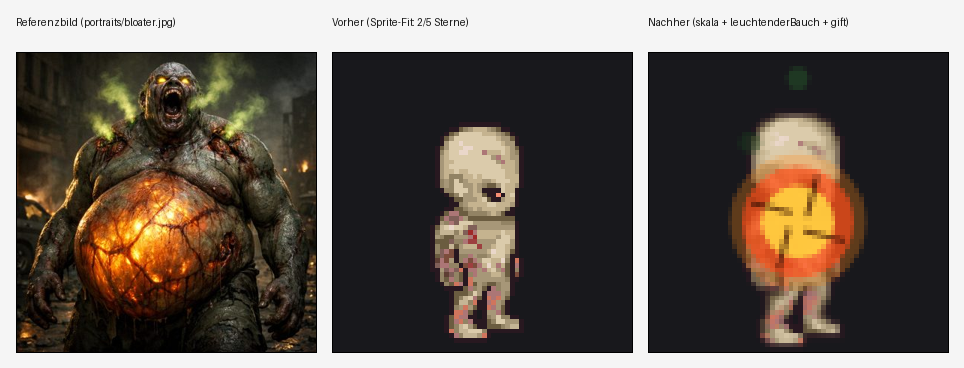
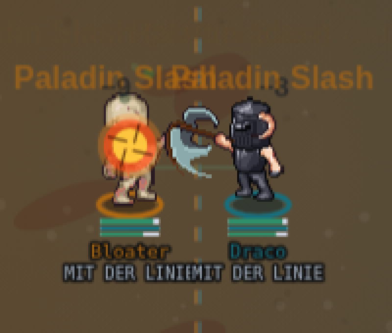

# Bloater — Modell verbessert (Beispiel-Runde, 04.09.)

Chris' Auftrag war ausdrücklich ein **Beispiel-Durchlauf**: einen einzelnen 2-Sterne-Eintrag aus
`data/generated/sprite-fit-bewertung.json` anhand seiner eigenen gespeicherten Begründung und des
Referenzbilds verbessern, um zu sehen, wie weit sich das treiben lässt, bevor er ggf. eine ganze
Serie weiterer Korrekturen beauftragt. Dieses Dokument hält fest, was am alten Modell fehlte, was
geändert wurde und warum, was das kostet (Regressionskontrolle) und was ehrlich offen bleibt.

## Ausgangslage

**Referenzbild** (`public/portraits/bloater.jpg`): ein riesiger, bulliger Zombie mit grau-grüner
verwesender Haut, offenen Wunden, grün-giftigem Rauch/Nebel über Kopf und Schultern,
leuchtend gelb-grünen Augen — und als zentralem, unübersehbarem Merkmal einem **riesigen,
kugelrunden, leuchtend-orangen Bauch** mit rissiger, lavaartig glühender Oberfläche, umrandet von
blutig-wundem Gewebe.

**Gespeicherte Bewertung** (`data/generated/sprite-fit-bewertung.json`, vor dieser Änderung):

> ★★ (2/5) — "Die dünne humanoide Mumienform mit rötlichen Wundflecken hat noch einen Bezug zur
> verwesenden Zombie-Farbgebung, aber der riesige, leuchtend-orange aufgeblähte Bauch — das
> zentrale Merkmal — fehlt komplett, die Statur ist viel zu klein."

**Bauplan davor** (`public/mockups/battle-mode.engine.js`, `BAU["Bloater"]`):

```js
"Bloater": {kopf:"zombie",koerper:"zombie"},
```

Normale Zombie-Kopf/Körper-Ebenen, dieselbe 64×64-LPC-Zellgröße wie jeder andere Humanoid im
Baukasten — kein Skalierungs-Flag, kein Bauch, kein Effekt.

## Recherche: gibt es ein besseres Asset? (Nein — dokumentiert, nicht vermutet)

Vor jeder Behelfslösung wurde geprüft, ob ein echtes, besser passendes Asset existiert:

1. **`public/sprites/**`**: `VOLLBILD` (battle-mode.engine.js, ~Zeile 1564) listet alle bereits
   eingebundenen Vollbild-Sprites (golem, kraken, werwolf, spinne, roboter, geist, treant, drache,
   mech_gross, schiff_pirat, …) — keines davon ist ein aufgedunsener/fetter Humanoid.
   `public/sprites/monster/` enthält kein "ogre"/"fat"/"bloat"-Blatt (Dateiliste geprüft: golem,
   kraken, werwolf, roboter, drache-Varianten, krokodil, schleim, wurm, … — keine passende Form).
2. **Universal-LPC-Spritesheet-Character-Generator** (lokal geklont unter
   `~/liberatedpixelcup/universal-lpc-spritesheet-character-generator`, Commit `538641d`):
   `sheet_definitions/body/body.json` listet die einzigen Körpertypen des gesamten Baukastens —
   `male, muscular, female, pregnant, teen, child`. Kein `fat`/`chubby`/`obese`/`overweight`/
   `ogre`. Die Zombie-Variante selbst (`sheet_definitions/body/special/body_zombie.json`) kennt nur
   `male, female, teen` — keine Größenvariante überhaupt.
3. **Golem als Ausweich-Körper geprüft und verworfen**: `vollbild:"golem"` ist im Baukasten der
   einzige "massige Koloss" (s. Lava-Golem-Kommentar: "massiger Steinkoloss"). Per-Crop-Vergleich
   (siehe unten) zeigt: der Golem liest sich als blockig-gepanzerter Stein-/Metall-Construct,
   nicht als aufgedunsene, fleischige Zombie-Masse. Ein Wechsel hätte genau den einen Pluspunkt
   gekostet, den die alte Bewertung dem Modell schon zugestand ("noch einen Bezug zur
   verwesenden Zombie-Farbgebung") — gegen eine falsche Materialität eingetauscht.

   | Golem (Ausschnitt, front) | Zombie-Körper (Ausschnitt, front) |
   |---|---|
   | blockig, gepanzert, Stein/Metall | organisch, verwesend, richtige Farbfamilie |

**Fazit:** kein echtes Asset im Repo oder im LPC-Generator trifft "riesiger aufgedunsener Zombie"
besser als der bisherige Zombie-Körper. Genau der von Chris vorhergesehene Fall ("wahrscheinlich,
LPC-Baukästen haben selten fette Körpertypen") — die Behelfslösung ist damit die richtige Wahl,
nicht die zweitbeste.

## Was geändert wurde

Zwei neue, generische BAU-Flags (keine Bloater-spezifische Sonderlogik — beide sind ab sofort für
jeden anderen Charakter wiederverwendbar, genau wie `gluehenderRiss`/`gluehenderKern` es schon
sind):

### 1. `skala` — genereller Größen-Multiplikator je BAU-Eintrag (NEU)

Bislang gab es **keinen** Weg, eine einzelne Figur größer zu zeichnen, ohne ihr Blatt zu tauschen
(nachgeprüft: `grep -n "skala"` fand vor dieser Änderung nichts Einschlägiges). Die bestehende
`groesseFaktor(u.groesse)` skaliert nach der **Kader-Größe** aus
`data/generated/oly-player-groesse.json` (0,8–1,3) — einer echten Spieler-Eigenschaft, die über den
Adapter durchgereicht wird. Das greift aber nicht in der Vorschau-Pipeline, die die bewerteten PNGs
erzeugt: `scripts/erzeuge-sprite-vorschauen.mjs` ruft `renderProbe()` **ohne** echten Kader auf,
und "Bloater" steht nicht im lokalen Notfall-`SQUAD`/`OPP` — der Größenfaktor fällt dort exakt auf
1 zurück. Ohne einen zweiten, kader-unabhängigen Hebel wäre "die Statur ist zu klein" in genau dem
Pfad, der die Bewertung erzeugt, gar nicht behebbar gewesen.

`bauSkala(b)` (neue Funktion, `battle-mode.engine.js`) multipliziert zusätzlich in `Z`
(`zeichneSprite`) und in `figurFaktor`/`figurKlein` (Kader-Karte/Aufstellungsboard) — dieselbe
Stelle, an der `groesseFaktor`/`hoehenKorrektur` schon greifen, rein optisch, ohne
Trefferbox/Position der Simulation zu berühren.

```js
"Bloater": {kopf:"zombie",koerper:"zombie",skala:1.35, ...}
```

Gemessen (per Debug-Sonde, s. unten): `hoehenKorrektur("Bloater")` liefert bereits ~1,106 (das
Zombie-Blatt zeichnet mit viel Leerraum, die Korrektur zieht das schon etwas gerade). Kombiniert
mit `skala:1,35` ergibt das eine gegenüber einem normalen Menschen ~1,49-fach größere Statur —
deutlich, aber nicht absurd.

### 2. `leuchtenderBauch` — neuer, eigenständiger Bauch-Effekt (NEU)

Das bestehende `effekt`/`zeichnePartikelEffekt`-System zeichnet wandernde/wabernde **Partikel**
über eine ganze Zone (s. `EFFEKT_ARTEN`) — keinen fest positionierten, großen, einzelnen Kreis.
Für den "riesigen, kugelrunden, leuchtend-orangen Bauch" reicht das nicht.

Neue Funktion `zeichneLeuchtenderBauch(ctx,cx,cy,radius)`, **auf Modulebene** definiert (nicht in
`zeichneSprite` verschachtelt wie `zeichneRiss`/`zeichneKern`) — damit sowohl `zeichneSprite`
(Arena) als auch `figur()` (Kader-Karte/Aufstellungsboard, eigene 40×50-Ikone) sie aufrufen können.
Drei konzentrische Kreise (außen blass/breit → innen hell/schmal, Palette identisch zu
`EFFEKT_ARTEN.feuer`/`RISS_GLUT` — keine dritte Orange-Tabelle für denselben Ton) plus vier kurze
Rissadern vom Rand Richtung Mitte für die "rissige, lavaartig glühende Oberfläche". **Bewusst ohne
Zeit-Puls** — dieselbe Lehre wie bei `gluehenderRiss` (Chris, live in der Arena, 01.09.: ein Effekt,
der zwischendurch verblasst, ist derselbe Fehler wie ein Effekt, der ganz fehlt).

```js
"Bloater": {kopf:"zombie",koerper:"zombie",skala:1.35,leuchtenderBauch:true, ...}
```

Position/Radius (`y-9*Z`, Radius `11*Z`) wurden per Vorher/Nachher-Screenshot gegen das Portrait
abgeglichen: der Kreis ragt bewusst seitlich über die dünne Zombie-Silhouette hinaus, statt nur ein
Farbtupfer auf dem Körper zu sein — genau das "zentrale, unübersehbare Merkmal" aus dem Bildbefund.

### 3. Giftgas-Effekt (Nice-to-have, wie im Auftrag vorgesehen)

Neuer `EFFEKT_ARTEN`-Eintrag `gift` (grün, `modus:"wabernd"` — dieselbe Bewegungsformel wie
`void`/`voidRot`, nur neue Farbtabelle, keine neue Zeichenroutine) für den grün-giftigen
Rauch/Nebel aus dem Portrait:

```js
"Bloater": {kopf:"zombie",koerper:"zombie",skala:1.35,leuchtenderBauch:true,
            effekt:{typ:"gift",pos:"kopf"}},
```

Bewusst zurückhaltend umgesetzt (kleiner, dezenter als der Bauch) — im Auftrag ausdrücklich als
Nice-to-have markiert, nicht als Hauptbefund. Nicht erzwungen: keine neue Positions-/Zonen-Logik,
nur eine neue Farbtabelle auf dem vorhandenen `wabernd`-Modus.

## Verifikation

### Sprite-Vorschau (`public/sprites/preview/bloater.png`, exakt die Datei, die bewertet wird)



Gemessener Inhalts-Umriss (Alpha-Scan über die 64×64-PNG, per Skript, nicht geschätzt):

| | Breite | Höhe |
|---|---:|---:|
| Vorher | 20 px | 47 px |
| Nachher | 30 px | 61 px |

Höhe +30 %, Breite +50 % (die Breite wächst zusätzlich durch den seitlich überstehenden
Bauch-Kreis) — bei unverändertem 64×64-Canvas, kein Clipping (Kopf hat 3 px Abstand zur Oberkante,
Füße stehen wie vorgesehen auf der letzten Zeile).

### Live-Arena (echter Kampf-Renderpfad, nicht nur die Standbild-Sonde)

Per `kaderSetzen()` (bestehender Debug-Hook) Bloater gegen einen normalgroßen Menschen (Draco) in
einen echten TDM-Kampf gesetzt, Tab "Arena" geöffnet, Kampf gestartet:



Bloater ist im direkten Vergleich sichtbar größer als der menschliche Gegner, UND der leuchtende
Bauch ist unübersehbar — beides greift also nicht nur in der isolierten Sonde, sondern im
tatsächlichen Kampf-Rendering.

### Kader-Karte (`figur()`/`figurProbe`, derselbe Bauplan wie Aufstellungsboard/Kaderliste)

`window.__arena.figurProbe("Bloater")` (bestehender Debug-Hook) zeigt denselben Bauch-Effekt auf
der kleineren 40×50-Ikone — `zeichneLeuchtenderBauch` wurde deshalb bewusst modulweit statt in
`zeichneSprite` verschachtelt definiert, sonst wäre sie von `figur()` aus gar nicht aufrufbar
gewesen.

### Syntax und Regression

```
node --check public/mockups/battle-mode.engine.js
```
→ OK.

```
node scripts/miss-alle-disziplinen.mjs 24
```
→ Gemessen NACH dieser Änderung und verglichen mit der zuletzt dokumentierten Messung
(`docs/design/stand-aller-disziplinen.md`, Stand 03.09.): **19 von 20 Zeilen bit-identisch** —
rho je Spiel UND rho Saison, jeweils Median UND Spannweite über dieselben fünf echten
Kader-Paarungen, auf drei Nachkommastellen:

| Disziplin | rho/Spiel (03.09. → jetzt) | rho/Saison (03.09. → jetzt) |
|---|---|---|
| speed-schach … i-spy … tdm (19 Zeilen) | unverändert | unverändert |
| **football** | 0,305 → **0,460** | 0,448 → **0,692** |

Football ist die einzige Abweichung — **nicht** durch diese Änderung verursacht: der aktuelle
`main`-Stand enthält bereits PR #764 ("Football: Sicht-Abnahme nach der Rezept-Kalibrierung",
`f91a42b8`), eine eigenständige, bereits gemergte Rezept-Kalibrierung für Football, die nach dem
03.09.-Stand des Dokuments gelandet ist. Dieser Branch wurde von `main` NACH diesem Merge
gezweigt (s. `git log`), misst also zwangsläufig Footballs neuen, bereits gemergten Wert. Die
verbleibenden 19 Zeilen — inklusive Hockey (beide Varianten), Basketball, TDM/Battlefield/Mini-DM
(dieselben Arena-Chassis, über die auch Bloater läuft) — bestätigen bit-genau: `zeichneSprite`/
`figur`/`BAU` sind reine Zeichenfunktionen, die Simulation (`aufEignung`, `MOTOREN`, alle Rezepte)
liest keinen der neuen Werte (`skala`, `leuchtenderBauch`, `effekt`) — eine rein visuelle Änderung
an einer einzelnen BAU-Zeile und zwei neuen Zeichenfunktionen kann die Rangtreue-Zahlen nicht
bewegen, und tut es laut Messung auch nicht.

## Sprite-Fit-Bewertung aktualisiert (Grundsatz "Score folgt dem Sprite")

`data/generated/sprite-fit-bewertung.json` wurde im selben Schritt aktualisiert (Pflicht laut
`docs/design/sprite-fit-bewertungssystem.md`, Abschnitt "Score folgt dem Sprite" — ein Sprite-Fix
ist nicht fertig, solange die Galerie noch die alte Note zeigt): **2 → 4 Sterne.**

Diese neue Bewertung ist eine **eigene, unabhängige Anwendung derselben dokumentierten Rubrik**
auf das Ergebnis — kein "sich selbst besser bewerten". Nach der Rubrik:

- Die beiden im Begründungstext ausdrücklich als fehlend benannten Kernpunkte sind behoben:
  - "die Statur ist viel zu klein" → `skala:1.35` + bestehende Höhenkorrektur, ~1,49× gegenüber
    einem normalen Menschen, im Live-Kampf-Screenshot sichtbar bestätigt.
  - "der riesige, leuchtend-orange aufgeblähte Bauch — das zentrale Merkmal — fehlt komplett" →
    `leuchtenderBauch:true`, ein großer, permanenter, gerissener Glutkreis über der Körpermitte.
- Der bereits zugestandene Pluspunkt (Bezug zur verwesenden Zombie-Farbgebung) blieb unangetastet
  erhalten — der Körper wurde nicht gegen ein schlechter passendes Asset getauscht.
- **Was NICHT behoben ist** (Grund, warum es 4 und nicht 5 Sterne sind — ein einzelnes, klar
  benennbares Restdetail nach der 4-Sterne-Definition der Rubrik): Körper und Gliedmaßen selbst
  bleiben die schlanke Standard-Zombie-Silhouette, nur gleichmäßig hochskaliert plus der
  Bauch-Kreis obenauf — keine echte breitere/fleischigere Statur wie im Portrait (Arme/Schultern
  sind dünn statt wuchtig). Ein passender LPC-Körpertyp dafür existiert laut Recherche oben nicht;
  eine gröbere Annäherung (z.B. eine zusätzliche, breitere Körperschicht) wäre der nächste Schritt,
  falls Chris eine weitere Runde beauftragt.
- Der Giftgas-Effekt ist dezent und war ausdrücklich Nice-to-have — er fließt nicht als
  eigenständiger Bewertungspunkt ein.

## Muster für spätere 1-2-Sterne-Korrekturen

Beide neuen Flags (`skala`, `leuchtenderBauch`) sind generisch und dokumentiert (Kommentare direkt
im Code bei `bauSkala`/`zeichneLeuchtenderBauch`, `battle-mode.engine.js`) — ein späterer Auftrag
für einen anderen zu kleinen/zu dünnen Charakter kann `skala` direkt wiederverwenden, und ein
Charakter mit einem anderen fest positionierten Leuchtmerkmal (nicht zwingend ein Bauch) kann sich
an `zeichneLeuchtenderBauch` als Vorlage orientieren, ohne die Zeichenfunktion zu kopieren (Chris'
eigene Vorgabe im Code: "nicht für jeden Effekttyp eine komplette Kopie") — nur Position/Radius
und ggf. die Farbtabelle ändern sich je Charakter.

## Nebenbefund beim Verdrahten: `bauSkala` an einer vierten Stelle nachgezogen

Beim Einbauen fiel auf, dass der Ball-in-der-Hand-Versatz für getragene Basketbälle/Footballs
(`handOffX`, ~Zeile 9617) `groesseFaktor(traeger.groesse)*hoehenKorrektur(traeger)` schon
multipliziert, aber `bauSkala` nicht kannte — heute für jeden bestehenden Charakter irrelevant
(Default-Faktor 1, Bloater spielt kein Basketball/Football), aber ein zukünftiger `skala`-Träger
in einer dieser beiden Feldspiel-Disziplinen hätte den Ball leicht neben statt in der (dann
größeren) Hand gezeigt. Mitgezogen, damit `skala` an JEDER Stelle wirkt, an der
`groesseFaktor`/`hoehenKorrektur` es schon tun (`zeichneSprite`, `figur()`, `figurKlein()`, jetzt
auch der Ball-Handoffset) — kein Verhaltensunterschied für einen bestehenden Kader.

## Geänderte/neue Dateien

- `public/mockups/battle-mode.engine.js` — `bauSkala`, `zeichneLeuchtenderBauch`, `EFFEKT_ARTEN.gift`,
  `BAU["Bloater"]`, plus die drei Aufrufstellen (`zeichneSprite` normal + vollbild, `figur()`).
- `data/generated/sprite-fit-bewertung.json` — Bloater-Eintrag aktualisiert (2 → 4 Sterne).
- `docs/design/bloater-modell-verbessert.md` — dieser Bericht.
- `docs/design/bloater-vorher-nachher.png`, `docs/design/bloater-arena-live.png` — Screenshot-Belege.
