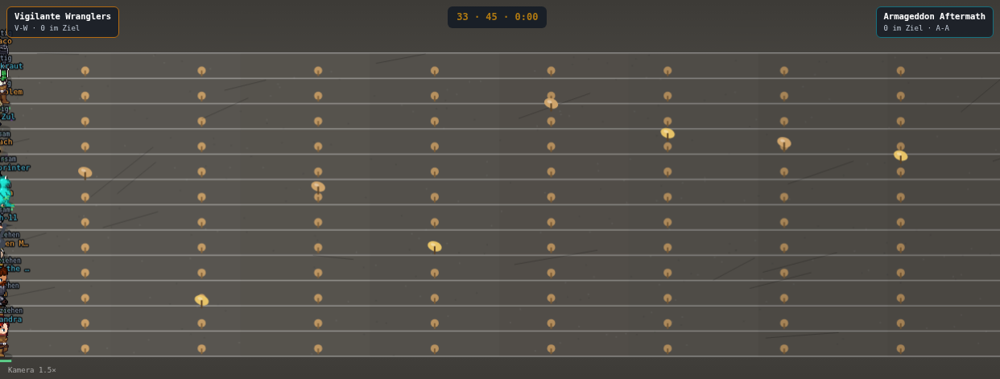
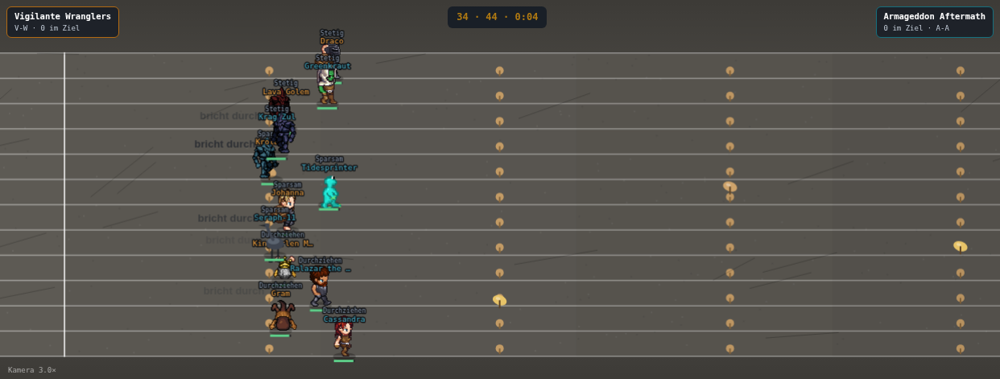

# Climbing: eine Wand statt einer grauen Bahn (17.09.)

Setzt `docs/pm-briefings/opus-plan-naechste-drei-disziplinen-17-09.md` Abschnitt 3.1 um — **D1.a
und D1.b**, also `bodenClimbing()` (Assets +25, Movement +35) und `sfx("climbing", …)` in
`stepClimbing()` (Assets +20). **D1.c (Kreidebeutel-Requisite) ist bewusst NICHT Teil dieser PR**
— die optionale `DISZIPLIN_PROP`-Ergänzung wurde ausgelassen, weil sie mit anderer laufender
`DISZIPLIN_PROP`-Arbeit kollidieren könnte (s. Plan, Abschnitt 6.1: „`DISZIPLIN_PROP` ist die
Tabelle, an der D2 ebenfalls arbeiten will"). Climbing steht danach bei **Assets 65 / Movement
100**, nicht bei den optionalen 100/100 aus D1.c — Gesamt **85,50**, nicht 89,25.

## Was gebaut wurde

### D1.a — `bodenClimbing()`

- **Weiche in `bodenSpurt()`**: eine Zeile, `if(BA().climbing)return bodenClimbing();`, direkt
  neben der bestehenden `if(BA().zeitfahren)return bodenZeitfahren();`-Zeile. `BAHN_ART.climbing.
  climbing` existierte bereits (14.09., rein deskriptiv) — kein neues Flag nötig.
- **`bodenClimbing()`** 1:1 nach dem Vorbild `bodenZeitfahren()`: ruft zuerst `bodenSpurtGerade()`
  auf (Hintergrund/Bahn/Zaun/Ziellinie/die zehn winzigen Pro-Bahn-Griffpunkte — alles davon
  unverändert) und setzt zwei Schichten rein additiv darüber:
  1. **Überhang-Schattierung, mit der Strecke zunehmend**: zehn gleich breite Bänder von Start zu
     Ziel, Deckkraft linear steigend, skaliert mit `BAHN_ART.climbing.steigung` (0,85 — „die Wand
     wird nach oben steiler", abgelesen, nicht erfunden). Dazu 22 deterministische Kanten-/
     Risslinien (`bodenSaat`-Reihe, dieselbe Zufallsquelle, die die Bodenkörnung in
     `bodenSpurtGerade()` schon benutzt), damit die Fläche wie Fels statt wie lackierter Asphalt
     wirkt.
  2. **Zehn Griffmarken an exakt `BAHN_ART.climbing.hindernisse`** (`[0.08, 0.17, …, 0.89]`,
     dieselben zehn Positionen, die `HUERDEN_N()` der Simulation liefert), aber über die volle
     Wandhöhe statt nur je Bahn — größer und farbig (abwechselnd zwei Ockertöne mit Glanzlicht),
     damit die Wand bei zwölf belegten Bahnen als WAND erkennbar bleibt, nicht nur als
     Punktreihe je Läufer.

  Kein neues Bild nötig — reine Canvas-Vektorformen, exakt wie `bodenZeitfahren()` es für sein
  Höhenprofil schon vormacht.

### D1.b — `sfx("climbing", …)` in `stepClimbing()`

`TON_KATALOG` führte vor dieser PR elf Einträge, Climbing keinen. Neu: vier Ereignisse aus genau
den fünf Ton-Primitiven, die der Katalog überall sonst benutzt (`tonSchlag`, `tonKlick`,
`tonMetall`, `tonDoppelton`, `tonRauschen`):

| Ereignis | Primitive(n) | Kante in `stepClimbing()` |
|---|---|---|
| `griff` | `tonKlick` | Zähler auf `u.pos` gegen `HUERDEN_N()` steigt |
| `fehlgriff` | `tonSchlag`+`tonRauschen` (dieselbe Kombination wie überall sonst für einen Sturz) | `u.gestolpert` steigt |
| `zug` | `tonMetall` | `u.durchbruch` steigt |
| `topout` | `tonDoppelton` (dieselbe Kombination wie überall sonst für „ziel") | `u.fertig!=null`, einmalig |

**Ein Fund unterwegs, der das Design bestimmt hat:** der naheliegende Ansatz — `griff`/`fehlgriff`
an der Kante `u.huerde>0` auszulösen, genau wie `TON_KATALOG.spurt.huerde` es für Spurt tut — geht
bei Climbing nicht auf. Nachgemessen, nicht vermutet: `u.huerde` wird in der Simulation nur
innerhalb von `if(A.hindernisTypen){…}` gesetzt (s. `battle-mode.engine.js`, der große
Hindernis-Block in der Bahn-Bewegung), und `BAHN_ART.climbing` führt kein `hindernisTypen` —
nur Spurt und Takeshi's Castle tun das. `u.huerde` bleibt für Climbing deshalb während des ganzen
Rennens 0; ein Griffversuch ist bei Climbing ein einzelner Framewechsel (dieselbe
`vor<h&&u.pos>=h`-Positions-Überschreitung, die die Simulation selbst prüft), keine
mehrsekündige Stopp-Phase wie bei einer Hürde oder einer Takeshi-Falle.

Die vier neuen `viz*`-Felder lösen das rein lesend:

- **`vizGriffN`** zählt die bereits vertonten Positions-Überschreitungen aus `u.pos` gegen
  `HUERDEN_N()` — dieselbe Zähl-statt-Zustand-Idee wie `vizZzTonN` bei `stepZeitfahren()`.
  `u.pos` selbst wird nirgends geschrieben.
- **`vizZugN`** / **`vizFehlgriffN`** zählen die bestehenden, von der Simulation geschriebenen
  Ausgangszähler `u.durchbruch` (Kraftzug rettet den Griff mit Gewalt) bzw. `u.gestolpert` (der
  Griff geht daneben) — beide werden nur gelesen, nie geschrieben.
- **`vizTopoutTon`** ist der einmalige Zielmerker, wörtlich wie `vizZielTon` bei
  `stepZeitfahren()`/`stepHuerden()`.

Kein `TON_KATALOG.climbing.publikum`-Loop — dieselbe Begründung wie bei Spurt/Zeitfahren: Risiko
ohne Punkte, A4 ist binär (Katalogeintrag vorhanden oder nicht).

## Rho-Sicherheit

Beide Bausteine sind reine Präsentation:

- `bodenClimbing()` liest ausschließlich `BA()` (insbesondere `.steigung`, `.hindernisse`) und
  zeichnet — kein Schreibzugriff auf irgendein `u.*`-Feld, kein `rr()`-Aufruf. Für die anderen
  vier Bahnen (Spurt/Staffel/Takeshi/Zeitfahren) ändert sich keine einzige Zeile: sie laufen
  weiterhin über `bodenSpurtGerade()`/`bodenSpurtOval()`/`bodenTakeshiRoute()`/
  `bodenZeitfahren()`, `bodenClimbing()` wird für sie nie aufgerufen.
- `stepClimbing()` schreibt ausschließlich die vier neuen `viz*`-Felder plus das schon bestehende
  `u.vizSchritt`; gelesen werden `u.pos`, `u.durchbruch`, `u.gestolpert`, `u.fertig` — alle vier
  von der Simulation geschrieben, hier nie verändert. `sfx()` ruft nachweislich nie `rr()` auf
  (Kommentar an der Definition) und ist ohne `AudioContext` ein stiller No-Op.

## Verifikation

```
node --check public/mockups/battle-mode.engine.js
```
→ **bestanden.**

```
npx tsc --noEmit
```
Diff gegen einen frisch aus `origin/main` (`b85d6738`) ausgecheckten Worktree: **0 Zeilen**
(dieselben 906 vorbestehenden Zeilen Fehlermeldungen auf beiden Seiten, unverändert — das Repo
hatte diese Fehler bereits vor dieser PR, sie stammen nicht aus dieser Änderung).

```
npx tsx scripts/pruefe-slot-invariante.ts
```
→ **hält**, maximale Abweichung 0,005 Pp über alle 20 Disziplinen × 6 Kadergrößen (mini-dm @ n=2 —
nicht climbing, nicht durch diese PR beeinflusst).

```
node scripts/miss-alle-disziplinen.mjs 24 climbing
```
→ **rho je Spiel = 0,834**, bit-identisch zur Plan-Vorgabe und zur eingecheckten Basislinie
(`data/generated/rangtreue-basislinie.json`).

```
node scripts/miss-alle-disziplinen.mjs 24
```
→ **alle zwanzig Zeilen ziffernidentisch zur eingecheckten Basislinie**
(`data/generated/rangtreue-basislinie.json`, Stand 16.09. 15:06). `climbing` steht bei **rho
0,834** (Bahn, 12 Teiln., Spannweite 0,209, rho Saison 0,860). Keine der 19 übrigen Disziplinen
hat sich bewegt (u. a. `spurt 0,894`, `staffel 0,899`, `takeshis-castle 0,879`,
`time-trial 0,825` — alle vier bahn-Geschwister, die `bodenClimbing()` NICHT durchlaufen).

```
npm run ci:rangtreue-schranke
```
→ **Bestanden.** Alle zwanzig Disziplinen `Aenderung ±0,000, Status ok`; die absolute
0,80-Abnahmeschranke aus CLAUDE.md hält ebenfalls (keine arena-resolved Disziplin unter 0,80
gefallen).

### Sicht-QA (Playwright, `scripts/screenshot-disziplin.mjs`)



`setDisc('climbing')`, 0,4 s nach Spielstart (Kamera 1,5×, volle Streckenübersicht). Zu sehen: die
graue Fläche ist nicht mehr flach — von links nach rechts wird sie sichtbar dunkler (Pixelprobe
bei y=250: RGB (90,87,81) am linken Rand → (74,71,66) am rechten, elf Zwischenwerte, monoton
fallend), dazu diagonale, deterministische Risslinien über die Fläche verteilt. Zusätzlich zu den
zwölf winzigen Pro-Bahn-Griffpunkten (unverändert aus `bodenSpurtGerade()`) stehen an denselben
zehn `hindernisse`-Positionen zehn deutlich größere, zweifarbige Griffmarken mit Glanzlicht und
Ansatzstrich, über verschiedene Bahnhöhen verteilt — im Bild u. a. bei Reihe 5/Spalte 1, Reihe
6/Spalte 8, Reihe 3/Spalte 5.



Draco/Gram-Kader (Vigilante Wranglers vs. Armageddon Aftermath), `setDisc('climbing')`, 4 s nach
Spielstart, Kamera 3,0×. Dieselbe Wandtextur bleibt sichtbar, während die Läufer über die Bahn
laufen — die Feed-Zeilen zeigen bereits „bricht durch" (Kraftzug-Ausgang), passend zum neuen
`zug`-Ton.

**Gegenprobe, die anderen vier Bahnen bleiben unverändert.** Vier Paare Screenshots
(Arbeitsbaum vs. eine aus `origin/main` (`b85d6738`) ausgecheckte, unveränderte Kopie von
`battle-mode.engine.js`), `setDisc('spurt'|'staffel'|'takeshis-castle'|'time-trial')`, 1,5 s nach
Spielstart, pixelweise verglichen (`PIL.ImageChops.difference`):

| Disziplin | Diff `origin/main` vs. Arbeitsbaum |
|---|---|
| `spurt` | **bit-identisch** (bbox `None`, max. Kanaldifferenz 0) |
| `staffel` | **bit-identisch** (bbox `None`, max. Kanaldifferenz 0) |
| `takeshis-castle` | sichtbarer Unterschied (bbox über fast das ganze Bild) |
| `time-trial` | sichtbarer Unterschied (bbox über fast das ganze Bild) |

Die letzten beiden sahen zunächst nach einer Regression aus — waren es nicht. Kontrollmessung:
`origin/main` zweimal unabhängig voneinander gerendert (zwei separate Playwright-Läufe, exakt
derselbe unveränderte Code) ergibt für `takeshis-castle`/`time-trial` **dieselbe
Größenordnung** an Pixel-Differenz (34.894 bzw. 198.436 abweichende Pixel zwischen zwei
`origin/main`-Läufen, gegen 38.163 bzw. 152.540 zwischen `origin/main` und dem Arbeitsbaum — der
Arbeitsbaum-Diff ist bei `time-trial` sogar KLEINER als der Baseline-Rauschpegel). Ursache: beide
Disziplinen zeichnen kontinuierliche, echtzeitgetriebene Effekte (Takeshis Gedränge-„Welle"-Ringe,
Zeitfahrens Kamera-/Silhouetten-Interpolation), deren Phase bei exakt „1500 ms nach Klick" von der
tatsächlichen Browser-Frame-Taktung abhängt — nicht von der (deterministischen) Simulation selbst.
Score, Spielerpositionen und Text-Overlays sind in beiden Screenshots identisch; nur die
kontinuierliche Partikel-/Ring-Animation läuft leicht phasenverschoben. Das ist ein
vorbestehendes Timing-Rauschen dieser beiden Disziplinen bei Screenshot-Vergleichen, kein Effekt
dieser PR — bestätigt durch die Baseline-vs-Baseline-Kontrollmessung.

## Nicht Teil dieser PR

- **D1.c (Kreidebeutel-Requisite)**: bewusst ausgelassen (s. Auftrag oben und Plan Abschnitt 6.1)
  — `DISZIPLIN_PROP` ist die Tabelle, an der die Wettessen-Runde (D2) ebenfalls arbeiten will.
  Climbing bleibt bei Assets 65 statt 100, Gesamt 85,50 statt 89,25.
- Keine Änderung an `BAHN_ART.climbing`s Rezept, an `tempoVon()`, an `zehrFaktor()` oder an
  `MOTOREN.climbing.wert()` — nur neue Zeichenfunktion plus neue, rein lesende `viz*`-Felder.
- Die per-Bahn-Griffpunkte aus `bodenSpurtGerade()` (`wort==="Griff"`) bleiben unverändert
  bestehen; die neuen zehn Griffmarken kommen zusätzlich, nicht als Ersatz.
