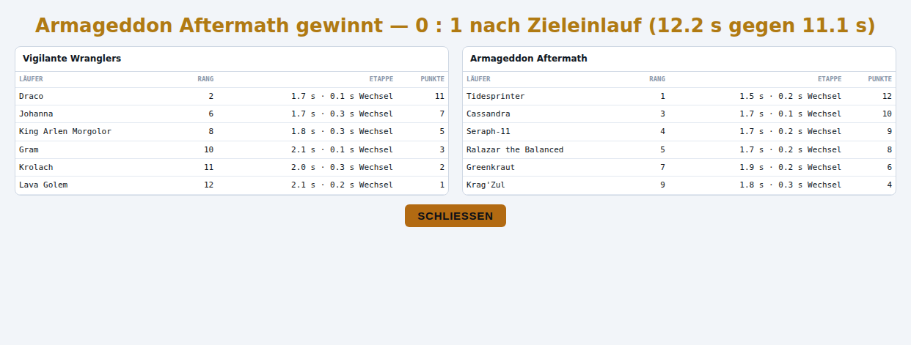
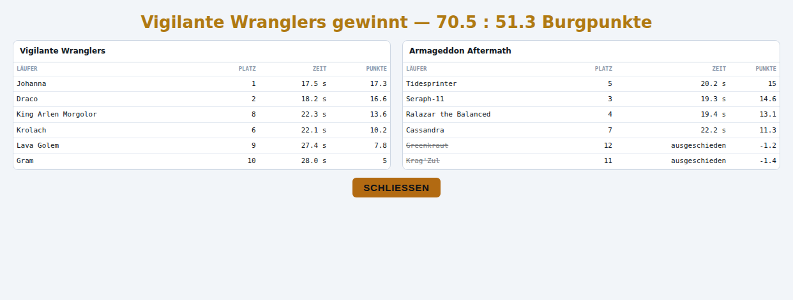

# Endstand-Overlay: Punkte je Läufer für Staffel und Takeshi's Castle (Fable, 06.09.2026)

Recherche, Konzept und Prototyp — **keine Umsetzung auf `main`**. Der Prototyp-Diff liegt als
Anhang bei (`endstand-punkte-prototyp-06-09.diff`, 269 Zeilen gegen `01e90379`), die Screenshots
daneben. Alle Zahlen kaderfest (`scripts/miss-alle-disziplinen.mjs 24`, fünf echte Paarungen aus
dem live-save vom 03.09.) beziehungsweise aus der beiliegenden Sonde
(`endstand-punkte-sonde-06-09.mjs`, 120 Rennen je Disziplin über dieselben fünf Paarungen).

Chris' Rahmen (06.09.): „ich sollte nur fürs balancing da sein und um im nachhinein mechaniken zu
korrigieren wenn sie falsch sind […] also heißt es sowieso probieren!" — deshalb steht hier eine
Empfehlung mit Zahlen, keine Optionsliste. Was Chris trotzdem entscheiden muss, steht in
Abschnitt 6, jeweils mit Voreinstellung.

---

## 0. Die Antwort in fünf Sätzen

1. **Staffel: zwei Größen, bewusst nicht eine.** Das *Rennen* entscheidet die Mannschaft, die
   zuerst im Ziel ist — Kopfzeile „1 : 0 nach Zieleinlauf (11,1 s gegen 12,2 s)". Die *Punkte je
   Läufer* sind der Rang seiner **Etappenleistung** über alle zwölf Läufer beider Seiten (12 … 1),
   und die Etappenleistung ist exakt die Größe, an der `MOTOREN.staffel.wert()` heute schon die
   Rangtreue misst: `−Etappenzeit + Wechselkonto`. Keine neue Formel, keine Motoränderung,
   rho bleibt 0,915 (nachgemessen, bit-identisch).
2. **Warum nicht die Rangpunktsumme als Teamstand wie bei den drei anderen Bahnen:** in 120
   Rennen widersprach sie dem Zieleinlauf zwar nie, stand aber neunmal (7,5 %) auf Gleichstand,
   während eine Mannschaft 1,2 s vorn war. Eine Staffel, die gewonnen hat, darf im Overlay nicht
   „Unentschieden" heißen — der Zieleinlauf ist das Ergebnis, die Punkte sind der Boxscore.
3. **Takeshi's Castle: die W4-Burgpunkte taugen direkt als Endstand — aber nur, wenn überall
   DIESELBE Zahl steht.** Heute zeigt die Burgmauer die Sternsumme *ohne* Zielbonus, `wert()` und
   die Läuferzeile im Ziel die Summe *mit* Bonus. Der Bonus macht beim Siegerteam im Median
   **31,8 %** der Punkte aus — im Beispielrennen stünde „Burgpunkte 47,4 : 21,0" auf der Mauer
   und „68 : 32" im Overlay. Der Prototyp zieht alles auf eine Funktion `burgwertung()` zusammen.
4. **Negative Burgpunkte sind ausschließlich Ausgeschiedene** (322 von 322 negativen W4-Werten in
   1440 Läufern, 22,4 % aller Läufer). Anzeigen kann man sie ehrlich („ausgeschieden · −1,4"),
   aber „minus Sterne" widerspricht Chris' Bild („immer wenn Spieler es schaffen gibt's nen
   Punkt"). Die Variante **„je Falle nie unter null"** misst 0,862 / Saison 0,958 gegen heute
   0,861 / 0,923 und bei 2/3/5 je Seite 0,908 / 0,924 / 0,886 gegen 0,858 / 0,898 / 0,864 —
   nirgends schlechter, in der Saisonzahl besser. Empfehlung: einführen, in einer eigenen PR,
   weil es die Wertung berührt (Abschnitt 6, Frage 2).
5. **Aufwand der Folge-PR: der Diff im Anhang ist die Umsetzung**, plus Basislinie und Doku-Zeilen
   (Abschnitt 5). Die drei Rang-Bahnen, Spurt eingeschlossen, sind bit-identisch — der Prototyp
   fasst nur `wertung:"etappe"`/`"burg"`-Zweige und das Overlay an.

---

## 1. Ausgangslage — was das Overlay heute zeigt und warum

`renderEndstandBahn()` (aus #807) baut für alle fünf Bahnen dieselbe Tafel: Läufer, Platz, Zeit,
Punkte. Platz und Zeit kommen aus `bahnRangliste()` (Sortierung nach `u.fertig`, dann Strecke),
die Punkte aus `bahnTeamstand().punkte` — und das ist nur bei `wertung:"rang"` (Time-Trial,
Spurt, Climbing) eine Map, sonst `null`. Staffel und Takeshi zeigen deshalb „–" je Läufer und in
der Kopfzeile „Rennen beendet — 6 : 6 im Ziel · noch keine Wertung".

Das ist für beide Disziplinen aus je einem anderen Grund falsch:

| | Staffel | Takeshi's Castle |
|---|---|---|
| Platz-Spalte | alle sechs einer Mannschaft teilen `fertig` — der „Platz" innerhalb des Teams ist die Reihenfolge im Array, keine Information | richtig (Zielreihenfolge, Ausgeschiedene nach Strecke) |
| Zeit-Spalte | für alle sechs dieselbe Teamzeit | richtig |
| Punkte | „–", obwohl der Motor `etappenZeit` und `wechselKonto` je Läufer längst führt und `wert()` daraus misst | „–", obwohl `wert()` seit #813 Burgpunkte vergibt und die Mauer sie groß anzeigt |
| Kopfzeile | „6 : 6 im Ziel · noch keine Wertung" bei einem Rennen, das eine Mannschaft klar gewonnen hat | „6 : 6 im Ziel" bei sechs Ausgeschiedenen — genau der Fehler, den #807 für die drei anderen behoben hat |

Das Overlay selbst ist generisch richtig gebaut: es liest nur `bahnTeamstand()`. Der Auftrag ist
also nicht „ein Overlay für Staffel bauen", sondern **`bahnTeamstand()` um zwei Zweige erweitern**
und dem Overlay drei optionale Felder geben (Zeitspalte, Spaltenköpfe, Kopfzeilen-Zusatz).

---

## 2. Staffel

### 2.1 Was der Motor über einen einzelnen Läufer schon misst

Alles in `stepSpurt`, Wechsel-Block (`:16861 ff.`) und Zieleinlauf (`:16937 ff.`):

| Größe | Was sie ist | Wo sie entsteht |
|---|---|---|
| `etappenZeit` | Zeit für den eigenen Abschnitt, **Wechselverlust herausgerechnet** (`rennT − startT − wechselVerlust`). Alle sechs Abschnitte sind gleich lang, die Zeiten direkt vergleichbar | Übergabe des eigenen Stabs bzw. Zieleinlauf |
| `wechselKonto` | Bilanz der Übergaben, an denen er beteiligt war, in Sekunden, negativ: der stufenlose Verlust aus dem Schnitt beider TECHNIK-Werte plus Patzer-Zuschlag, je zur Hälfte dem Abgebenden und dem Annehmenden angeschrieben | jede Übergabe |
| `wechselN`, `gestolpert` | Zahl der Übergaben, Zahl der Patzer | jede Übergabe |
| `fertig` | **Teamzeit**, für alle sechs gleich | Zieleinlauf des Schlussläufers |

`MOTOREN.staffel.wert()` (`:18864 ff.`) misst `−(etappenZeit) + wechselKonto` — größer ist
besser — und liest damit kaderfest **0,915 je Spiel** (Spannweite 0,089, Saison 0,951): die beste
Rangtreue im ganzen Feld. Der Kommentar dort erklärt auch, warum es NICHT die Teamzeit ist: mit
ihr hatte jeder Läufer eines Teams denselben Wert, rho lag bei −0,038.

**Es gibt also nichts Neues zu messen.** Die Frage ist nur, wie man diese eine Zahl als „Punkte"
zeigt.

### 2.2 Die Ansätze, abgewogen

| Ansatz | Punkte je Läufer | Teamstand | Für | Gegen |
|---|---|---|---|---|
| **A** Rangpunkte auf die Etappenleistung, Teamstand = Summe (wie `wertung:"rang"`) | 12 … 1 | Σ Punkte | eine Regel für alle fünf Bahnen; Overlay ohne Sonderfall | die Summe kann dem Zieleinlauf widersprechen oder auf Gleichstand stehen, obwohl das Rennen entschieden ist (gemessen: 0 Widersprüche, aber **9 Gleichstände in 120 Rennen**) |
| **B** Beitrag zur Team-Zielzeit: Etappenleistung minus Mannschaftsschnitt, in Sekunden („+0,4 s") | ±Sekunden | Zieleinlauf | zeigt den Abstand, nicht nur die Reihenfolge | sagt nur, wer *im eigenen Team* schneller war — der beste Läufer eines langsamen Teams steht mit „+0,3 s" da, obwohl er gegen jeden Gegner verloren hätte; vergleicht also nicht über beide Seiten, was die Rangtreue misst |
| **C** Komposit Etappenzeit + Übergabequalität, eigene Gewichte | Punkte | Zieleinlauf | „belohnt Wechsel sichtbar" | ist bereits `wert()` — `wechselKonto` steht in Sekunden und wird ohne Gewicht addiert (Kommentar `:18892`: „kein Gewicht, das man einstellen könnte und das dann jemand einstellt"). Ein zweites Gewicht wäre eine zweite Wertung |
| **D** (Empfehlung) **Rang der Etappenleistung über beide Seiten** (= A für die Läufer), **Teamstand aus dem Zieleinlauf** (1 : 0) | 12 … 1 | Zieleinlauf, beide Zielzeiten in der Kopfzeile | Punkte = exakt der Rang von `wert()`; das Rennen bleibt das Rennen; Etappe und Wechselverlust stehen als Zeit daneben | `seiten` ist hier nicht Σ `punkte` — das Overlay muss das nicht wissen, die Sonde meldet es |

Ansatz D nimmt aus A die Läuferpunkte und aus dem Rennen den Sieger. Der Preis ist ein Satz im
Kommentar; der Gewinn ist, dass eine Staffel nie „Unentschieden" heißt, während eine Mannschaft
mit einer Sekunde Vorsprung im Ziel steht.

### 2.3 Gemessen — 120 Rennen, fünf Paarungen, 24 Saaten

| Größe | Wert |
|---|---|
| Rangpunktsumme widerspricht dem Zieleinlauf | **0 / 120** |
| Rangpunktsumme auf Gleichstand | **9 / 120 (7,5 %)** — jedes Mal bei entschiedenem Rennen |
| Summe der Etappenleistungen widerspricht dem Zieleinlauf | 0 / 120 |
| Bester Einzelläufer (Rang 1) steht im Siegerteam | 120 / 120 |
| Beide Mannschaften im Ziel (60-s-Grenze nie berührt) | 120 / 120 — Rennzeit 11,6 – 14,8 Sim-Sekunden |
| Spannweite der zwölf Etappenzeiten, Median | 0,73 s |
| Abstand der beiden Zielzeiten, Median | 1,22 s |
| Wechselkonto, Median / schlechtestes | −0,22 s / −0,80 s |

Die Zielabstände sind bei den echten Paarungen groß gegen die Etappenstreuung — deshalb kein
Widerspruch. Die Gleichstände entstehen, weil 78 Rangpunkte sich oft 39 : 39 teilen, sobald die
beiden Mannschaften ineinander greifen. Bei zwei je Seite (10 Punkte) wären Gleichstände noch
häufiger; genau das ist die Kadergröße, die der Saisonplan würfelt.

Rangtreue der Etappen-Rangpunkte: **identisch mit `wert()`**, weil Spearman selbst über Ränge
rechnet und der Rang eine monotone Abbildung von `wert()` ist — nachgemessen 0,915 / 0,089 /
0,951 / 0,093, bit-identisch zu `main`. Bei 2 / 3 / 5 je Seite: 0,950 / 0,931 / 0,919.

### 2.4 Was das Overlay dann zeigt



Kopfzeile: „Armageddon Aftermath gewinnt — 0 : 1 nach Zieleinlauf (12.2 s gegen 11.1 s)". Spalten
**Läufer · Rang · Etappe · Punkte**; „Etappe" trägt die eigene Abschnittszeit und den eigenen
Wechselverlust („1.7 s · 0.1 s Wechsel"), damit der Spieler sieht, *warum* zwei Läufer mit gleicher
Etappenzeit verschieden stehen (Gram 2,1 s / 0,1 s Wechsel vor Krolach 2,0 s / 0,3 s). Zeilen
nach Punkten sortiert — bei `"rang"` ist das dieselbe Folge wie bisher.

Während des Rennens sortiert `bahnRangliste()` gelaufene Etappen nach Leistung, dahinter den
Aktiven, dann die Wartenden nach Bein — vorläufig, wie die Streckensortierung der anderen Bahnen,
und die Kopfzeile trägt „· vorläufig", solange `gewertet` und nicht `done`.

---

## 3. Takeshi's Castle

### 3.1 Taugt W4 als Endstand-Anzeige?

Ja — sie ist bereits die Wertung (Chris 05.09.: „immer wenn Spieler es schaffen gibt's nen
Punkt … am Ende wird zusammengezählt"; `MOTOREN["takeshis-castle"].wert()`, #813). Das Overlay
muss nur dieselbe Zahl zeigen wie alles andere. Das Problem ist, dass es heute **drei** Zahlen gibt:

| Ort | Formel | Zielbonus |
|---|---|---|
| Burgmauer / Band („Burgpunkte 47,4 : 21,0") | Σ `burgpunkte(u)` | **nein** (Kommentar `:15206`: „nicht die Wertung selbst") |
| Läuferzeile unterwegs („★ 7,1") | `burgpunkte(u)` | nein (kann er noch nicht haben) |
| Läuferzeile im Ziel („Platz 3 · 19.3 s · ★ 10,4") | `burgpunkte(u)` | **nein** — obwohl er ihn ab diesem Moment hat |
| `wert()` (Rangtreue, MVP) | `burgpunkte(u) + (N − Platz)/2` für Finisher | **ja** |

Der Bonus ist kein Rundungsfehler: **im Median 31,8 % der Punkte des Siegerteams** (Sonde,
120 Rennen). Ein Overlay mit W4 neben einer Mauer mit Sternsumme zeigt zwei Ergebnisse, die sich
um ein Drittel unterscheiden — und bei den drei Finishern mit negativer Sternsumme (Sonde, 1440
Läufer) sogar ein anderes Vorzeichen: Mauer „−0,3", Overlay „+1,2".

**Empfehlung: eine Funktion, überall.** `zielbonus(u)` ist live berechenbar, sobald der Läufer im
Ziel ist (sein Platz steht dann fest: Index in `rennFertig` ohne Ausgeschiedene), `burgwertung(u)
= burgpunkte(u) + zielbonus(u)` ersetzt die vier Lesestellen. `wert()` liest sie ebenfalls —
nachgemessen bit-identisch (0,861 / 0,116 / 0,923 / 0,056 vor wie nach dem Umzug). Der Teamstand
`seiten` ist Σ `burgwertung` je Seite, mit einer Nachkommastelle.

### 3.2 Dieselbe Zahl wie in der Wertungstabelle?

Die Takeshi-Wertungstabelle (`WERTUNG_RENNEN` + `wertungTabelle`) führt **keine** Burgpunkte-
Spalte — sie zeigt Saub/Durch/Sturz/Nerv/Rempl/Ausw/Gedr/Weit/Res/Zeit/Stand/Eig, und auf der
Bahn gibt es bewusst keine „Imp"-Spalte (Chris 06.09.: „Plätze sind ein Nullsummenspiel"). Das
Overlay wäre damit die erste Tabelle, in der die Wertung als Zahl je Läufer steht — neben der
Mauer und der Läuferzeile die dritte Stelle, und alle drei müssen `burgwertung` lesen. Eine
eigene, „einfachere" Overlay-Darstellung (nur Sterne, gerundet) würde die vierte Zahl einführen;
davon rate ich ab. Eine Spalte „★" in der Wertungstabelle ist sinnvoll, aber ein eigener kleiner
Punkt (Abschnitt 5, Schritt 5), keine Voraussetzung.

### 3.3 Teamsieger nach Burgpunkten — die „Lotterie"-Sorge aus dem Plan vom 05.09.

`takeshi-schach-optik-gameplay-plan-05-09.md` B.5 riet damals davon ab, die Teamsumme als
Siegkriterium zu nehmen („die Summe von zwölf Münzwurf-Reihen"). Das galt für W1/W2 (Punkt je
*geschaffter* Falle, binomial). W4 zählt die stetige Größe; die Sonde sagt:

| Größe (120 Rennen) | Wert |
|---|---|
| Teamsieger nach Σ W4 widerspricht dem Sieger nach Rangpunkten (Platzierung) | **0 / 120** |
| Teamsieger nach Σ W4 widerspricht dem nach Σ Sterne ohne Bonus | 0 / 120 |
| Gleichstand | 0 / 120 |
| Abstand der beiden Teamsummen, Median | 34,4 Punkte |

Bei den echten Paarungen ist die Teamsumme also kein Münzwurf; sie sagt dasselbe wie die
Platzierung, nur in Chris' Währung. Die Kopfzeile darf sie tragen.

### 3.4 Negative Werte

Gemessen über 1440 Läufer:

| Größe | Wert |
|---|---|
| Läufer mit negativer W4 | **322 (22,4 %) — alle 322 ausgeschieden** |
| Läufer mit negativer Sternsumme | 325 — 322 ausgeschieden, 3 im Ziel (Bonus hebt sie über null) |
| Ausgeschiedene insgesamt | 471 (32,7 %) |
| W4 min / max | −3,7 / 23,1 |

Ein Sturz kostet die halbe Stufe, ein Läufer mit Skill 40 hält an einer Falle nur 0,32 Stufen —
wer stürzt, geht an dieser Falle ins Minus, und wer dreimal stürzt, ist raus **und** im Minus. Die
negativen Zahlen sind also nichts als eine zweite Schreibweise von „ausgeschieden".

Vier Wertungs-Varianten, kaderfest (6 je Seite; die drei letzten Spalten bei 2 / 3 / 5 je Seite):

| Variante | rho je Spiel | Spannw. | Saison | Spannw. | 2 je Seite | 3 | 5 |
|---|---:|---:|---:|---:|---:|---:|---:|
| **W4 heute** (Sterne + Sturzabzug + Zielbonus) | **0,861** | 0,116 | 0,923 | 0,056 | 0,858 | 0,898 | 0,864 |
| Sterne ohne Zielbonus (das, was die Mauer heute zeigt) | 0,848 | 0,144 | 0,923 | 0,105 | — | — | — |
| **W4, je Falle nie unter null** (`Math.max(0, …)` in `burgpunkte`) | **0,862** | 0,098 | **0,958** | 0,084 | **0,908** | **0,924** | **0,886** |
| reine Platzierung (Stand vor #813, zum Vergleich) | 0,877 | 0,098 | 0,923 | 0,112 | — | — | — |

Lesart: die Mauer-Zahl (ohne Bonus) ist die schlechteste der vier — ein Grund mehr, sie nicht als
eigene Anzeige stehen zu lassen. Die Klemme je Falle kostet nichts (0,862 gegen 0,861 liegt
weit unter der Spannweite), hebt die Saisonzahl um 0,035 (Spannweite 0,056, also knapp über
dem Rauschen) und ist bei jeder Kadergröße die bessere. Sie ist außerdem der Satz, den man einem
Spieler sagen kann: **„Ein Sturz kann dir die Sterne dieser Falle nehmen, aber nicht mehr."**
Damit gibt es keine negativen Burgpunkte mehr — weder je Läufer noch je Team.

**Empfehlung:** die Klemme einführen, **aber in einer eigenen Folge-PR mit Chris' Ja**, weil sie
`wert()` verändert und die Basislinie neu gebaut werden muss. Der Endstand-Prototyp hängt nicht
daran: er zeigt W4, wie sie ist, und bei Ausgeschiedenen steht „ausgeschieden" in der Zeitspalte
neben der Zahl — ehrlich, nur nicht schön.



Kopfzeile „Vigilante Wranglers gewinnt — 70.5 : 51.3 Burgpunkte", Spalten Läufer · Platz · Zeit ·
Punkte, Zeilen nach Punkten sortiert (King Arlen, Platz 8, 13,6 vor Krolach, Platz 6, 10,2 — das
Overlay ordnet nach dem, was gewertet wird, wie das Kampf-Overlay nach Impact). Greenkraut und
Krag'Zul durchgestrichen mit „ausgeschieden · −1.2 / −1.4".

---

## 4. Der Prototyp — was er ändert, was er nicht anfasst

`endstand-punkte-prototyp-06-09.diff` (gegen `01e90379`), ausschließlich
`public/mockups/battle-mode.engine.js`:

| Stelle | Änderung |
|---|---|
| `bahnLeistung(u)` neu, `bahnRangliste()` | Staffel-Zweig: Sortierung nach `−etappenZeit + wechselKonto`; ohne Etappe erst der Aktive, dann Wartende nach Bein. Andere Bahnen: unverändert |
| `bahnTeamstand()` | zwei Zweige: `"etappe"` (seiten 1 : 0 aus dem Zieleinlauf, punkte aus `bahnRangliste`, `zusatz` mit beiden Zielzeiten, `zeitVon`/`zeitKopf`/`platzKopf`) und `"burg"` (punkte = `burgwertung`, seiten = Summe, `fmt` eine Nachkommastelle) |
| `zielbonus(u)`, `burgwertung(u)` neu | Bonus live aus `rennFertig`; Mauer (`:15105`, `:15214`), Läuferzeile im Ziel (`:17045`) und `wert()` lesen `burgwertung` |
| `renderEndstandBahn()` | optionale Felder aus `bahnTeamstand` (Spaltenköpfe, Zeitspalte, Zusatz, Format); Zeilen nach Punkten sortiert, `platz` weiterhin aus der Rangliste |
| `BAHN_ART.staffel` / `["takeshis-castle"]` | `wertung:"etappe"` bzw. `"burg"` |
| `bahnLauf` (Sonde) | drei Felder mehr je Läufer: `etappe`, `wechselKonto`, `burg:{stern,bonus}` |

**Bit-identisch bleiben** Spurt, Time-Trial, Climbing (kein Zweig berührt sie; `bahnRangliste`
läuft dort durch denselben Code wie vorher), und die Rangtreue beider Disziplinen:

| | main `01e90379` | Prototyp |
|---|---|---|
| staffel | 0,915 / 0,089 / 0,951 / 0,093 | 0,915 / 0,089 / 0,951 / 0,093 |
| takeshis-castle | 0,861 / 0,116 / 0,923 / 0,056 | 0,861 / 0,116 / 0,923 / 0,056 |

(`stand-aller-disziplinen.md` führt Takeshi noch mit 0,886 — das ist der Stand vor #813; der
heutige `main` liest 0,861, wie #813 selbst angibt. Kein Befund dieses Plans, nur ein Hinweis für
die Basislinie.)

Sichtprüfung: `endstand-punkte-screenshots-06-09.mjs` — eigener HTTP-Server auf `public/`,
Tempo 4×, Rennen bis `vorbei()`, Screenshot von `#endstand`, DOM-Auszug, keine Seitenfehler.

---

## 5. Umsetzungsschritte für die Folge-PR

| # | Schritt | Umfang | Abnahme |
|---|---|---|---|
| 1 | Diff aus dem Anhang übernehmen (Engine) | 1 Datei | `node --check`; `miss-alle-disziplinen 24` alle zwanzig bit-identisch zu `main` |
| 2 | `bahnLauf`-Sonde: `wertung`, `gewertet`, `seiten` melden jetzt „etappe"/„burg" — `scripts/sonde-wertungstabelle.mjs` und `docs/design/stand-aller-disziplinen.md` (Zeile „Staffel BEWUSST NICHT dabei: `gewertet:false`") nachziehen | Doku | — |
| 3 | Sichtprüfung beider Overlays im Spiel, Kopfzeile während des Rennens („· vorläufig") | Screenshot | wie Anhang |
| 4 | **Chris' Ja vorausgesetzt:** `Math.max(0, …)` in `burgpunkte()`, Mauer-Legende („Sturz kostet die halbe Falle" → „… kann die Sterne der Falle nehmen, nicht mehr"), Basislinie neu, `stand-aller-disziplinen.md` | 1 Zeile + Doku | `miss-alle-disziplinen 24 takeshis-castle` ≥ 0,85; `--je-seite=2/3/5` ≥ 0,80; 19 andere bit-identisch |
| 5 | optional: Spalte „★" in der Takeshi-Wertungstabelle (`wertungTabelle`, hinter „Stand"), liest `burgwertung` | 3 Zeilen | Sichtprüfung |

Reihenfolge: 1–3 sind reine Anzeige und können sofort; 4 ist eine Wertungsänderung und wartet auf
Abschnitt 6.

---

## 6. Offene Fragen an Chris — mit Voreinstellung

1. **Staffel-Teamstand „1 : 0 nach Zieleinlauf" mit beiden Zielzeiten** (Voreinstellung) — oder
   die Rangpunktsumme wie bei den drei anderen Bahnen (nie Widerspruch, aber 7,5 % Gleichstände
   bei entschiedenem Rennen)?
2. **Burgpunkte je Falle nie unter null?** Voreinstellung: ja, Folge-PR (0,862 / 0,958 gegen
   0,861 / 0,923; keine negativen Sterne mehr). Nein hieße: Ausgeschiedene stehen mit „−1,4" im
   Overlay und auf der Mauer.
3. **Mauer und Läuferzeile zeigen ab jetzt die Wertung mit Zielbonus** (Voreinstellung) — das
   heißt, der Stand auf der Mauer springt um bis zu 5,5 Punkte, wenn einer ins Ziel kommt. Wer
   das nicht will, muss stattdessen den Bonus aus `wert()` nehmen (0,848, Spannweite 0,144 —
   messbar schlechter) — nicht empfohlen.

---

## Anhang A — die Sonde

`endstand-punkte-sonde-06-09.mjs <worktree>`: lädt `battle-mode.html`, setzt je Paarung der
Kader-Familie `kaderSetzen`, fährt je 24 Saaten (`1337 + i·7919`, dieselbe Reihe wie
`disziplinProbe`) `bahnLauf("staffel")` und `bahnLauf("takeshis-castle")` und rechnet die
Tabellen aus Abschnitt 2.3, 3.3 und 3.4. Braucht die drei neuen `bahnLauf`-Felder aus dem Diff.
Ohne Formkarten (bahnLauf zieht keine) — die Rangtreue-Zahlen kommen deshalb aus
`miss-alle-disziplinen.mjs`, nicht aus der Sonde.

Die Wertungs-Varianten aus 3.4 liefen über einen lokalen Mess-Haken (`window.__WERT` in
`wert()`, `addInitScript` im Messskript), der **nicht** im Diff steht — zehn Zeilen, im Klartext:

```js
// in MOTOREN[bd].wert(), Takeshi-Zweig, nur zur Messung:
const V=window.__WERT||"w4";
if(V==="platz"){[...LAEUFER].sort((a,b)=>(a.fertig??99)-(b.fertig??99)).forEach((u,pl)=>{o[u.n]=-(pl+1);});return o;}
for(const u of LAEUFER){
  let p;
  if(V==="floor"){const St=BA().fallenStufe||{}; p=0;
    for(const f of (u.fallen||[])){const st=St[f.typ]??1; p+=Math.max(0,st*(1-f.stoppAnteil)-(f.aus==='sturz'?st*0.5:0));}
    p+=zielbonus(u);}
  else if(V==="stern")p=burgpunkte(u);
  else p=burgwertung(u);
  o[u.n]=p;}
```

## Anhang B — Beispielrennen (Paarung 1, Saat 1337) aus der Sonde

Staffel, sortiert nach Etappenleistung: Tidesprinter (S1, Bein 3) 1,52 s / Konto −0,25 → Rang 1,
12 Punkte … Krag'Zul (S1, Bein 1) 2,18 s / −0,19 → Rang 12, 1 Punkt; Zieleinlauf S1 vor S0. Die
Beine verteilen sich über die Ränge (3, 6, 1, 2, 5, 6, 4, 4, 5, 3, 2, 1) — der Rang misst den
Läufer, nicht den Abschnitt (der Bein-Bias war K2 der Staffel-Recherche vom 05.09.).

Takeshi: Draco ★ 14,3 + Bonus 5,0 = 19,3 (Platz 2) vor Ralazar ★ 13,1 + 5,5 = 18,6 (Platz 1);
Cassandra / Krag'Zul / Greenkraut ausgeschieden mit −0,5 / −0,9 / −1,7. Teamstand 68 : 32; die
Mauer hätte 47,4 : 21,0 gezeigt.

## Quellen im Repo

`public/mockups/battle-mode.engine.js` (`bahnRangliste`/`bahnTeamstand` `:14562 ff.`,
`renderEndstandBahn` `:18495 ff.`, Staffel-Wechsel `:16861 ff.`, `burgpunkte` `:14898`,
`MOTOREN[bd].wert` `:18864 ff.`, `BAHN_ART` `:15382 ff.`); PR #807 (Overlay), #808/#817
(Wertungstabelle, Befund 7), #813 (Burgpunkte W4, Kurse, Chaos);
`docs/design/time-trial-einzelzeitfahren-wertung-plan-05-09.md` 5.5;
`docs/design/takeshi-schach-optik-gameplay-plan-05-09.md` B.5;
`docs/design/staffel-modellierung-recherche-05-09.md`; `CLAUDE.md` (Abnahme je Spiel, Kaderfamilie).
