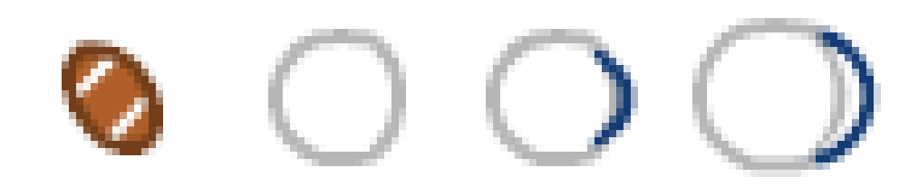

# Football-Assets: Beschaffung (reine Asset-Runde, keine Motor-Verdrahtung)

Stand: Branch `claude/football-assets`, abgezweigt von `origin/main`, 03.09.2026. Reine
Asset-Beschaffung nach `docs/design/football-rollout-plan.md` Abschnitt C — **keine Engine-Aenderung,
kein Rezept, keine Live-Migration**. Die ist ausdruecklich einer spaeteren Runde vorbehalten.

## 1. Kenney Sports Pack: Ball und Helm

`kenney_sportsPack.zip` wurde von `https://opengameart.org/sites/default/files/kenney_sportsPack.zip`
(verlinkt von `https://opengameart.org/content/sports-pack-350`) heruntergeladen und entpackt.
`License.txt` im Paket bestaetigt **CC0** wortwoertlich ("You may use these assets in personal
and commercial projects. Credit ... would be nice but is not mandatory.") — dieselbe Quelle und
Lizenz, aus der `public/sprites/basketball/quellen.json` bereits `korb_topdown.png` u. a. bezieht.

Vier Dateien aus `PNG/Equipment/` nach `public/sprites/football/` uebernommen, unveraendert
(keine Skalierung, keine Zuschnitte):

| Datei | Groesse | Inhalt |
|---|---:|---|
| `ball_football.png` | 14x16 | brauner Football, zwei weisse Schnuersenkel-Streifen, oval |
| `helmet_white1.png` | 19x19 | Helm-Blickwinkel 1 |
| `helmet_white2.png` | 21x19 | Helm-Blickwinkel 2 |
| `helmet_white3.png` | 26x22 | Helm-Blickwinkel 3 |

Alle vier Groessen stimmen exakt mit den in `football-rollout-plan.md` Abschnitt C.1/C.2 vorab
geprueften Massen ueberein. Lizenznachweis, Herkunft und Verwendungshinweise stehen in
`public/sprites/football/quellen.json` (Vorbild: `public/sprites/basketball/quellen.json`).

**Sichtpruefung** (Nearest-Neighbor 8x vergroessert, Belegbild unten): der Ball ist eindeutig als
Football erkennbar (braun, oval, Schnuersenkel) — kein Soccer-Ball unter falschem Namen. Die drei
Helm-Sprites zeigen einen weissen Helm (dominante Farbe 255/255/255, grau schattiert 182/182/182)
mit blauem Gesichtsschutz-Bogen, der ueber die drei Varianten zunehmend sichtbar wird (Blickwinkel-
Rotation) — als Helm erkennbar, Zuordnung der drei Winkel zu den `blickAus()`-Richtungen ist noch
NICHT vorgenommen (das ist Verdrahtungsarbeit einer spaeteren Runde, nicht dieser Beschaffung).

**Feld:** kein neues Asset noetig — `bodenFeldspiel()` (`engine.js:8368-8384`) zeichnet Endzonen
und Yard-Linien bereits vektoriell, wie im Rollout-Plan (C.3) festgestellt.

## 2. Trikot/Schulterpolster-Layer: eigene Suche durchgefuehrt, ergebnislos

Der Rollout-Plan vermutete (Abschnitt C.4/C.5), dass eine gezielte Suche nach einem
football-spezifischen LPC-kompatiblen Ruestungslayer erfolglos bleibt. Das wurde in dieser
Runde selbst nachgeprueft, nicht nur uebernommen:

**Universal-LPC-Spritesheet-Character-Generator** (`github.com/LiberatedPixelCup/
Universal-LPC-Spritesheet-Character-Generator`, vollstaendig geklont, 89&nbsp;353 Dateien,
Dateinamen durchsucht):

- `find . -iname "*football*"` → **kein Treffer**
- `find . -iname "*jersey*"` → **kein Treffer**
- `find . -iname "*pauldron*"` / `*shoulder*` → nur die vier bekannten Schulter-Typen
  (`shoulders_legion.json`, `shoulders_epaulets.json`, `shoulders_mantal.json`,
  `shoulders_pauldrons.json` — Letzterer ist genau die bereits im Baukasten genutzte
  `schulter`-Ebene, `shoulders/pauldrons/male/slash.png`)
- `find . -iname "*helmet*"` → nur mittelalterliche Typen (`hat_helmet_armet`, `_morion`,
  `_bascinet`, `_norman`, `_kettle`, `_spangenhelm`, `_barbarian_viking`, `_xeon`)

**OpenGameArt.org** (`art-search-advanced`, `keys`-Parameter, Suchmechanik gegen eine bekannte
Kontrollabfrage — `keys=sword` liefert 767 Treffer — als funktionierend bestaetigt, bevor die
Nulltreffer als echte Nulltreffer gewertet wurden):

| Suchbegriff | Treffer | Befund |
|---|---:|---|
| `football shoulder pad` | 0 | — |
| `shoulder pad` | 1 | irrelevant |
| `shoulder pads` | 3 | irrelevant |
| `football armor` | 1 | irrelevant |
| `football jersey` | 1 | irrelevant |
| `football uniform` | 1 | irrelevant |
| `gridiron` | 0 | — |
| `american football` | 7 | keine LPC-Layer (s. u.) |
| `NFL` | 3 | irrelevant |
| `LPC sport` | 0 | — |
| `LPC jersey` | 0 | — |
| `LPC quarterback` | 0 | — |
| `football` (41 Treffer, alle Titel durchgesehen) | 41 | ueberwiegend Soccer (britischer Sprachgebrauch), zwei echte American-Football-Funde s. u. |

Zwei echte American-Football-Treffer wurden geprueft und beide verworfen:

1. **„American Football Assets"** (`opengameart.org/content/american-football-assets`,
   CC-BY 3.0): ein einzelnes 64x64-GIF, ein statisches Icon (Helm+Trikot-Andeutung von oben),
   keine Bewegungs-Frames, kein LPC-Raster — nicht als Layer nutzbar.
2. **„football players"** (`opengameart.org/content/football-players`, CC0): eine ansehnliche
   Vektor-Illustration eines kompletten Football-Spielers (Helm, Schulterpolster, Trikot,
   sichtbar gute Qualitaet) — aber eine EINZELNE, frontale, statische Pose ohne Bewegungs-
   Frames oder Richtungsvarianten und als GESCHLOSSENE Figur, nicht als separierbare
   Ruestungs-EBENE fuer einen LPC-Koerper. Nicht kompatibel mit dem Baukasten-Schema
   (`slash`/`walk`/`run`/`idle`/`hurt`/`shoot` je Richtung, 64px-Raster).

**Befund, wie vom Plan vermutet und hier selbst bestaetigt:** es existiert kein
football-spezifisches, LPC-kompatibles Schulterpolster-/Trikot-Layer — weder im
LPC-Generator-Repo noch auf OpenGameArt. Die bestehende `schulter`-Ebene
(`shoulders/pauldrons/male/slash.png`, `public/sprites/baukasten/quellen.json:77`) bleibt die
pragmatischste verfuegbare Loesung: gerundete Schulterkappen, die der Silhouette eines
Football-Schulterpolsters naeher kommen als eine Fantasy-Pauldrone, aber erkennbar als
mittelalterliches Ruestungsteil gestaltet — sofort verfuegbar, keine neue Lizenz noetig, kein
neuer Download.

## Zusammenfassung fuer die spaetere Live-Migrations-Runde

- Ball und Helm liegen jetzt im Repo, lizenzsauber dokumentiert, sichtgeprueft — einsatzbereit
  fuer die Verdrahtung (analog `bkBild`/`BK_TEILE`, `engine.js:12491-12495`), sobald diese Runde
  ansteht.
- Feld braucht kein neues Asset.
- Trikot/Schulterpolster bleibt ein offener Punkt ohne bessere Loesung als die bestehende
  `schulter`-Ebene — eine erneute Suche waere nur bei neuem Kandidatenmaterial sinnvoll, nicht
  als wiederholte Stichprobe derselben zwei Quellen.
