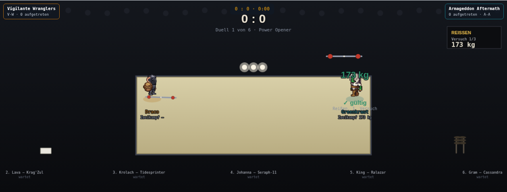
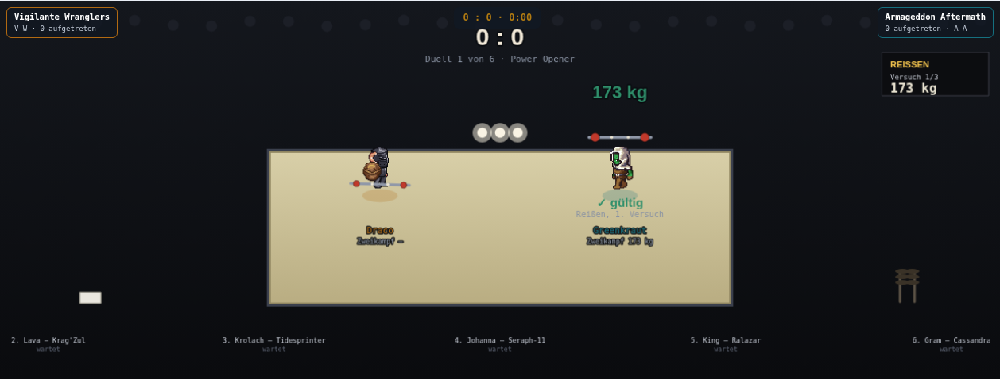
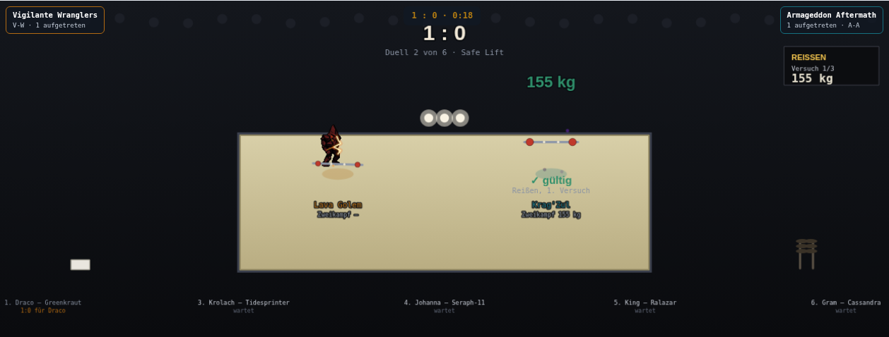
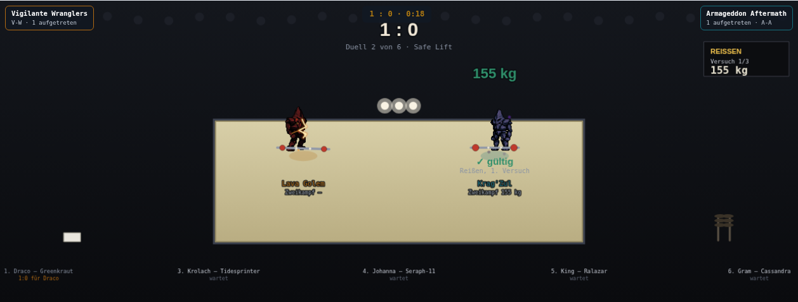

# Gewichtheben: Duell-Aufstellung und Hantel-Geometrie — Pixelmessung (13.09.)

Auftrag ist Chris' Befund zu einem Live-Screenshot eines Gewichtheben-Duells, wörtlich:

> „bitte gewichtheben auch im UI und optisch checken, momentan stehen die 2 spieler unnnötig
> weit am rand statt zentraler im vergleich in der mitte. dann hat nur enier eine hantel. die
> ist viel zu weit unten und beim heben wird sie quasi weit über den kopf geworfen. Das muss
> sich viel mehr am modell orientieren. Und wenn wir verschiedene modellgrößen haben von 1-10
> height dann musst du das ans modell anpassen. lass fable das sauber erarbeiten mit nem agent
> und dann umsetzn"

„Sauber erarbeiten" heißt hier: **erst messen, dann ändern** — dieselbe Reihenfolge wie bei
`docs/design/sprite-handpunkte.md` (Hockeyschläger/HEBEN_HAND) und beim Takeshi-Armband
(`sprite-armpunkte-beweis-takeshi.png`), und aus demselben Grund: die alten `HEBEN_PHASEN`-Zahlen
waren nie an einer Figur gemessen, sondern am freien Bildeindruck gewählt. Dieses Dokument ist die
Messung; der Code-Teil kommt danach.

## Kurzfassung

| Chris' Befund | Gemessen | Ursache |
|---|---|---|
| „stehen unnötig weit am rand" | Mittelachsen bei 372 und 868px auf einer 1240px-Bühne, 496px Abstand, dazwischen 352px leere Fläche zwischen den Stangenenden | `W*0.30`/`W*0.70`, zweimal wörtlich im Code |
| „nur einer hat eine hantel" | **5 von 17 Figuren** bekommen in **keiner** Phase eine Hantel | `b.vollbild`- und `b.reiherMech`-Zweig in `zeichneSprite()` kehren `return` **vor** dem Hantel-Block zurück. **Nicht** `u.down` — das ist auf einer Bühne nie gesetzt |
| „viel zu weit unten" | Stangenmitte bei Körperanteil **1,065** — also 3 Zellen **unter** der Sohle, im Boden | `HEBEN_PHASEN.boden.dy = 34` |
| „weit über den kopf geworfen" | Stangenmitte bei Körperanteil **−0,545** — eine halbe Körperhöhe über dem Scheitel | `HEBEN_PHASEN.hoch.dy = −49` |
| „muss sich viel mehr am modell orientieren" | Stangenmitte hängt an EINER Faust, 21 Zellen (0,41 Körperhöhen) neben der Körpermitte | `HEBEN_HAND` ist der gemessene Punkt **einer** Faust; eine Hantel wird zweihändig symmetrisch gegriffen |
| „bei modellgrößen 1-10 ans modell anpassen" | **Hält bereits.** Über Größe 1…10 bleibt der Körperanteil der Stange auf ±0,008 konstant | Die lineare Z-Skalierung ist richtig — es braucht **keinen** größenabhängigen Korrekturterm. Die echte Nichtproportionalität sitzt woanders, s. Abschnitt 5 |

Das ist der wichtigste Einzelbefund dieser Runde: **Chris' Vermutung, die Skalierung über
Modellgröße 1–10 sei schuld, trifft nicht zu — nachgemessen skaliert sie sauber.** Falsch waren
die Grundwerte selbst, und zwar bei jeder Größe gleich falsch.

## 1. Methode

`scripts/messe-heben-geometrie.mjs` (Playwright, Chromium unter `/opt/pw-browsers`), gebaut nach
dem Vorbild von `scripts/messe-heben-handpunkt.mjs`, aber mit einer anderen Frage: nicht „wo ist
die Hand", sondern „wo liegt die Stange relativ zum ganzen Körper, über alle Phasen und
Modellgrößen".

1. **Modellgröße über den Produktionspfad setzen.** `window.__arena.kaderSetzen({heim:[…]})`
   tauscht SQUAD zur Laufzeit — derselbe Weg, den auch `window.__olyArenaKader` aus der echten
   App nimmt. `renderProbe` liest `groesse` aus dem Kader, nicht als Aufrufwert (so ist die Sonde
   ausdrücklich gebaut: „die Sonde soll zeigen, was das Spiel zeigt"). Gemessen bei
   **groesse 1, 3, 5, 7, 10**.
2. **Disziplin scharfschalten.** `window.__arena.setDisc("gewichtheben")`; ohne das ist
   `istHeben()` falsch und der Hantel-Block wird gar nicht erreicht.
3. **Phase gezielt ansteuern.** `renderProbe` hat dafür einen neuen, rein diagnostischen
   7. Parameter `vizPhase` bekommen — dieselbe Rolle wie die schon vorhandenen optionalen
   `lunge`/`leinwand`. Ohne laufendes Duell liefert der Fallback `hebePhase()` immer `"boden"`;
   die Überkopf-Phase `"hoch"`, um die es in Chris' Befund geht, war über diese Sonde vorher
   **gar nicht messbar**.
4. **Hantel exakt isolieren.** Zwei Renderings, **beide** mit `feldspiel=true` und beide in
   derselben „shoot"-Pose: einmal unter `disc="gewichtheben"` (Körper + Hantel), einmal unter
   `disc="basketball"` (derselbe Körper, keine Requisite). Die Alpha-Differenz ist exakt die
   Hantel — keine Farbheuristik.
5. **Körper-Landmarken** aus dem reinen Körperbild: Scheitel und Sohle als erste/letzte
   Alpha-Zeile, Schulter als erste Zeile im oberen Drittel mit ≥70 % der Maximalbreite, Hüfte als
   schmalste Zeile darunter.

`renderProbe` zeichnet immer bei `x=32,y=46` der Leinwand, unabhängig von deren Größe —
Leinwand-Pixel und Zellkoordinaten sind also deckungsgleich (s. `sprite-handpunkte.md`).

### Ein Fehlversuch unterwegs — zur Ehrlichkeit dieser Messung

Der erste Durchlauf nahm als Gegenbild `feldspiel=false` statt einer anderen Disziplin. Das ist
falsch: `feldspiel` schaltet zusätzlich die Bogen-/Feuerwaffen-Overlays und die `ani`-Wahl um
(Engine `:2827`/`:2853`). Die Differenz enthielt damit den **Bogen**, nicht die Hantel, und meldete
für `"hoch"` eine über alle Größen konstante Stangenmitte bei y=44,5 — während die Stange in
Wahrheit längst außerhalb der Leinwand stand. Der Fehler fiel auf, weil diese Konstanz der
Formel widersprach; neu gemessen mit dem Disziplin-Wechsel als Gegenbild, Ergebnis unten. Der
Kopfkommentar des Skripts hält den Fall fest, damit ihn niemand nachbaut.

## 2. Befund 1 — die zwei Heber stehen zu weit außen

Die Bühne ist 1240×470 (`battle-mode.html`, `<canvas id="cv">`). `zeichneHeben()` setzt die beiden
Podestplätze auf `W*0.30` und `W*0.70`, also **372** und **868** — 496px Abstand der Mittelachsen.
Die Hantel ist im Profil `34*Z` lang und reicht mit der äußersten Scheibe bis ~`54*Z` von der
Mittelachse; bei der größten Figur des Beispielkaders (Krag'Zul, Z≈1,71) sind das ~92px je Seite.
Zwischen den beiden Stangenenden bleiben damit **352px leere Bühne**. Genau das sieht man im
Vorher-Bild.

Dieselben zwei Zahlen standen an **zwei** Stellen wörtlich im Code (im `forEach` der beiden Heber
und unten bei `bx` für die Textkarte) — sie konnten also auseinanderlaufen.

**Neu: `HEBEN_SPALTE=[0.38,0.62]`**, eine Konstante statt zweier Literale. Das ergibt 471/769,
Abstand 298px, und zwischen den Stangenenden (563 und 677) bleiben **114px** Luft. Die Schranke
ist gerechnet, nicht geraten: bei 0.42/0.58 (Abstand 198px) wären es nur noch 14px — zwei große
Heber würden ihre Scheiben kreuzen. Die Namens-/Zweikampfzeilen sind schmaler als die Hantel
(16 Zeichen IBM Plex Mono 11px ≈ 106px, also ~53px je Seite) und deshalb nicht die bindende
Schranke.

## 3. Befund 2 — fünf von siebzehn Figuren bekommen NIE eine Hantel

Der naheliegende Verdacht war die `!u.down`-Bedingung am Hantel-Block („ein Heber nach einem
Fehlversuch gilt als `down` und verliert die Stange"). **Der trifft nicht zu:** Bühnen-Teilnehmer
werden mit `down:false` gebaut, und keine Zeile des Bühnen-Chassis setzt das Feld je auf `true`
(gesetzt wird es nur im Feldspiel-Hockey und in der Arena). Ein Fehlversuch führt in `stepHeben()`
von `"zug"` direkt nach `"ablage"`, nicht in einen Down-Zustand — das ist bereits korrekt
modelliert.

Die wirkliche Ursache ist eine Zeile weiter oben. `zeichneSprite()` hat drei Zeichenpfade, und
**zwei davon kehren zurück, bevor der Hantel-Block überhaupt erreicht wird**:

| Zweig | Zeile | Requisiten-Haken vorhanden |
|---|---|---|
| `b.reiherMech` (prozedurale Kranich-Figur) | `return` bei :2779 | nur Hockeyschläger |
| `b.vollbild` (Golem/Kraken/Krokodil/… als Ganzblatt) | `return` bei :2870 | nur Hockeyschläger (`VOLLBILD_SCHLAEGER`) |
| Normaler Baukasten-Körper | — | Hockeyschläger, **Hantel**, Schachuhr |

Hockey hatte diese Lücke am 02.09. schon einmal („auch die Golems brauchen einen") und wurde
damals repariert — für Gewichtheben blieb sie stehen.

Erhebung über den ganzen Beispielkader (`renderProbe`, echte Größen, Phasen `boden` und `hoch`):

| Figur | Blatt | Hantel? |
|---|---|---|
| Lava Golem | `b.vollbild` golem | **keine** |
| Krolach | `b.vollbild` golem | **keine** |
| Krag'Zul | `b.vollbild` golem | **keine** |
| Tidesprinter | `b.vollbild` | **keine** |
| Seraph-11 | `b.reiherMech` | **keine** |
| Draco, Johanna, King Arlen Morgolor, Gram, Rhyx'Tal, Xelara, Jorund, Inefinna, Lulu, Greenkraut, Ralazar, Cassandra | Baukasten | ja |

**5 von 17.** Bei sechs Duellen je Auftritt trifft das statistisch fast jeden Durchlauf — im
Beispielkader ist Duell 2 (Lava Golem gegen Krag'Zul) sogar ein Duell, in dem **beide** Heber Luft
stemmen, und Duell 3 (Krolach gegen Tidesprinter) ebenfalls. Genau Chris' „dann hat nur einer eine
hantel".

**Behebung:** beide Zweige bekommen denselben Aufruf wie der normale Pfad, über eine gemeinsame
Hilfsfunktion `hantelAnPunkt(hp,richtung)` — damit gibt es die Umrechnung Zellkoordinate →
Bildschirm genau einmal in `zeichneSprite()` statt dreimal. **Gegenprobe nach der Änderung:
alle 17 Figuren des Beispielkaders zeichnen in `boden` UND in `hoch` eine Hantel** (Protokoll
in Abschnitt 5.1).

- **Vollbild**: Ankerpunkt aus `VOLLBILD_SCHLAEGER[b.vollbild].punkte[r0]`. Die Tabelle heißt nur
  nach ihrem ersten Nutzer; ihr eigener Kopfkommentar nennt sie „GRIFFPUNKTE FÜR VOLLBILD-/
  REIHERMECH-KREATUREN" und sie ist genau das — je Blatt ein vermessener Körperpunkt
  (`vollbild-schlaeger-griffpunkte.md`).
- **Fehlt ein Blatt in der Tabelle** (von den 16 tatsächlich benutzten Schlüsseln nur
  `singvogel`), fällt der Anker auf `HEBEN_HAND` zurück statt gar nichts zu zeichnen. Beim
  Schläger ist „lieber keiner als einer an der falschen Stelle" richtig — ein Hockeyspieler ohne
  Schläger fällt nicht auf. Beim Gewichtheben ist es umgekehrt: ein Heber ohne Hantel stemmt
  sichtbar Luft, und genau das ist der gemeldete Fehler.
- **ReiherMech**: **nicht** am Kopf/Schnabel wie der Schläger — eine Hantel hängt am Rumpf. Die
  Figur wird rein prozedural gezeichnet (`zeichneReiherMech`), ihre Maße stehen deshalb im Code
  statt in einem Pixelscan: Rumpf-Oval bei `cy+1*Z`, Füße bei `cy+19*Z`, Kopf bei `cy-17*Z`
  (Scheitel also ~`cy-19*Z`). Das ergibt ~39 Zellen Körperhöhe; 0,40 davon — derselbe relative
  Griffpunkt, den `HEBEN_HAND` beim Standardkörper hat — liegt bei `cy-3*Z`, in Zellschreibweise
  `y:43`.

### 3.1 Beim Gegenprüfen aufgefallen: der aktive Heber verschwand ganz

Das Beweisbild des Vollbild-Duells (Abschnitt 9) zeigte Lava Golem mit Hantel — und von
Krag'Zul nur Schatten, Hantel und zwei Void-Partikel. **Kein Körper.** Das ist ein
**vorbestehender** Fehler, nachgemessen an `origin/main`, und er hat mit der Hantel nichts zu
tun.

Der Bildindex der Angriffsanimation rechnet an drei Stellen `Math.floor((1 - u.lunge/0.2) * n)`.
Die Formel setzt voraus, dass `u.lunge` bei **0,2** startet. In der Arena stimmt das. Auf der
Bühne und im Feldspiel nicht: dort setzen `stepBuehne()` und die Wurf-/Block-/Torwart-Pfade
`u.lunge` auf **0,5** — auf der Bühne ist diese 0,5 sogar bewusst als Einmal-pro-Versuch-Marke
gewählt (`stepHeben()` erkennt daran den frisch enthüllten Versuch). Für `u.lunge > 0,2` wird der
Ausdruck **negativ**, `Math.min()` lässt ihn negativ, und `drawImage()` mit negativem Quell-x
zeichnet gar nichts.

Gemessen an `origin/main`, sichtbare Alpha-Pixel derselben Figur über `renderProbe`, Disziplin
Gewichtheben:

| Figur | `lunge 0,19` | `lunge 0,21` | `lunge 0,5` (was die Bühne setzt) |
|---|---:|---:|---:|
| Krag'Zul (vollbild) | 1603px | **53px** | **53px** |
| Lava Golem (vollbild) | 1848px | **283px** | **283px** |
| Johanna (Baukasten) | 1553px | **827px** | **827px** |
| Draco (Baukasten) | 1584px | **829px** | **829px** |
| Seraph-11 (reiherMech) | 376px | 376px | 376px |

Vollbild-Kreaturen verschwinden **ganz**, Baukasten-Figuren verlieren die Ebenen, die am
Bildindex hängen (Körper, Kopf, Rüstung), und nur der prozedural gezeichnete Reiher-Mech ist
unbetroffen. Das passiert für die ersten 0,3 Simulationssekunden **jedes** enthüllten Versuchs —
bei `ZEIT_DEHNUNG.gewichtheben = 4` gut eine reale Sekunde, und zwar genau an der Figur, auf der
die Kamera steht.

**Behoben mit `Math.max(0, …)` an allen drei Stellen** (Standardkörper-Bildindex, Waffenbild,
Vollbild). Nachweisbar risikolos: für `u.lunge ≤ 0,2` liegt der Ausdruck ohnehin schon in
`[0, n-1]`, die Klammer ist dort wirkungslos; nur für `u.lunge > 0,2` ändert sich etwas, und dort
ändert sie „gar nichts gezeichnet" in „erstes Bild gezeichnet". Es gibt keinen Fall, in dem
etwas **anderes** Sichtbares erscheint als bisher. Während 0,5 → 0,2 hält die Figur damit die
Ausholpose und spielt die Sequenz danach wie bisher über 0,2 → 0 ab; eine Umrechnung auf den
echten Startwert wäre die sauberere Lösung, nur wird dieser Startwert nirgends festgehalten.

**Das reicht über Gewichtheben hinaus** — dieselben drei Stellen bedienen alle zwanzig
Disziplinen, und `u.lunge = 0,5` setzen auch Basketball-Würfe, Hockey-Blocks und die
Torwart-Pfade. Es ist bewusst trotzdem Teil dieser Runde: Chris' Auftrag lautet „gewichtheben
auch im UI und optisch checken", und dies war der auffälligste Fund dabei.

## 4. Befund 3 — wo die Stange wirklich lag

Alle Zahlen aus `scripts/messe-heben-geometrie.mjs`, Figur Johanna (Standard-Baukasten-Körper),
Blickrichtung „rechts", Zellkoordinaten (Fußpunkt y=46).

### 4.1 Die Körperlandmarken, an denen gemessen wird

Johanna, groesse 5 (Z≈1,04), umgerechnet in Zellkoordinaten:

| Landmarke | Zelle | Körperanteil (0 = Scheitel, 1 = Sohle) |
|---|---:|---:|
| Scheitel | 11,4 | 0,00 |
| Schulter | 26,8 | 0,30 |
| Brustbein | 30,6 | 0,38 |
| **Handanker `HEBEN_HAND`** | **32,0** | **0,40** |
| Hüfte | 43,1 | 0,62 |
| Sohle | 62,3 | 1,00 |

Körperhöhe **51,0 Zellen** — nahe genug an `HOEHEN_BEZUG=52`, dass gilt: **`dy/51` ist direkt der
Anteil der Körperhöhe**, um den die Stange vom Handanker abweicht. Das macht die vier Offsets
lesbar, ohne eine zweite Rechnung.

### 4.2 Gemessene Stangenlage, alte Werte

Körperanteil der Stangenmitte, je Phase und Modellgröße:

| Phase | `dy` alt | g=1 | g=3 | g=5 | g=7 | g=10 | Soll (echtes Gewichtheben) |
|---|---:|---:|---:|---:|---:|---:|---|
| boden | 34 | 1,071 | 1,063 | 1,065 | 1,067 | 1,065 | ~0,88 (Stange auf der Plattform, Scheibenmitte) |
| antritt | 34 | 1,060 | 1,052 | 1,056 | 1,058 | 1,058 | wie boden |
| zug | 2 | 0,405 | 0,406 | 0,417 | 0,417 | 0,420 | ~0,29 (Front-Rack, Schlüsselbein) |
| hoch | −49 | −0,545 (gerechnet) | −0,545 | −0,545 | −0,545 | −0,545 | ~0,00 bis −0,12 (über dem Scheitel) |
| ablage | 40 | 1,179 | 1,188 | 1,185 | 1,175 | 1,181 | ~0,90 (gefallen, aber auf der Plattform) |

Lesart: **1,065 heißt, die Stangenmitte liegt 6,5 % einer Körperhöhe UNTER der Sohle** — die
Hantel steckt im Boden, unter den Füßen der Figur, drei Zellen tief. **−0,545 heißt, sie steht
eine halbe Körperhöhe über dem Scheitel** — bei Johanna in Bühnenpixeln 29px über dem Kopf einer
54px hohen Figur. Das ist exakt Chris' „viel zu weit unten" und „weit über den kopf geworfen",
nur in Zahlen.

In der Phase `"hoch"` steht die Stange bei jeder Größe **außerhalb** der 256px-Messleinwand
(gerechnet y = −4,9 bei g=1 bis −37,6 bei g=10). Die Messung stützt sich dort auf die Formel; sie
ist belastbar, weil Messung und Formel in **jeder** Phase, in der die Stange im Bild lag, auf
≤1,4px übereinstimmten.

### 4.3 Die neuen Werte, und woher sie kommen

| Phase | `dy` alt | `dy` neu | Herleitung |
|---|---:|---:|---|
| boden | 34 | **25** | Sohle 62,3 minus ~5,5 Zellen Scheibenradius = 56,8; 56,8 − 32 = 24,8. So liegt eine belegte Stange wirklich auf der Plattform: die Scheiben tragen, die Stange schwebt auf Scheibenmitte |
| antritt | 34 | **25** | wie boden, nur ohne die Grundneigung |
| zug | 2 | **−4** | Schulterlinie 26,8, Schlüsselbein gut eine Zelle darunter (28); 28 − 32 = −4 |
| hoch | −49 | **−27** | Scheitel 11,4; Stange ~6 Zellen (0,12 Körperhöhen) darüber → 5,3; 5,3 − 32 = −26,7 |
| abwurf | 36 | **26** | Legacy-Fallback, gleich behandelt wie ablage |
| ablage | 40 | **26** | eine Zelle tiefer als boden, stärker gekippt: gefallen und schief, aber **auf** der Plattform |

**Warum `hoch` nicht auf die anatomisch korrekten ~0,25 Körperhöhen einer echten Ausstoßung
geht:** das Sprite-Blatt hat gar keine Überkopf-Pose. Die von `zeichneHeben()` erzwungene
„shoot"-Pose ist ein seitlicher Stoßgriff auf Brusthöhe (das steht so schon im Kommentar an
`HEBEN_HAND` und in `sprite-handpunkte.md`). Je höher die Stange über diesen Händen steht, desto
mehr schwebt sie frei — genau der Eindruck, den Chris „geworfen" nennt. **0,12 Körperhöhen ist der
Kompromiss, der „über Kopf" liest, ohne sich vom Modell zu lösen.** Das ist eine bewusste
Abweichung von der Anatomie zugunsten der Lesbarkeit, keine Messung, und deshalb hier
ausgewiesen.

## 5. Befund 4 — die Modellgrößen 1–10 skalieren bereits richtig

Chris' Vermutung war, die Proportionen könnten über die Größenskala auseinanderlaufen. Gemessen
tun sie das **nicht**. Für ein und dasselbe Blatt ist der Körperanteil der Stange über den ganzen
Bereich 1…10 konstant:

| Phase | Spannweite des Körperanteils über g=1…10 |
|---|---:|
| boden | 1,063 … 1,071 (±0,004) |
| antritt | 1,052 … 1,060 (±0,004) |
| zug | 0,405 … 0,420 (±0,008) |
| ablage | 1,175 … 1,188 (±0,007) |

Der Grund ist strukturell und nicht zufällig: `Z = groesseFaktor(u.groesse) × hoehenKorrektur(u) ×
bauSkala(b)` skaliert das Blatt **und** den Bodenanker `y-46*Z` **und** die Zellkoordinate
`hp.y*Z` **und** den Phasenoffset `p.dy*s` mit demselben Faktor. Innerhalb eines Blatts ist alles
proportional; die Restabweichung von ±0,008 ist Rundung der Landmarken-Heuristik auf ganze
Pixelzeilen, nicht Drift.

**Ein größenabhängiger Korrekturterm wäre also falsch** — er würde eine Nichtlinearität
kompensieren, die es nicht gibt. Die alten Zahlen waren bei Größe 1 genauso falsch wie bei
Größe 10.

### 5.1 Wo die Proportionen wirklich auseinanderlaufen: zwischen BLÄTTERN

Was die Messung stattdessen zeigt: die gezeichnete Körperhöhe im selben 64er-Rahmen unterscheidet
sich je Blatt erheblich.

| Figur | Blatt | Körperhöhe bei groesse 5 | Z gesamt |
|---|---|---:|---:|
| Johanna | Baukasten `body_walk` | 54px | ≈1,04 |
| Krag'Zul | `b.vollbild` golem | 89px | ≈1,71 |

`hoehenKorrektur()` soll genau das wegnormieren (alle Blätter auf `HOEHEN_BEZUG=52`). Der
naheliegende Grund, warum es hier nicht greift, ist der eigene Deckel der Funktion
(`HOEHEN_KORR_MAX=1.25`): ein Vollbild-Blatt füllt seine 64er-Zelle ganz aus, der Rahmen ist
immer `64*Z` hoch, und `52/64 = 0,81` wäre die nötige Korrektur — nach unten. Gemessen ist sie
es nicht. Bei Krag'Zul mit seiner echten `groesse 9` (`groesseFaktor` 1,244) passt
`Z = 1,244 × 1,25 = 1,555`, also ein Rahmen von 99px, exakt zur gemessenen Körperhöhe von 100px:
die Korrektur steht am **oberen** Anschlag statt am rechnerischen 0,81. **Das ist ein
vorbestehender Befund außerhalb dieses Auftrags** — eine Änderung daran verschöbe die Größe
*jeder* Figur in *allen* zwanzig Disziplinen — und wird hier nur festgehalten, nicht angefasst.

Praktische Folge für die Hantel: ein fester `dy` in Zelleinheiten ist proportional über *Größen*,
aber nicht über *Blätter*. Der Standardkörper füllt die Zelle von ~11 bis ~62 (51 Zellen), ein
Vollbild-Blatt von 0 bis 64. Dieselben `dy` treffen deshalb andere Körperstellen.

Gemessen nach der Korrektur, Probe-Koordinaten (Fußpunkt y=46), echte Kadergrößen:

| Figur | Blatt | Körper y | Stange „boden" über der Sohle | Stange „hoch" über dem Scheitel |
|---|---|---|---:|---:|
| Johanna | Baukasten | 10…63 | +5,5 | +7,5 |
| Gram | Baukasten | 9…63 | +5,5 | +6,5 |
| Greenkraut | Baukasten | 11…64 | +6,0 | +9,5 |
| Krolach | vollbild golem | 3…61 | +3,5 | (oben beschnitten) |
| Krag'Zul | vollbild golem | 0…99 | **+38,0** | (oben beschnitten) |
| Tidesprinter | vollbild | 21…68 | −1,5 | +19,5 |
| Seraph-11 | reiherMech | 24…67 | −2,0 | +11,0 |

Die zwölf Baukasten-Figuren liegen eng beieinander (Stange 5…6px über der Sohle, 6…11px über dem
Scheitel). **Krag'Zul ist der Ausreißer**: seine Ruhestange steht 38px über der Sohle, also auf
Brusthöhe statt auf der Plattform — die direkte Folge dessen, dass sein Blatt bei gleicher
nominaler Größe fast doppelt so hoch gezeichnet wird.

**Bewusst nicht weiter korrigiert.** Ein zweiter, blattabhängiger Skalierungsfaktor auf `dy` wäre
genau der parallele Mechanismus, den es hier nicht geben soll; und ein *einzelner* Ankerpunkt je
Blatt kann beide Enden nicht zugleich treffen: mit festem `dy` verlangt „boden" bei einem
64-Zellen-Körper einen Anker bei Zelle ~31, „hoch" einen bei ~19. Der gemessene Griffpunkt des
Golem-Blatts (y=33) trifft die Ruhelage gut und die Überkopflage schwach — und die Ruhelage ist
der Zustand, den man die meiste Zeit sieht, weil immer nur einer der beiden Heber aktiv ist. Der
saubere Weg führt über `hoehenKorrektur()`, nicht über die Hantel; dafür ist eine eigene Runde
vorgemerkt.

## 6. Befund 5 — die Stange hing an EINER Faust

Nicht in Chris' Liste benannt, aber Teil von „muss sich viel mehr am modell orientieren", und im
Vorher-Bild deutlich zu sehen: die Stange klebt seitlich neben der Figur statt vor ihr.

`HEBEN_HAND` ist der per Pixelscan gemessene Punkt **einer** Faust — für die Höhe richtig, für die
Seite nicht. Gemessen bei Johanna, groesse 5, Blickrichtung „rechts": Handanker bei Zelle x=52,
Stangenmitte damit bei Bildschirm-x 53, während der Körper um x=32 steht. Das sind **21 Zellen =
0,41 Körperhöhen Versatz** — die Hantel schwebt neben dem Heber, nicht in seinen Händen.

Eine Hantel wird zweihändig und symmetrisch gegriffen; ihre Mitte hängt deshalb an der
**Körpermittelachse**, nicht an einer einzelnen Faust.

**Das war schon einmal aufgeschrieben.** Die unabhängige Review zu PR #876 (10.09.,
`docs/pm-briefings/opus-review-pr-876-feinschliff-ziel1-gewichtheben-09-10.md`, Befund N3) hat
genau diesen Punkt notiert — und die Folge vorhergesagt, die Chris drei Tage später gemeldet hat:

> **N3 — die Stange haengt an EINER Faust, nicht zwischen beiden.** […] Sichtbar in jedem
> Screenshot: die Hantel steht seitlich versetzt zur Koerperachse. Zusammen mit
> `HEBEN_PHASEN.hoch.dy=-49` fuehrt das dazu, dass die Stange in der Streckungsphase eher ueber
> dem Kopf **schwebt**, als in den Haenden zu liegen […] Der richtige Ankerpunkt waere die Mitte
> zwischen den beiden gemessenen Faeusten (x≈32) […] **Kein Blocker** […] Aber der naechste
> Anfassende sollte es wissen.

Die hier unabhängig gemessene Mittelachse (31,5) bestätigt die damals geschätzte Zahl (≈32), und
die Kombination aus beidem — Faust-Anker **plus** `dy=-49` — ist wörtlich das, was Chris als
„weit über den kopf geworfen" beschreibt. Der Befund war als „kein Blocker" eingestuft und blieb
liegen; das ist die Runde, die ihn abarbeitet.

Gemessen wurde die Mittelachse auf zwei Arten, weil die „shoot"-Pose die Silhouette verzerrt
(ein Arm stößt weit heraus, der andere kreuzt vor der Brust; die Beine stehen im Ausfallschritt):

| Richtung | Silhouettenmitte ab Schulterhöhe | Mitte des Becken-/Beinbands |
|---|---:|---:|
| 0 hinten | 27,0 | 23,5 |
| 1 links | **31,5** | 38,0 |
| 2 vorn | 25,0 | 22,5 |
| 3 rechts | **31,5** | 25,0 |

Die zwei Profilrichtungen liefern ab Schulterhöhe **exakt 31,5**, und zwar spiegelgleich für
links und rechts und übereinstimmend für drei verschiedene Figuren (Johanna, Draco, Greenkraut).
31,5 ist die geometrische Mitte der 64er-Zelle — also genau der Punkt, auf den `zeichneSprite()`
die Figur ohnehin zentriert. Die Becken-/Beinwerte streuen dagegen um ±6,5, weil der
Ausfallschritt der Pose die Beine seitlich versetzt; sie taugen deshalb **nicht** als Mittelachse.
Die Front-/Rückenwerte (25,0/27,0) sind vom quer vor der Brust liegenden Arm nach links gezogen —
dort zeigt die Hantel ohnehin nur einen verkürzten Stummel.

**Ergebnis:** die Stangenmitte hängt an der Zeichen-x der Figur selbst. In der Schreibweise dieser
Datei ist `x-32*Z+hp.x*Z` mit `hp.x = 32` exakt `x`, es braucht also keine zusätzliche Rechnung
und keinen neuen Tabellenwert. `HEBEN_HAND.x` bleibt unverändert stehen (die Werte sind gemessen
und beschreiben korrekt eine Faust, wie der `DISZIPLIN_PROP`-Vertrag es verlangt) — der
Hantel-Pfad liest daraus nur noch `y`.

**Dazu passend: zwei Griffbänder statt einem.** `zeichneHantel()` setzte ein helles Band auf den
Ankerpunkt — richtig, solange der Anker eine Faust war. Auf der Stangenmitte wäre ein einzelnes
Band sinnlos: dort ist beim Gewichtheben nichts, die Hände liegen links und rechts davon. Jetzt
zwei symmetrische Bänder auf ±9 Zellen im Profil (≈ die gemessene Rumpfbreite der Standardfigur,
x 23…40 im Becken-/Beinband) bzw. ±5 in Front/Rücken, wo die Stange nur ein Stummel ist.

### 6.1 Gegenprobe nach der Änderung

Dieselbe Messung, nach der Korrektur (Johanna, Körperanteil der Stangenmitte):

| Phase | g=1 | g=3 | g=5 | g=7 | g=10 | Ziel |
|---|---:|---:|---:|---:|---:|---:|
| boden | 0,881 | 0,885 | 0,889 | 0,892 | 0,891 | ~0,88 |
| antritt | 0,881 | 0,885 | 0,880 | 0,875 | 0,884 | ~0,88 |
| zug | 0,286 | 0,302 | 0,296 | 0,300 | 0,304 | ~0,29 |
| ablage | 0,964 | 0,969 | 0,972 | 0,983 | 0,971 | ~0,97 |
| hoch | −0,167 | −0,177 | (beschnitten) | (beschnitten) | (beschnitten) | ~−0,12 |

Die Stange liegt in `zug` jetzt bei allen fünf Größen auf **exakt der Schulterlinie**
(„0,0px unter Schulter" im Messprotokoll) und in `boden`/`antritt` **4…7px über der Sohle** statt
darunter. Die Konstanz über die Größen bleibt erhalten (±0,006 bei boden, ±0,009 bei zug).

Zwei Messvorbehalte, ausgewiesen statt weggelassen:

- Die `hoch`-Werte sind **nach oben beschnitten**: `renderProbe` setzt den Fußpunkt fest auf
  Leinwand-y=46, ab groesse 5 liegt die Stange dort teils über dem Bildrand. Die Zahlen für g=1/3
  (−0,167/−0,177) enthalten außerdem die Scheiben im Umriss-Kasten, dessen Mitte ~2px über der
  Stangenlinie liegt; die Stangenlinie selbst steht bei g=1 rechnerisch 5,1px über dem Scheitel,
  also bei 0,121 Körperhöhen — dem Zielwert. Auf der echten Bühne (Fußpunkt y=216) ist nichts
  beschnitten.
- Die x-Ausdehnung der Stange lässt sich auf der Sondenleinwand nicht vollständig messen: bei
  einem Zeichenanker von x=32 ragt die linke Stangenhälfte (bis ~54*Z) über den linken Rand
  hinaus. Für die Höhenmessung ist das ohne Belang, für eine Breitenmessung wäre es eine Falle.

### 6.2 Die Textkarte musste weichen

`zeichneHeben()` setzte die kg-Zahl auf `textY-34` und das Kühn-Badge auf `textY-58`, also 32 bzw.
56px über dem Fußpunkt. Das ging nur deshalb gut, weil die Stange mit `dy=-49` **über** die ganze
Karte hinausflog — genau der gemeldete Wurf. Mit der korrigierten Überkopfhöhe steht die Stange
jetzt dort, wo vorher die Zahl stand.

Beide Zeilen liegen deshalb neu auf einer **festen Bühnenhöhe** (`H*0.245` und `H*0.20`) statt auf
einem Abstand zum Fußpunkt. Grund: die Überkopfhöhe hängt am Z der jeweiligen Figur und streut
über den Beispielkader um ~28px (Stangenoberkante zwischen Bühnen-y 167 bei Johanna/Z≈1,04 und
138 bei Krag'Zul/Z≈1,71). Ein fester Abstand hätte für die eine Figur gepasst und für die andere
nicht; `H*0.245` = 115px liegt über **beiden** und noch unter der Duell-Kopfzeile bei `H*0.155`.

**Und ein dritter, im Vorher-Bild sichtbarer Textfehler:** Name (`y+58`) und Versuchszeile der
Textkarte (`textY+48` = `y+50`) lagen acht Pixel auseinander — bei 10- bzw. 11px-Schrift heißt das
überlappend, im Vorher-Bild steht „Reißen, 1. Versuch" mitten im Namen „Greenkraut". Name und
Zweikampfzeile rücken auf `y+70`/`y+84`; nach unten ist Platz bis zur Warteschlangenzeile bei
`H*0.90` (= `y+207`).

## 6a. Nachtrag — die erste Fassung war nur für den Standardkörper kalibriert

**Diese Korrektur stammt aus der unabhängigen Review zu dieser PR und hebt Teile von
Abschnitt 6 auf.** Sie steht hier und nicht am Ende, weil sie den dort beschriebenen Anker
ersetzt.

Die erste Fassung dieser Runde hat den Hantel-Block in alle drei Zeichenpfade gezogen
(Abschnitt 3) und die Offsets neu vermessen (Abschnitt 4) — beides am **Standardkörper**,
51 Zellen hoch, Scheitel 11,4, Sohle 62,3. Die Zusammenfassung der eigenen Sonde
(`scripts/pruefe-heben-hantel-vollzaehlig.mjs`) lautete danach „Alle 17 Figuren zeichnen eine
Hantel", und genau diese eine Zeile stand in der PR. **Die Zeilenausgabe derselben Sonde zeigte
zugleich, dass die Geometrie für sechs Figuren noch falsch war** — die Prüfung fragte nur, *ob*
eine Hantel gezeichnet wird, nicht *wo*:

| Figur | Pfad | `boden` | `hoch` |
|---|---|---|---|
| Tidesprinter | vollbild | **1,5 Zellen unter der Sohle** | 19,5 über Scheitel |
| Seraph-11 | reiherMech | **2,0 Zellen unter der Sohle** | 11,0 über Scheitel |
| Inefinna | vollbild | **27,5 über der Sohle — schwebt auf halber Rumpfhöhe** | **3,0 unter Scheitel** |
| King Arlen | vollbild | ok | **3,0 unter Scheitel** |
| Krolach | vollbild | ok | **2,0 unter Scheitel** |
| Lava Golem | vollbild | ok | **3,0 unter Scheitel** |
| Krag'Zul | vollbild | nicht messbar (Figur an der Leinwandkante abgeschnitten) | nicht messbar |

„Unter der Sohle" heißt: die Stange liegt **im Boden** — derselbe Befund („viel zu weit unten"),
den diese Runde zu beheben antrat. „Unter dem Scheitel" heißt: die Stange schneidet in der
Überkopfphase **durch Kopf/Helm**.

### Die Ursache: absolute Zelleinheiten an einem fremden Blatt

`HEBEN_PHASEN.dy` stand in **absoluten Zellen** relativ zum Griffpunkt. Das ist richtig, solange
jede Figur denselben 51-Zellen-Körper benutzt. Zwei Quellen taten das nicht:

1. **`zeichneReiherMech`** (Seraph-11) zeichnet von `cy-19*Z` bis `cy+19*Z`, also **38 statt 51
   Zellen**. Ein `+25` aus der Standardkörper-Kalibrierung schießt an einem 38-Zellen-Körper
   zwangsläufig unter die Sohle, ein `-27` zwangsläufig weit über den Kopf. Ein anderer
   *Ankerpunkt* hätte das nicht geheilt: kein fester Punkt kann `boden` **und** `hoch` zugleich
   treffen, wenn die Höhe selbst abweicht.
2. **Der vollbild-Pfad** las die Griffhöhe aus `VOLLBILD_SCHLAEGER[...].griff.punkte[r0].y` — einer
   Tabelle mit **Faust**punkten für den Hockeyschläger. Deren `y` streut über die Blätter von 8
   (Inefinnas Blatt) bis 45 (kraken); golem liegt bei ~33, weshalb ausgerechnet die Figuren im
   Beweisbild richtig aussahen. Die Stangenhöhe hing damit an einer Größe **ohne jeden Bezug zur
   Körperhöhe** — bis zu einer viertel Körperhöhe Fehler, je nach Blatt.

### Die Behebung: Anteil der Körperhöhe statt absoluter Zellen

`HEBEN_PHASEN` steht jetzt in **`anteil`** — dem Anteil der Körperhöhe, vom Scheitel nach unten
gemessen (0 = Scheitel, 1 = Sohle) — statt in `dy`. Die Stangenhöhe ist damit

    Stangenmitte = Scheitel(Blatt) + anteil × Körperhöhe(Blatt)

und der **Griffpunkt geht überhaupt nicht mehr ein**. Das ist dieselbe Einsicht wie bei der
x-Achse in Abschnitt 6, eine Ebene tiefer: eine zweihändig gegriffene Hantel hängt am **Körper**,
nicht an einer Faust — weder seitlich noch in der Höhe.

| Phase | alt (`dy`) | neu (`anteil`) | Rechnung |
|---|---:|---:|---|
| boden / antritt | 25 | **0,896** | (32+25−11,4)/50,9 |
| zug | −4 | **0,326** | (32−4−11,4)/50,9 |
| hoch | −27 | **−0,126** | (32−27−11,4)/50,9 |
| abwurf / ablage | 26 | **0,916** | (32+26−11,4)/50,9 |

**Es ist dieselbe Geometrie, nur umgerechnet.** Für den Standardkörper zeichnet es pixelgleich
(nachgerechnet: `boden` 11,4+0,896×50,9 = 57,0 gegen 32+25 = 57; `hoch` 11,4−0,126×50,9 = 4,99
gegen 32−27 = 5). Die Änderung wirkt ausschließlich auf Blätter, deren Höhe von 51 Zellen abweicht.

Die Körperspanne kommt je Pfad aus der Quelle, die sie wirklich kennt:

| Pfad | Spanne (Zellen) | Woher |
|---|---|---|
| Standardkörper | 11,4 … 62,3 | die gemessenen Landmarken aus Abschnitt 4.1 |
| reiherMech | 27 … 65 | `zeichneReiherMech` zeichnet genau diese Grenzen — **der Code ist die Quelle** |
| vollbild | je Blatt gemessen | `blattSpanne()`: ein Alpha-Durchlauf über die ganze Blattzeile, einmal je Blatt+Richtung, danach im Zwischenspeicher |

`blattSpanne()` folgt demselben Grundsatz wie `hoehenKorrektur()` daneben — *„GEMESSEN STATT
TABELLIERT. Eine generierte Tabelle wäre die zweite Kopie derselben Wahrheit"* — nur am **Blatt**
statt an der fertig gezeichneten Figur, weil `zeichneSprite()` sich sonst über `hantelAnPunkt`
selbst aufrufen würde. Das Blatt reicht auch: `drawImage()` skaliert jede Zelle unabhängig von
ihrer nativen Größe immer auf `dh=64*Z`, die Zellspanne ist also direkt die Spanne im 64er-Rahmen.
Damit braucht **kein** neues Blatt je wieder eine Einzelmessung — auch die über 65 Vollbild-
Kreaturen außerhalb des Beispielkaders nicht.

### Zwei Werkzeug-Korrekturen, die dabei nötig wurden

- **`pruefe-heben-hantel-vollzaehlig.mjs` prüft jetzt die Geometrie mit**, nicht nur die Existenz:
  `boden` darf nicht unter die Sohle, `hoch` nicht unter den Scheitel (Toleranz 0,5 Zellen).
  Ein grüner Haken über einer Ausgabe, die den Fehler im Klartext enthält, ist schlimmer als gar
  keine Prüfung — er lädt dazu ein, „behoben" zu schreiben.
- **`renderProbe` nimmt einen optionalen Anker.** Der Zeichenpunkt lag fest auf `(32,46)`,
  *unabhängig* von `leinwand` — eine größere Leinwand gab einer großen Figur nur unten und rechts
  Platz. Krag'Zul (Z≈1,71, Sprite ab `y-46*Z` = −32) klebte deshalb oben an der Kante, und die
  Sonde meldete Scheitel 0 und Stangenmitte 0: **beides nur die abgeschnittene Bildkante**, keine
  Messung. Ohne Argument bleibt es wortgleich bei `(32,46)`, jede bestehende Messung im Repo
  zeichnet unverändert.

## 7. Was NICHT geändert wurde

- **`HEBEN_HAND.y`** bleibt wie gemessen — die Höhe des Griffs ist richtig, nur die Seite war es
  nicht. (Nachtrag: der Hantel-Pfad liest seit Abschnitt 6a **weder** `x` **noch** `y` daraus; die
  Tabelle bleibt für ihre anderen Nutzer und für den `DISZIPLIN_PROP`-Vertrag stehen.)
- **`hoehenKorrektur()`** (Abschnitt 5.1) — vorbestehend, außerhalb des Auftrags, würde jede
  Disziplin betreffen.
- **Stangenlänge** (`34*Z` im Profil): eine echte Hantel misst ~1,2 Körperhöhen, unsere 68 Zellen
  gegen ~51 Zellen Körperhöhe sind 1,33 — nah genug, kein Handlungsbedarf.
- **Scheibenradius wirkt nicht auf die Stangenhöhe.** In der Realität hebt eine größere Scheibe
  die Stange höher; hier bleibt der Phasen-Anteil fest. Nachgerechnet macht das zwischen der kleinsten und der
  größten Scheibenstufe ~2px Unterschied — unter der Wahrnehmungsschwelle, bewusst nicht gebaut.
- **Alle Motor-/Wertungspfade.** Diese Runde fasst ausschließlich Zeichenkoordinaten an; die
  Rangtreue muss bit-identisch bleiben (s. PR-Verifikation).

## 8. Reproduzieren

```sh
node scripts/messe-heben-geometrie.mjs [zielordner]
node scripts/erzeuge-heben-buehnenbild.mjs vorher [zielordner]
node scripts/erzeuge-heben-buehnenbild.mjs nachher [zielordner]
```

Playwright-Browser: `/opt/pw-browsers/chromium-1194/chrome-linux/chrome`.

## 9. Beweisbilder

**Vorher** — beide Befunde in einem Bild: die zwei Heber am Rand mit 352px Leere dazwischen, links
die Stange unter den Füßen, rechts die Stange weit über dem Kopf, und die Versuchszeile
(„Reißen, 1. Versuch") sichtbar im Namen „Greenkraut".



**Nachher** — dieselbe Stelle desselben Duells: die Heber stehen zentraler, die Ruhestange liegt
auf der Plattform statt darunter, die Überkopfstange steht knapp über dem Kopf statt eine halbe
Körperhöhe darüber, beide Stangen sind auf der Körpermittelachse zentriert, und Name und
Versuchszeile überlappen nicht mehr.



**Das Vollbild-Duell** (Duell 2 des Beispielkaders, Lava Golem gegen Krag'Zul) zeigt beide
Befunde dieser Runde auf einmal. Vorher: Lava Golem ohne Hantel, und von Krag'Zul nur Schatten,
Hantel und zwei Void-Partikel — **kein Körper** (Abschnitt 3.1).



Nachher: beide Golems sind sichtbar, beide haben eine Hantel, beide liegen auf der Plattform.


