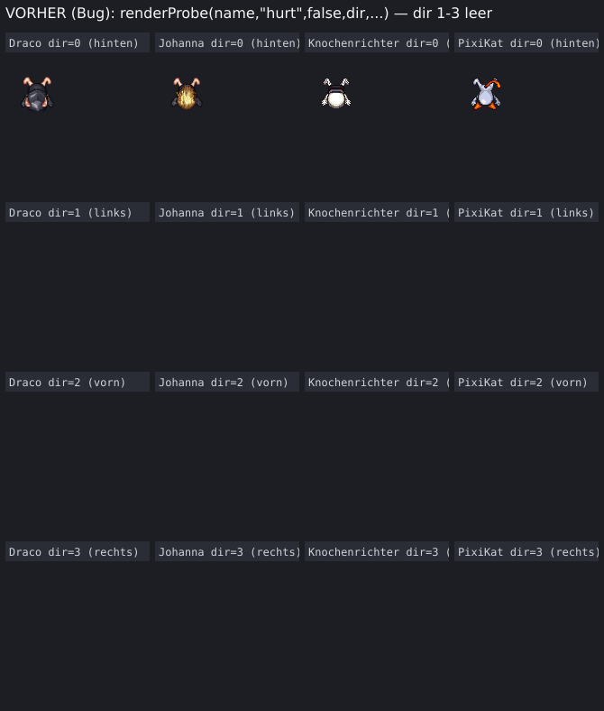
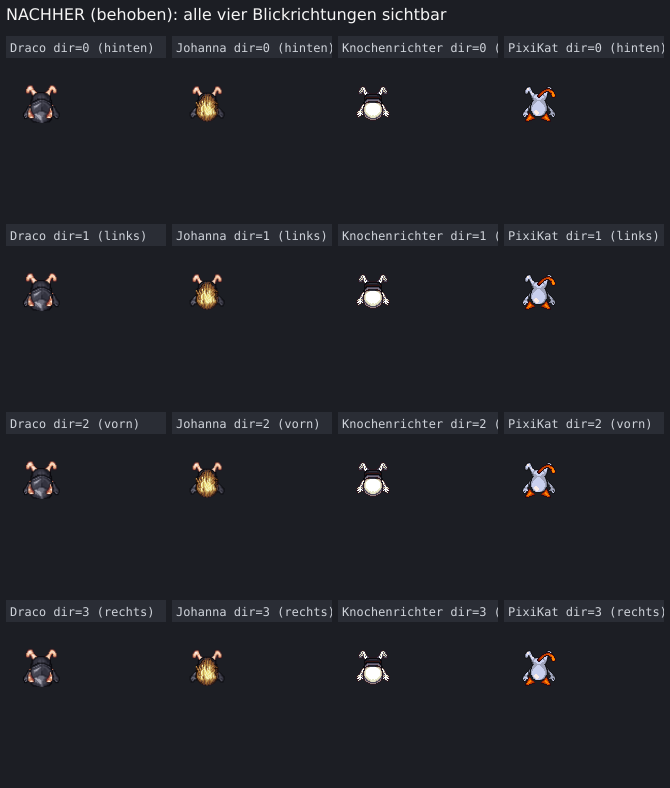

# Hurt-Sprites in allen Blickrichtungen sichtbar

Gefunden und dokumentiert (nicht behoben, außerhalb des damaligen Auftrags) in PR #770
("Draco/Johanna: Schild verdrahtet, Krolach: Energiekern + rote Augen"), Abschnitt
"Nebenfund". Diese Änderung behebt genau diesen Fund — nur `public/mockups/battle-mode.engine.js`
(Sprite-Baukasten/Mockup), kein Produktionscode.

## Der Bug

Ein niedergeschlagener ("hurt") Kämpfer war in JEDER Blickrichtung außer "hinten" komplett
unsichtbar. Ursache: die generische Zeichenhilfe `male()` in `zeichneSprite()` berechnete den
Quell-y-Versatz für jede Ebene immer als `r*zell` (`r` = Blickrichtungs-Zeilenindex 0–3 aus
`blickAus()`), unter der stillschweigenden Annahme, jedes Blatt habe vier Zeilen — eine je
Blickrichtung, wie `body_walk` (576×256 = 9 Spalten × 4 Zeilen).

Die `_hurt`-Blätter sind aber anders gebaut: ein niedergeschlagener Charakter braucht keine
Blickrichtung mehr, deshalb liefert das LPC-Basismaterial für "hurt" nur EINE Zeile.
Nachgemessen an der PNG-Kopfzeile (IHDR) direkt aus den Base64-Daten im `SPRITES`-Objekt:

```
body_hurt             384x64   (1 Zeile statt 4)
khumanw_hurt          384x64
koerper_skelett_hurt  384x64
... (insgesamt 51 *_hurt-Dateien, alle 384x64)
```

Für `r>0` (links/vorn/rechts) griff `drawImage()` damit mit `sy = r*64` (64/128/192) in ein
Bild, das nur 64px hoch ist — außerhalb der Bildgrenzen, was der Canvas leer/transparent
zurückgibt. Der Charakter verschwand sichtbar, sobald er "hurt" war, außer die Kamera blickte
zufällig auf seinen Rücken (`r=0`).

## Untersuchung: betrifft das nur "hurt"?

Alle über 400 Sprite-Einträge im `SPRITES`/`B_SPRITES`-Bestand wurden per PNG-IHDR-Scan
(Breite/Höhe direkt aus den Base64-Daten, ohne Canvas) durchgemessen. Ergebnis: **genau die
51 Blätter mit dem Suffix `_hurt` haben nur eine 64px-Zeile — sonst keine einzige Abweichung.**
`walk` (9×4), `slash` (6×4) und `shoot` (13×4) liegen bei jeder betroffenen Ebene mit den
vollen vier Zeilen vor. Der PR-#770-Fund ("jeder Charakter betroffen") bezieht sich also auf
die Reichweite über alle Chassis/Rassen hinweg — nicht auf weitere Animationszustände neben
"hurt". Die Fundstellen `zeichneWaffenbild` (Feuerwaffen-Mündungsfeuer) und `zeichneFluegel`
(Flügel-Requisite) nutzen dieselbe `r*64`-Mechanik, aber ihre Blätter haben nachweislich volle
vier Zeilen (`pistole_walk` 576×256, `z_fluegel_bg` 448×256) — dort bestand kein Bug, deshalb
unverändert gelassen. Die Kader-Vorschau (`figur()`, Kaderliste/Aufstellungs-Board) zeichnet
nie eine `_hurt`-Ebene (fest `r=3`, immer die Steh-/Gehpose) und war nie betroffen.

## Die Behebung

`male()` liest jetzt die tatsächliche Bildhöhe (`im.height`) und leitet daraus die echte
Zeilenzahl ab, statt sie als 4 anzunehmen; der Blickrichtungsindex wird per Modulo auf diese
Zeilenzahl begrenzt — dasselbe Prinzip wie beim bestehenden Präzedenzfall für `schiff_pirat`
(`VOLLBILD`-Tabelle, `rows:1`, dort per Kommentar "row wird unten per Modulo auf die
tatsächliche Zeilenzahl des Blattes begrenzt"):

```js
const male=(im,zell,ox,oy)=>{
  if(!im||!im.width)return;
  const reihen=Math.max(1,Math.round((im.height||zell*4)/zell));
  const sp=(r%reihen)*zell;
  try{ctx.drawImage(im,f*zell,sp,zell,zell,x-32*Z+ox*Z,y-46*Z+oy*Z,zell*Z,zell*Z);}catch(e){}
};
```

Bei vier echten Zeilen (jeder andere Zustand) ändert sich nichts (`r%4===r` für `r` in 0..3).
Bei einer echten Zeile (jedes `_hurt`-Blatt) zeichnet jede Blickrichtung jetzt aus Zeile 0 —
der niedergeschlagene Kämpfer sieht aus allen vier Blickrichtungen gleich aus, was korrekt ist:
es gibt nur eine Pose.

## Verifikation

`window.__arena.renderProbe(name,"hurt",false,dir,undefined,160)` für vier unterschiedlich
aufgebaute Charaktere (Mensch/Rüstung/Helm/Hörner, Mensch weiblich mit Haar, Skelett-Körper,
Katzenschwanz/-ohren) über alle vier `dir`-Werte, per Playwright gegen `battle-mode.html`
(`file://`, kein Server nötig — alle Sprites liegen als Base64 im Blatt).

**Vorher** (Bug reproduziert, Fix per `git stash` entfernt): nur `dir=0` (hinten) zeigt etwas,
`dir=1/2/3` sind leer — gemessen am Anteil nicht-transparenter Pixel je Canvas (0,00 % für
dir 1–3, 3–4,5 % für dir 0):



**Nachher** (mit Fix): alle vier Blickrichtungen zeigen dieselbe (einzige) Hurt-Pose, überall
derselbe nicht-transparente Pixelanteil wie zuvor nur bei `dir=0`:



```
node --check public/mockups/battle-mode.engine.js   → OK (keine Syntaxfehler)
```

## Regressionskontrolle

`zeichneSprite()`/`male()` ist reine Zeichenroutine — sie fließt in keine Eignungs-, Score-
oder Rangtreue-Berechnung ein (dieselbe Trennung zwischen BAU/Zeichnen und Simulation, die
PR #770 bereits verifiziert hat). Zur Bestätigung trotzdem:

```
node scripts/miss-alle-disziplinen.mjs 24
```

Ergebnis bit-identisch zur Baseline vor dieser Änderung (reines Rendering, keine
Simulations-/Eignungslogik berührt).
