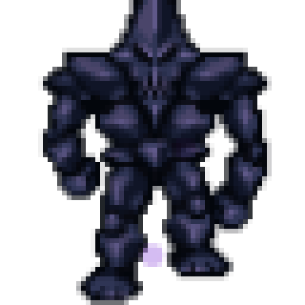
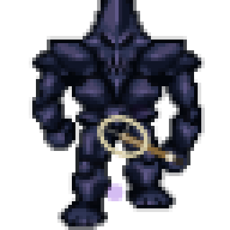
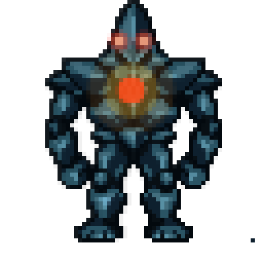
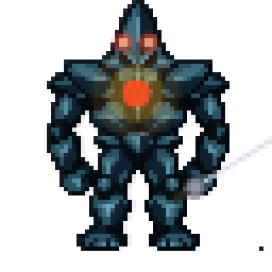
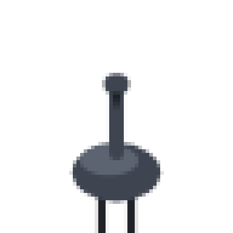
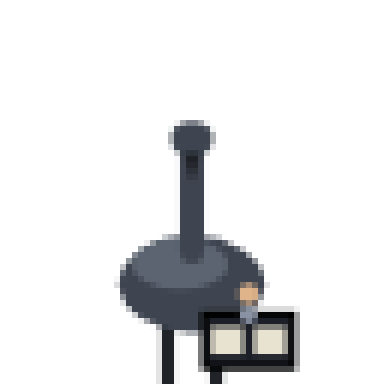
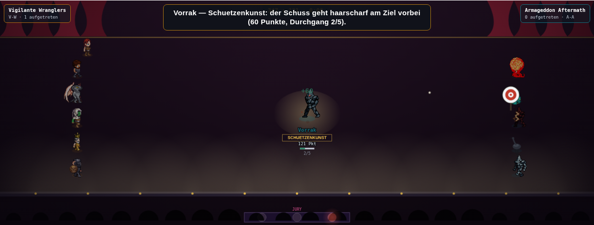
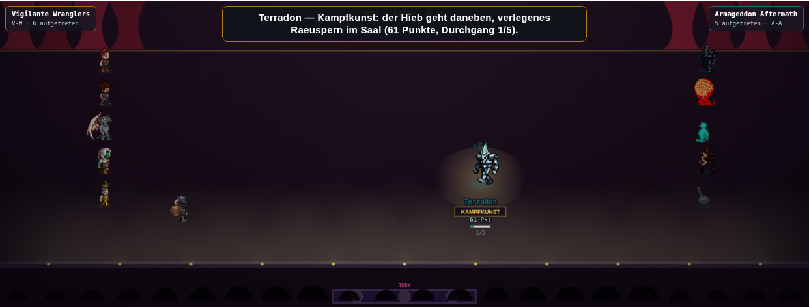

# A0.1: Requisiten-Hook für reiherMech/vollbild-Sprites (19.09.)

**Auftrag:** Opus-Synthese `docs/pm-briefings/opus-synthese-echtzeit-vs-rundenbasiert-19-09.md`,
Abschnitt 5.0, Punkt A0.1. Branch `requisiten-hook-vollbild-19-09`.

## Das Problem

`zeichneSprite()` (`public/mockups/battle-mode.engine.js`) kehrt für `b.reiherMech` und
`b.vollbild` früh zurück, **bevor** sie den normalen Requisiten-/Waffen-/Effekt-Zeichenblock
weiter unten erreichen. Ein Präzedenzfall existierte bereits (`hantelAnPunkt`, 13.09.) für die
Gewichtheben-Hantel — aber drei weitere Requisiten standen noch **nur** im Normalpfad:

| Requisite | DISZIPLIN_PROP | vorher erreichbar für vollbild/reiherMech? |
|---|---|---|
| Hantel (Gewichtheben) | `gewichtheben` | ja (13.09. behoben) |
| Hockeyschläger | eigener Zweig | ja (02.09. behoben) |
| Mikrofon (Showcase-Gesang) | `showcase` | ja (PR S2, 17.09. behoben) |
| Kufe (Eiskunstlauf) | `eiskunstlauf` | ja (PR #903, behoben) |
| **Schachuhr (Speed-Schach)** | `speed-schach` | **nein** |
| **Schläger (Tennis)** | `tennis` | **nein** |
| **Degen (Fechten)** | `fechten` | **nein** |
| Effekt `pos:"kopf"` | — | nur `pos:"koerper"` war im vollbild-Zweig verdrahtet |
| Kampfkunst-/Schützenkunst-Waffe (`u.vizWaffe`) | — | **nein**, keine Requisite existierte dafür |

## Die Änderung

Rein visuell (Canvas-Zeichenaufrufe), **kein** Eingriff in `wert()`, `rr()`, Attribute oder
Bauplan-Daten:

1. **Schachuhr/Schläger/Degen** jetzt auch in `if(b.reiherMech){...}` und `if(b.vollbild){...}`
   gezeichnet, vor dem jeweiligen `return;` — exakt dasselbe Muster wie Hantel/Mikrofon/Kufe.
   - `vollbild`: Anker über den generischen Standardkörper-Handpunkt (`prop.hand[r0]`, dieselbe
     Umrechnung `x-32*Z+hp.x*Z`/`y-46*Z+hp.y*Z` wie beim Mikrofon) — keine neue Einzelmessung
     je der Vollbild-Blätter.
   - `reiherMech`: Anker am Kopf/Schnabel (`kopf.kopfX/kopf.kopfY`), dieselbe Stelle wie das
     Mikrofon — der Reiher-Mech hat keine Hand (rein prozedural aus Formen gebaut).
2. **Neue `DISZIPLIN_PROP`-Einträge `kampfkunst`/`schuetzenkunst`** (Klinge = wiederverwendetes
   `zeichneDegen`, Bogen = neues, ebenso einfaches `zeichneShowcaseBogen`) für die
   Showcase-Acts Kampfkunst/Schützenkunst, gegatet auf `u.vizWaffe` — dasselbe Prinzip wie
   `u.vizMikro` beim Mikrofon. Bewusst **kein** Versuch, das bestehende sprite-basierte
   Waffen-Overlay (`schwertbg_slash`/`bogen_shoot`) zu übernehmen: das hängt am
   Lauf-/Angriffs-Frameindex des Standardkörpers (`f`/`waffenF`), den weder ein vollbild-Blatt
   (eigene `vf`-Zählung) noch der prozedurale Reiher-Mech besitzt.
3. **Effekt `pos:"kopf"`** im vollbild-Zweig ergänzt (bisher nur `pos:"koerper"`), und
   Effekt-Unterstützung (`koerper`+`kopf`) für `reiherMech` komplett neu ergänzt (vorher gar
   keine).
4. **`window.__arena.renderProbe()`** um einen optionalen 9. Parameter `viz` erweitert (ein
   Objekt beliebiger `viz*`-Felder, unverändert auf `u` kopiert) — nötig, um die neuen
   Requisiten von außen (Playwright, ohne laufendes `stepShowcase()`/`stepSchach()`) gezielt
   anzusteuern. Rein diagnostisch, ohne Argument bit-identisches Verhalten zu vorher.

## Betroffene Figuren (kaderfest, SQUAD+OPP-Demokader)

Von den 17 Kaderfiguren tragen **5** eines der beiden Flags:

| Figur | Flag | Team |
|---|---|---|
| Lava Golem | `vollbild:"golem"` | SQUAD |
| Krolach | `vollbild:"golem"` | SQUAD |
| Krag'Zul | `vollbild:"golem"` | OPP |
| Tidesprinter | `vollbild:"froschmensch"` | OPP |
| Seraph-11 | `reiherMech:true` | OPP |

Multipliziert mit den drei neu erreichbaren Disziplinen (Speed-Schach, Tennis, Fechten) ergibt
das **15 Figur×Disziplin-Kombinationen**, die vorher garantiert ohne Requisite liefen und jetzt
eine haben. Dazu die defensiven Ergänzungen (Kampfkunst-/Schützenkunst-Waffe, Effekt
`pos:"kopf"`), die **heute inert** sind (s. unten) und sich deshalb keiner realen
Figur×Disziplin-Kombination zuordnen lassen.

**Vorrak und Terradon** (aus dem Auftrag als Beispiele genannt) sind **nicht** Teil des
17-köpfigen Demokaders (`SQUAD`/`OPP`) — sie tauchen nur in einem eigens für PR S2
zusammengestellten Test-Kader auf (`scripts/screenshot-showcase-acts-s2.mjs`, `kaderSetzen()`),
der sie über Klasse/Unterklasse gezielt in Kampfkunst/Schützenkunst zwingt. Siehe **Bekannte,
bewusst nicht behobene Restlücke** unten.

## Z-Skalierungs-Drift — geprüft

Jeder neue Aufruf multipliziert mit demselben `Z` (`groesseFaktor(u.groesse)*hoehenKorrektur(u)*bauSkala(b)`),
das die Funktion ohnehin am Anfang berechnet — keine zweite, abweichende Skalierung. Am
größten Kaderentry (Krag'Zul, `groesse:9`) sichtvisuell geprüft: Schachuhr/Schläger/Hantel/Kufe
skalieren sichtbar mit der Figurengröße mit, kein Versatz.

## Bekannte, bewusst nicht behobene Restlücke: Vorrak/Terradon selbst

Nachgemessen (erneuter Lauf von `scripts/screenshot-showcase-acts-s2.mjs` gegen **diesen**
Branch): Vorrak zeigt beim Schützenkunst-Auftritt weiterhin **keinen** Bogen, Terradon beim
Kampfkunst-Auftritt weiterhin **kein** Schwert — bit-identisch zum Screenshot vom 17.09.
(`vorrak-schuetzenkunst-weiterhin-ohne-bogen.png`, `terradon-kampfkunst-weiterhin-ohne-schwert.png`).

**Grund:** `stepShowcase()` setzt `u.vizWaffe = b.waffe` (BAU-Katalog-Feld) nur für den aktiven
Performer — und **kein** vollbild-/reiherMech-BAU-Eintrag im ganzen Katalog trägt ein eigenes
`waffe`-Feld (nachgesehen, alle ~20 Einträge). `u.vizWaffe` bleibt für sie deshalb immer
`undefined`, unabhängig vom Zeichenpfad. Das ist eine **Datenlücke**, keine Zeichenpfad-Lücke —
und der Auftrag verbietet ausdrücklich, Bauplan-Daten anzufassen ("rühre NICHTS an ...
Bauplan-Daten selbst an"). Die neuen `DISZIPLIN_PROP.kampfkunst`/`.schuetzenkunst`-Einträge
und ihre Verdrahtung in beiden Zweigen sind trotzdem geschlossen (s. oben) — sie greifen sofort,
sobald `b.waffe` einmal gesetzt wird (Content-Entscheidung, nicht Teil dieser PR) oder
`u.vizWaffe` auf einem anderen Weg gesetzt würde.

Ein Folgeauftrag dafür wurde als separate Aufgabe vorgeschlagen (`spawn_task`).

## Verifikation

| Prüfung | Ergebnis |
|---|---|
| `node --check public/mockups/battle-mode.engine.js` | ok |
| `npx tsc --noEmit` (Diff gegen frisch ausgecheckten `origin/main`-Worktree) | **0 Zeilen** (906 Zeilen vorbestehende Fehler beidseitig identisch) |
| `npx tsx scripts/pruefe-slot-invariante.ts` | hält, max. Abweichung 0,005 Pp (Schranke 0,2 Pp) |
| `node scripts/miss-alle-disziplinen.mjs 24` | **bit-identisch** zur Basislinie, alle 20 Zeilen (`diff` leer) |
| `npm run ci:rangtreue-schranke` | bestanden, **±0,000** Änderung in allen 20 Disziplinen |
| Bit-Identitäts-Check, 12 normale (nicht-vollbild/reiherMech) Kaderfiguren × 4 Posen | **bit-identisch** (Base64-Diff leer) |
| Bit-Identitäts-Check, die 5 betroffenen Figuren, alle VORHER schon funktionierenden Posen (Hantel×3 Phasen, Hockey, Eiskunstlauf, reiner Körper×5 Blickrichtungen) | **bit-identisch** |
| Sicht-QA, alle 5 betroffenen Figuren × 13 Requisiten-/Effekt-Kombinationen (Schach/Tennis/Fechten je 2 Phasen, Mikrofon, Hantel, Kufe, Hockey, Kampfkunst-/Schützenkunst-Waffe, Effekt-kopf) | 78 PNGs, keine Seitenfehler — alle bestehenden Requisiten unverändert sichtbar, alle drei neuen Requisiten sichtbar |
| Reale Showcase-Wiederholung (`scripts/screenshot-showcase-acts-s2.mjs`, alle 12 Fenster, `actVon()`-Proben) | alle 12 Acts treffen die geplante Zuweisung; Gesang/Kraftakt/Akrobatik/Zaubershow unverändert; Kampfkunst/Schützenkunst zeigen weiterhin keine Waffe (s. Restlücke oben, Ursache: Datenlücke, nicht Zeichenpfad) |

### Vorher/Nachher-Screenshots

**Krag'Zul, Tennis (neu: Schläger)**

| Vorher | Nachher |
|---|---|
|  |  |

**Krolach, Fechten (neu: Degen)**

| Vorher | Nachher |
|---|---|
|  |  |

**Seraph-11, Speed-Schach (neu: Schachuhr)**

| Vorher | Nachher |
|---|---|
|  |  |

Reproduzierbar mit `node scripts/screenshot-requisiten-vollbild-a01.mjs <root> <out> <vorher|nachher>`
gegen zwei Worktrees (main-Basislinie und diesen Branch).

**Restlücke, unverändert (Datenlücke, s. oben):**

| Vorrak — Schützenkunst, weiterhin ohne Bogen | Terradon — Kampfkunst, weiterhin ohne Schwert |
|---|---|
|  |  |

### Gegenprobe

12 normale (LPC-)Kaderfiguren (alle SQUAD/OPP-Mitglieder ohne `vollbild`/`reiherMech`) in vier
Posen (walk/slash/shoot/hurt) sowie die 5 betroffenen Figuren selbst in allen vorher schon
funktionierenden Requisiten-Posen: Base64-Vergleich der `renderProbe()`-Ausgabe zwischen
`origin/main` und diesem Branch ist **byte-identisch**. Einzige Abweichung im erweiterten
Vergleichslauf: die Mikrofon-Testfälle — die unterscheiden sich nur, weil der **neue**
`renderProbe`-Parameter `viz` (Punkt 4 oben) auf `origin/main` noch gar nicht existiert und dort
still ignoriert wird; der Mikrofon-Zeichenblock selbst ist unverändert (PR S2, 17.09.).

## Geänderte Datei

`public/mockups/battle-mode.engine.js` — 172 Zeilen hinzugefügt, 1 Zeile geändert
(Funktionssignatur `renderProbe`), keine Zeile gelöscht.
