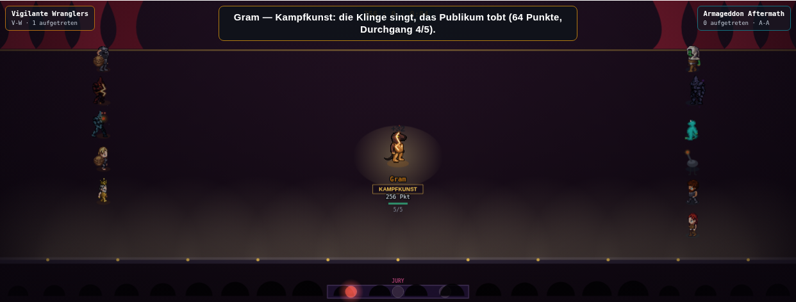
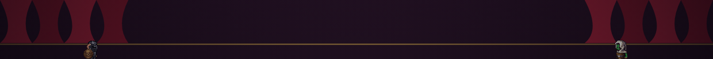

# Showcase S1: Bühnenbild und Rampenlicht (17.09.)

Zweite von vier sequenziellen PRs aus `docs/design/showcase-talentshow-konzept-17-09.md`,
Abschnitt 5 ("PR S1 — Bühnenbild und Rampenlicht"). Baut ausschließlich den dort beschriebenen
S1-Umfang: eigenes Bühnenbild, zwei Ränge (Aktiver im Rampenlicht vs. Backstage-Wartende),
Act-Schild unter dem Namen, Buzzer-/Applaus-Reaktion. Die sechs Act-Zeichenfunktionen (PR S2)
und Ton (PR S3) folgen in späteren PRs — `u.vizWaffe`/`u.vizEffekt`/`u.vizPose` werden hier
nirgends gesetzt oder gelesen.

## Was gebaut wurde

- **`bodenShowcase()`** neben `bodenBuehne()`/`bodenHeben()`/`bodenEis()`, angeschlossen über
  eine weitere `else if` in `zeichneBuehne()`s BODEN-DISPATCH (dasselbe Muster wie
  Gewichtheben/Eiskunstlauf). Motive nach `app/foundation/discipline-stage/arena/disciplines/
  showcase.tsx` (Vorhang, LED-Hype-Wall/Rampenlicht, Jury-Buzzer, Publikum) — nicht 1:1
  übernommen (SVG vs. Canvas-Primitiven, andere Auflösung), sondern dieselbe visuelle Sprache
  im Maßstab von `bodenHeben()`/`bodenEis()`:
  - Roter Vorhang oben, zwei Portale mit je vier gerafften Falten, goldener Zierstrich.
  - Rampenlicht: elf warme Lichtkegel am Bühnenrand (showcase.tsx hat 13 im SVG-Maßstab).
  - Jury-Pult mit drei Buzzern am unteren Rand (`showcaseBuzzerPos(i)` liefert die
    Koordinaten, dieselbe Funktion nutzt die Reaktionsanimation in `zeichneShowcase()`, damit
    beide Stellen garantiert dieselben Punkte treffen).
  - Publikums-Silhouetten als dunkle Halbkreise, **ganz vorne** gezeichnet (näher an der
    Kamera als Rampenlicht und Jury-Pult, wie `showcase.tsx`s "Audience silhouette at
    bottom"-Kommentar) — ein erster Anlauf zeichnete sie hinter dem Rampenlicht-Balken, der
    sie dann zu 80 % verdeckte (s. Sicht-QA-Befund unten); die jetzige Reihenfolge löst das.
  - Publikums-Loop (`showcasePublikumAn`) nach dem `schachPublikumAn`-Muster: `bodenShowcase()`
    stoppt beim Betreten alle drei anderen Loop-Flaggen (Heben/Schach/Eiskunstlauf) und startet
    seinen eigenen; `bodenBuehne()` bekam symmetrisch einen Stop für `showcasePublikumAn`, und
    `reset()` bekam denselben N1-Fix-Eintrag wie die drei Geschwister (sonst bliebe der Loop ab
    dem zweiten Showcase-Spiel der Session stumm). `tonLoopStart("showcase")` ist bis
    `TON_KATALOG.showcase` (PR S3) ein sicherer No-Op (`if(!katalog)return`, Funktionskopf
    `tonLoopStart()`) — das Flaggen-Bookkeeping ist trotzdem schon jetzt korrekt verdrahtet.
- **Zwei Ränge**, nach dem Breaking-Präzedenzfall (`zeichneBreaking()`, "ZWEI RÄNGE STATT ZWÖLF
  GLEICHER"):
  - `showcaseAktiver()`: liest nur `buehneQueue`/`buehneZeiger` (PR S0 gruppiert die
    Warteschlange je Teilnehmer zusammenhängend) — der zuletzt enthüllte Eintrag ist über den
    gesamten Auftritt (`rundenN` Enthüllungen) derselbe Teilnehmer, eine rein lesende
    Ableitung, kein neuer Motorzustand.
  - `showcaseZielPos(u, aktiver)`: der Aktive zielt auf Bühnenmitte (volle Größe), alle
    anderen auf eine feste Backstage-Spalte ihrer Seite (links Heim, rechts Gast), Index über
    `TEILNEHMER.filter(...).indexOf(u)` — die Spalte mischt nicht neu, wenn jemand in die
    Mitte wechselt, die Lücke bleibt einfach offen (wie ein echter Wartestuhl).
  - `stepShowcase()`: **`NAECHER()`**, wortgleicher exponentieller Anäherungs-Stil wie
    `stepCypher()`s gleichnamige Closure (`u[feld]+=(ziel-u[feld])*(1-Math.exp(-dt/tau))`),
    hier auf `u.vizX`/`u.vizY`/`u.vizScale` (kartesisch statt polar, weil die Showcase-Bühne
    kein Ringlayout braucht). Erstinitialisierung setzt direkt auf die Zielposition (kein
    Glide aus dem Nichts) — dasselbe Muster wie `u.vizPhase`/`u.vizA`/`u.vizR` bei Breaking.
  - `zeichneShowcase()`: Backstage-Figuren klein (0,72) und per `ctx.scale()` um den
    Fußpunkt skaliert (dieselbe Translate-Scale-Translate-Technik wie Breakings Rang-1-Loop),
    danach ein einziger radialer Vignetten-Verlauf über die ganze Fläche (dasselbe Mittel wie
    Breaking, statt eines von außen gesetzten `globalAlpha`, das `zeichneSprite()` für
    Effekt-/Partikelfiguren intern selbst zurückstellt), danach der Aktive in voller Größe
    unabgedunkelt.
- **Act-Schild unter dem Namen**: `SHOWCASE_ACTS[u.vizAct].label` (aus PR S0) als kleines
  goldgerahmtes Textschild unter dem Charakternamen, nur beim Aktiven (die Backstage-Wartenden
  bleiben unbeschriftete Silhouetten, dasselbe Sparsamkeitsprinzip wie Rang 1 bei Breaking).
- **Buzzer-/Applaus-Reaktion**, `u.lunge` als Uhr — exakt dasselbe Muster wie der Tennis-Ball
  (`zeichneTennis()`: 0,5 im Enthüllungs-Frame → 0 nach 0,5 realen Sekunden, keine neue Uhr,
  kein neues Feld):
  - Fehlschlag (`r.ereignis===art.failWort`): einer der drei Pult-Buzzer leuchtet rot auf und
    blendet aus. Welcher der drei, ist deterministisch über `cypherHash(u.id, u.aktuell)%3`
    (kein `rr()`).
  - Erfolg (`r.ereignis===art.erfolgWort`): ein goldener Applaus-Ring startet auf
    Publikumshöhe und steigt Richtung Bühnenmitte, während er ausblendet.

## Rho-Sicherheit

Neu sind ausschließlich `viz*`-Felder (`u.vizX`, `u.vizY`, `u.vizScale`) plus reines Zeichnen
(`bodenShowcase()`, die neue `zeichneShowcase()`, drei kleine Helferfunktionen). Nirgends wird
`u.summe`/`u.runden`/`u.aktuell`/`u.lunge`/`buehneAkt`/`buehneZeiger`/`done` geschrieben, `rr()`
wird nie aufgerufen — der Vertrag aus dem `buehnenBewegung()`-Funktionskopf gilt wörtlich.
`showcaseAktiver()`/`showcaseZielPos()` LESEN `buehneQueue`/`buehneZeiger`/`TEILNEHMER`, ändern
sie aber nie.

## Sicht-QA (Playwright-Screenshot, `scripts/screenshot-disziplin.mjs showcase`)

Draco/Gram-Kader, `setDisc('showcase')`, 4 s nach Spielstart. Zu sehen:

- **Zwei klar unterscheidbare Ränge**: Gram (Kampfkunst) steht groß, hell und mit
  Rampenlicht-Kegel in der Bühnenmitte; die übrigen zehn Teilnehmer stehen klein (0,72),
  unbeschriftet und durch die Vignette abgedunkelt in zwei Spalten links/rechts — deutlich
  als "Backstage" statt als "Team, das alle gleich behandelt" lesbar.
- **Act-Schild**: goldgerahmtes "KAMPFKUNST"-Schild direkt unter "Gram".
- **Buzzer-Reaktion**: der linke der drei Jury-Buzzer leuchtet rot (ein Fehlschlag aus Grams
  letztem enthülltem Durchgang; die Feed-Zeile zeigt zu diesem Zeitpunkt noch die
  vorletzte, erfolgreiche Enthüllung — reines Anzeige-Timing der Feed-Historie, kein
  Datenfehler: die Reaktion liest live `u.lunge`/`u.runden[u.aktuell]`, der Feed-Text
  cycled unabhängig davon durch).
- **Bühnenbild**: roter Vorhang oben (zweites Bild unten), warmes Rampenlicht, Jury-Pult mit
  drei Buzzern und dunkle Publikums-Halbkreise am unteren Rand (drittes Bild unten).

**Gegenprobe Wettessen/I-Spy** (`scripts/screenshot-disziplin.mjs wettessen` /
`scripts/screenshot-disziplin.mjs i-spy`, beide nutzen weiterhin denselben generischen
`bodenBuehne()`/`zeichneBuehne()`-Fallback-Zweig):

- Wettessen: Screenshot vor/nach dieser PR ist **byte-identisch** (`cmp` exit 0).
- I-Spy: Screenshot vor/nach dieser PR unterscheidet sich nur in den nicht-deterministischen
  Live-Werten (Uhrzeit/Vorteil je Brett — zwei aufeinanderfolgende Screenshots **auf demselben
  unveränderten `main`** unterscheiden sich aus demselben Grund, nachgeprüft per zweitem Lauf).
  Layout, Beschriftung und Bühnenboden sind optisch identisch mit dem Referenzlauf auf
  `origin/main`.

## Verifikation

- `node --check public/mockups/battle-mode.engine.js` — sauber.
- `npx tsc --noEmit` — Diff gegen einen frisch ausgecheckten `origin/main`-Worktree
  (Commit 21531b22, `.claude/worktrees/baseline-main-tmp`): **0 Zeilen** (906/906 identische
  Fehlerzeilen).
- `npx tsx scripts/pruefe-slot-invariante.ts` — hält, maximale Abweichung 0,005 Pp
  (mini-dm @ n=2, Attribut stamina), Schranke 0,2 Pp.
- `node scripts/miss-alle-disziplinen.mjs 24` (voller 20-Disziplinen-Lauf) — **bit-identisch**
  zu einem Referenzlauf auf demselben frisch ausgecheckten `origin/main`-Worktree, alle 20
  (bzw. 21 mit der Feldspieler-Unterzeile) Zeilen, insbesondere `showcase` selbst unverändert
  bei rho je Spiel 0,892 (Spannweite 0,158), rho Saison 0,937 (Spannweite 0,077), bestanden.
- `node --import tsx scripts/pruefe-rangtreue-schranke.mjs` (`npm run ci:rangtreue-schranke`)
  — alle 20 Disziplinen `±0,000` gegenüber der gespeicherten Basislinie, Status `ok`; die
  absolute 0,80-Schranke ist unverändert nicht neu unterschritten.
- `npx vitest run tests/battle-mode-arena-team-points.test.ts tests/arena-headless-runner.test.ts`
  — 86/86 grün.
- Sicht-QA: `node scripts/screenshot-disziplin.mjs showcase` (s. oben) plus Gegenprobe
  Wettessen (byte-identisch)/I-Spy (visuell identisch bis auf Live-Werte-Rauschen).

## Bewusst nicht in dieser PR

- Keine der sechs Act-Zeichenfunktionen, kein `u.vizWaffe`/`u.vizEffekt`/`u.vizPose` — PR S2.
  Die Bühnenfigur trägt weiterhin nur die generische, waffenlose Pose aus PR S0.
- Kein Ton (`TON_KATALOG.showcase`) — PR S3. `tonLoopStart("showcase")` ist bis dahin ein
  sicherer No-Op; das Flaggen-Bookkeeping (`showcasePublikumAn`) ist schon vollständig verdrahtet.
- Keine Rezept-, Formel- oder Rundenzahl-Änderung (Konzept Abschnitt 4.1) — rho bleibt
  bit-identisch, wie oben nachgewiesen.
