# Showcase S2: die sechs Act-Zeichenfunktionen (17.09.)

Dritte von vier sequenziellen PRs aus `docs/design/showcase-talentshow-konzept-17-09.md`,
Abschnitt 5 ("PR S2 — Die sechs Acts"). Baut ausschließlich den dort beschriebenen S2-Umfang:
für jeden der sechs Acts eine eigene Requisite/Bewegung/Zusatzschicht, aufgerufen aus
`zeichneShowcase()` (PR S1) nur für den gerade aktiven Performer. Ton (PR S3) folgt in einer
späteren PR — `TON_KATALOG.showcase` bleibt unverändert leer.

## Was gebaut wurde

### Zwei geteilte Berührungen mehr, alle bit-identisch für jeden anderen Aufrufer

Das Konzept (Abschnitt 4.3) nennt drei Berührungen des geteilten Codes; PR S0/S1 haben sie
bereits gebaut (`waffeEffektiv`-Vorbereitung, `art.showcase`-Dispatch). Für S2 kommen zwei
weitere, nach demselben Muster, dazu:

- **`waffeEffektiv`** (`zeichneSprite()`): `u.vizWaffe!==undefined ? u.vizWaffe : (...)` —
  überschreibt auch die generische Showcase-Sperre `DISZIPLIN_WAFFE.showcase=null`. Gesetzt
  von `stepShowcase()` ausschließlich am aktiven Kampfkunst-/Schützenkunst-Performer, sonst
  immer `undefined`.
- **`ani`-Weiche** (neu, nicht im ursprünglichen Drei-Punkte-Plan, aber notwendig): `u.vizPose
  ==="walk"` hält das walk-Blatt fest, `u.vizPose==="shoot"` erzwingt die Überkopf-Pose,
  jeweils obwohl `u.lunge>0` (der generische Buhnen-Enthüllungsmarker). Ohne diese Zeile
  bekäme jeder Gesang-/Akrobatik-/Zaubershow-Performer bei jeder Enthüllung denselben
  unbewaffneten `slash`-Faustschlag wie vor diesem Konzept — genau die Lücke, die das
  Konzept beheben soll. Nur von `stepShowcase()` gesetzt, für jede andere Figur/Disziplin
  bleibt `u.vizPose` `undefined`.
- **`effU`-Override** (`zeichneSprite()`, zwei Stellen — normaler Pfad und `b.vollbild`-Pfad):
  `u.vizEffekt||b.effekt` ersetzt jedes `b.effekt`-Vorkommen. Gesetzt von `stepShowcase()`
  ausschließlich am aktiven Zaubershow-Performer (auch für Charaktere ohne eigenes
  `b.effekt`, dann mit Ersatztyp aus `istHeiler()`/`"arkan"`).
- **Mikrofon-Requisite** (`DISZIPLIN_PROP.showcase`, dritte Wiederverwendung von
  `SCHACH_HAND`): drei Aufrufstellen (normaler Pfad, `b.vollbild`-Pfad, `b.reiherMech`-Pfad),
  gegated auf `u.vizMikro` statt `feldspiel&&istXxx()` — Showcase zeichnet die Requisite nur
  am einen aktiven Gesang-Performer, nicht an allen Teilnehmern einer Disziplin gleichzeitig.

Alle vier sind Einzelfelder, die **nur** `stepShowcase()` je Frame setzt/löscht (`istAktiv`
neu berechnet, kein Nachleuchten nach dem Abtritt). Kein anderer Aufrufer setzt sie je —
bit-identisch für alle 19 anderen Disziplinen, nachgewiesen unten.

### `zeichneBodenstaub` gehoben (Konzept Abschnitt 5, Punkt 4)

War eine lokale Closure innerhalb `zeichneBreaking()`, jetzt eine Modul-Funktion direkt davor
— Körper unverändert, nur die Definition ist umgezogen. Showcase nutzt sie für den
Kraftakt-Stampfer UND die Akrobatik-Landung; Breaking bleibt an seiner einzigen Aufrufstelle
unverändert (bit-identischer Nachweis unten).

### Die sechs Acts

1. **Gesang/Rede**: `DISZIPLIN_PROP.showcase = {hand:MIKRO_HAND(=SCHACH_HAND), phasen:
   MIKRO_PHASEN, zeichne:zeichneMikrofon}`. `u.vizPose="walk"` hält das walk-Blatt fest,
   `u.vizMikro` zeigt das Mikrofon. Notenglyphen (♪/♫) steigen deterministisch aus
   `buehneT`/`u.id` auf; bei Erfolg der bestehende Applaus-Ring (PR S1), bei Fehlschlag der
   bestehende rote Buzzer (PR S1) — beide unverändert, keine neue Erfolgs-/Fehlschlag-Logik
   in dieser PR nötig.
2. **Kampfkunst**: `u.vizWaffe=b.waffe`, nur am aktiven Performer. `ani` fällt automatisch auf
   `slash`, sobald die Waffe eine Nahkampfwaffe ist (bestehende Weiche, kein Zusatz nötig).
   Funken-Primitive am Klingenweg (Radial-Funken-Stil wie der Fechten-Klingenkontakt-Funke),
   Schildschlag-Ring bei `b.schild`.
3. **Zaubershow**: `u.vizEffekt={typ, pos:"koerper", streuung}`, `u.vizPose="shoot"`.
   Streuung 6→18 während der 0,5s-`u.lunge`-Uhr bei Erfolg/offen; bei "verpatzt" ein kurzer
   Fehlzünder (Streuung fällt binnen 0,125s auf 0 statt zu wachsen — Alpha bricht ab, wie im
   Konzept gefordert).
4. **Kraftakt**: Stauchung/Kippung um den Fußpunkt (`ctx.scale`/`ctx.rotate` um `y+19*Z`,
   dieselbe Fußhöhe wie die Schatten-Ellipse anderswo), Felsbrocken-Primitive über dem Kopf
   (zwei Hälften, zerbricht bei Erfolg zunehmend, fällt bei "verpatzt" ganz und kippt weg),
   `zeichneBodenstaub` (gehoben, s. oben) am Fußpunkt während `u.lunge>0`.
5. **Schützenkunst**: `u.vizWaffe=b.waffe`, `ani` fällt automatisch auf `shoot`, sobald die
   Waffe eine Fernwaffe ist. Zielscheiben-Primitive (3 Ringe, `FOLTER_GERAETE`-Stil: `zeichne(
   ctx,x,y,s)` an lokalem Ursprung) fest am Bühnenrand, Geschoss-Flug nach dem
   Tennis-Ball-Muster (`u.lunge` 0,5→0 als Fortschritt, Sinusbogen), Mündungsfeuer bei
   Feuerwaffe kommt automatisch aus der bestehenden `feuerwaffe&&ani==="shoot"`-Ebene.
6. **Akrobatik**: Sprungbogen über die Bühnenmitte (`ctx.translate/rotate` um den
   Körpermittelpunkt, eine volle Rotation = ein Salto, Höhe aus einem Sinusbogen),
   Landungsstaub (`zeichneBodenstaub`) kurz vor dem Bodenkontakt. Flügler (`b.fluegel`)
   schweben statt zu springen — der Transform-Zweig greift für sie nicht, sie fallen auf den
   normalen, unrotierten `zeichneSprite()`-Aufruf zurück. Bei "verpatzt" **`u.vizSturz`
   wiederverwendet, ohne zeichneSprite() anzufassen** — der Pfad (`kuerSturz=!!u.vizSturz`,
   `:3543` vor dieser PR) ist bereits act-neutral gelesen; `stepShowcase()` setzt ihn nur für
   den aktiven Akrobatik-Performer während des Fehlschlag-Fensters.

### Der bekannte Vollbild-Fallstrick — geprüft, zwei Stellen gefunden und behoben

Beide vom Auftrag genannten Fallstricke wurden konkret geprüft:

- **Z-Skalierung**: jede neue Requisite/jeder neue Versatz multipliziert mit `showcaseZ(u) =
  groesseFaktor*hoehenKorrektur*bauSkala` — derselben Formel, die `zeichneSprite()` selbst
  benutzt. Keine feste Pixelzahl ohne `*Z`.
- **`vollbild`/`reiherMech` früher `return`**: geprüft an ALLEN sechs Acts, nicht nur den
  beiden BAU-vollbild-lastigen (Kraftakt/Akrobatik):
  - Kraftakt/Akrobatik (Stauchung, Sprungbogen, Fels, Staub): die Transformation UMSCHLIESST
    den `zeichneSprite()`-Aufruf von außen (in `zeichneShowcaseAct()`, s. unten) statt eine
    Zeile hinter den frühen `return;`s einzufügen — sie wirkt dadurch **uniform** für
    LPC-Körper UND Vollbild-/reiherMech-Kreaturen, ohne dass `zeichneSprite()` selbst
    angefasst werden muss.
  - Zaubershow: `effU`-Override war ursprünglich nur im normalen Pfad geplant — **Fund**: der
    `b.vollbild`-Pfad hat eine EIGENE `b.effekt`-Leseabfrage (Krokodil-Sonderfall
    eingeschlossen), vor dem `return;`. Eine Vollbild-Kreatur, die den Zaubershow-Act über
    Klasse/Sub/Attribute erhält (nicht über einen eigenen `b.effekt`), hätte ohne Patch dort
    **nichts** gesehen. Behoben: derselbe `u.vizEffekt||b.effekt`-Override jetzt auch im
    `b.vollbild`-Zweig, inklusive derselben `streuung`-Übersteuerung wie im Normalpfad.
  - Gesang (Mikrofon): **Fund, exakt das dokumentierte Bug-Muster ("5 von 17 hatten keine
    Hantel")**. Der Mikrofon-Aufruf stand zunächst nur im normalen Zeichenpfad. Im
    Demokader ist Seraph-11 (reiherMech) Gesang-Performer — ohne Nachbesserung hätte sie
    beim Singen kein Mikrofon bekommen, weil `b.reiherMech` vor der Requisiten-Zeile
    zurückkehrt. Behoben: zwei zusätzliche `u.vizMikro`-Aufrufstellen, eine im
    `b.reiherMech`-Zweig (Anker am Kopf/Schnabel-Rückgabewert von `zeichneReiherMech()`),
    eine im `b.vollbild`-Zweig (Anker: Standardkörper-Handpunkt auf den Vollbild-Rahmen
    umgerechnet, derselbe Kompromiss wie die bestehende Kufen-Nachbesserung dort).
  - Kampfkunst/Schützenkunst (Waffenüberschreibung): **strukturell unerreichbar für
    Vollbild**, nicht nachgebessert — `waffeEffektiv` wird erst NACH beiden frühen `return;`s
    berechnet, und keine der 146 Vollbild-Einträge trägt je ein `waffe`-Feld (nachgesehen im
    ganzen `BAU`-Katalog, nicht nur den 17 Demo-Charakteren). Eine Vollbild-Kreatur, die
    Kampfkunst/Schützenkunst über Klasse/Sub erhält, zeigt deshalb keine Waffe — aber Funken/
    Zielscheibe/Geschoss (die in `zeichneShowcaseAct()` außerhalb von `zeichneSprite()`
    liegen) sehr wohl, s. Terradon/Vorrak-Sicht-QA unten. Dokumentierte, akzeptierte
    Einschränkung, kein Absturz.

## Die Choreografie-Schicht: `zeichneShowcaseAct()`

Ersetzt den bloßen `zeichneSprite(ctx,aktiver,x,y)`-Aufruf aus PR S1 in `zeichneShowcase()`.
Berechnet `Z`/`fortschritt`/`ereignis` einmal, wendet für Kraftakt/Akrobatik die jeweilige
Transformation UM den `zeichneSprite()`-Aufruf herum an (uniform für jeden Körpertyp, s.
oben) und ruft danach `SHOWCASE_ACT_ZEICHNEN[act](u,x,y,Z,fortschritt,ereignis,art)` für die
act-eigene Zusatzschicht (Requisite/Funken/Noten/Fels/Ziel/Staub). Vertrag der sechs
Act-Zeichenfunktionen selbst (Konzept Abschnitt 3.2/4.3, wörtlich eingehalten): liest nur
`u.runden[u.aktuell].ereignis`, `u.lunge`, `buehneT`, `u.id`, `u.vizAct` (plus die
übergebenen `x,y,Z,fortschritt,ereignis` — abgeleitete Werte derselben erlaubten Quellen) —
schreibt nichts.

## Sicht-QA (Playwright, `scripts/screenshot-showcase-acts-s2.mjs`)

**Warum ein eigener Testkader statt des Standalone-Demokaders:** der hartkodierte
17-Charakter-Demokader (SQUAD+OPP) liefert für Kampfkunst/Schützenkunst/Zaubershow **keine**
Vollbild-Kreatur — nachgemessen trägt keiner der vier Vollbild-Charaktere (Lava Golem/
Krolach/Krag'Zul/Tidesprinter) eine Waffen-/Warrior-/Hunter-lastige Unterklassen-Kombination,
die den eingebauten 3-Punkte-Bauplanvorsprung von Kraftakt/Akrobatik schlagen würde. Statt
eine nicht existierende Kombination vorzutäuschen oder die Verifikation auf zwei von sechs
Acts zu beschränken, nutzt das Skript `window.__arena.kaderSetzen()` (bestehende, rein
additive Testschnittstelle seit der Kaderfamilien-Runde) für einen bewusst konstruierten
12-Charakter-Kader: sechs typische Kaderfiguren (eine je Act) gegen sechs Vollbild-/
reiherMech-Kreaturen (eine je Act — drei davon, Lava Golem/Tidesprinter/Seraph-11,
unverändert aus dem Demokader übernommen; drei, Terradon/Vorrak/Abysskraken, über
Klasse/Unterklasse GEZIELT in den jeweiligen Act gezwungen, exakt über `actVon()`s eigene,
unveränderte Punktetabelle — keine neue Logik, nur eine deterministische Wahl der
Eingabedaten). Die Warteschlangen-Reihenfolge (aufsteigend nach `eig`, Seiten verzahnt, PR
S0) macht die Auftrittszeiten vorhersagbar über stark gestaffelte Charisma-Werte (300 Punkte
Abstand — 20 Punkte Abstand reichten nicht: Slot-/Formkarten-Rauschen in `eig` vertauschte
beim ersten Versuch zwei benachbarte Fenster, s. Kommentar im Skript).

**Sonden-Bestätigung vor dem Spiel** (`window.__arena.showcaseActProbe`): alle zwölf
geplanten Act-Zuweisungen treffen exakt (12/12 `OK`).

| Act | Typische Kaderfigur | Vollbild-/reiherMech-Kreatur |
|---|---|---|
| Schützenkunst | 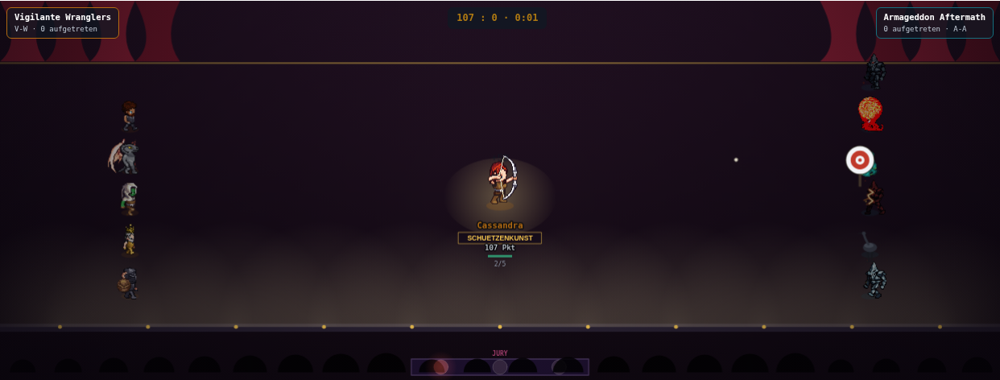 Cassandra — Bogen sichtbar, Zielscheibe + Geschoss am Bühnenrand |  Vorrak (vollbild golem) — kein Bogen sichtbar (kein LPC-Waffenblatt für Vollbild, dokumentierte Einschränkung), Zielscheibe + Geschoss trotzdem vorhanden |
| Zaubershow | 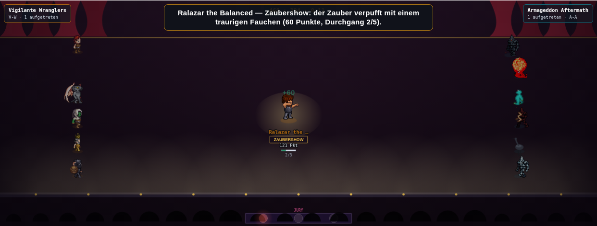 Ralazar the Balanced — Überkopf-Pose, Effekt in diesem Einzelbild gerade im Zwischen-Sparkle (funkelnd-Modus ist bewusst intermittierend, s. Abysskraken für den Peak) | 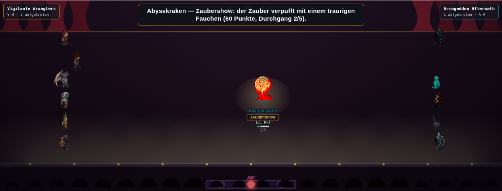 Abysskraken (vollbild kraken, Zaubershow NUR über Klasse/Sub erzwungen) — deutlich sichtbarer Partikelausbruch, bestätigt den Vollbild-Patch |
| Akrobatik | 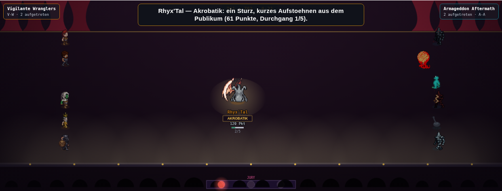 Rhyx'Tal (`fluegel:true`) — schwebt, kein Sprungbogen | 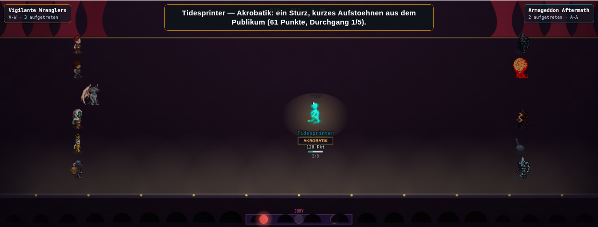 Tidesprinter (vollbild froschmensch) — "verpatzt"-Fall, Feed zeigt den Sturz-Text |
| Kraftakt | 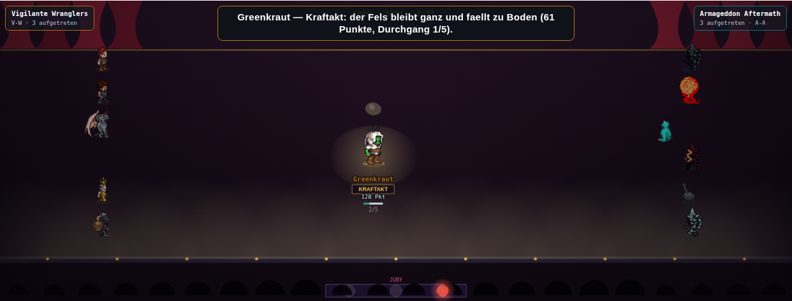 Greenkraut — Felsbrocken sichtbar, Stauchung erkennbar | 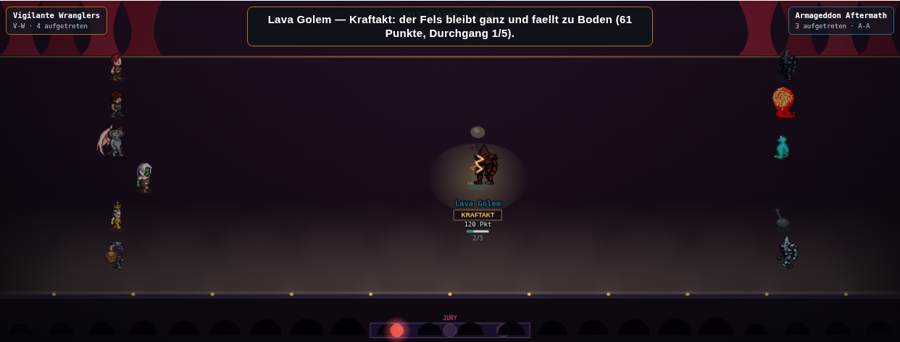 Lava Golem (vollbild golem) — Felsbrocken UND Stauchung wirken uniform über den Vollbild-Zeichenpfad |
| Gesang | 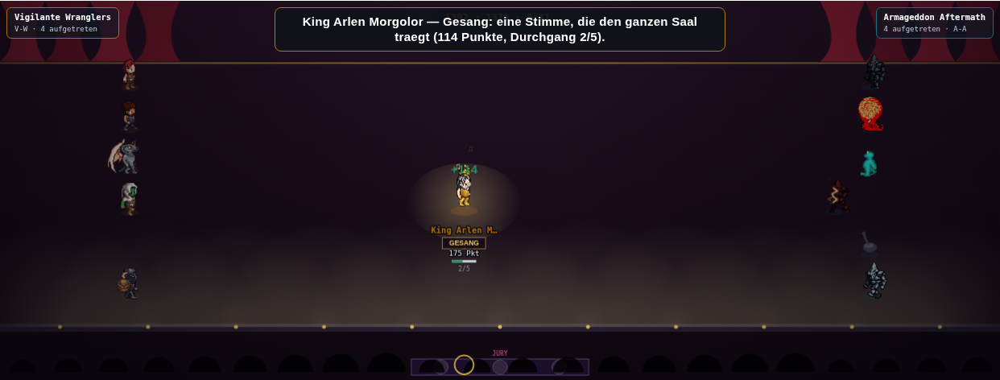 King Arlen Morgolor — Mikrofon + Notenglyphe + Applaus-Ring (Erfolg) | 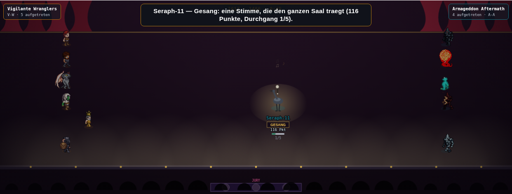 Seraph-11 (reiherMech) — zwei Notenglyphen deutlich sichtbar, bestätigt die reiherMech-Mikrofon-Nachbesserung |
| Kampfkunst | 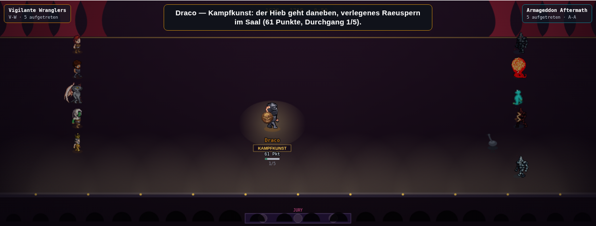 Draco — Schwert sichtbar, Funkenausbruch am Klingenweg | 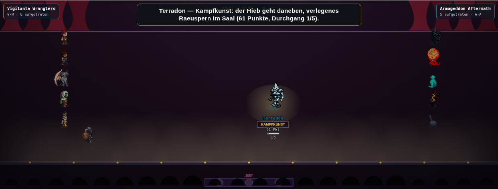 Terradon (vollbild golem, Kampfkunst NUR über Klasse/Sub erzwungen) — kein Schwert (dokumentierte Einschränkung), kein Absturz |

**Gegenprobe Wettessen/I-Spy** (Kollateralschaden-Kontrolle, Pixel-Diff mit Toleranz statt
striktem `cmp` — Lehre aus der PR-S1-Review: zwei Läufe auf unverändertem `main` sind wegen
Timing nie strikt byte-identisch):

- Kontrollprobe (zwei Läufe auf demselben frisch ausgecheckten `origin/main`-Worktree,
  Sekunden auseinander, `>24`px/Kanal-Schwelle): Wettessen 0/586224 Pixel (0,000 %), I-Spy
  808/586224 Pixel (0,138 %) — die natürliche Rausch-Größenordnung dieser beiden Bühnen.
- Vorher (`origin/main`) gegen Nachher (dieser Branch): Wettessen 115/586224 Pixel
  (0,020 %), I-Spy 115/586224 Pixel (0,020 %) — **kleiner** als I-Spys eigene
  Kontrollprobe, in derselben Größenordnung wie Wettessens Kontrollprobe. Kein
  Kollateralschaden über das erwartete Timing-Rauschen hinaus.

## Verifikation

- `node --check public/mockups/battle-mode.engine.js` — sauber.
- `npx tsc --noEmit` — Diff gegen denselben Commit (4f6c7c7d) in einem zweiten, frisch
  ausgecheckten Worktree (`.claude/worktrees/baseline-showcase-s2-tmp`): **0 Zeilen** (906/906
  identische Fehlerzeilen).
- `npx tsx scripts/pruefe-slot-invariante.ts` — hält, maximale Abweichung 0,005 Pp (mini-dm
  @ n=2, Attribut stamina), Schranke 0,2 Pp — unverändert gegenüber PR S0/S1.
- `node scripts/miss-alle-disziplinen.mjs 24` (voller 20-Disziplinen-Lauf) — **bit-identisch**
  zu einem Referenzlauf auf `.claude/worktrees/baseline-showcase-s2-tmp` (`diff` exit 0, alle
  20 Zeilen inkl. Feldspieler-Unterzeile), insbesondere `showcase` selbst unverändert bei rho
  je Spiel 0,892 (Spannweite 0,158), rho Saison 0,937 (Spannweite 0,077), bestanden. Zweimal
  gemessen (vor und nach der Zaubershow-Fehlzünder-Nachbesserung), beide Male bit-identisch.
- `npm run ci:rangtreue-schranke` — alle 20 Disziplinen `±0,000` gegenüber der gespeicherten
  Basislinie, Status `ok`; keine arena-resolved Disziplin unter die absolute 0,80-Schranke
  gefallen.
- `npx vitest run tests/battle-mode-arena-team-points.test.ts tests/arena-headless-runner.test.ts tests/buehne-erfindet-keine-formkrise.test.ts`
  — 92/92 grün.
- Sicht-QA: `node scripts/screenshot-showcase-acts-s2.mjs` (s. oben, alle sechs Acts, je
  typische Figur UND Vollbild-/reiherMech-Kreatur, 12/12 Act-Proben korrekt, keine
  Seitenfehler) plus Gegenprobe Wettessen/I-Spy (Pixel-Diff mit Toleranz, s. oben).

## Bewusst nicht in dieser PR

- Kein Ton (`TON_KATALOG.showcase`) — PR S3. Kein `sfx()`-Aufruf in `stepShowcase()`/
  `zeichneShowcase()`/den sechs Act-Funktionen.
- Keine Waffen-Requisite für Vollbild-Kampfkunst/-Schützenkunst — strukturelle Einschränkung
  (kein Vollbild-BAU-Eintrag trägt je ein `waffe`-Feld), dokumentiert statt umgangen.
- Keine Rezept-, Formel- oder Rundenzahl-Änderung (Konzept Abschnitt 4.1) — rho bleibt
  bit-identisch, wie oben nachgewiesen.
- Kein Eingriff in `WERTUNG_AUFTRITT`, keine neue Act-Spalte in der Wertungstabelle (Konzept
  Abschnitt 4.2).
