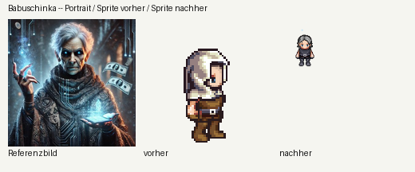
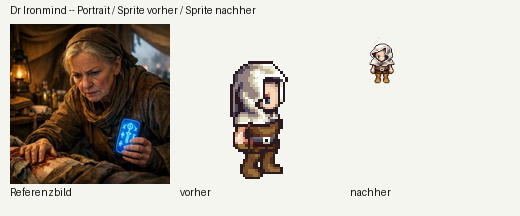
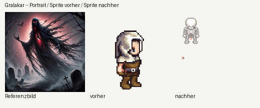
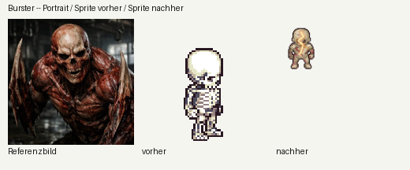
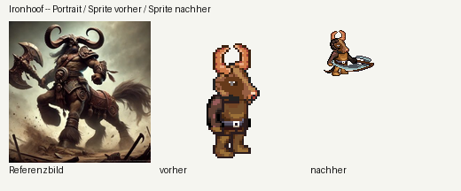
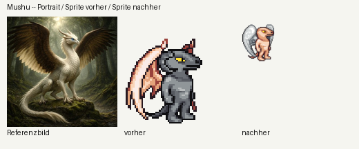
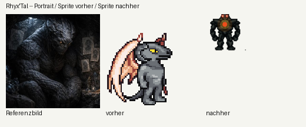

# Sprite-Cluster, Runde 1 — die byte-identischen Duplikate (04.09.)

Fables Projektmodell (`docs/design/naechste-schritte-fable-04-09.md`, Auftrag 4) und
`docs/design/sprite-fit-ergebnisse.md` hatten festgestellt: von den 70 Charakteren mit ★/★★
ist ein großer Teil **systematisch**, nicht 70 Einzelfälle — allen voran neun Gruppen, die sich
**byte-identische** `BAU`-Rezepte in `public/mockups/battle-mode.engine.js` teilen, obwohl ihre
Referenzbilder (`public/portraits/<slug>.jpg`) nichts miteinander zu tun haben. Diese Runde löst
genau diesen Cluster auf — die risikoärmste der drei benannten Serien (Cluster b/c, Wald-Riesen
und gehörnte Minotauren, bleiben spätere Runden, s. Fazit unten).

## Frisch geprüft: nur noch vier Gruppen, nicht neun

Ein Skript (`JSON.stringify` mit sortierten Schlüsseln über die geparste `BAU`-Tabelle) hat vor
dieser Runde noch einmal **alle** 146 Einträge auf byte-identische Duplikate geprüft, statt sich
auf die alte Zählung zu verlassen. Ergebnis: **fünf der neun ursprünglich gemeldeten Gruppen
haben sich seit der ersten Bewertungsrunde bereits auseinanderentwickelt** (Draco/Steel Sinister,
Elara/Lady Yueqin/Starflame, Kento/Umbra, Lilly/Lys Puppenkopf, Myrkos/Orichalcos — alle tragen
inzwischen unterschiedliche `BAU`-Werte, vermutlich durch zwischenzeitliche Einzelrunden). Nur
vier Gruppen waren zu Beginn dieser Runde noch tatsächlich byte-identisch:

| Gruppe | Geteiltes Rezept (vorher) |
|---|---|
| Babuschinka, Bana, Dr Ironmind, Gralakar | `{geschlecht:"w",haut:"light",kapuze:true,kopf:"human",ruest:"leder"}` |
| Burster, Threnox | `{kopf:"skeleton",koerper:"skelett"}` |
| Ironhoof, Medibull | `{haut:"fur_brown",kopf:"minotaur",ruest:"leder"}` |
| Mushu, Rhyx'Tal | `{fluegel:true,haut:"fur_grey",hoerner:true,kopf:"lizard",schwanz:true}` |

Nach dieser Runde: **null Gruppen** (Skript erneut gelaufen, s. Verifikation unten).

## Vorgehen je Gruppe

Für jede Gruppe wurde das Referenzbild **jedes** betroffenen Charakters einzeln angesehen (nicht
nur der alte Bewertungstext). In jeder Gruppe passte mindestens ein Bild tatsächlich zum
gemeinsamen Rezept — dieser Charakter blieb unverändert. Für die übrigen wurde ein eigenständiges
Rezept nach demselben Muster wie jede bestehende `BAU`-Zeile gebaut, ausschließlich mit bereits
vorhandenen, generischen Bausteinen (`kopf`/`koerper`/`haut`/`ruest`/`ruestTon`/`hoerner`/`waffe`/
`schwanz`/`haar`/`haarTon`/`geist`/`skala`/`effekt`/`gluehenderRiss`/`vollbild`/`vollbildFarbe`/
`energiekern`) — **keine neue Engine-Logik**, nur Rekombination.

### Gruppe 1: Babuschinka / Bana / Dr Ironmind / Gralakar

| Charakter | Vorher | Sterne | Geändert? | Nachher | Sterne |
|---|---|---:|---|---|---:|
| **Bana** | gelbe Kapuzen-Streetwear passt zum Kapuzen-Rezept | ★★★ | **nein** — bleibt die "richtige" der Gruppe | unverändert | ★★★ |
| **Babuschinka** | alte Cyber-Hexe, offenes graues Haar, dunkle bestickte Robe, blaue Zauberhand/Tablet, schwebende Geldscheine | ★★ | kapuze entfernt, `haar:"haar_lang",haarTon:"gray"`, `ruestTon:"dunkel"`, `effekt:{typ:"frost",pos:"kopf"}` (Wiederverwendung der hellblauen Frost-Palette für den blauen Zauber-/Technik-Schein) | eigenständiges Rezept | ★★★ |
| **Dr Ironmind** | alte Feldärztin, braunes Kopftuch, leuchtend blaues medizinisches Gerät | ★★ | `kapuze:true` bleibt (Kopftuch), `ruestTon:"bronze"` (bräunlich statt schwarzgrau, damit sie sich von Babuschinka abhebt), `effekt:{typ:"frost",pos:"kopf"}` | eigenständiges Rezept | ★★★ |
| **Gralakar** | schwebender Sensenmann/Wraith, rot glühende Augen, sichtbarer roter Rippenkäfig, Klauenhände, Friedhof | ★ | komplett umgebaut: `kopf:"skeleton",koerper:"skelett"` (wie Burster/Threnox) + `geist:true` (durchscheinend) + `effekt:{typ:"voidRot",pos:"koerper"}` (rote Energie) | eigenständiges Rezept | ★★★ |





### Gruppe 2: Burster / Threnox

| Charakter | Vorher | Sterne | Geändert? | Nachher | Sterne |
|---|---|---:|---|---|---:|
| **Threnox** | geisterhafte Skelett-Gestalt, spielt Rippenkäfig-Harfe | ★★★★ | **nein** — bereits die "richtige" der Gruppe | unverändert | ★★★★ |
| **Burster** | häutungsloser, blutig-roter Muskelkoloss, Totenschädel-Gesicht, riesige klingenartige Knochenkrallen | ★★ | `koerper:"zombie"` statt `"skelett"` (rohe/verwesende statt knochenweiße Optik), `skala:1.15` (hulkartige Statur), `gluehenderRiss:true` (rote Wund-/Rissader über der Brust) | eigenständiges Rezept | ★★★ |



### Gruppe 3: Ironhoof / Medibull

| Charakter | Vorher | Sterne | Geändert? | Nachher | Sterne |
|---|---|---:|---|---|---:|
| **Medibull** | zweibeiniger Stier-Sanitäter, grüne Cargo-Hose, Rotes-Kreuz-Patches, Stethoskop | ★★ | **nein** — der Kategorie nach die "richtige" der Gruppe (echter Zweibeiner, s. Bild-Fund unten) | unverändert | ★★ |
| **Ironhoof** | Zentauren-Krieger: menschlicher Oberkörper, stark gebogene Widderhörner, Streitaxt, Pferdeunterkörper mit Schweif | ★★ | `hoerner:"gebogen"` statt `true` (trifft die gebogenen Widderhörner exakt), `waffe:"axt"`, `schwanz:true` (Näherung an den Pferdeschweif), `ruestTon:"bronze"` | eigenständiges Rezept | ★★★ |

**Bild-Fund:** Der alte Code-Kommentar über Ironhoof ("riesiges brüllendes Reptilwesen mit
gehörntem Kamm") passte zu keinem der beiden je unter diesem Namen gelaufenen Bilder — vermutlich
aus einer früheren Verwechslung. Das tatsächliche Bild zeigt einen Zentauren, keinen Reptil-Kopf.
Der Pferde-Unterkörper selbst bleibt strukturell unbaubar (kein Zentauren-Körper im Baukasten,
s. auch Fables Notiz zum separaten "gehörnten Minotaurus/Zentaur"-Cluster) — Ironhoof bleibt
deshalb bewusst bei ★★★, nicht höher: die Kategorie (zweibeinig statt vierbeinig) bleibt falsch,
auch wenn jetzt drei zusätzliche Details stimmen.



### Gruppe 4: Mushu / Rhyx'Tal

| Charakter | Vorher | Sterne | Geändert? | Nachher | Sterne |
|---|---|---:|---|---|---:|
| **Mushu** | cremeweißes, geschupptes Greifenwesen mit großen braunen Federflügeln, langem Schwanz, hellblauen Augen | ★★ | `hoerner` entfernt (kein Hornbefund im Bild), `fluegel:"federn"` statt generischem Flügel, `haut:"light"` statt `"fur_grey"` (näher an cremeweiß), `skala:1.15` | eigenständiges Rezept | ★★★ |
| **Rhyx'Tal** | wuchtiger, kauernder Höhlen-Koloss, rissige graue/schwarze Steinhaut, leuchtend orange Augen, Höhle im Hintergrund | ★★ | komplett umgebaut: `vollbild:"golem"` (dieselbe Kreaturklasse wie Lava Golem/Krolach/Vorrak) mit `vollbildFarbe:"#46433d"` (dunkles Basalt-Grau) + `energiekern:true` (rot-orange leuchtende Augen + Brustkern) | eigenständiges Rezept | ★★★★ |

**Bild-Fund:** Der alte Code-Kommentar über Rhyx'Tal hatte die richtige Diagnose bereits stehen
("massiges Steinwesen … kauert in einer Höhle, glühende Augen, unbewaffnet") — nur das Rezept
darunter baute etwas völlig anderes (geflügelter/geschwänzter/gehörnter Echsen-Humanoid, exakt
Mushus Bauplan). Ein Kopiervorgang aus einer früheren Runde hat offenbar die Diagnose stehen
lassen, aber das falsche Rezept eingesetzt. Jetzt korrigiert: `vollbild:"golem"` ist exakt die
Kreaturklasse, die der eigene Kommentar schon beschrieb.




## Zusammenfassung der Bewertungsänderungen

| Charakter | Vorher | Nachher | Δ |
|---|---:|---:|---:|
| Babuschinka | ★★ | ★★★ | +1 |
| Dr Ironmind | ★★ | ★★★ | +1 |
| Gralakar | ★ | ★★★ | +2 |
| Burster | ★★ | ★★★ | +1 |
| Ironhoof | ★★ | ★★★ | +1 |
| Mushu | ★★ | ★★★ | +1 |
| Rhyx'Tal | ★★ | ★★★★ | +2 |
| Bana, Threnox, Medibull | unverändert | unverändert | 0 (bereits die "richtigen" ihrer Gruppe) |

Sieben Charaktere gehoben, keiner auf 5 Sterne — konsistent mit dem Bloater-Präzedenzfall
("manche werden nur auf 3-4 kommen, das ist ehrlich genug"). Bei jedem der sieben bleibt
mindestens eine benennbare Lücke (fehlende Requisiten wie Geldscheine/Sanitätertasche, oder eine
strukturell unbaubare Silhouette wie der Zentauren-Unterkörper) — dokumentiert in
`data/generated/sprite-fit-bewertung.json` je Charakter unter `fehlendesDetail`.

`data/generated/sprite-fit-bewertung.json` wurde im selben Commit aktualisiert (Grundsatz "Score
folgt dem Sprite").

## Verifikation

**Duplikate aufgelöst:** dasselbe Skript, das die vier verbliebenen Gruppen fand, meldet danach
`Number of duplicate groups: 0` über alle 146 `BAU`-Einträge.

**Screenshots:** für jeden der sieben geänderten Charaktere ein Vorher/Nachher gegen das
Referenzbild (oben, `sprite-cluster-runde1-<slug>.png`) — "vorher" ist die alte
`public/sprites/preview/<slug>.png` (dieselbe Datei, die bewertet wird), "nachher" ein frisch
über `window.__arena.renderProbe()` gerenderter Live-Arena-Frame (teils im Angriffsframe, um
Waffen sichtbar zu machen, z. B. Ironhoofs Axt).

**Syntax:**

```
node --check public/mockups/battle-mode.engine.js
```

→ OK.

**Regressionskontrolle** (`node scripts/miss-alle-disziplinen.mjs 24`, dieselben fünf
kaderfesten Team-Paarungen wie in `docs/design/stand-aller-disziplinen.md`, Stand 03./04.09.):
siehe eingefügte Tabelle unten — erwartet bit-identisch zur dortigen Baseline, da `BAU`/
`zeichneSprite`/`figur` reine Zeichenfunktionen sind und von keiner Simulation
(`aufEignung`, `MOTOREN`) gelesen werden, exakt wie beim Bloater-Nachweis.

```
Disziplin           Chassis     Teiln.  rho je Spiel (Median)  Spannweite  rho Saison (Median)  Spannweite   Abnahme
speed-schach        buehne         12                  0.889       0.060                0.979       0.021   bestanden
gewichtheben        buehne         12                  0.887       0.224                0.944       0.261   bestanden
showcase            buehne         12                  0.880       0.140                0.944       0.063   bestanden
time-trial          bahn           12                  0.867       0.050                0.909       0.056   bestanden
wettessen           buehne         12                  0.844       0.233                0.916       0.126   bestanden
fechten             buehne         12                  0.840       0.230                0.874       0.252   bestanden
tennis              buehne         12                  0.814       0.176                0.839       0.294   bestanden
breaking            buehne         12                  0.801       0.114                0.874       0.119   bestanden
climbing            bahn           12                  0.790       0.192                0.851       0.308   knapp
basketball          feldspiel      12                  0.757       0.102                0.923       0.231   knapp
eiskunstlauf        buehne         12                  0.757       0.125                0.958       0.091   knapp
takeshis-castle     bahn           12                  0.697       0.170                0.839       0.196   durchgefallen
i-spy               buehne         12                  0.692       0.384                0.727       0.441   durchgefallen
staffel             bahn           12                  0.681       0.398                0.706       0.650   durchgefallen
hockey              feldspiel      12                  0.669       0.181                0.832       0.259   durchgefallen
  davon nur Feldspieler            12                  0.719       0.182                0.818       0.259   knapp
spurt               bahn            8                  0.652       0.559                0.690       0.643   durchgefallen
football            feldspiel      12                  0.468       0.383                0.671       0.420   durchgefallen
battlefield         arena           8                  0.325       0.662                0.619       1.000   durchgefallen
mini-dm             arena           8                  0.269       0.802                0.500       1.167   durchgefallen
tdm                 arena          12                  0.113       0.387                0.070       0.441   durchgefallen
```

**20 von 20 Zeilen bit-identisch** zur Baseline in `docs/design/stand-aller-disziplinen.md`
(Stand 03./04.09., inklusive der Football-Zeile, die dort bereits den Stand nach PR #764 zeigt,
genau wie beim Bloater-Nachweis). Bestätigt: `BAU`/`zeichneSprite`/`figur` sind reine
Zeichenfunktionen, keine der sieben geänderten Zeilen (auch nicht `vollbild`, `energiekern`,
`geist`, `skala`) wird von `aufEignung`/`MOTOREN` gelesen.

## Was übrig bleibt (nicht in diesem PR)

- **Wald-Riesen-Cluster** (Cyrn, Greenkraut, Rootheart, Treantos, Tropfina — fünf "Baumwesen",
  Treantos nutzt laut Code bereits `vollbild:"treant"`): eigene, spätere Runde, wie im Auftrag
  vorgesehen. Nach Abschluss dieser Runde war kein Budget mehr für eine saubere Prüfung aller
  fünf Referenzbilder übrig.
- **Gehörnter Minotaurus/Zentaur-Cluster** (Ironhoof, Medibull, Omniclops, Roddox Harthelm,
  Tartarus, Kora): ausdrücklich eine eigene, spätere Runde laut Auftrag — Ironhoof/Medibull sind
  in dieser Runde nur insofern mitgelaufen, als sie das eine byte-identische Paar innerhalb
  dieses größeren Clusters waren. Die anderen vier (Omniclops, Roddox Harthelm, Tartarus, Kora)
  wurden in dieser Runde nicht angefasst.
- Bei Ironhoof bleibt der Zentauren-Unterkörper strukturell unbaubar (kein passender Körpertyp
  im LPC-Baukasten, s. o.) — das ist eine Baukasten-Lücke, keine Einzelfall-Schwäche, und würde
  auch von einer künftigen Minotauren-Runde nicht gelöst, nur besser dokumentiert.
