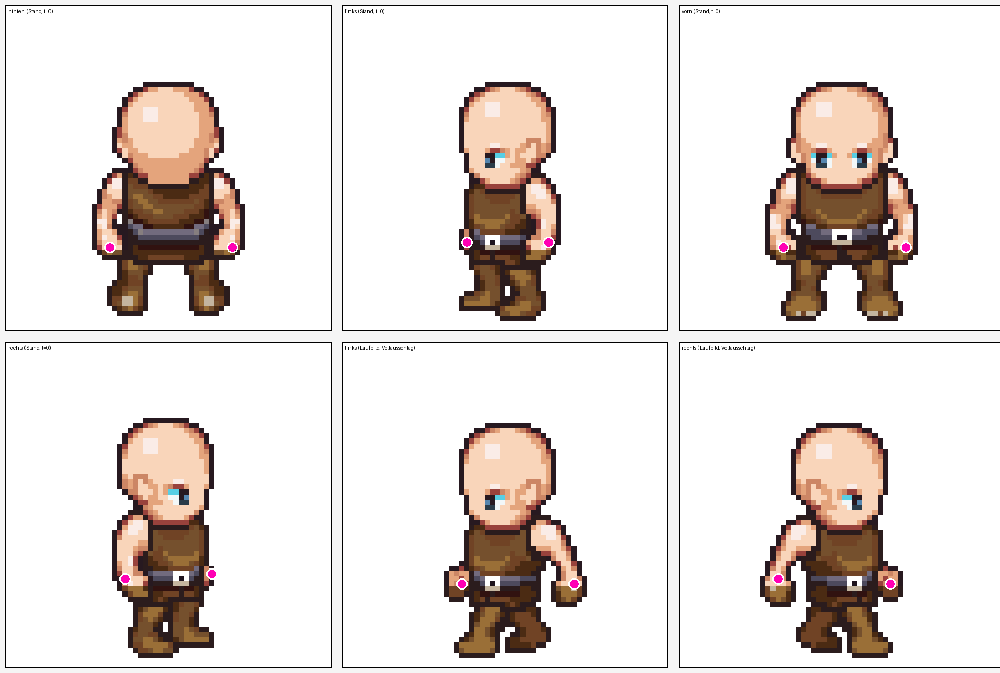
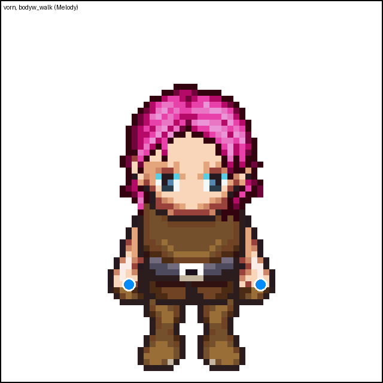

# Sprite-Handpunkte — wo die Hand sitzt, für einen künftigen Hockeyschläger

Reine Messung, **kein** Schläger gezeichnet, **keine** Zeile `zeichneSprite` geändert. Bevor
jemand einer Figur einen Hockeyschläger in die Hand zeichnet, muss bekannt sein, wo genau die
Hand liegt — je Blickrichtung und je Bild des Laufzyklus. Gemessen an den Pixeln der
Standard-Körperblätter `body_walk` (männlich) und `bodyw_walk` (weiblich), 576×256 =
9 Spalten (Laufzyklus, `ANIBILDER.walk=9`) × 4 Zeilen (Blickrichtung, `blickAus()`: 0 hinten,
1 links, 2 vorn, 3 rechts) zu je 64×64.

## Methode

1. **Blatt extrahieren**: `body_walk`/`bodyw_walk` liegen als Base64-PNG-Data-URI im
   `SPRITES`-Objekt in `public/mockups/battle-mode.engine.js` (eine einzige, sehr lange
   Zeile). Ein Regex zieht die passende Data-URI heraus, `PIL.Image.open` dekodiert sie.
2. **Zelle für Zelle scannen**: je Blickrichtung/Laufbild wird die 64×64-Zelle zugeschnitten
   und im Höhenband y=36–52 (Schulter- bis Hüfthöhe) auf ihre am weitesten seitlich
   ausladenden Pixel geprüft — die Hand ist dort, wo die Silhouette am weitesten über den
   Rumpf hinausragt (Faust am Ende des Arms). Skript: `scripts/messe-sprite-handpunkte.py`.
3. **Gegenprobe im echten Rendering**: `scripts/erzeuge-sprite-handpunkte-beweisbild.mjs`
   rendert dieselbe Figur über die **echte** `zeichneSprite()`-Pipeline
   (`window.__arena.renderProbe`, Playwright) und markiert die gemessenen Punkte farbig —
   Ergebnis unten. Landet der Punkt nicht sichtbar auf einer Hand, ist die Messung falsch;
   das war der Fall bei einem ersten Versuch (s. „Ein Messfehler unterwegs" unten) und wurde
   vor dieser Abgabe korrigiert.

Koordinaten sind **Pixel innerhalb der 64×64-Zelle** (x/y = 0..63), exakt der Raum, in dem
`zeichneSprite()` bei Standardgröße (`groesseFaktor`-Faktor Z=1) auch zeichnet — ein Aufruf
wie `window.__arena.renderProbe(name,"walk",false,dir)` zeichnet auf einen 64×64-Canvas mit
`x=32,y=46` als Fußpunkt, sodass Canvas-Pixel und Zellen-Koordinate hier deckungsgleich sind.

## Ergebnis: `body_walk` (männlicher Standardkörper)

### Hinten / vorn — zwei Hände, unbewegt über den ganzen Laufzyklus

Arme hängen in der Front-/Rückenansicht ruhig herab; nur die Beine laufen. Alle 9 Laufbilder
liefern (bis auf Rauschen von 0–1px) dieselbe Zahl:

| Richtung | linke Hand (Bildschirm) | rechte Hand (Bildschirm) |
|---|---|---|
| hinten | x=20, y=47 | x=44, y=47 |
| vorn | x=20, y=47 | x=44, y=47 |

### Links / rechts (Profil) — die sichtbare Hand wandert mit dem Schwung

Anders als vorn/hinten bewegt sich die Hand hier deutlich: in der Ruhehaltung liegt sie eng am
Rumpf (keine eigene, vom Körper abgrenzbare Kontur — ehrlich gemessen heißt hier: **kein
Fund**, keine geratene Zahl), im Vollausschlag schwingt sie weit heraus. Volle Tabelle aller
9 Laufbilder (Spalte 0–8), Außenkante der Silhouette im Höhenband y=36–52,
`scripts/messe-sprite-handpunkte.py`:

| Spalte | links: vordere Hand | links: hintere Hand | rechts: hintere Hand | rechts: vordere Hand |
|---|---|---|---|---|
| 0 | eng am Rumpf, kein Fund | eng am Rumpf, kein Fund | eng am Rumpf, kein Fund | eng am Rumpf, kein Fund |
| 1 | eng am Rumpf, kein Fund | eng am Rumpf, kein Fund | eng am Rumpf, kein Fund | eng am Rumpf, kein Fund |
| 2 | eng am Rumpf, kein Fund | eng am Rumpf, kein Fund | eng am Rumpf, kein Fund | eng am Rumpf, kein Fund |
| 3 | ansatzweise, x≈25,y≈36 | x≈43, y≈45 | x≈20, y≈45 | ansatzweise, x≈38,y≈36 |
| 4 | x=22, y=45 | x=44, y=45 | x=19, y=45 | x=41, y=45 |
| **5 (Vollausschlag)** | **x=20, y=45** | **x=47, y=46** | **x=16, y=46** | **x=43, y=45** |
| 6 | x=23, y=45 | x=45, y=41 | x=18, y=41 | x=40, y=45 |
| 7 | eng am Rumpf, kein Fund | x≈44, y≈37 | x≈19, y≈37 | eng am Rumpf, kein Fund |
| 8 | eng am Rumpf, kein Fund | x≈43, y≈37 | x≈20, y≈37 | eng am Rumpf, kein Fund |

„Vordere Hand" = die Hand auf der Seite, in die die Figur blickt (Bewegungsrichtung); „hintere
Hand" = die gegenläufig schwingende. Spalte 5 von 9 ist der Vollausschlag (größter Abstand
beider Hände von der Körpermitte); Spalten 0–2 und 7–8 sind die „Passier"-Bilder, in denen der
Baukasten die Hand nicht als eigene Form zeichnet, sondern in die Rumpfsilhouette einfließen
lässt — für diese Bilder gibt es bewusst **keine** erfundene Koordinate, nur die für den Griff
brauchbare Notlösung unten.

**Praktische Notlösung für einen Schläger, der über den ganzen Laufzyklus in der Hand bleiben
soll**: für die Frames ohne eigene Handkontur (0–2, 7–8) ist die plausibelste Griffposition der
Punkt, an dem in Spalte 4/6 die Hand zuletzt sichtbar war, linear zur jeweils
nächstgelegenen sichtbaren Spalte interpoliert — z. B. links etwa (24, 46) für Spalte 0/1/2 und
(24, 44) für Spalte 7/8. Das ist eine Interpolation, keine Messung, und sollte im Beweisbild
gegengeprüft werden, bevor sie fest verdrahtet wird.

## Ergebnis: `bodyw_walk` (weiblicher Körper)

Stichprobe (Front-Ansicht plus eine Profil-Extremstellung) zeigt **denselben Rumpf/Arm-Rig**,
Abweichung ≤1px gegenüber dem männlichen Körper — vermutlich dieselbe LPC-Vorlage nur mit
schlankerer Silhouette:

| Blickrichtung/Bild | `body_walk` (männlich) | `bodyw_walk` (weiblich) |
|---|---|---|
| vorn, Spalte 0, linke Hand | x=20, y=47 | x=21, y=47 |
| vorn, Spalte 0, rechte Hand | x=44, y=47 | x=43, y=47 |
| links, Spalte 5, vordere Hand | x=20, y=45 | x=21, y=47 |
| links, Spalte 5, hintere Hand | x=47, y=46 | x=44, y=46 |

Für die Griffposition eines Schlägers reicht es, dieselben Koordinaten wie beim männlichen
Körper zu verwenden — der Unterschied liegt unterhalb eines Pixels.

## Beweisbild

Gerendert über die echte `zeichneSprite()`-Pipeline (`window.__arena.renderProbe`,
`scripts/erzeuge-sprite-handpunkte-beweisbild.mjs`), Standard-Rasse/-Rüstung (unbekannter
Name fällt auf `BAU_STD` zurück: Mensch, Lederrüstung) — Ärmel enden am Oberarm, Unterarm/Hand
bleiben nackt sichtbar, was die Kontrolle erleichtert. Punkt = gemessene Handposition.



Oben: hinten/links/vorn im Stand-Frame (`t=0`, direkt nach dem Laden — das Laufbild hängt an
der globalen Kampfzeit `t`, die nur während eines laufenden Nahkampfs vorläuft, s. Kommentar im
Beweisbild-Skript). Unten: rechts im Stand-Frame, dann links/rechts im **Vollausschlag**-
Laufbild (Spalte 5 von 9, erreicht durch kurzes Anwerfen des Nahkampfs über den echten
„Kampf starten"-Button, danach wieder pausiert — reiner Zeit-Vorspulmechanismus, keine
Spiellogik verändert). In allen sechs Feldern sitzt der Punkt sichtbar auf der Faust/dem
Unterarm, nicht auf Gürtel oder Rüstung.



### Ein Messfehler unterwegs — zur Ehrlichkeit dieser Messung

Der erste Versuch für die Stand-Frames (links/rechts) hat die vordere und die hintere Hand
verwechselt (Koordinaten grob mit den Vorderansicht-Werten geschätzt statt am Profilbild selbst
gemessen) — das Beweisbild zeigte den Punkt auf dem Gürtel bzw. neben der Figur in der Luft.
Das ist genau der Fall, den der Auftrag verlangt zu melden: **neu gemessen** (direkter
Farbklassen-Scan der gerenderten PNG-Pixel, Skin-Rampe `HAUT.light` gegen Rüstungs-Braun
unterschieden statt nur Alpha-Silhouette), Ergebnis oben, im Beweisbild bestätigt.

## Unsicherheiten — ehrlich, nicht geraten

- **Links/rechts, Passier-Bilder (Spalte 0–2, 7–8)**: keine eigene Handkontur, s. oben. Jede
  Zahl dafür ist eine Interpolation zwischen den messbaren Nachbarbildern, keine Messung.
- **Zwei Hände in derselben Zelle**: vorn/hinten zeigen klar zwei getrennte Fäuste; im Profil
  ist die zweite (verdeckte) Hand nur als 1–2px-Hautsaum am Rumpf sichtbar (s. Stand-Frame im
  Beweisbild: der zweite Punkt liegt genau auf diesem schmalen Saum, nicht auf einer echten
  Faustform) — für einen zweihändig gehaltenen Schläger ausreichend als Näherung, für einen
  eigenständig gezeichneten zweiten Handschuh nicht.
- **`bodyw_walk`**: nur zwei Stichprobenbilder direkt nachgemessen (s. Tabelle oben), nicht der
  volle 9×4-Raster wie bei `body_walk` — die Abweichung war dort so klein (≤1px), dass eine
  komplette Zweitmessung keinen Erkenntnisgewinn versprach. Wer beim tatsächlichen Verdrahten
  eines Schlägers Wert auf Subpixel-Genauigkeit legt, sollte `scripts/messe-sprite-handpunkte.py
  bodyw_walk` einmal vollständig laufen lassen (Aufruf steht im Skript-Header).
- **Andere Körperblätter** (`koerper_skelett_*`, `koerper_zombie_*`, Vollbild-Rassen wie
  Golem/Kraken/Werwolf) wurden **nicht** vermessen — der Auftrag nennt ausdrücklich nur
  `body_walk`/`bodyw_walk`, und diese anderen Blätter haben andere Proportionen/Raster.

## Reproduzieren

```sh
python3 scripts/messe-sprite-handpunkte.py            # beide Blätter, alle Richtungen/Bilder
node scripts/erzeuge-sprite-handpunkte-beweisbild.mjs  # Rohbilder für ein neues Beweisbild
```

Playwright-Browser: `/opt/pw-browsers/chromium-1194/chrome-linux/chrome` (wie im Auftrag
vorgegeben, dieselbe Technik wie `scripts/erzeuge-sprite-vorschauen.mjs`).
