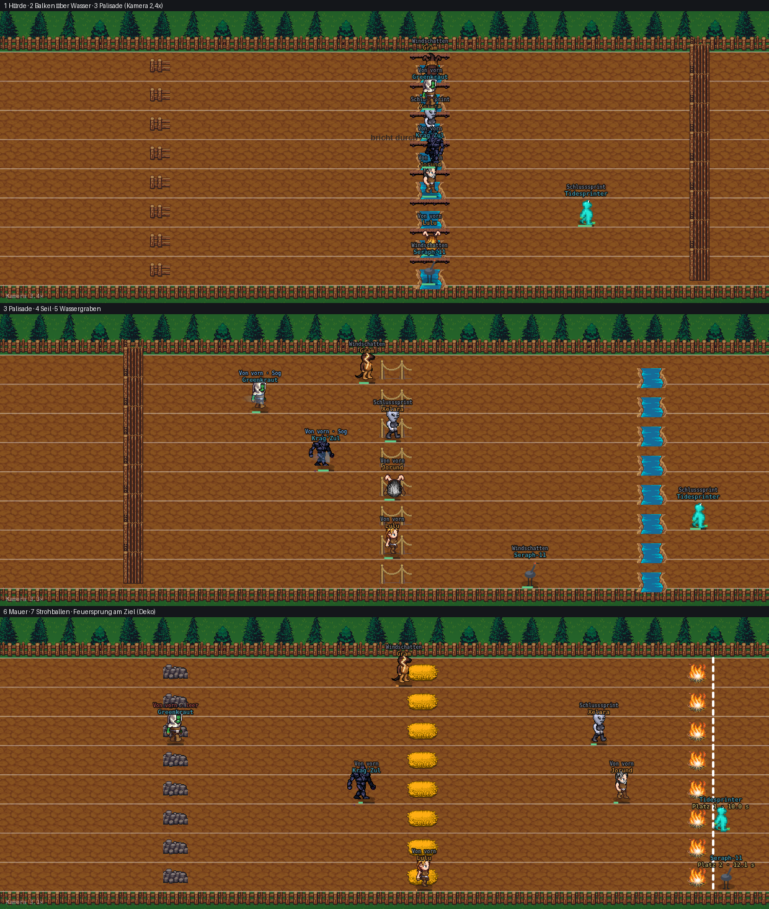

# Spurt — die sieben offenen Fragen entschieden, Rezept-Paket B gemessen, Optik-Plan U3 (Fable, 05.09.2026)

Stand `ee2ac733` (`origin/main`, 05.09., nach PR #794 Spurt-Umsetzung und #795 Football-Assets).
Reine Recherche und Planung: **keine Zeile am Motor geändert**, dieser Branch trägt nur diesen
Bericht und ein Beweisbild (`spurt-optik-prototyp-05-09.png`). Alle Prototypen liefen in einem
eigenen Worktree gegen den Motor und wurden nach der Messung per `git checkout` verworfen; der
Optik-Prototyp lief in einer Kopie von `public/` mit eigenem HTTP-Port, damit er die
Messläufe nicht störte. Die Patches stehen zeichengenau im Anhang, damit die Umsetzungsrunde
sie nachbauen kann.

Auftrag (Chris, 05.09., später am Tag): „mach weiter mit den 3 offenen was gameplay usw angeht
suche wieder im netz lass fable das planen und wenn das soweit durch ist review noch mal ingame
ob das sauber aussieht, fixe alle probleme und mach dann weiter mit den nächsten 3 diszis" —
Freigabe, die offenen Fragen aus `spurt-modellierung-recherche-05-09.md` Abschnitt 5 nach
eigenem Urteil zu entscheiden.

---

## Die Kurzfassung

1. **Alle sieben Fragen sind entschieden** (Abschnitt 1). Die wichtigsten: Spurt bleibt
   **Hindernislauf** auf der Bahn (kein eigenes Chassis), **kein achter Sub-Skill** — GRIFF
   wurde gebaut, gemessen und verworfen (rho 0,857 → 0,829, Spannweite 0,286 → 0,351), der
   **Rempler bleibt**, aber nie im Hindernis; die Abnahme bei zwei je Seite läuft über
   **Star in Top 2 und Paartreue**, nicht über rho.
2. **Ein gemessenes Rezept-Paket („Paket B") verbessert alles gleichzeitig, ohne neuen
   Sub-Skill:** sieben Stationen mit fester Typfolge (statt Dreierzyklus), Kraft-Hindernisse
   kosten 1,4× Zeit, kein Rempler im Hindernis, Stopp verbrennt nur 40 % Reserve. Kaderfest:

   | je Seite | heute (`main`) | Paket B |
   |---|---:|---:|
   | 4 (Abnahme-Standard) | 0,857 / Spannweite 0,286 / Saison 0,905 | **0,871 / 0,236 / 0,905** |
   | 2 (das echte `playerCount`) | 0,700 / 0,235 / 0,800 — „knapp" | **0,825 / 0,191 / 0,949 — bestanden** |
   | 6 | 0,849 / 0,178 / 0,867 | **0,918 / 0,106 / 0,909** |
   | Einfluss-Abweichung zur Matrix | 38,9 Pp (Torment 3,6 %, Power 3,8 %) | **16,7 Pp (Torment 9,1 %, Power 9,4 %, Dexterity 11,4 %)** |

   Einschränkung, ehrlich: bei vier je Seite liegt der Sprung (+0,014) **innerhalb der
   Kader-Spannweite** und ist dort von null nicht unterscheidbar. Was Paket B trägt, sind die
   zwei je Seite (+0,125, das ist der Normalfall im echten Spiel), die sechs je Seite (+0,069)
   und die Einfluss-Abweichung (−22 Pp) — die Mechanik belohnt danach, was die Matrix bepreist.
3. **Die Optik (U3) ist geplant und als Prototyp gesichtet** — alle sieben Stationen plus
   Feuersprung am Ziel aus den zwei bereits geholten LPC-Paketen, kein neuer Download, kein
   neuer Credit. Neun Kacheln, Schnittkoordinaten stehen in Abschnitt 4, der
   `bodenSpurt()`-Override als Code im Anhang C. Beweisbild: `spurt-optik-prototyp-05-09.png`.
   Aufwand für die Umsetzungsrunde: ein halber Tag statt des geschätzten ganzen — die
   Sichtprüfung ist hier schon gelaufen.
4. **Reihenfolge für die Umsetzungsrunde** (Abschnitt 5): erst Paket B (vier Zeilen Motor, eine
   Zeile Daten), Messung an drei Kadergrößen, dann U3, dann Basislinie und Stand-Doku.

---

## 1. Die sieben Fragen — Entscheidung und Begründung

### Frage 1 — Hindernislauf oder Hürdensprint? → **Hindernislauf.**

Drei Gründe, jeder für sich ausreichend. **(a)** Die Matrix sagt es: torment 14, dexterity 12,
power 10 und speed nur 18 beschreiben einen Parcours, keinen Sprint — bei 110 m Hürden stünde
Speed über 30. **(b)** Chris' ursprünglicher Auftrag nannte als Vorbild „Ninja Warrior, Spartan
Race, Hindernislauf", nicht Leichtathletik. **(c)** Die Umsetzung als Hindernislauf (PR #794,
P6) ist gemessen und bestanden; ein Rückbau zum Hürdensprint hätte laut Vorgänger-Recherche
einen Median um 0,72 — unter der Schranke.

Was das für die Optik heißt: keine Leichtathletik-Hürden, sondern ein **Parcours im Freien**
(Zaun, Palisade, Seil, Wassergraben, Strohballen). Das Bild bleibt die Bahn — s. Frage 7.

### Frage 2 — Sieben Stationen, und passen Wasser und Feuer ins Weltenbild? → **Ja, in dieser Reihenfolge:**

| # | Position | Station | Sub-Skill (Paket B) | Warum dieser Sub-Skill |
|---|---|---|---|---|
| 1 | 0,14 | Hürde (Holzzaun) | TECHNIK | Rhythmus, Absprung — dexterity/awareness |
| 2 | 0,26 | Balken über Wasser | WENDIGKEIT | Balance — dexterity/awareness/speed |
| 3 | 0,38 | Palisade | WUCHT | Wand hochziehen — torment/power |
| 4 | 0,50 | Seil (Hangeln) | WUCHT | Griff- und Zugkraft — power; Torment = nicht loslassen |
| 5 | 0,62 | Wassergraben | WENDIGKEIT | Anlauftempo und Landeweite erklären 82–84 % der Varianz (Steeple-Studie, Vorgänger 2.2) — speed/dexterity |
| 6 | 0,74 | Bruchsteinmauer | WUCHT | wie 3 |
| 7 | 0,86 | Strohballen | TECHNIK | wie 1 |
| Ziel | 1,00 | Feuersprung (nur Deko) | — | Spartan-Tradition: das letzte Hindernis jeder Spartan-Strecke ist der Feuersprung; hier ohne Zeitpreis, damit die Mechanik nicht wieder ein achtes Ereignis bekommt |

**Wasser und Feuer im Weltenbild:** ja. Beides sind Elemente, keine Technik, und kommen in den
zwei Paketen als mittelalterliche Dorf-Deko vor (Teich, Lagerfeuer). Für Konstrukte, Untote und
die Aqua-Rasse gilt: der Wassergraben ist ein Sprung über Wasser, kein Schwimmen — niemand muss
hinein. Das Feuer steht am Ziel und kostet nichts; wer es bildlich für eine Rasse unpassend
findet, streicht `feuerZiel:true` — eine Zeile, keine Mechanik.

**Warum nicht die Reihenfolge aus der Vorgänger-Recherche** (Hürde, Balken, Wand, Hangeln,
Graben, Wand, Hürde mit GRIFF und ANTRITT)? Weil sie gemessen schlechter ist: mit GRIFF
(Frage 3) fällt rho, und mit dem Graben als ANTRITT-Station („Paket A") fällt der
Dexterity-Einfluss auf 4,8 % (Matrix 12) — die Mechanik belohnt dann Power/Torment auf Kosten
der Technik. Mit dem Graben als WENDIGKEIT-Station („Paket B") lesen alle drei Hindernis-
Attribute nahe der Matrix (Abschnitt 3.2).

### Frage 3 — Achter Sub-Skill GRIFF? → **Nein. Gebaut, gemessen, verworfen.**

GRIFF `{power:40, stamina:30, determination:30}` an Station 4, Rest wie in der
Vorgänger-Tabelle, kaderfest n = 24:

| | rho/Spiel | Spannweite | Saison |
|---|---:|---:|---:|
| `main` (7 Sub-Skills) | 0,857 | 0,286 | 0,905 |
| GRIFF (8 Sub-Skills) | 0,829 | 0,351 | 0,857 |
| GRIFF bei 2 je Seite | 0,750 | 0,153 | 1,000 |

Der Grund ist strukturell, nicht Kalibrierung: ein achter Wert, den nur **eine** von sieben
Stationen liest, verdünnt die Rangordnung — der Läufer mit dem besten GRIFF gewinnt 0,3 s an
genau einem Ort, und sonst nirgends zählt der Wert. Real ist Griffkraft bei OCR zwar der Träger
der am häufigsten verfehlten Hindernisse (Spartan: Beater, Olympus, Twister, Multi-Rig —
Erstläufer scheitern „etwa 90 % der Zeit", mit Übung 50:50), aber dort gibt es **drei bis fünf**
solche Stationen auf zwanzig, nicht eine auf sieben. Bei uns bekommt das Hangeln deshalb den
Kraft-Sub-Skill, den es schon gibt: **WUCHT** (torment 55, power 42). Power ist die Griffkraft,
Torment das „Nicht-Loslassen" — dieselbe Lesart wie beim Durchbrechen einer Hürde. Der Preis
für diese Entscheidung ist ein Stück Etikett, nicht Rangtreue; die `lang`-Beschriftung von
WUCHT kann in der Umsetzungsrunde zu „Kraft" werden, wenn „Wucht" am Seil komisch klingt.

Das Chassis hätte den achten Wert gratis getragen (`spurtWerte` iteriert über die Rezept-
Schlüssel, `SPURT_KEYS` wird daraus gelesen, `battle-mode.rezepte.js` führt Spurt nicht — das
Inline-Rezept gilt). Es scheitert nur an der Messung.

### Frage 4 — Rempler behalten? → **Ja, gedämpft (schon drin) und nie im Hindernis (neu).**

Chris' Wunsch war ausdrücklich („Gram müsste … öfter tackeln"), und die Dämpfung aus PR #794
(`tackleAb 50`, `tackleRate 1,0`) hat den Rempler von 9–16 auf 3–8 je Rennen gebracht. Was
noch fehlte: **während ein Läufer im Hindernis-Stopp steht, darf er weder rempeln noch
gerempelt werden** — sonst ist der Stopp an der Wand Freiwild, und der Zeitpreis, der Dexterity
tragen soll, wird zur Torment-Prämie. Gemessen allein: 0,853 / 0,358 / 0,810 (Rauschen); im
Paket B trägt die Sperre dazu bei, dass die Spannweite fällt (Abschnitt 3.1). Kosten: null
Zeilen Optik, zwei Bedingungen im Motor.

### Frage 5 — Abnahme bei zwei je Seite? → **Rho > 0,80 bei 4 und 6 je Seite; bei 2 je Seite Star in Top 2 > 80 % und Paartreue ≥ 15 Punkte > 90 %.**

Spearman über vier Läufer kennt 25 diskrete Zustände; ein vertauschtes Nachbarpaar kostet
0,2–0,4. Die Zahl schwankt strukturell, nicht mechanisch. Die ehrliche Frage bei vier Läufern
ist die aus CLAUDE.md für Hockey: **steht der Beste vorn, und werden klar getrennte Paare
richtig geordnet?** Gemessen mit einer eigenen Sonde (Anhang A), dieselbe Kaderfamilie, n = 24:

| | je Seite | Star auf Rang 1 | Star in Top 2 | Paare ≥ 15 Punkte richtig | Paare < 3 Punkte |
|---|---:|---:|---:|---:|---:|
| `main` | 2 | 63 % | 88 % | 100 % | 42 % |
| `main` | 4 | 67 % | 96 % | 99 % | 49 % |
| `main` | 6 | 67 % | 88 % | 97 % | 55 % |
| Paket B | 2 | **88 %** | **96 %** | **100 %** | 50 % |
| Paket B | 4 | 63 % | 96 % | 100 % | 59 % |
| Paket B | 6 | 67 % | 92 % | 99 % | 55 % |

Die Kriterien sind bei `main` schon erfüllt und bei Paket B mit Puffer; Paare unter drei
Punkten liegen überall beim Münzwurf, wie sie sollen. Und trotzdem: mit Paket B besteht Spurt
auch die **nackte** rho-Schranke bei zwei je Seite (0,825), was `main` nicht schafft (0,700).
Die Abnahme in `miss-alle-disziplinen` läuft weiter bei vier je Seite (Basislinie); die zwei
und sechs gehören als `--je-seite=2/6`-Zeile in die Stand-Doku, wie bei Gewichtheben.

**`playerCount: 2` selbst wird nicht angefasst.** Ob ein Hindernislauf mit vier Läufern auf
acht Bahnen dünn wirkt, ist eine Spielgefühl-Frage für Chris; die Mechanik trägt jetzt beide
Fälle. Falls er anheben will: `lib/data/dataAdapter.ts:59`, `playerCount: 2 → 3` (würfelt dann
2–4), betrifft nur neue Saisons.

### Frage 6 — Stationen an Slots hängen? → **Nein. Slot bleibt Aufschlag und Rennplan.**

Ein Slot wirkt heute über `slotAufschlag()` auf die Attribute, aus denen die Sub-Skills
gemischt werden (`bauSpurt`, `engine.js:14937–14942`) — ein „Wandläufer" hat also bereits an
der Wand einen Vorteil, weil sein Aufschlag in WUCHT landet. Ein zweiter Zuschlag an der
Station würde dasselbe doppelt zählen, wäre im Boxscore unsichtbar und in der Rangtreue nicht
messbar (die Eignung kennt keine Stationen). Was stattdessen nachgezogen gehört, ist die
**Slot-Lücke**: `SLOTS_JE_DISC.spurt` (`engine.js:3537–3542`) kennt vier Slots,
`lib/lineups/matchday-slot-roles.ts:153–160` sechs (drivephase, photofinish). Ein Läufer auf
einem der zwei unbekannten Slots bekommt heute keinen Rennplan aus `planJeSlot` und fällt auf
`Object.keys(P)[1]` = „Windschatten" zurück (`engine.js:14956`). Zwei Einträge reichen:
`planJeSlot: {…, drivephase:"vorn", photofinish:"kick"}` — reine Anzeige- und Plan-Sache, kein
Rezept, gehört in die Umsetzungsrunde als Nebenzeile.

### Frage 7 — Bahn mit Stationen oder eigenes Bild? → **Bahn mit sieben Stationen (U3), kein eigenes Chassis.**

Drei Gründe. **(a)** Das Bahn-Chassis hat Kamera, Zoom, Pläne, Ansage, Schwebetexte, Sog-
Anzeige — alles, was ein Parcours braucht, ist da; ein Seitenansicht-Ninja-Parcours müsste das
neu bauen. **(b)** Die Läufer können `run`/`walk`/`hurt`, aber weder springen noch klettern noch
hängen; die LPC-Expanded-Blätter (ElizaWy) liefern `jump`/`climb` nur für Körper und Kopf,
nicht für Rüstung und Waffen — ein Seitenansicht-Parcours würde die Lücke in jedem Bild zeigen,
die Bahn versteckt sie im Stopp. **(c)** Die Sichtprüfung (Abschnitt 4.5) zeigt, dass die Bahn
mit sieben verschiedenen Stationen und Feuer am Ziel bereits **wie ein Parcours** liest, nicht
wie eine Laufbahn mit Deko. Ein eigenes Bild bleibt eine spätere Option, wenn Chris es will —
es ist eine Geschmacks-, keine Rangtreue-Entscheidung.

---

## 2. Recherche-Nachtrag — was die Netzsuche zu den Parametern beigetragen hat

Die Vorgänger-Recherche hatte die Vorbilder (110 m Hürden, Steeplechase, Spartan, Ninja Warrior)
mit Quellen belegt. Gezielt nachgesucht wurde diesmal, was die **Rezeptfragen** brauchten:

- **Kosten je Hindernistyp sind ungleich — das rechtfertigt den 1,4-Faktor für Kraft-
  Hindernisse.** Steeplechase: eine saubere Barriere kostet 0,1–0,3 s, eine schlampige 1–2 s;
  wer auf die Barriere **steigt** statt sie zu überlaufen, verliert 0,5–1,0 s je Barriere; am
  Wassergraben kostet ein tiefer Landepunkt 1–2 s ([T&F AI, Steeplechase Technique](https://www.trackandfieldapp.com/steeplechase-technique/)).
  Die Hürde des Sprinters kostet 0,2 s (Vorgänger 2.1). Eine Spartan-Wand (6–8 ft, „giant
  8-foot tall wooden box") kostet Sekunden, ein Seilaufstieg (12–16 ft) ebenso
  ([Marathon Handbook: Spartan Obstacles](https://marathonhandbook.com/spartan-race-obstacles/),
  [Spartan: Rope Climb](https://www.obstacle-formula.com/spartan-race-obstacles-rope-climb)).
  Verhältnis Wand/Seil zu Hürde also eher 5–10× als 1×; unser 1,4 ist die vorsichtige
  Fassung, die die Rangtreue trägt (ein steilerer Faktor wurde nicht gemessen — offener
  Regler für die Kalibrierung, s. Abschnitt 5).
- **Welche Hindernisse scheitern, und woran:** die vier meistverfehlten Spartan-Hindernisse
  (Beater, Olympus, Twister, Spear Throw) hängen an Griffkraft/Zugkraft-Ausdauer, Beinkraft und
  Technik, der Speerwurf „mehr mental als physisch"; Erstläufer scheitern an Speer, Seil,
  Tyrolean Traverse und Multi-Rig „about 90 % of the time", mit Übung 50:50
  ([Spartan: Commonly Failed Obstacles](https://shop.spartan.com/blogs/unbreakable-training/commonly-failed-spartan-obstacles)).
  Ein Spartan Sprint hat 20 Hindernisse auf 5 km ([Spartan: Sprint](https://www.spartan.com/en/race/sprint)).
  Für uns: mehrere Kraftstationen (drei von sieben) sind realistischer als eine — genau das
  ist der Schritt von `main` (zwei WUCHT) zu Paket B (drei).
- **Ausdauer der Kette, nicht Einzelausfall:** bei den OCR-Europameisterschaften behielten nur
  3 % der Elite-Frauen und 13 % der Männer das 100-%-Band; OCRWC 2025 fährt ein Drei-Band-System
  (drei Fehlversuche, nicht einer) ([OCRWC: Obstacle Difficulty](https://ocrworldchampionships.com/obstacle-difficulty-ocr-championships/),
  [Mud Run Guide 2018](https://www.mudrunguide.com/2018/10/standardizing-failure-an-examination-of-the-100-obstacle-completion-discrepancy-between-men-and-women-at-ocrwc-and-beyond/)).
  Unser Modell hat keinen Ausschluss (der Sturz ist teuer, aber nicht tödlich) — das passt zum
  Drei-Band-Gedanken und bleibt so.
- **Physiologie, neuere Studie (2024):** bei Spartan-Läufern trugen Unterkörper-Explosivität
  (CMJ/Abalakov) und Lungenkapazität die Leistung, während Oberkörper-Koordination/Griffkraft
  vor dem Rennen die **Nach**-Rennleistung negativ vorhersagte — Oberkörper-Ermüdung ist die
  Bremse ([MDPI Applied Sciences 14:9604, 2024](https://doi.org/10.3390/app14209604)). Das
  stützt die Entscheidung, Griff nicht als eigenen Sub-Skill zu führen, sondern in WUCHT (mit
  Power) und über die Reserve (ZEHR-Rabatt im Stopp) abzubilden.
- **Ninja Warrior:** keine quantitative Aufteilung der Hinderniskategorien gefunden; die
  FINA-Standardkurse unterscheiden Agility, Aerial/Balance und Upper Body, Stage 1 prüft Speed
  und Agility, danach zunehmend Oberkörper ([Rebounderz: Obstacles Explained](https://www.rebounderz.com/ninja-warrior-course-obstacles-explained/),
  [Sasukepedia: ANW obstacles](https://sasukepedia.fandom.com/wiki/List_of_American_Ninja_Warrior_obstacles_(Obstacle_Descriptions))).
  Für Frage 7 der Beleg, dass ein Ninja-Bild ohne Hangel-/Sprunganimation hohl bliebe.

---

## 3. Paket B — die Rezeptänderung, gemessen

### 3.1 Die Messreihe

Alle Zahlen kaderfest (`node scripts/miss-alle-disziplinen.mjs 24 spurt`, fünf echte
Team-Paarungen aus `kaderfamilie-live-save.json`, n = 24, Median und Spannweite), Einzelvarianten
jeweils allein auf `main`, Kombinationen kumulativ. Die Messung ist deterministisch (derselbe
Lauf zweimal → dieselben Zahlen), die **Spannweite von `main` (0,286) ist die Rauschgrenze**:
kleinere Bewegungen sind von null nicht unterscheidbar.

| Variante | Was | rho/Spiel | Spannweite | Saison |
|---|---|---:|---:|---:|
| `main` | Dreierzyklus TECHNIK/WUCHT/WENDIGKEIT, Preis 1,0 | 0,857 | 0,286 | 0,905 |
| GRIFF8 | + GRIFF, Stationen wie Vorgänger-Tabelle | 0,829 | 0,351 | 0,857 |
| STAT7 (Paket A-Stationen) | Typfolge T,Wd,W,W,**ANTRITT**,W,T | 0,847 | 0,236 | 0,881 |
| SPERRE | kein Rempler, solange einer im Stopp steht | 0,853 | 0,358 | 0,810 |
| DURCHBRUCH | Durchbruch halbiert den Reststopp | 0,829 | 0,414 | 0,857 |
| ZEHR | im Stopp nur 40 % Reserveverbrauch | 0,857 | 0,262 | 0,905 |
| WANDTEUER | WUCHT-Stationen kosten 1,4× | 0,867 | 0,260 | 0,881 |
| STAT7 + WANDTEUER | | 0,851 | 0,204 | 0,881 |
| + SPERRE | | 0,883 | 0,213 | 0,881 |
| + ZEHR (= **Paket A**) | | 0,883 | 0,214 | 0,881 |
| **Paket B** | wie A, aber Graben = **WENDIGKEIT** (T,Wd,W,W,Wd,W,T) | **0,871** | **0,236** | **0,905** |

Was daraus folgt: kein einzelner Schalter bewegt rho über das Rauschen hinaus; der
Durchbruch-Rabatt und GRIFF gehen eher nach unten und bleiben draußen. Die Pakete gewinnen
nicht über den Median bei vier je Seite, sondern über die **Spannweite** (0,286 → 0,21–0,24),
die **Kadergrößen 2 und 6** und den **Einfluss** — s. 3.2 und 3.3.

### 3.2 Einfluss gegen die Matrix (`messe-arena-einfluss.mjs spurt 48`)

| Variante | Pp | dex (12) | torment (14) | power (10) | will (14) | det (15) | speed (18) | awareness (7) |
|---|---:|---:|---:|---:|---:|---:|---:|---:|
| `main` | 38,9 | 16,7 | 3,6 | 3,8 | 17,6 | 20,6 | 16,0 | 11,7 |
| STAT7 | 32,8 | 8,2 | 6,0 | 7,7 | 19,9 | 24,5 | 19,0 | 6,0 |
| WANDTEUER | 38,4 | 15,9 | 5,2 | 4,8 | 20,5 | 20,9 | 13,6 | 8,8 |
| STAT7 + WANDTEUER | 28,6 | 6,2 | 10,8 | 13,7 | 18,5 | 20,2 | 16,1 | 5,0 |
| Paket A | 33,7 | 4,8 | 9,6 | 12,8 | 20,0 | 21,9 | 18,8 | 4,5 |
| **Paket B** | **16,7** | **11,4** | **9,1** | **9,4** | 18,4 | 18,8 | 18,0 | 7,1 |

Paket B ist die einzige Fassung, in der **alle drei** Hindernis-Attribute nahe ihrer
Matrixgewichte lesen (Dexterity −0,6, Torment −4,9, Power −0,6 Punkte) und keines über 20 %
läuft. Paket A kauft Torment/Power mit Dexterity — deshalb der Graben als WENDIGKEIT statt
ANTRITT. Das U2-Ziel der Vorgänger-Recherche (unter 30 Pp, Torment/Power ≥ 8 %) ist damit
erreicht, ohne dass ein Regler dafür nachgezogen werden musste.

### 3.3 Kadergrößen und die ehrliche Abnahme

| je Seite | `main` rho / Spannweite / Saison | Paket B | Abnahme (`main` → B) |
|---|---|---|---|
| 2 (4 Läufer) | 0,700 / 0,235 / 0,800 | **0,825 / 0,191 / 0,949** | knapp → **bestanden** |
| 4 (8 Läufer) | 0,857 / 0,286 / 0,905 | 0,871 / 0,236 / 0,905 | bestanden → bestanden |
| 6 (12 Läufer) | 0,849 / 0,178 / 0,867 | **0,918 / 0,106 / 0,909** | bestanden → bestanden |

Star- und Paartreue-Zahlen stehen unter Frage 5. Auffällig und erklärbar: bei zwei je Seite
steigt die Saison-Rangtreue auf 0,949 — vier Läufer, deren Reihenfolge über 24 Rennen stabil ist.
Das ist die Verlässlichkeit, die CLAUDE.md meint: wenige Läufer, aber jeder Lauf sagt den
nächsten gut voraus.

### 3.4 Isolation — die übrigen 19 Disziplinen

Die vier Motorzeilen sind über `A.hindernisTypen` bzw. `u.huerde` gegated; `u.huerde` wird nur
innerhalb von `if(A.hindernisTypen)` gesetzt, und nur `BAHN_ART.spurt` führt das Feld. Die
Sperre (`!(u.huerde>0)`) und der Zehr-Rabatt (`if(u.huerde>0)`) sind für Zeitfahren, Klettern,
Staffel und Takeshi damit tote Bedingungen; Arena, Feldspiel und Bühne lesen den Code nicht.
Nachgemessen (voller Lauf `miss-alle-disziplinen.mjs 24`, einmal `main`, einmal Paket B):

| Disziplin | `main` rho / Spannweite / Saison | Paket B | Bewegung |
|---|---|---|---|
| staffel | 0,915 / 0,089 / 0,951 | 0,915 / 0,089 / 0,951 | — |
| speed-schach | 0,889 / 0,060 / 0,979 | 0,889 / 0,060 / 0,979 | — |
| gewichtheben | 0,887 / 0,224 / 0,944 | 0,887 / 0,224 / 0,944 | — |
| showcase | 0,880 / 0,140 / 0,944 | 0,880 / 0,140 / 0,944 | — |
| time-trial | 0,867 / 0,050 / 0,909 | 0,867 / 0,050 / 0,909 | — |
| **spurt** | 0,857 / 0,286 / 0,905 | **0,871 / 0,236 / 0,905** | **+0,014 / −0,050 / ±0** |
| wettessen | 0,844 / 0,233 / 0,916 | 0,844 / 0,233 / 0,916 | — |
| fechten | 0,840 / 0,230 / 0,874 | 0,840 / 0,230 / 0,874 | — |
| tennis | 0,814 / 0,176 / 0,839 | 0,814 / 0,176 / 0,839 | — |
| breaking | 0,801 / 0,114 / 0,874 | 0,801 / 0,114 / 0,874 | — |
| climbing | 0,790 / 0,192 / 0,851 | 0,790 / 0,192 / 0,851 | — |
| basketball | 0,772 / 0,088 / 0,923 | 0,772 / 0,088 / 0,923 | — |
| eiskunstlauf | 0,757 / 0,125 / 0,958 | 0,757 / 0,125 / 0,958 | — |
| takeshis-castle | 0,697 / 0,170 / 0,839 | 0,697 / 0,170 / 0,839 | — |
| i-spy | 0,692 / 0,384 / 0,727 | 0,692 / 0,384 / 0,727 | — |
| hockey (alle 12) | 0,669 / 0,181 / 0,832 | 0,669 / 0,181 / 0,832 | — |
| football | 0,468 / 0,383 / 0,671 | 0,468 / 0,383 / 0,671 | — |
| battlefield | 0,387 / 0,938 / 0,595 | 0,387 / 0,938 / 0,595 | — |
| tdm | 0,253 / 0,328 / 0,217 | 0,253 / 0,328 / 0,217 | — |
| mini-dm | 0,094 / 0,697 / 0,071 | 0,094 / 0,697 / 0,071 | — |

Neunzehn Zeilen bit-identisch, Spurt allein bewegt sich — die Sperre und der Zehr-Rabatt sind
für die anderen vier Bahnen nachweislich no-ops. (Die `main`-Zahlen einiger Disziplinen weichen
von `stand-aller-disziplinen.md` ab — Basketball 0,772 statt 0,757, Hockey 0,669 alle zwölf —
das ist der Stand des Kaderabbilds vom 03.09. gegen die dort notierten älteren Läufe, nicht
diese Runde; für die Isolation zählt nur, dass beide Läufe hier dieselbe Quelle hatten.)

### 3.5 Die Änderung, zeichengenau (Anhang B) — vier Motorstellen, eine Datenzeile

Aufwand: eine Viertelstunde plus Messung. `BAHN_ART.spurt` (`engine.js:14564`): Typfolge und
Preisfaktor; `stepSpurt` Hürdenblock (`:15340`): Faktor; Rempler (`:15408–15411`): Sperre;
Kraftverbrauch (`:15299`): Rabatt. Die Kommentare an den Stellen sollten die Messzahlen aus 3.1
bis 3.3 tragen, wie bei P6.

---

## 4. U3 — die Optik der sieben Stationen, umsetzungsreif

### 4.1 Das Muster: Disziplin-Override beim Zeichnen, Datei-Kacheln mit Rückfall

Zwei etablierte Muster greifen zusammen, beide in `engine.js`:

- **Datei-Kacheln mit Einzelrückfall** (`A_TEILE`/`aBild`/`aDa`/`aMust`, `engine.js:14207–14214`):
  Kacheln liegen als PNG unter `public/sprites/arena/`, werden je Name geladen, und jede wird
  einzeln geprüft — fehlt eine, zeichnet der Motor an genau dieser Stelle die alte Vektorform.
  Basketball (`BK_TEILE`) und Football (`FK_TEILE`) folgen demselben Muster.
- **Disziplin-Override beim Zeichnen, nicht in den Daten** (Football-Gear, `engine.js:2572`
  `footballGear = feldspiel && istFootball()`; Hockeyschläger analog): die Zeichenfunktion
  entscheidet anhand der Disziplin, nichts an den Bauplänen ändert sich.

Für die Bahn heißt das: `BAHN_ART.spurt` bekommt eine Liste `hindernisBilder` (eine je
`hindernisse[i]`), `bodenSpurt()` liest sie und zeichnet die Kachel statt der zwei grauen
Pfosten — **nur** wenn die Liste da ist und die Kachel geladen hat. Zeitfahren (Kurve),
Klettern (Griff), Takeshi (Falle) und Staffel führen keine Liste und bleiben bit-identisch.

### 4.2 Die neun Kacheln — geprüft, geschnitten, gesichtet

Alle aus den zwei Paketen, die `scripts/arena-assets-schneiden.mjs` ohnehin lädt
(`lpc-terrains.zip`, `decoration_medieval.zip`, in dieser Sitzung neu von OpenGameArt geholt,
Größen 9 229 182 und 193 126 Byte). Lizenz CC-BY-SA 3.0/4.0, Urheberketten liegen schon in
`public/sprites/arena/HERKUNFT/CREDITS-terrain.txt` und `CREDITS-decorations-medieval.txt` —
**kein neuer Credit**. Die Koordinaten stammen aus den TSX-Wangsets der Pakete
(`fence_medieval.tsx`: „Fence 1_Beam" x 0–96/y 0–160, „Fence 5_Rope" x 384–480, „Fence
8_Rock" x 192–288/y 192–384, „Fence 9_Palisades" x 288–384; `terrain-v7.tsx`: Terrain „Water"
Kachel 548 → x 128/y 544, 32 Spalten) und wurden am 4x-Ausschnitt gegengeprüft:

| Zielname | Blatt | x | y | B×H | Was es zeigt | Station |
|---|---|---:|---:|---|---|---|
| `hind_huerde` | `fence_medieval.png` | 64 | 160 | 32×32 | Balkenzaun (Fence 1_Beam), waagerecht, zwei Pfosten, zwei Latten | 1 Hürde |
| `hind_balken` | `fence_medieval.png` | 80 | 768 | 64×32 | Holzplanke auf Füßen (Bank) | 2 Balken, über die Wasser-Kacheln gelegt |
| `hind_wand` | `fence_medieval.png` | 256 | 448 | 32×64 | Palisade, gespitzte Rundhölzer, zwei Kacheln hoch | 3 Wand |
| `hind_seil` | `fence_medieval.png` | 384 | 64 | 64×32 | Seilzaun (Fence 5_Rope): zwei Pfosten, ein Seilbogen | 4 Seil |
| `hind_wasser_l` | `terrain-v7.png` | 96 | 544 | 32×32 | Wasser mit linkem Ufer | 2 und 5 |
| `hind_wasser_r` | `terrain-v7.png` | 160 | 544 | 32×32 | Wasser mit rechtem Ufer | 2 und 5 |
| `hind_mauer` | `fence_medieval.png` | 192 | 352 | 40×32 | Bruchsteinmauer (Fence 8_Rock), waagerechtes Stück | 6 Mauer |
| `hind_heu` | `decorations-medieval.png` | 0 | 736 | 64×32 | flacher Strohballen | 7 Strohballen |
| `hind_feuer` | `decorations-medieval.png` | 256 | 1536 | 160×32 | Lagerfeuer, **5 Bilder** zu 32×32 (animierbar) | Ziel (Deko) |

Verworfen, aber notiert (Koordinaten stimmen, falls jemand tauschen will): Baumstamm
`decorations-medieval.png` 16/352 48×16 (liest gut, aber Station 7 ist als Stroh
freundlicher); Zinnenmauer `fence_medieval.png` 256/672 64×64 (Burgmauer, zu wuchtig neben der
Palisade); Schlamm `terrain-v7.png` 896/96 32×32 (braun auf ockerner Bahn zu kontrastarm);
Strohstapel `decorations-medieval.png` 128/672 64×64 (drei Ballen, zu hoch für 47 px Bahnhöhe);
nackte Planke ohne Wasser (braun auf braun, im Prototyp unsichtbar — deshalb liegt der Balken
über Wasser). Die LPC-Brücke (Xenodora) aus der Vorgänger-Recherche wird **nicht** gebraucht.

### 4.3 Verdrahtung — die fünf Stellen

1. **`scripts/arena-assets-schneiden.mjs`** — `BLATT` um `deko: 'decoration_medieval/decorations-medieval.png'`
   ergänzen und die neun Zeilen in `SCHNITTE` (Anhang C, Block 1). `node scripts/arena-assets-schneiden.mjs`
   schreibt sie nach `public/sprites/arena/`; die bestehenden 13 Kacheln bleiben byte-identisch,
   weil das Skript an festen Koordinaten schneidet (nach dem Lauf mit `git status` prüfen).
2. **`public/sprites/arena/quellen.json`** — ein Eintrag je Kachel nach dem vorhandenen Muster
   (`paket`, `blatt`, `schnitt`, `urheber`, `lizenz`, `url`), plus `verwendung` mit der Station
   (Anhang C, Block 2). `README.md` im Ordner: neun Zeilen in der Tabelle.
3. **`engine.js:14207` `A_TEILE`** — die neun Namen anhängen. Sonst nichts: Laden, `aDa`,
   Rückfall kommen vom bestehenden Code.
4. **`engine.js:14550` `BAHN_ART.spurt`** — `hindernisBilder:["huerde","balken","wand","seil","wasser","mauer","heu"]`
   und `feuerZiel:true` (Anhang C, Block 3). Die Liste ist parallel zu `hindernisse` und
   `hindernisTypen` (Paket B); wer die Reihenfolge einer der drei ändert, ändert alle drei.
5. **`engine.js:14447–14465` `bodenSpurt()`** — die Hindernis-Schleife durch die Fassung aus
   Anhang C, Block 4 ersetzen (Kachel zentriert auf `camX(h)`, Unterkante auf `bahnY(b)+16`,
   die Fußlinie der Läufer; Wasser als zwei Kacheln links/rechts der Marke; Balken als Planke
   über dem Wasser; Rückfall auf die alten Pfosten, wenn die Kachel fehlt). Danach der
   Feuer-Block hinter der Ziellinie (`:14473–14477`), ein Lagerfeuer je Bahn, Bild
   `Math.floor(rennT*8)%5`.

Nicht `figur()`, nicht `zeichneSprite()`: es wird keine Requisite an eine Figur gehängt, nur
der Boden ändert sich — die Falle aus `neue-disziplin-assets.md` Abschnitt 2 greift hier nicht.

### 4.4 Texte — damit Ticker und Schwebetext die Station nennen

Heute kennt der Ticker nur ein Wort (`hindernisWort:"Hürde"`, `engine.js:15350/15393`) und der
HUD-Untertitel eines (`:14125`). Mit sieben Stationen soll dort stehen, was man sieht:

- `BAHN_ART.spurt.hindernisWorte:["die Hürde","den Balken","die Palisade","das Seil","den Wassergraben","die Mauer","den Strohballen"]`
  (Akkusativ, passend zu „nimmt … mit Gewalt" / „reißt …"). Im Hürdenblock steht der Index
  schon (`HUERDEN_N().indexOf(h)`, `:15338`); ein `const wortI=(A.hindernisWorte||[])[i]` und
  zwei Ersetzungen in den `feed`-Zeilen. Für „reißt den Wassergraben" braucht es je Station ein
  Verb-Paar — einfachste Fassung: `hindernisVerben:[["nimmt","reißt"],["nimmt","fällt vom"],["stürmt","rutscht ab an"],["hangelt","lässt los am"],["springt über","landet im"],["stürmt","rutscht ab an"],["nimmt","reißt"]]`.
  Das ist Kür; eine Umsetzungsrunde darf beim einen Wort bleiben, wenn die Zeit knapp ist.
- Ein **Schwebetext beim Stopp** fehlt: heute sieht man den Läufer stehen und weiß nicht,
  warum. Beim Setzen von `u.huerde` (`:15340`) ein `schwebe({…, txt: kurzWort[i], life:.6, crit:false, _laeufer:u.id})`
  mit `["Hürde","Balken","Wand","Seil","Graben","Mauer","Stroh"]` — nur wenn `u.huerde`
  tatsächlich neu gesetzt wurde (sonst spammt der Text). Wer sich den Text sparen will, lässt
  ihn: die Kachel selbst erklärt den Stopp schon.

### 4.5 Sichtprüfung — was der Prototyp gezeigt hat

Prototyp exakt nach Anhang C in einer Kopie von `public/`, über HTTP geladen (unter `file://`
laden die `/sprites/arena/`-Kacheln nicht — deshalb zeigt `zeige-feldspiel-arena.mjs` gegen
`file://` immer die Vektor-Rückfälle; für die Sichtprüfung in der Umsetzungsrunde `python3 -m
http.server` in `public/` und die Seite unter `http://localhost:<port>/mockups/battle-mode.html`
laden, Skript `shot-spurt.mjs` in Anhang A). Elf Aufnahmen zwischen 1,5 und 66 s Echtzeit
(die Bahn läuft zeitgedehnt, `ZEIT_DEHNUNG`, `engine.js:15937`), Kamera 1,0× bis 2,4×.



Befund, Station für Station: **Hürde** liest klar, ist mit 32 px die kleinste Form — das ist
richtig, sie ist auch das kleinste Hindernis. **Balken über Wasser** liest sofort als Steg; der
nackte Balken (erster Anlauf) war braun auf braun unsichtbar. **Palisade** wird über die acht
Bahnen zu einer durchgehenden Wand, weil 64 px Kachelhöhe die 47 px Bahnhöhe überlappen — ein
Glücksfall, genau das Bild einer OCR-Wand. **Seil** ist die zarteste Form (gelbes Seil auf
Ocker); mit dem Feuer-Schwebetext „Seil" reicht es, alternativ die Zwei-Bogen-Fassung
(`fence_medieval.png` 384/64 96×32). **Wassergraben** liest klar. **Mauer** liest als
Steinhaufen, was sie ist. **Strohballen** liest klar und gibt dem Schluss Farbe. **Feuer am
Ziel** ist das stärkste Bild der Bahn — acht animierte Lagerfeuer in einer Linie hinter der
Ziellinie, die Läufer laufen durch.

Was nicht sauber ist, bewusst offen gelassen: die Läufer werden **immer vor** den Kacheln
gezeichnet (Boden zuerst, dann alle Figuren). Wer im Stopp an der Palisade steht, steht
optisch **vor** der Wand, nicht darin. Sauber wäre eine Tiefensortierung je Bahn (Kachel nach
dem Läufer der Bahn darüber zeichnen) — das ist ein zweiter Schritt mit eigener Sichtprüfung,
kein Blocker; im Prototyp fällt es erst beim genauen Hinsehen auf. Zweitens: Kacheln werden
nicht mitgezoomt (wie die Figuren auch) — bei 2,4× wirken die Abstände größer, die Formen
gleich. Das ist das bestehende Verhalten der Bahn und passt zu den Läufern.

### 4.6 Aufwand

| Schritt | Umfang | Prüfung |
|---|---|---|
| Schneiden, `quellen.json`, README | 9 Zeilen + 9 Einträge, ½ h | `git status` zeigt nur neue Dateien; Größen 32×32 … 160×32 |
| `A_TEILE`, `hindernisBilder`, `bodenSpurt`-Override, Feuer | ~45 Zeilen, 1 h | Screenshots 1,5/16/34/66 s über HTTP, Vergleich mit Beweisbild |
| Texte (4.4) | ~10 Zeilen, ½ h | Ticker liest „Palisade"/„Seil"; kein Text-Spam |
| Rückfall-Test | Kacheln umbenennen, Seite laden | alte Pfosten erscheinen, keine Konsolenfehler |
| Isolation | `miss-alle-disziplinen 24 spurt` vorher/nachher | bit-identisch — die Optik liest den Motor, nicht umgekehrt |

Ein halber Tag. Die Tiefensortierung (4.5) käme als eigener Halbtag obendrauf, wenn gewünscht.

---

## 5. Reihenfolge und Abnahme für die Umsetzungsrunde

1. **Paket B** (Anhang B): vier Motorstellen, eine Datenzeile. Messen: `miss-alle-disziplinen 24 spurt`
   bei `--je-seite=2`, ohne Schalter (4) und `--je-seite=6` — Sollwerte 0,825 / 0,871 / 0,918
   (Median, ±0,00 bei identischem Kaderabbild, weil deterministisch); `messe-arena-einfluss spurt 48`
   — Soll 16,7 Pp. Isolation: voller Lauf, Diff gegen die Tabelle in 3.4.
2. **U3** (Anhang C): Kacheln, Override, Texte. Sichtprüfung über HTTP mit Anhang A.
3. **Nebenzeilen**: `planJeSlot` um `drivephase`/`photofinish` (Frage 6); `lang.WUCHT` ggf.
   „Kraft" (Frage 3).
4. **Basislinie und Stand-Doku**: `baue-rangtreue-basislinie.mjs 24 spurt` → Spurt-Eintrag in
   `data/generated/rangtreue-basislinie.json` von Hand einpflegen (nicht die anderen 19
   überschreiben, s. Kopf des Skripts); `docs/design/stand-aller-disziplinen.md` Spurt-Zeile in
   beiden Tabellen (rho 0,871; je-Seite-Zeile 0,825/0,871/0,918; Bild: „sieben Stationen als
   Kacheln, Feuersprung am Ziel" statt „Bild vom Chassis").
5. Danach, wie von Chris angesagt: die nächsten drei Disziplinen. Aus der Stand-Tabelle sind
   das die drei mit Chassis-Bild und rho unter der Schranke: **Takeshi's Castle (0,697)**,
   **Staffel (0,681)** und **Climbing (0,790)** — alle drei auf demselben Bahn-Chassis, und
   `hindernisTypen`/`huerdePreis`/`hindernisBilder` sind für sie gebaut, ohne dass sie es
   wissen. Das ist die billigste nächste Runde des Projekts.

Offene Regler, die **nicht** gemessen wurden und in der Kalibrierung liegen: der 1,4-Faktor
(real wären 3–10× realistischer, aber die Rangtreue hängt an der Balance zwischen
Hindernis-Spanne und Laufzeit-Spanne, s. Vorgänger 3.1 — erst mit Hindernissen, die tragen,
lässt sich `tempoSpanne` Richtung 3–5 % ziehen); die Zwei-Bogen-Seilkachel; die
Tiefensortierung.

---

## 6. Was geprüft wurde — und was nicht

Geprüft (Playwright/Chromium 1194, Worktree auf `ee2ac733`, `node_modules` aus dem
Hauptcheckout verlinkt):

- `miss-alle-disziplinen 24 spurt` gegen `main`: 0,857 / 0,286 / 0,905 — bit-identisch zu PR #794
  und Stand-Doku, zweimal gefahren, gleiche Zahlen (deterministisch).
- Elf Rezept-Varianten (3.1) bei vier je Seite, drei davon zusätzlich bei zwei und sechs;
  sechs Einfluss-Messungen (3.2) mit n = 48.
- Star-/Paartreue-Sonde (Anhang A) für `main`, Paket A und Paket B bei 2/4/6 je Seite. Hinweis:
  die Sonde nimmt den **Median** der rho je Spiel, `miss-alle` den **Mittelwert** — bei vier
  Läufern liegen die beiden 0,1 auseinander (0,800 gegen 0,700 für `main`); die Abnahmezahl
  bleibt die aus `miss-alle`.
- Volle 20er-Läufe `main` und Paket B (3.4).
- Beide LPC-Pakete frisch geholt, alle drei Blätter als Rasterbild mit Koordinaten gesichtet,
  21 Kandidatenausschnitte bei 4×, neun gewählte Kacheln geschnitten und auf Bahnfarbe geprüft,
  vier Optik-Varianten (A–D) mit zusammen 18 Bildschirmaufnahmen im laufenden Rennen.
- Quellen (Abschnitt 2) per Volltextabruf, wo erreichbar; Spartan-Seite nach 301-Redirect.

Nicht geprüft:

- Ein steilerer WUCHT-Faktor als 1,4 und eine Verengung von `tempoSpanne` — beide bewusst nicht,
  damit Paket B genau vier Schalter bleibt.
- Die Tiefensortierung Läufer/Kachel (4.5) — nur beschrieben.
- Ob `ZEIT_DEHNUNG` für Spurt mit sieben sichtbaren Stopps noch passt (die Stopps von 0,36–1,2 s
  Simulationszeit werden zu 1–3 s Echtzeit — im Prototyp wirkte das lesbar, nicht zäh; das ist
  ein Eindruck, keine Messung).
- Die Produktivierung (`ARENA_RESOLVED_DISCIPLINE_IDS`) — eigener Auftrag wie bei Hockey.

---

## Anhang A — die Werkzeuge dieser Runde (Scratchpad, nicht im Repo)

**`proto.py`** — Patch-Harness: hält `engine-main.js` als Referenz, wendet je Variante eine
Liste zeichengenauer Ersetzungen an (jede muss genau einmal treffen, sonst Abbruch), fährt
`miss-alle-disziplinen 24 spurt [--je-seite=N]` bzw. `messe-arena-einfluss spurt 48`, parst die
Spurt-Zeile und stellt die Referenz zurück.

**`sonde-paartreue.mjs`** — lädt `battle-mode.html` unter `file://`, ruft
`window.__arena.disziplinProbe("spurt",{n,kaderFamilie,jeSeite})` mit der echten Kaderfamilie
und rechnet je Variante: Median der rho je Spiel (`rho()` aus `scripts/lib/rangtreue-messung.mjs`),
Star (höchste `eig`) auf Rang 1 / in Top 2 nach `wert`, Paartreue für |Δeig| ≥ 15 und < 3.
Rund 40 Zeilen; sinnvoll als `scripts/miss-bahn-paartreue.mjs` ins Repo, wenn die Abnahme aus
Frage 5 gelten soll.

**`shot-spurt.mjs`** — Playwright gegen `http://localhost:<port>/mockups/battle-mode.html`:
`setDisc("spurt")`, Klick auf `#play`, `#cv.toDataURL()` zu den angegebenen Echtzeit-Sekunden.
Der Unterschied zu `zeige-feldspiel-arena.mjs` ist nur die HTTP-URL — die Kacheln.

## Anhang B — Paket B, zeichengenau gegen `ee2ac733`

```
// engine.js:14564  BAHN_ART.spurt
-      muedGrad:0.00014, hindernisTypen:["TECHNIK","WUCHT","WENDIGKEIT"], huerdePreis:1.00,
+      muedGrad:0.00014, hindernisTypen:["TECHNIK","WENDIGKEIT","WUCHT","WUCHT","WENDIGKEIT","WUCHT","TECHNIK"], huerdePreis:1.00,
+      wuchtPreisFaktor:1.4,   // Kraft-Hindernisse (Palisade, Seil, Mauer) kosten mehr Zeit als eine Huerde

// engine.js:15340  stepSpurt, Huerdenblock
-            u.huerde=Math.max(u.huerde||0,(A.huerdePreis??0)*(1-0.8*hSkill/100));
+            u.huerde=Math.max(u.huerde||0,(A.huerdePreis??0)*(hTyp==="WUCHT"?(A.wuchtPreisFaktor??1):1)*(1-0.8*hSkill/100));

// engine.js:15408  Rempler — nicht, solange einer der beiden im Hindernis steht
-      if(BA().tackle && u.tackleCd<=0 && u.WUCHT>(BA().tackleAb??45)
+      if(BA().tackle && u.tackleCd<=0 && !(u.huerde>0) && u.WUCHT>(BA().tackleAb??45)
-        const opfer=LAEUFER.filter(o=>o.seite!==u.seite&&o.fertig==null
+        const opfer=LAEUFER.filter(o=>o.seite!==u.seite&&o.fertig==null&&!(o.huerde>0)

// engine.js:15299  Kraftverbrauch — im Stopp haengt er, er laeuft nicht
       if(u.stolper>0)zehr*=1.4;            // Wiederaufnehmen kostet extra
+      if(u.huerde>0)zehr*=0.4;             // Stopp am Hindernis: ein Fuenftel bis die Haelfte, nicht Volllast
```

Der Prototyp hatte den Faktor 1,4 hart im Code; `wuchtPreisFaktor` als Datenfeld ist die
saubere Fassung und für die anderen Bahnen ohne `hindernisTypen` ohnehin unerreichbar.

## Anhang C — U3, zeichengenau

**Block 1 — `scripts/arena-assets-schneiden.mjs`**, in `BLATT` und `SCHNITTE`:

```js
const BLATT = {
  terrain:   'lpc-terrains/terrain-v7.png',
  zaun:      'decoration_medieval/fence_medieval.png',
  deko:      'decoration_medieval/decorations-medieval.png',
  nadelbaum: 'lpc-conifers/conifers.png',
};
// Hindernis-Stationen der Spurt-Bahn (docs/design/spurt-offene-fragen-plus-optik-plan-05-09.md, 4.2).
// Koordinaten aus den TSX-Wangsets der Pakete, am 4x-Ausschnitt gegengeprueft.
  ['hind_huerde',   'zaun',     64, 160,  32,  32, false],
  ['hind_balken',   'zaun',     80, 768,  64,  32, false],
  ['hind_wand',     'zaun',    256, 448,  32,  64, false],
  ['hind_seil',     'zaun',    384,  64,  64,  32, false],
  ['hind_wasser_l', 'terrain',  96, 544,  32,  32, false],
  ['hind_wasser_r', 'terrain', 160, 544,  32,  32, false],
  ['hind_mauer',    'zaun',    192, 352,  40,  32, false],
  ['hind_heu',      'deko',      0, 736,  64,  32, false],
  ['hind_feuer',    'deko',    256,1536, 160,  32, false],
```

**Block 2 — `public/sprites/arena/quellen.json`**, Muster (Urheber/Lizenz/URL wie die
bestehenden Einträge desselben Blatts, `schnitt` aus Block 1):

```json
"hind_huerde.png": { "paket": "[LPC] Medieval Village Decorations", "blatt": "fence_medieval.png", "schnitt": "x=64 y=160 32x32", "urheber": "bluecarrot16 und die in HERKUNFT/CREDITS-decorations-medieval.txt genannten", "lizenz": "CC-BY-SA 3.0 / CC-BY-SA 4.0", "url": "https://opengameart.org/content/lpc-medieval-village-decorations", "verwendung": "Spurt, Station 1 (Huerde) — Balkenzaun waagerecht" },
"hind_feuer.png":  { "paket": "[LPC] Medieval Village Decorations", "blatt": "decorations-medieval.png", "schnitt": "x=256 y=1536 160x32, 5 Bilder zu 32x32", "urheber": "…", "lizenz": "CC-BY-SA 3.0 / CC-BY-SA 4.0", "url": "…", "verwendung": "Spurt, Feuersprung hinter der Ziellinie (nur Bild, kein Zeitpreis), Bild = floor(rennT*8)%5" },
"hind_wasser_l.png": { "paket": "[LPC] Terrains", "blatt": "terrain-v7.png", "schnitt": "x=96 y=544 32x32", "urheber": "bluecarrot16, Zabin und die in HERKUNFT/CREDITS-terrain.txt genannten", "lizenz": "CC-BY-SA 3.0 / CC-BY-SA 4.0", "url": "https://opengameart.org/content/lpc-terrains", "verwendung": "Spurt, Stationen 2 (unter dem Balken) und 5 (Wassergraben), linkes Ufer" }
```

**Block 3 — `engine.js:14207` und `:14550`:**

```js
  const A_TEILE=["boden_sand","boden_stein","boden_erde","mauer_ziegel","rasen",
    "bahn_ocker","zaun_holz","baum_1","baum_2","baum_3","baum_4","fackel",
    // Spurt-Stationen (U3) — je eine Kachel je hindernisse[i], s. BAHN_ART.spurt.hindernisBilder
    "hind_huerde","hind_balken","hind_wand","hind_seil","hind_wasser_l","hind_wasser_r",
    "hind_mauer","hind_heu","hind_feuer"];

    spurt:{
      label:"Spurt", jeSeite:4, hindernisse:[0.14,0.26,0.38,0.50,0.62,0.74,0.86],
      // BILD JE STATION (U3). Parallel zu `hindernisse` und `hindernisTypen`: Index i ist
      // dieselbe Station. "wasser" zeichnet zwei Uferkacheln, "balken" dieselben zwei plus die
      // Planke darueber. Fehlt eine Kachel, faellt genau diese Station auf die alten Pfosten
      // zurueck (bodenSpurt). Andere Bahnen fuehren keine Liste und bleiben bit-identisch.
      hindernisBilder:["huerde","balken","wand","seil","wasser","mauer","heu"], feuerZiel:true,
      hindernisWort:"Hürde", schatten:true, tackle:true, grundTempo:88, tempoSpanne:0.95,
```

**Block 4 — `engine.js:14447–14465` `bodenSpurt()`, die Hindernis-Schleife:**

```js
    // Hindernisse genau dort, wo die Simulation sie prueft — als Kachel je Station, wenn die
    // Disziplin Bilder fuehrt (Spurt, U3), sonst in der Form, die die Disziplin kennt: Huerde,
    // Kurvenmarkierung, Griff. Unterkante auf bahnY(b)+16, der Fusslinie der Laeufer
    // (Schatten-Ellipse in zeichneSpurt bei y+16).
    const wort=BA().hindernisWort, bilder=BA().hindernisBilder||null;
    HUERDEN_N().forEach((h,i)=>{
      const x=camX(h);
      if(x<-60||x>W+60)return;           // ausserhalb des Bildausschnitts — nicht zeichnen
      const key=bilder&&bilder[i]?"hind_"+bilder[i]:null;
      const wasser=(key==="hind_wasser"||key==="hind_balken")&&aDa("hind_wasser_l")&&aDa("hind_wasser_r");
      const kachel=key&&key!=="hind_wasser"&&aDa(key)?aBild[key]:null;
      for(let b=0;b<BAHNEN_N();b++){
        const y=bahnY(b)+13;
        if(wasser){
          const l=aBild.hind_wasser_l, r=aBild.hind_wasser_r, yo=Math.round(y-15);
          ctx.drawImage(l,Math.round(x-32),yo); ctx.drawImage(r,Math.round(x),yo);
          if(key==="hind_balken"&&kachel)ctx.drawImage(kachel,Math.round(x-kachel.naturalWidth/2),Math.round(y-2-kachel.naturalHeight));
        } else if(kachel){
          ctx.drawImage(kachel,Math.round(x-kachel.naturalWidth/2),Math.round(y+3-kachel.naturalHeight));
        } else if(wort==="Griff"){
          ctx.fillStyle="#cfa46b";
          ctx.beginPath();ctx.arc(x,y-7,5,0,6.283);ctx.fill();
          ctx.fillStyle="#8d6a3f";ctx.fillRect(x-1,y-7,2,7);
        } else if(wort==="Kurve"){
          ctx.fillStyle="#f2d75a";ctx.fillRect(x-2,y-14,4,14);
          ctx.fillStyle="rgba(242,215,90,.30)";ctx.fillRect(x-9,y-14,18,3);
        } else {
          ctx.fillStyle="#e6e0d2";ctx.fillRect(x-14,y-13,28,3);
          ctx.fillStyle="#9a9486";ctx.fillRect(x-14,y-10,3,10);ctx.fillRect(x+11,y-10,3,10);
        }
      }
    });
```

und hinter dem Ziellinien-Block (`:14473–14477`):

```js
    // FEUERSPRUNG AM ZIEL (U3, nur Bild): ein Lagerfeuer je Bahn hinter der Ziellinie, fuenf
    // Bilder ueber rennT. Kein Zeitpreis — die Mechanik bekommt kein achtes Ereignis.
    if(BA().feuerZiel&&aDa("hind_feuer")&&xZiel>-40&&xZiel<W+40){
      const f=aBild.hind_feuer, fr=Math.floor(rennT*8)%5;
      for(let b=0;b<BAHNEN_N();b++){
        const y=bahnY(b)+16;
        ctx.drawImage(f,fr*32,0,32,32,Math.round(xZiel-42),Math.round(y-30),32,32);
      }
    }
```

Das ist der Prototyp, Zeichen für Zeichen, der die Bilder in `spurt-optik-prototyp-05-09.png`
erzeugt hat — nur mit `hindernisBilder` als Datenfeld statt Variante „D" im Harness.

## Quellen

- [T&F AI: Steeplechase Technique — Barriers, Water Jump, Pacing](https://www.trackandfieldapp.com/steeplechase-technique/) — 0,1–0,3 s saubere Barriere, 0,5–1,0 s Steigen, 1–2 s tiefe Landung
- [Spartan: The Most Commonly Failed Spartan Obstacles](https://shop.spartan.com/blogs/unbreakable-training/commonly-failed-spartan-obstacles) — Beater, Olympus, Twister, Spear Throw; „about 90 % of the time"
- [Spartan: Sprint 5K, 20 Obstacles](https://www.spartan.com/en/race/sprint); [Marathon Handbook: All 45+ Spartan Obstacles](https://marathonhandbook.com/spartan-race-obstacles/); [Obstacle Formula: Rope Climb](https://www.obstacle-formula.com/spartan-race-obstacles-rope-climb); [Wikipedia: Spartan Race](https://en.wikipedia.org/wiki/Spartan_Race)
- [MDPI Applied Sciences 14:9604 (2024): Physiological Response … in Endurance Obstacle Course Races](https://doi.org/10.3390/app14209604)
- [OCRWC: Obstacle Difficulty](https://ocrworldchampionships.com/obstacle-difficulty-ocr-championships/); [OCRWC: How to keep your band](https://ocrworldchampionships.com/how-to-keep-your-band-ocrwc/); [Mud Run Guide: 100 % Completion Discrepancy (2018)](https://www.mudrunguide.com/2018/10/standardizing-failure-an-examination-of-the-100-obstacle-completion-discrepancy-between-men-and-women-at-ocrwc-and-beyond/)
- [Rebounderz: Ninja Warrior Obstacles Explained](https://www.rebounderz.com/ninja-warrior-course-obstacles-explained/); [Sasukepedia: List of ANW obstacles](https://sasukepedia.fandom.com/wiki/List_of_American_Ninja_Warrior_obstacles_(Obstacle_Descriptions)); [SCORE: ANW Kaplan-Meier](https://modules.scorenetwork.org/obstacle_competitions/american_ninja_warrior/)
- [ScienceDirect: Steeplechase hurdle economy, mechanics, and performance](https://www.sciencedirect.com/science/article/pii/S2095254615000630)
- [LPC Medieval Village Decorations](https://opengameart.org/content/lpc-medieval-village-decorations); [LPC Terrains](https://opengameart.org/content/lpc-terrains)
- Vorgänger: `docs/design/spurt-modellierung-recherche-05-09.md` (PR #792), Umsetzung PR #794; Muster: `docs/design/neue-disziplin-assets.md`, `docs/design/football-assets.md`, Commit `8b2224c6` (Football-Gear-Override)
