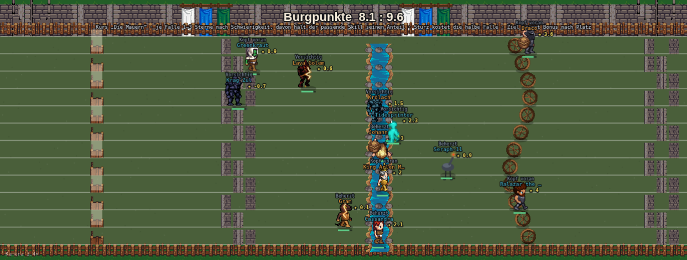
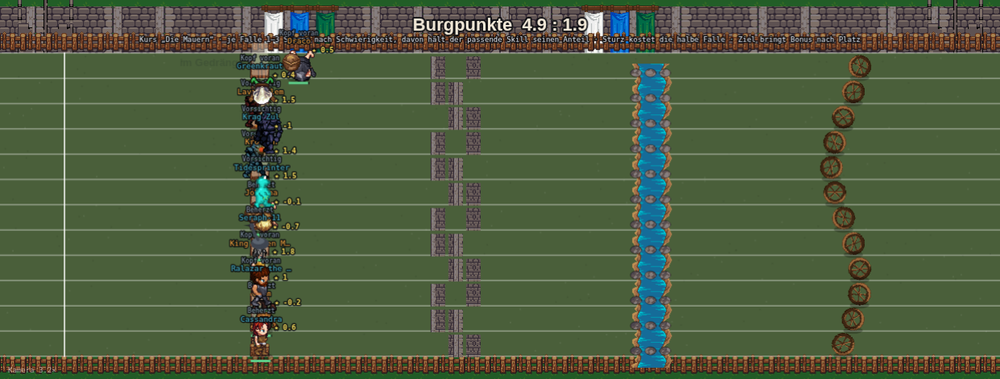

# Takeshi's Castle: Chaos am Hindernis und Outsmart — Rempler, Gedränge, Gegner lesen (Fable, 06.09.2026)

Stand: PR #810 (`eed811bf`, „Burgpunkte-Wertung, drei Kurse, zehn Fallen-Bilder", auf `origin/main`
`7cf1f09e` gemergt, in Review) und PR #811 (Routen-Entwurf, nur Doku). **Reine Recherche und Planung,
keine Zeile im Hauptcheckout geändert.** Das Konzept ist in einem eigenen Worktree auf dem Stand von
#810 prototypisiert und **kaderfest gemessen** (fünf Paarungen aus `kaderfamilie-live-save.json`,
24 Rennen je Paarung, zweimal mit anderen Renn-Saaten wiederholt); die zwei Bilder und der
Beispiel-Ticker in diesem Ordner stammen aus der laufenden Engine. Der Prototyp-Patch liegt als
`takeshi-chaos-tackle-prototyp-06-09.diff` daneben (175 Zeilen, `git apply`-fähig gegen `eed811bf`),
die Sonde als `takeshi-chaos-probe-06-09.mjs`.

Chris' Auftrag (06.09., nach dem Routen-Entwurf #811), wörtlich:

> „takeshis castle soll halt so chaotisch sein wo die leute sich tackeln rammen dann hindernisse kommen,
> jeder versucht 'zu überleben' und durch zu kommen etc. und dann verschiedene varianten wären halt geil."

und die Ergänzung, ebenfalls 06.09.:

> „fände es halt cool wenn man gegner dort auch outsmarten kann oder hindernisse, dass man damit
> schneller vorbei kommt weil takeshi ja als blaue diszi sicher auch int awareness etc braucht"

---

## 0. Die Antwort in neun Sätzen

1. **Heute gibt es in Takeshi's Castle keinen einzigen Rempler.** `BAHN_ART["takeshis-castle"]` führt
   `tackle:false` (`battle-mode.engine.js:15022` auf #810) — die eigene Kategorie heißt zwar
   `cat:"chaos"` (`:3296`), aber der Rempler-Code in `stepSpurt` wird für diese Bahn nie betreten.
   Spurt hat ihn, gedämpft auf `tackleAb:50, tackleRate:1.0` (Abschnitt 1).
2. **Die Spurt-Werte passen nicht auf Takeshi.** WUCHT heißt hier „Durchbrettern" (Charisma 38,
   Entschlossenheit 32, Torment 30) und wird durch `mengeAusEignung` auf das Eignungsniveau skaliert:
   Median 43, nur 30 % der Läufer liegen über 50. Mit der Spurt-Schwelle dürften sieben von zehn nie
   rempeln — gemessen 5 Rempler je Rennen, kaum sichtbar (Abschnitt 1.3).
3. **Die Sendung kannte Körperkontakt — aber gegen die Garde und im Pulk, nicht als Duell auf freier
   Strecke.** Longest Yard, Sumo, Devil's Domain: Kandidat gegen Takeshis Truppe. Knock Knock,
   Avalanche, das Tor: alle gleichzeitig, Gedränge an den Türen. Skipping Stones, Bridge Ball, Final
   Fall: einer nach dem anderen (Abschnitt 2). Daraus die Entscheidung: **Rempler nur im Fenster vor
   einer Falle, und Gedränge, wenn mehrere zugleich an derselben Falle ankommen.**
4. **Zwei Säulen, beide gemessen.** Säule *Chaos*: `tackleFenster` (die letzten 5 % Strecke vor jeder
   Falle), `tackleAb:30`, `tackleRate:2.0`, dazu `gedraenge` (ab zwei Mann im Umkreis ±2,5 % der
   Strecke kostet jeder weitere 0,12 s Stopp). Säule *Outsmart* (Takeshi ist im Spiel die Kategorie
   `mental`, in der Oberfläche **blau** — `foundation-format-render-helpers.ts:539`): der Kluge findet
   die Lücke im Pulk (`gedraenge.lesen`: es zählt das Bessere aus WUCHT und TECHNIK, wo Intelligence 36
   und Awareness 30 sitzen) und lässt den Rempler ins Leere laufen (`tackleAusweichen:{duell:0.35}`,
   TECHNIK des Opfers gegen WUCHT des Täters — dieselbe Form wie das bestehende `stark`).
5. **Rangtreue hält — und zwar nicht knapp.** Rezept-Kandidat kaderfest 0,860 (Saat 1337) und 0,872
   (Saat 4242) gegen Basis 0,866 / 0,826; Mittel beider Läufe 0,866 gegen 0,846. Bei 2/3/4/5 je Seite
   0,858 / 0,905 / 0,882 / 0,871. Der Star steht in 84 % der Rennen auf Rang 1 (Basis 73 %). Die
   Chaos-Kanäle belohnen WUCHT und ROBUST, und beide korrelieren mit der Eignung zu 0,85 und 0,88 —
   Rempler sind deshalb kein Rauschen, sondern ein weiterer Kanal derselben Größe (Abschnitt 4).
6. **Drei Dinge fliegen raus, weil sie messbar schaden:** Rempler, die Nerven kosten und ausscheiden
   lassen (Saison 0,937 → 0,902), ein TECHNIK-Bonus auf JEDER Falle (0,847 / 0,831 — TECHNIK
   korreliert nur 0,60 mit der Eignung und liest ohnehin schon jede Falle über den Technik-Wurf), und
   Raten über ~20 Rempler je Rennen (0,84). Die Dosis ist gemessen, nicht geschätzt (Abschnitt 3.3).
7. **Isolation: Spurt, Staffel, Zeitfahren, Klettern bit-identisch** auf dem Prototyp-Code (alle vier
   Zahlen je Bahn, Abschnitt 5) — konstruktiv, weil jede neue Weiche hinter einem Feld hängt, das nur
   Takeshi führt, und `rr()` für Spurt in exakt denselben Fällen wie vorher gerufen wird.
8. **„Verschiedene Varianten":** die drei Kurse aus #810 (Nordhof / Sumpfpfad / Die Mauern, über 24
   Saaten 9 / 9 / 6 gezogen) decken die *Fallenfolge* ab. Ein Chaos-Faktor je Kurs (`kurse[].chaos`,
   0,7 / 1,0 / 1,5) ist gebaut und gemessen unschädlich (0,859–0,861) — Empfehlung: als Nuance
   **nach** der Sichtung, nicht als vierte Achse jetzt (Abschnitt 6).
9. **Sichtbar ist es:** ein Rennen mit dem Rezept liefert im Ticker 10 × „rammt … vor der Falle um",
   5 × „sieht … kommen und lässt ihn ins Leere laufen", 3 × „steckt den Rempler weg", 9 Gedränge-Zeilen
   (eine je Falle und Pulk, statt 39 je Läufer) — und auf der Bahn den Pulk an der Falle (Bild unten).



---

## 1. Befund: was heute im Code steht

### 1.1 Die zwei Konfigurationsblöcke

| Feld | `BAHN_ART.spurt` (`:14756`) | `BAHN_ART["takeshis-castle"]` (`:15000`) |
|---|---|---|
| `tackle` | `true` | **`false`** |
| `tackleAb` | `50` (ursprünglich 36) | — |
| `tackleRate` | `1.0` (ursprünglich 2.4) | — |
| `tackleKosten` | `0` | — |
| `schatten` (Windschatten) | `true` | `false` |
| `plaene[].sucht` (Sog suchen → Spurwechsel) | 0,15 / 0,90 / 0,55 | 0 / 0 / 0 |
| WUCHT-Rezept | Torment 55, Power 42, Speed 3 („Wucht") | Charisma 38, Determination 32, Torment 30 („Durchbrettern") |
| ROBUST-Rezept | Health 28, Torment 24, Will 20, Dex 18, Aw 10 | Health 28, Will 30, Determination 24, Charisma 18 („Nehmerqualität") |
| TECHNIK-Rezept | Dex 52, Awareness 30, Determination 18 | **Intelligence 36, Awareness 30**, Dex 22, Will 12 („Falle lesen") |
| Mengenkopplung | keine (Rezept gibt Form und Menge) | `mengeAusEignung:true` — alle sieben Sub-Skills auf das Eignungsmittel skaliert |
| Ausscheiden | — | `nervenKosten:27`, Nerven = STEHEN × 2,2 |

Die Spurt-Dämpfung stammt aus PR #801: das neue Hindernis-Zeitpreis-System (`huerdePreis`) sollte
nicht „im alten Ermüdungs- und Rempler-Rauschen untergehen" (Kommentar `:14772`). Für Takeshi wurde
`tackle` nie eingeschaltet — der Block entstand mit `tackle:false` (PR #802), als noch niemand
Rempler wollte, und #810 hat daran nichts geändert.

### 1.2 Der Mechanismus in `stepSpurt` (`:15710–15746`), Schritt für Schritt

```js
const willTackeln=({draufgaenger:0.9,duellant:0.55,schleicher:0.5,opportunist:0.7,
  bollwerk:0.25,taktiker:0.3})[u.pers] ?? 0.5;
if(BA().tackle && u.tackleCd<=0 && !(u.huerde>0) && u.WUCHT>(BA().tackleAb??45)
   && rr()<willTackeln*dt*(BA().tackleRate??1.6)){
  const opfer=LAEUFER.filter(o=>o.seite!==u.seite&&o.fertig==null&&!(o.huerde>0)
    && Math.abs(o.bahnZ-u.bahnZ)<=1.6 && Math.abs(o.pos-u.pos)<0.035);
  if(opfer.length){
    const o=opfer.sort((a,b)=>b.pos-a.pos)[0];            // der Vorderste in Reichweite
    u.tackleCd=1.8; u.kraft=BA().tackleKosten??0.26; u.tackles++;
    const stark=u.WUCHT/(u.WUCHT+o.ROBUST);
    if(rr()<stark){ o.stolper=0.55+stark*0.9; o.reserve-=18; o.getackelt++; ... "räumt ... von der Bahn" }
    else            { ... "steckt den Rempler weg" }
  }
}
```

Was das im Einzelnen heißt:

1. **`tackleAb` ist eine harte Schwelle**, keine Wahrscheinlichkeit: wer weniger WUCHT hat, rempelt
   *nie*. Darüber entscheidet je Tick `willTackeln · dt · tackleRate` — für einen Duellanten bei
   Rate 1,0 und 60 Hz 0,9 % je Tick, also rund ein Versuch alle zwei Sekunden, *wenn* jemand in
   Reichweite ist.
2. **Reichweite:** Gegner (nur die andere Seite!) höchstens 3,5 % der Strecke entfernt und höchstens
   1,6 Spuren daneben. Die Spuren sind verschränkt vergeben (`bauSpurt :15308`: eigene auf 0, 2, 4 …,
   Gegner auf 1, 3, 5 …) — ein Gegner ist damit immer eine Spur weit weg, ein Mitspieler immer zwei.
   Der Filter `o.seite!==u.seite` und die Spurgeometrie sagen dasselbe.
3. **Wer im Hindernis-Stopp steht (`huerde>0`), rempelt nicht und wird nicht gerempelt** (Paket B) —
   in Takeshi ist das jeder, der gerade eine Falle nimmt.
4. **Ausgang:** `stark = WUCHT/(WUCHT+ROBUST)`, bei Erfolg 0,55–1,45 s Stolpern und 18 Reserve beim
   Opfer; der Täter zahlt 1,8 s Abklingzeit und `tackleKosten` Sekunden gebremstes Tempo (Spurt: 0).
5. **Der Boxscore zählt schon:** `tackles` / `getackelt` werden je Läufer geführt und in der
   Bahn-Serie ausgegeben (`:17934–17949`). Für Takeshi stünde da heute in jeder Zeile 0.

Nebenfund: `beschuetzer` fehlt in der `willTackeln`-Tabelle und fällt auf 0,5 — in der Kaderfamilie
sind 20 von 240 Läufereinträgen Beschützer. Harmlos, aber undokumentiert.

### 1.3 Warum die Spurt-Werte auf Takeshi nicht passen — gemessen an der Kaderfamilie

Über 240 Läufereinträge (fünf Paarungen, je 12 Läufer, vier Rennen), Takeshi-Werte nach
`mengeAusEignung`:

| Größe | min | q25 | Median | q75 | max | r zur Eignung |
|---|---:|---:|---:|---:|---:|---:|
| WUCHT (Durchbrettern) | 7 | 27 | **43** | 53 | 74 | **0,85** |
| ROBUST (Nehmerqualität) | 15 | 34 | 48 | 61 | 84 | **0,88** |
| TECHNIK (Falle lesen) | 2 | 30 | 43 | 53 | 78 | 0,60 |
| Eignung | 10,9 | 36,1 | 47,1 | 53,6 | 76,6 | 1 |

Anteil der Läufer über der Schwelle: `> 50` **30 %**, `> 40` 54 %, `> 36` 58 %, `> 30` **70 %**,
`> 20` 85 %. Persönlichkeiten: 192 Duellanten (0,55), 20 Beschützer (0,5), 16 Bollwerke (0,25),
8 Draufgänger (0,9), 4 Opportunisten (0,7).

Mit den Spurt-Werten (`tackleAb:50, tackleRate:1.0`) kommen gemessen **5,2 Rempler je Rennen** bei
zwölf Läufern zustande, davon 3,0 Treffer — im Ticker geht das zwischen 50 Fallen-Zeilen unter, und
sieben von zehn Läufern haben strukturell keinen Anteil daran. Die zwei rechten Spalten sind der
Grund, warum ein Rempler-Kanal die Rangtreue *nicht* bedroht: WUCHT gegen ROBUST ist ein Duell
zweier Größen, die beide fast dasselbe messen wie die Eignung. TECHNIK dagegen (0,60) ist der
Sub-Skill, der am wenigsten mit ihr läuft — das erklärt in Abschnitt 3.3, warum ein TECHNIK-Bonus auf
jeder Falle rho drückt.

---

## 2. Die Sendung: Körperkontakt gab es — gegen die Garde und im Pulk

Ergänzend zu #811 (Gelände, Stationen), hier nur die Frage: **wer hat wen angefasst, und liefen die
Kandidaten gleichzeitig oder nacheinander?** Quellen unten.

| Spiel | Wer gegen wen | Gleichzeitig? | Kontakt |
|---|---|---|---|
| **The Longest Yard** (ザ・ロンゲストヤード) | Kandidat gegen **Takeshis Garde** in Football-Rüstung — „seven men to avoid, women had five" | in Gruppen | Tackles durch die Garde; „if a contestant is pinned to the ground by defenders, they lose" |
| **Sumo Rings** (すもうでポン) | Kandidat gegen einen Gardisten im Ring | einzeln | Sumo — „get their opponent on the ground or out of the ring" |
| **Devil's Domain / Devil's House** | Kandidat gegen Gardisten im Labyrinth | mehrere | Gardisten „smeared black, sticky paint all over the contestants that they caught" |
| **Bridge over the Battlefield** | Kandidat gegen Gardisten auf den Walzen | einzeln | Gardisten „shove them off the track" |
| **Knock Knock** (自由への壁) | Kandidaten gegen Türen | **alle zugleich**: „All the contestants, at the same time, run full-speed at the doors" | Gedränge an den Wänden, falsche Türen prallen ab, Netze, Wasserbecken |
| **Das Tor / Aufmarsch, Avalanche, Sumo Pon-Ziehung** | Menge | alle zugleich, 86–142 Kandidaten je Folge | Pulk, Stürmen |
| **Skipping Stones, Bridge Ball, Rice Bowl, Revolving Comaneci, Final Fall** | Kandidat gegen die Falle | **einer nach dem anderen** | keiner |
| **Show Down** (カート戦) | Kandidaten gegen Takeshis Karts | alle zugleich | Wasserpistolen/Laser, kein Körperkontakt |

**Das Muster:** Kandidat-gegen-Kandidat-Kontakt war in der Sendung *nie* das Spiel — der Gegner war
die Garde oder die Falle. Was es zwischen Kandidaten gab, war das **Gedränge**: alle stürmen zugleich
auf die Türen, den Hang, das Tor. *Wipeout* macht dieselbe Trennung explizit (Qualifier „one or two at
a time", Sweeper „twelve contestants … simultaneously"), *Ninja Warrior* ist durchgehend einzeln.

**Was das für unser Spiel heißt.** Bei uns laufen zwölf Läufer zweier Vereine gleichzeitig über
vierzehn Fallen — das ist der Knock-Knock-Modus, nicht der Skipping-Stones-Modus. Chris' „tackeln,
rammen, jeder versucht zu überleben" ist deshalb am ehrlichsten so umgesetzt:

- **Rempler = Körperkontakt, aber nur dort, wo in der Sendung Körper aufeinandertrafen: vor und an
  der Falle.** Auf freier Strecke gibt es in Takeshi's Castle nichts zu gewinnen; am Engpass vor der
  Tür, dem Steg, der Wand entscheidet sich, wer zuerst durchkommt. Deshalb `tackleFenster`: der
  Rempler ist nur in den letzten 5 % Strecke vor einer Falle erlaubt.
- **Gedränge = der Pulk, der alle trifft.** Wer mit vier anderen an derselben Falle ankommt, braucht
  länger — unabhängig von der Seite. Das ist „jeder versucht zu überleben": nicht Team gegen Team,
  sondern jeder gegen die Enge.
- **Gegner oder alle?** Standard bleibt der bestehende Filter (nur die andere Seite): die Olympiade
  ist ein Vereinsspiel, die Boxscore-Spalten `tackles`/`getackelt` sind seitenweise gedacht, und ein
  Läufer, der den eigenen Mann umrennt, wäre dem Manager schwer zu erklären. „Jeder gegen jeden" ist
  als Feld gebaut (`tackleAlleSeiten` + `tackleSpur:2.6`) und gemessen tragfähig (Abschnitt 4) —
  Chris' Entscheidung, nicht meine.

---

## 3. Das Konzept: zwei Säulen

Alle Felder liegen in `BAHN_ART["takeshis-castle"]`; keine andere Bahn führt sie. Der Motor
(`stepSpurt`) liest sie hinter Weichen, die für Spurt/Staffel/Zeitfahren/Klettern wortgleich zum
alten Code auswerten — Abschnitt 5 belegt das mit Zahlen.

### 3.1 Säule Chaos — Rempler im Fenster, Gedränge an der Falle

**Rempler (`tackle:true`, `tackleAb:30`, `tackleRate:2.0`, `tackleKosten:0`, `tackleFenster:0.05`).**

```js
let tackleOk=TA.tackle && u.tackleCd<=0 && !(u.huerde>0) && u.WUCHT>(TA.tackleAb??45);
if(tackleOk && TA.tackleFenster){                       // NEU: nur vor einer Falle
  const naechste=HUERDEN_N().find(h=>h>u.pos);
  tackleOk=naechste!=null && (naechste-u.pos)<=TA.tackleFenster;
}
if(tackleOk && rr()<willTackeln*dt*(TA.tackleRate??1.6)*(bahnKursChaos||1)){ ... }
```

- Schwelle 30 statt 50: 70 % der Läufer *können* rempeln, nicht 30 %. Wer es *tut*, entscheidet
  weiter die Persönlichkeit, wie oft er trifft, das Duell WUCHT gegen ROBUST.
- Rate 2,0 statt 1,0, weil das Fenster die Gelegenheit auf ~0,45 s je Falle (56 px bei ~124 px/s)
  begrenzt: 14 Fenster × 0,45 s ≈ 6 s Rempelzeit je Rennen, gegen 1,8 s Abklingzeit. Gemessen
  **13,3 Rempler je Rennen** (1,1 je Läufer), 5,4 Treffer — gegen 5,2 / 3,0 mit Spurt-Werten und
  36,4 / 16,6 bei Schwelle 20 und Rate 4 (dann fällt rho auf 0,842, Abschnitt 4).
- Ticker: „*Johanna rammt Tidesprinter vor der Falle um.*" / „*Tidesprinter steckt den Rempler weg.*"
  Schwebetext am Opfer „gerammt".

**Gedränge (`gedraenge:{radius:0.025, frei:1, preis:0.12, lesen:true, melden:2}`).** Beim Erreichen
einer Falle (`vor<h && u.pos>=h`, also genau dort, wo der Zeitpreis gesetzt wird):

```js
const andere=LAEUFER.filter(o=>o!==u&&o.fertig==null&&Math.abs(o.pos-h)<=G.radius).length;
const extra=Math.max(0,andere-G.frei);
if(extra>0){
  const schieb=G.lesen?Math.max(u.WUCHT,u.TECHNIK):u.WUCHT;   // s. 3.2
  const preis=G.preis*extra*(1-0.8*schieb/100)*(bahnKursChaos||1);
  u.huerde+=preis; ...
}
```

- Ein Mitläufer im Umkreis ±2,5 % der Strecke ist frei (`frei:1`), jeder weitere kostet bis zu
  0,12 s zusätzlichen Stopp, gemindert um bis zu 80 % durch den, der sich durchschiebt.
- Beide Seiten zählen — der Pulk kennt keine Vereine. Kein `rr()`-Aufruf: die Zufallsfolge aller
  Bahnen bleibt unberührt.
- Gemessen **85 Gedränge-Ereignisse je Rennen** (von 168 Fallen-Durchgängen), im Mittel **1,9 s je
  Läufer und Rennen** — spürbar, nicht dominant (ein Fallen-Stopp kostet bei Skill 43 ~0,52 s, mal 14).
- Ticker **einmal je Falle und Pulk** (ab `melden:2` Mitläufern): „*Gedränge an Falle 3 — 5 Mann an
  einer Stelle, Seraph-11 mittendrin.*" — je Läufer gemeldet waren es 39 Zeilen in einem Rennen, ohne
  Schwelle über 80. Schwebetext „im Gedränge" bleibt je Läufer.

### 3.2 Säule Outsmart — die blaue Disziplin liest Gegner und Pulk

Takeshi ist im Spiel `category: "mental"` (`lib/data/dataAdapter.ts:68`), Farbe blau
(`foundation-format-render-helpers.ts:539`, `season-discipline-schedule.ts:149`), Bereichsgruppe
MEN neben Schach, Tennis, I-Spy, Wettessen (`season-discipline-area-groups.ts:89`). In der Matrix
stehen Intelligence 11 und Awareness 8 — zusammen 19 Punkte, mehr als Torment, Stamina, Dexterity,
Health und Speed zusammen. **Beide erreichen den Motor heute nur über TECHNIK** („Falle lesen":
Intelligence 36, Awareness 30, Dex 22, Will 12), und TECHNIK wirkt an zwei Stellen:

- am **Technik-Wurf jeder Falle** (`:15647`: `0,26 + TECHNIK · 0,006` — Skill 43 kommt zu 52 %
  sauber drüber, Skill 78 zu 73 %), und
- am **Zeitpreis der vier TECHNIK-Fallen** (Labyrinth, Eis; `hSkill=u[hTyp]`).

Das ist die Säule „Hindernisse outsmarten" — sie **existiert schon** und trägt (die 0,866 sind mit
ihr gemessen). Was fehlt, ist „**Gegner** outsmarten". Zwei Kanäle, beide in derselben Größe TECHNIK,
ohne dritte Wertformel:

**Die Lücke im Pulk (`gedraenge.lesen:true`).** Im Gedränge zählt das Bessere aus WUCHT und TECHNIK:
der Bulle schiebt sich durch, der Kluge sieht die Lücke. Gemessen ist genau das der Unterschied
zwischen 0,857 (Gedränge nur mit WUCHT) und **0,878** (mit `lesen`) — der einzige Einzelschalter im
ganzen Versuch, der rho *hebt*.

**Den Rempler kommen sehen (`tackleAusweichen:{duell:0.35}`).** Bevor das Duell WUCHT gegen ROBUST
fällt, darf das Opfer ausweichen:

```js
const ausw=TA.tackleAusweichen.duell*(o.TECHNIK||0)/((o.TECHNIK||0)+u.WUCHT||1);
if(TA.tackleAusweichen && rr()<Math.min(0.75,ausw)){   // eigener rr() NUR hinter dem Feld
  o.ausgewichen++; feed(o.seite,o.n+" sieht "+u.n+" kommen und lässt ihn ins Leere laufen."); ...
} else { const stark=u.WUCHT/(u.WUCHT+o.ROBUST); ... }
```

Dieselbe Form wie `stark`, nur andersherum: TECHNIK des Opfers gegen WUCHT des Täters, mal 0,35 —
bei gleichen Werten 17,5 %, ein Kluger gegen einen Schwachen bis 26 %. Der Täter zahlt Abklingzeit
und Kraft trotzdem — er ist ins Leere gelaufen. Gemessen **2,3 Ausweicher je Rennen** neben 5,4
Treffern und 5,6 „steckt weg". Eine *lineare* Fassung (`basis 0,05 + TECHNIK · 0,006`, 4,9 Ausweicher)
kostete 0,017; die Duell-Fassung liegt in beiden Saaten innerhalb des Rauschens (Abschnitt 4).

Was ich **nicht** empfehle, obwohl es naheliegt: „Fake-Bewegungen" oder ein eigener
Ausweich-Spurwechsel. Der Spurwechsel-Code (`:15546–15570`) wechselt bei Takeshi nie freiwillig
(`sucht:0`), und ein neuer Bewegungs-Zustand wäre ein zweiter Codepfad für etwas, das die
Ausweich-Chance oben in einer Zeile erledigt — mit Ticker-Zeile und Schwebetext, also sichtbar.

### 3.3 Was draußen bleibt — und warum (gemessen, nicht gemeint)

| Idee | Feld | rho/Spiel | Saison | Urteil |
|---|---|---:|---:|---|
| Rempler kosten Nerven, können ausscheiden lassen | `tackleNerven:0.5` | 0,840 | **0,902** (Basis 0,937) | raus — die Validität sinkt, weil ein Ausscheiden durch fremde Hand nicht die eigene Eignung misst |
| TECHNIK spart Stopp an JEDER Falle | `lesenBonus:0.25` / `0.40` | 0,847 / 0,831 | 0,944 / 0,902, Spannweite 0,154 / 0,175 | raus — TECHNIK korreliert nur 0,60 mit der Eignung; wer ihn auf 14 Fallen legt, gewichtet ihn über die Matrix (11+8) hinaus |
| Mehr Rempler (Rate 3–4, Abklingzeit 1,2, Schwelle 20) | `tackleRate:3–4`, `tackleCd:1.2`, `tackleAb:20` | 0,840–0,856 | 0,909–0,951 | zu viel — ab ~20 Remplern je Rennen wird der Kanal lauter als die Fallen |
| Alles auf einmal (Fenster + Ausweichen linear + Gedränge + lesenBonus) | R1 | 0,825 | 0,923 | raus — die zwei schädlichen Stücke addieren sich |
| Weiteres Fenster (8 %) | `tackleFenster:0.08` | 0,867 | 0,951 | möglich, 17 Rempler je Rennen; 5 % ist die Fassung, die „vor der Falle" wörtlich nimmt |
| Stärkeres Gedränge (Radius 3 %, 0,18 s) | | 0,862 | 0,930 | möglich, 2,9 s je Läufer; unnötig laut |

---

## 4. Messungen — kaderfest, zwei Saatensätze, vier Kadergrößen

Sonde: `takeshi-chaos-probe-06-09.mjs` (dieselbe Rechnung wie `miss-alle-disziplinen.mjs`, Median
und Spannweite über die fünf Paarungen, dazu die Chaos-Diagnose aus `u.tackles/getackelt/
ausgewichen/gedraengt`). Kader: `live-save` (Oly New Game Custom 19.8.2026, gezogen 03.09.).
`V0` ist der unveränderte #810-Stand und reproduziert dessen Zahl bit-identisch (0,866 / 0,126 /
0,937 / 0,056).

### 4.1 Saat 1337 (die Standard-Saaten der Abnahme)

| Variante | rho/Spiel | Spannw. | Saison | Spannw. | Rempler/Rennen | Treffer | Ausw. | Gedränge/Rennen | s/Läufer | raus % | Star #1 |
|---|---:|---:|---:|---:|---:|---:|---:|---:|---:|---:|---:|
| **V0** Basis #810 (`tackle:false`) | **0,866** | 0,126 | 0,937 | 0,056 | 0 | 0 | 0 | 0 | 0 | 25,8 | 73 % |
| A Spurt-Werte 1:1 (Ab 50, Rate 1,0) | 0,859 | 0,095 | 0,944 | 0,070 | 5,2 | 3,0 | 0 | 0 | 0 | 27,0 | 72 % |
| B Spurt-Urwerte (Ab 36, Rate 2,4) | 0,862 | 0,164 | 0,944 | 0,042 | 20,4 | 10,0 | 0 | 0 | 0 | 26,0 | 73 % |
| C Fenster 5 %, Ab 30, Rate 2,0 | 0,871 | 0,119 | 0,951 | 0,084 | 16,5 | 8,1 | 0 | 0 | 0 | 26,4 | 78 % |
| C2 wie C, Rate 4,0 | 0,840 | 0,111 | 0,951 | 0,084 | 24,8 | 12,2 | 0 | 0 | 0 | 27,5 | 77 % |
| C3 Ab 20, Rate 4,0, Cd 1,2 | 0,842 | 0,066 | 0,937 | 0,056 | 36,4 | 16,6 | 0 | 0 | 0 | 24,7 | 83 % |
| D wie C, `tackleAlleSeiten` | 0,871 | 0,119 | 0,951 | 0,084 | 16,5 | 8,1 | 0 | 0 | 0 | 26,4 | 78 % |
| D2 wie D, `tackleSpur:2.6` | 0,851 | 0,074 | 0,944 | 0,070 | 25,6 | 12,1 | 0 | 0 | 0 | 26,4 | 70 % |
| E nur Gedränge (WUCHT) | 0,867 | 0,076 | 0,944 | 0,049 | 0 | 0 | 0 | 84,8 | 2,24 | 25,6 | 71 % |
| F = C + E | 0,857 | 0,123 | 0,944 | 0,070 | 14,0 | 6,8 | 0 | 84,5 | 2,13 | 24,7 | 80 % |
| G = F + Nerven 0,5 | 0,840 | 0,114 | **0,902** | 0,091 | 13,6 | 6,6 | 0 | 83,5 | 2,11 | 27,8 | 78 % |
| H = F + Chaos je Kurs 0,7/1,0/1,5 | 0,861 | 0,080 | 0,944 | 0,056 | 13,1 | 6,1 | 0 | 82,7 | 2,19 | 25,4 | 83 % |
| O1 = C + Ausweichen linear | 0,854 | 0,110 | 0,930 | 0,077 | 16,6 | 5,7 | 4,9 | 0 | 0 | 26,0 | 73 % |
| **O2 = C + Gedränge mit `lesen`** | **0,878** | 0,108 | 0,923 | 0,091 | 13,5 | 6,5 | 0 | 86,3 | 1,91 | 26,3 | 76 % |
| O3 `lesenBonus` 0,25 / 0,40 | 0,847 / 0,831 | 0,098 / 0,103 | 0,944 / 0,902 | 0,154 / 0,175 | 0 | 0 | 0 | 0 | 0 | 26,0 | 78 / 71 % |
| P1 = O2 + Ausweichen linear schwach | 0,860 | 0,081 | 0,930 | 0,063 | 13,4 | 5,4 | 2,4 | 85,2 | 1,95 | 26,9 | 84 % |
| P2 = O2 + Ausweichen linear | 0,846 | 0,096 | 0,923 | 0,098 | 13,2 | 4,6 | 4,0 | 86,8 | 1,97 | 26,4 | 78 % |
| P6 = O2 + jeder gegen jeden (`tackleSpur:2.6`) | 0,868 | 0,081 | 0,944 | 0,070 | 22,0 | 10,4 | 0 | 88,0 | 2,02 | 25,5 | 72 % |
| P9 = O2, Fenster 8 % | 0,867 | 0,132 | 0,951 | 0,035 | 17,3 | 8,6 | 0 | 85,7 | 1,85 | 24,9 | 78 % |
| **P10 = O2 + Ausweichen Duell 0,35 — das Rezept** | **0,860** | 0,095 | 0,944 | 0,063 | 13,3 | 5,4 | 2,3 | 85,7 | 1,96 | 26,3 | **84 %** |
| P11 Duell 0,25 | 0,862 | 0,110 | 0,923 | 0,063 | 13,4 | 5,7 | 1,6 | 85,8 | 1,95 | 26,0 | 80 % |
| P12 Duell 0,50 | 0,857 | 0,078 | 0,951 | 0,056 | 13,3 | 5,1 | 3,3 | 85,9 | 1,95 | 26,0 | 82 % |
| R1 alles inkl. `lesenBonus` | 0,825 | 0,077 | 0,923 | 0,098 | 12,9 | 4,6 | 3,9 | 84,4 | 1,88 | 26,8 | 69 % |

„Star #1": Anteil der Rennen, in denen der eignungsbeste Läufer die höchste Wertung hat (die
Abnahmefrage aus `CLAUDE.md`, Abschnitt „Was rho drückt, ist oft gar kein Fehler").

Zwei Befunde, die die Tabelle trägt: **D ist bit-identisch zu C** — `tackleAlleSeiten` allein tut
nichts, weil eigene Läufer zwei Spuren auseinander starten und der Filter 1,6 Spuren reicht; erst
`tackleSpur:2.6` macht „jeder gegen jeden" real (D2, P6). Und **D3 (Gegner, Spur 2,6) ist ebenfalls
identisch zu C**: Gegner sind eine oder drei Spuren entfernt, 2,6 fängt nichts Neues.

### 4.2 Replikat mit Saat 4242 — wie groß ist das Saat-Rauschen?

| Variante | rho/Spiel | Spannw. | Saison | Rempler | Treffer | Ausw. | Star #1 | Mittel beider Saaten |
|---|---:|---:|---:|---:|---:|---:|---:|---:|
| V0 Basis | **0,826** | 0,106 | 0,923 | 0 | 0 | 0 | 73 % | **0,846** |
| C | 0,845 | 0,123 | 0,951 | 17,3 | 8,7 | 0 | 78 % | 0,858 |
| O2 | 0,863 | 0,103 | 0,958 | 13,7 | 6,8 | 0 | 73 % | 0,871 |
| P1 | 0,864 | 0,099 | 0,944 | 13,1 | 5,2 | 2,3 | 79 % | 0,862 |
| P6 jeder gegen jeden | **0,881** | 0,070 | 0,916 | 21,8 | 10,8 | 0 | 75 % | 0,875 |
| **P10 Rezept** | **0,872** | 0,099 | 0,944 | 13,4 | 5,4 | 2,3 | 79 % | **0,866** |

Die Basis selbst schwankt zwischen den Saatensätzen um 0,040 — mehr als jeder Unterschied zwischen
den Kandidaten. Mit den zweiten Saaten liegt **jede** Chaos-Variante über der Basis. Ehrlich gelesen:
die zwei Säulen kosten Rangtreue **nicht**; ob sie 0,01 bringen, ist nicht entscheidbar. Was
entscheidbar ist: die drei verworfenen Stücke (3.3) liegen in beiden Saaten unten.

### 4.3 Kadergröße (Saat 1337; der Saisonplan würfelt 2 bis 6 je Seite, `dataAdapter` führt 4)

| je Seite | Teilnehmer | #810 Basis | O2 | **P10 Rezept** | Spannweite P10 |
|---|---:|---:|---:|---:|---:|
| 2 | 4 | 0,842 | 0,840 | **0,858** | 0,490 |
| 3 | 6 | 0,902 | 0,900 | **0,905** | 0,182 |
| 4 | 8 | — | 0,885 | **0,882** | 0,147 |
| 5 | 10 | 0,882 | 0,891 | **0,871** | 0,146 |
| 6 | 12 | 0,866 | 0,878 | **0,860** | 0,095 |

Über 0,80 bei jeder Kadergröße; bei zwei je Seite dieselbe riesige Spannweite wie in #810 (vier
Läufer, ein Paar Ausscheider kippt alles) — das ist die Kadergröße, nicht das Rezept.

---

## 5. Isolation — die anderen Bahnen und die anderen 19 Disziplinen

**Konstruktiv.** Jede neue Zeile in `stepSpurt` hängt hinter einem Feld, das nur
`BAHN_ART["takeshis-castle"]` führt: `tackleFenster`, `tackleAlleSeiten`, `tackleSpur`,
`tackleNerven`, `tackleCd`, `tackleAusweichen`, `gedraenge`, `kurse[].chaos`. Für Spurt gilt
`tackleOk` Zeichen für Zeichen wie die alte Bedingung, `(bahnKursChaos||1)` ist 1,
`TA.tackleSpur??1.6` ist 1,6, `TA.tackleCd??1.8` ist 1,8 — und `rr()` wird in genau denselben Fällen
gerufen wie vorher, in derselben Reihenfolge. Das Gedränge ruft `rr()` gar nicht. Das ist der Grund,
warum die Zufallsfolge aller anderen Bahnen unverändert bleibt, bevor man misst.

**Gemessen, Prototyp-Code mit unveränderten Takeshi-Feldern** (`miss-alle-disziplinen.mjs 24 spurt
staffel time-trial climbing`), gegen die #810-Tabelle:

| Disziplin | #810 rho/Spiel | Spannw. | Saison | Spannw. | Prototyp rho/Spiel | Spannw. | Saison | Spannw. |
|---|---:|---:|---:|---:|---:|---:|---:|---:|
| staffel | 0,915 | 0,089 | 0,951 | 0,093 | 0,915 | 0,089 | 0,951 | 0,093 |
| spurt | 0,871 | 0,236 | 0,905 | 0,190 | 0,871 | 0,236 | 0,905 | 0,190 |
| time-trial | 0,867 | 0,050 | 0,909 | 0,056 | 0,867 | 0,050 | 0,909 | 0,056 |
| climbing | 0,790 | 0,192 | 0,851 | 0,308 | 0,790 | 0,192 | 0,851 | 0,308 |

Bit-identisch, alle sechzehn Zahlen. **Spurt bleibt bei `tackleAb:50, tackleRate:1.0`** — der
Takeshi-Rempler lebt in Takeshi-Feldern, nicht in einer gemeinsamen Konstante.

**Alle zwanzig mit dem Rezept in der Datei** (zweiter Worktree, Rezeptblock aus Abschnitt 8 in
`BAHN_ART["takeshis-castle"]` eingetragen, `miss-alle-disziplinen.mjs 24`):

| Disziplin | Chassis | #810 rho/Spiel | Spannw. | Saison | Rezept rho/Spiel | Spannw. | Saison | Spannw. | Bewegung |
|---|---|---:|---:|---:|---:|---:|---:|---:|---|
| staffel | bahn | 0,915 | 0,089 | 0,951 | 0,915 | 0,089 | 0,951 | 0,093 | — |
| speed-schach | buehne | 0,889 | 0,060 | 0,979 | 0,889 | 0,060 | 0,979 | 0,021 | — |
| gewichtheben | buehne | 0,887 | 0,224 | 0,944 | 0,887 | 0,224 | 0,944 | 0,261 | — |
| showcase | buehne | 0,880 | 0,140 | 0,944 | 0,880 | 0,140 | 0,944 | 0,063 | — |
| spurt | bahn | 0,871 | 0,236 | 0,905 | 0,871 | 0,236 | 0,905 | 0,190 | — |
| time-trial | bahn | 0,867 | 0,050 | 0,909 | 0,867 | 0,050 | 0,909 | 0,056 | — |
| **takeshis-castle** | bahn | **0,866** | 0,126 | 0,937 | **0,860** | 0,095 | 0,944 | 0,063 | Rezept 8.1 (P10), innerhalb der Spannweite; Saat 4242: 0,872 |
| wettessen | buehne | 0,844 | 0,233 | 0,916 | 0,844 | 0,233 | 0,916 | 0,126 | — |
| fechten | buehne | 0,840 | 0,230 | 0,874 | 0,840 | 0,230 | 0,874 | 0,252 | — |
| tennis | buehne | 0,814 | 0,176 | 0,839 | 0,814 | 0,176 | 0,839 | 0,294 | — |
| breaking | buehne | 0,801 | 0,114 | 0,874 | 0,801 | 0,114 | 0,874 | 0,119 | — |
| climbing | bahn | 0,790 | 0,192 | 0,851 | 0,790 | 0,192 | 0,851 | 0,308 | — |
| basketball | feldspiel | 0,772 | 0,088 | 0,923 | 0,772 | 0,088 | 0,923 | 0,231 | — |
| eiskunstlauf | buehne | 0,757 | 0,125 | 0,958 | 0,757 | 0,125 | 0,958 | 0,091 | — |
| i-spy | buehne | 0,692 | 0,384 | 0,727 | 0,692 | 0,384 | 0,727 | 0,441 | — |
| hockey (nur Feldspieler 0,719) | feldspiel | 0,669 | 0,181 | 0,832 | 0,669 | 0,181 | 0,832 | 0,259 | — |
| football | feldspiel | 0,516 | 0,172 | 0,811 | 0,516 | 0,172 | 0,811 | 0,168 | — |
| battlefield | arena | 0,387 | 0,938 | 0,595 | 0,387 | 0,938 | 0,595 | 1,095 | — |
| tdm | arena | 0,253 | 0,328 | 0,217 | 0,253 | 0,328 | 0,217 | 0,308 | — |
| mini-dm | arena | 0,094 | 0,697 | 0,071 | 0,094 | 0,697 | 0,071 | 0,786 | — |

Die #810-Spalten sind die „nachher"-Werte aus der PR-Beschreibung von #810; **alle 19 anderen
Zeilen sind ziffernidentisch**, einschließlich Spurt (0,871 / 0,236 / 0,905 / 0,190) und der
Hockey-Feldspielerzeile. Die Takeshi-Zeile ist die einzige, die sich bewegt — um −0,006 bei einer
Spannweite von 0,095, und im Replikat mit anderen Saaten um +0,046 (Abschnitt 4.2). Rohbericht:
`node scripts/miss-alle-disziplinen.mjs 24` im Rezept-Worktree, keine Seitenfehler.

---

## 6. „Verschiedene Varianten" — was die Kurse schon abdecken, und was nicht

**Was #810 hat:** drei benannte Kurse als Fallen*folge* — Nordhof, Sumpfpfad, Die Mauern —, je Saat
gewählt (über die 24 Mess-Saaten 9 / 9 / 6; Nebenfund: benachbarte Saaten ziehen denselben Kurs,
Folge `DDDDNNNNNSSSSSDDDDDNNNNS`, weil die oberen LCG-Bits sich bei Saatabstand 7919 langsam bewegen —
für das Spiel egal, solange die Renn-Saat nicht aus einem Zähler kommt). Jeder Kurs ist dieselbe
Multimenge von 14 Fallen, anders sortiert; Bilder wechseln mit dem Typ.

**Was #811 vorschlägt:** Weg C — drei Wegpunkt-Listen über dasselbe Gelände, „Sumpfpfad geht zweimal
über den See, Die Mauern länger durch den Holzhof". Damit unterscheiden sich die Kurse auch im *Bild*,
nicht nur in der Fallenfolge.

**Was Chris meinen könnte, meine Einschätzung:** Sein Satz steht direkt hinter „chaotisch … tackeln
… überleben" — „verschiedene Varianten" heißt in diesem Zusammenhang eher **verschiedene Rennen, die
sich verschieden anfühlen**, als nur verschiedene Reihenfolgen derselben Fallen. Drei Stücke dazu:

1. **Fallenfolge** — hat #810. Reicht für „nicht immer dasselbe".
2. **Route und Gelände je Kurs** — #811 Weg C. Das ist der größte Sprung in der Wiedererkennbarkeit
   („der Sumpfpfad") und kostet nichts an der Mechanik.
3. **Chaos-Intensität je Kurs** — hier gebaut als `kurse[].chaos`, ein Faktor auf `tackleRate` und
   `gedraenge.preis`, im Motor über `bahnKursChaos` gelesen (in `bauSpurt` beim Kurs-Zug gesetzt).
   Gemessen mit 0,7 / 1,0 / 1,5 (Nordhof ruhig, Sumpfpfad normal, Die Mauern wild): H 0,861, P5
   0,859, R4 0,839 — alles innerhalb der Spannweite, mit Star #1 83–85 %. **Technisch drei Zeilen,
   mechanisch unschädlich.**

**Empfehlung:** 1 und 2 sind die „Varianten", die man *sieht*. 3 erst, wenn Chris das Grund-Chaos
im Spiel gesehen hat — sonst stellt man drei Regler ein, bevor der erste steht. Wenn ja: „Die
Mauern" 1,5 (es sind die Knock-Knock-Türen, das Gedränge-Spiel der Sendung), „Nordhof" 0,7 (die
Wasser-Fallen, in der Sendung einzeln gelaufen), „Sumpfpfad" 1,0. Der Kursname steht schon im Kopf
der Bühne — „Die Mauern: heute wird geschubst" wäre eine Zeile Ansage.

---

## 7. Sichtbarkeit — Ticker und Bühne

Ein Rennen mit dem Rezept (Saat des Mockups, Kurs „Die Mauern", `takeshi-chaos-ticker-beispiel-06-09.txt`,
124 Zeilen):

```
0:00 King Arlen Morgolor sieht Ralazar the Balanced kommen und lässt ihn ins Leere laufen.
0:00 Lava Golem rammt Greenkraut vor der Falle um.
0:01 Gedränge an Falle 1 — 11 Mann an einer Stelle, Draco mittendrin.
0:01 King Arlen Morgolor rammt Seraph-11 vor der Falle um.
0:04 Gedränge an Falle 2 — 4 Mann an einer Stelle, Draco mittendrin.
0:06 King Arlen Morgolor steckt den Rempler weg.
0:07 Seraph-11 sieht Johanna kommen und lässt ihn ins Leere laufen.
0:07 Gedränge an Falle 3 — 5 Mann an einer Stelle, Seraph-11 mittendrin.
0:09 Seraph-11 rammt King Arlen Morgolor vor der Falle um.
...
0:39 Greenkraut scheidet aus — Nerven am Ende nach 5 Stürzen bei 70 % der Strecke.
```

Zählung: **10 × rammt, 5 × ins Leere, 3 × steckt weg, 9 Gedränge-Zeilen, 51 Fallen-Zeilen
(stolpert / reißt / mit Gewalt), 2 × ausgeschieden.** Das Chaos ist ein Viertel des Tickers — laut
genug, um es zu lesen, leise genug, dass die Fallen die Geschichte bleiben.

Auf der Bühne: der Pulk an Falle 1 (elf Mann, Bild unten) und an den Trittsteinen (oben) sind auf dem
#810-Rechteck schon zu sehen — auf der Route aus #811 werden sie zum Bild, das Chris meint: alle auf
einem Weg, an der Engstelle stauen sie sich, einer räumt einen anderen weg. `tackleFenster` arbeitet
auf `u.pos`, also genau dort, wo #811 die Fallen-Fähnchen setzt; die Schwebetexte „gerammt" / „weicht
aus" / „im Gedränge" hängen an `_laeufer` und wandern mit `laeuferXY` mit. Nichts in diesem Plan
berührt den Zeichenpfad.



Bahn-Serie/Boxscore: `tackles` und `getackelt` je Läufer gibt es dort schon (`:17934–17949`);
`ausgewichen` und `gedraengt` sind zwei Spalten mehr, gleiche Stelle.

---

## 8. Das Rezept — Werte, Ort, Schritte, Abnahme

Zeilen beziehen sich auf `public/mockups/battle-mode.engine.js` auf `eed811bf` (#810); die
Umsetzung setzt auf #810 auf.

### 8.1 Der Block (`BAHN_ART["takeshis-castle"]`, `:15022`, ersetzt `tackle:false`)

```js
      hindernisWort:"Falle", boden:"#4a5f3a", schatten:false,
      // CHAOS AM HINDERNIS + OUTSMART (Chris 06.09., docs/design/takeshi-chaos-tackle-plan-06-09.md).
      // Rempler nur im Fenster vor einer Falle (tackleFenster), Schwelle 30 statt Spurts 50 (WUCHT
      // ist hier "Durchbrettern", Median 43); Gedraenge, wenn mehrere zugleich an einer Falle
      // ankommen — der Kluge (TECHNIK: Intelligence/Awareness) findet die Luecke, der Bulle (WUCHT)
      // schiebt sich durch; das Opfer darf den Rempler kommen sehen (tackleAusweichen, Duell
      // TECHNIK gegen WUCHT). Kaderfest (n=24): 0,860 / 0,872 in zwei Saatensaetzen gegen Basis
      // 0,866 / 0,826; Star auf Rang 1 in 84 % der Rennen (Basis 73 %). Spurt fuehrt keines der
      // Felder und bleibt bit-identisch.
      tackle:true, tackleAb:30, tackleRate:2.0, tackleKosten:0, tackleFenster:0.05,
      tackleAusweichen:{duell:0.35},
      gedraenge:{radius:0.025, frei:1, preis:0.12, lesen:true, melden:2},
```

Bewusst **nicht** gesetzt: `tackleNerven`, `lesenBonus`, `tackleAlleSeiten`/`tackleSpur`,
`kurse[].chaos` (Abschnitt 3.3 und 6; die Felder bleiben im Motor verfügbar).

### 8.2 Die Schritte

| # | Schritt | Ort (#810) | Umfang |
|---|---|---|---|
| 1 | Zustand: `bahnKursChaos`, `bahnGedraengeGemeldet` neben `bahnFallenTypen`; in `bauSpurt` zurücksetzen, `kurs.chaos` mitlesen | `:15135`, `:15190–15196` | 4 Zeilen, Diff Block A |
| 2 | Gedränge im Fallen-Durchgang, direkt nach dem Fallen-Protokoll (`u.fallen.push`) | `:15645` | 18 Zeilen, Diff Block B |
| 3 | Rempler: `tackleOk` mit Fenster, `(bahnKursChaos‖1)`, Opferfilter mit `tackleSpur`/`tackleAlleSeiten`, `tackleCd`, Ausweichen vor dem Duell, `tackleNerven`-Zweig, neue Ticker-Texte | `:15724–15746` | 40 Zeilen, Diff Block C |
| 4 | Block 8.1 in `BAHN_ART["takeshis-castle"]` | `:15022` | 12 Zeilen |
| 5 | Boxscore-Spalten `ausgewichen`, `gedraengt` in der Bahn-Serie | `:17934–17949` | 4 Zeilen |
| 6 | Sichtprüfung im Spiel: ein Rennen je Kurs, Ticker lesen, Schwebetexte am Pulk | Playwright, `takeshi-chaos-ticker-06-09.mjs` | Screenshots in den PR |
| 7 | Abnahme: `miss-alle-disziplinen.mjs 24` — Takeshi ≥ 0,80, die 19 anderen bit-identisch zu #810; dazu `--je-seite=2`, `3`, `5` | — | ein Lauf |

**Nicht in die Umsetzung übernehmen:** die zwei Mess-Haken im Diff (`bahnArtSetzen`/`bahnArtLesen`
in `window.__arena`, das `diag`-Feld in `disziplinProbe`) — sie sind für die Sonde da. Wer sie
behalten will, hat damit ein Werkzeug, das jede Bahn-Konstante ohne Datei-Edit durchmisst; sie sind
additiv und lesen nur.

Gesamt für 1–7: **ein halber Tag**, mit dem Diff als Vorlage. `lesenBonus`, `tackleNerven`,
`tackleAlleSeiten`, `tackleSpur`, `kurse[].chaos` können im Motor bleiben (kosten nichts, sind
gemessen) oder rausfallen — Geschmack.

**Reihenfolge:** #810 zuerst mergen (Kurse, `takeshi:true`, Fallen-Protokoll — das Gedränge hängt
sich an `u.fallen.push`). #811 ist unabhängig davon: die Route berührt nur den Zeichenpfad, dieser
Plan nur den Motor. Beide können parallel umgesetzt werden.

---

## 9. Offene Entscheidungen für Chris

1. **Gegner oder jeder gegen jeden?** Standard: nur die andere Seite (Vereinslogik, Boxscore). „Jeder
   gegen jeden" (`tackleAlleSeiten:true, tackleSpur:2.6`) misst 0,868 / 0,881 mit 22 Remplern je Rennen
   — tragfähig, aber dann rennt Krolach auch Johanna um.
2. **Ausweichen ja (P10) oder nein (O2)?** Beide innerhalb des Rauschens. P10 hat die Ticker-Zeile
   „sieht ihn kommen" — das ist die sichtbare Antwort auf „Gegner outsmarten". Empfehlung: ja.
3. **Chaos je Kurs** (Abschnitt 6, Punkt 3): jetzt oder nach der Sichtung? Empfehlung: danach.
4. **Ticker-Dichte:** `melden:2` gibt ~9 Gedränge-Zeilen je Rennen; `melden:3` etwa die Hälfte.
5. **Wörter:** „rammt … um" / „lässt ihn ins Leere laufen" / „Gedränge an Falle n" — oder Chris'
   eigene.

---

## Anhang A — der Prototyp-Patch

`takeshi-chaos-tackle-prototyp-06-09.diff`, 175 Zeilen, gegen `eed811bf` (#810):

```sh
git worktree add /tmp/takeshi-chaos eed811bf
cd /tmp/takeshi-chaos
git apply <repo>/docs/design/takeshi-chaos-tackle-prototyp-06-09.diff
```

Der Patch enthält den Motor (Blöcke A–C) und die Mess-Haken, **nicht** den Rezeptblock 8.1 — die
Felder wurden in der Messung zur Laufzeit gesetzt (`bahnArtSetzen`), damit eine Browser-Sitzung alle
Varianten fährt. Für die Isolation über alle zwanzig wurde der Block in einem zweiten Worktree in die
Datei geschrieben.

## Anhang B — die Sonde

```sh
node docs/design/takeshi-chaos-probe-06-09.mjs <worktree> 24                 # alle Varianten
node docs/design/takeshi-chaos-probe-06-09.mjs <worktree> 24 V0_basis P10_O2_duell35
SAAT0=4242 node docs/design/takeshi-chaos-probe-06-09.mjs <worktree> 24 V0_basis P10_O2_duell35   # Replikat
JE_SEITE=2,3,4,5 node docs/design/takeshi-chaos-probe-06-09.mjs <worktree> 24 P10_O2_duell35     # Kadergroesse
node docs/design/takeshi-chaos-ticker-06-09.mjs <worktree>/public <out> '<json-felder>'          # Ticker + Bilder
```

Die Sonde braucht die Mess-Haken aus dem Patch; die Rho-Rechnung ist `scripts/lib/rangtreue-messung.mjs`,
also dieselbe wie in der Abnahme.

## Quellen

- Wikipedia (en): *Takeshi's Castle* — 86–142 Kandidaten je Folge; Longest Yard („defenders wearing
  large foam football costumes … if a contestant is pinned to the ground by defenders, they lose"),
  Devil's Domain (Farbe), Bridge over the Battlefield („shove them off the track"), Sumo Pon, Show
  Down. <https://en.wikipedia.org/wiki/Takeshi%27s_Castle>
- Keshipedia (Fandom): *Knock Knock (v2)* — „All the contestants, at the same time, run full-speed at
  the doors"; *The Longest Yard* — „seven men to avoid, women had five"; *Sumo Rings*; *Show Down
  (v1/v2)*. <https://takeshi.fandom.com/wiki/Knock_Knock_(v2)>, <https://takeshi.fandom.com/wiki/Sumo_Rings>,
  <https://takeshi.fandom.com/wiki/Show_Down_(v2)> (aus der Agenten-Umgebung nur über Suchauszüge
  lesbar, 402/403 beim Direktabruf; Zitate aus den Auszügen.)
- Sasukepedia: *List of challenges in Takeshi's Castle*.
  <https://sasukepedia.fandom.com/wiki/List_of_challenges_in_Takeshi's_Castle>
- Wipeout Wiki: *Qualifier* („one (or two) at a time"), *Sweeper* („twelve contestants …
  simultaneously"). <https://abcwipeout.fandom.com/wiki/Qualifier>, <https://abcwipeout.fandom.com/wiki/Sweeper>
- Sasukepedia: *American Ninja Warrior* — Einzelläufe. <https://sasukepedia.fandom.com/wiki/American_Ninja_Warrior>
- `docs/design/takeshi-schlammroute-plan-06-09.md` (PR #811) — Gelände, Stationen, Route;
  `docs/design/takeshi-schach-optik-gameplay-plan-05-09.md` Teil B — Fallen, Kurse, Burgpunkte;
  PR #810 — die Umsetzung, auf der dieser Plan aufsetzt; PR #801 — die Spurt-Dämpfung des Remplers.
- `lib/data/dataAdapter.ts:68` (Kategorie `mental`), `lib/foundation/tabs/foundation-format-render-helpers.ts:539`
  und `lib/season/season-discipline-schedule.ts:149` (mental = blau/blue),
  `lib/season/season-discipline-area-groups.ts:89` (Bereich MEN).
