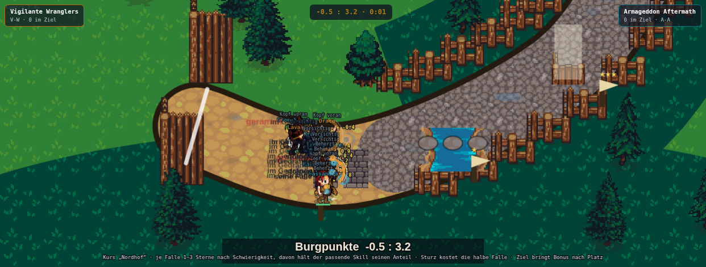
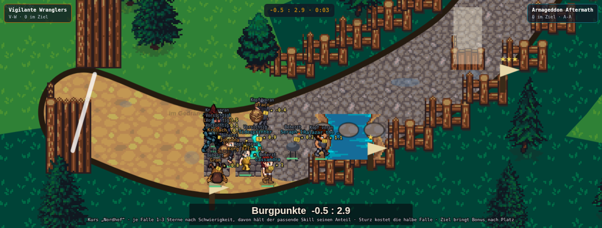
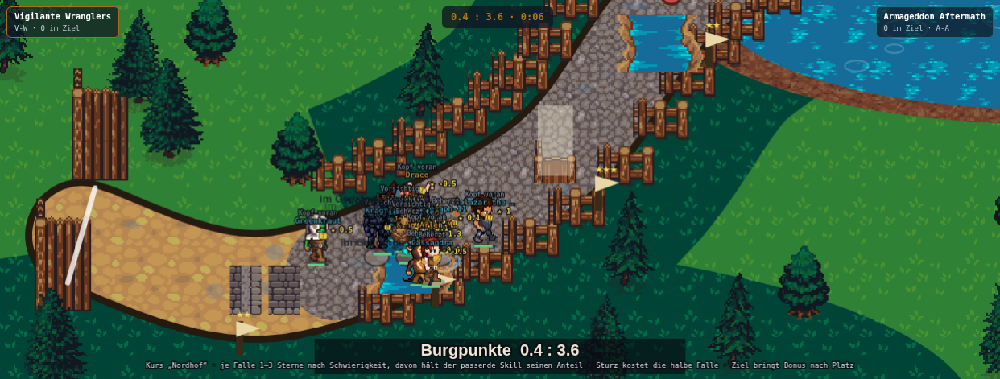

# Takeshi's Castle: Hindernis-Können gegen Streckentempo — warum das Rennen keine Geschichten erzählt (Fable, 13.09.2026)

Stand: `origin/main` `ec9190c5` („Staffel Assets 55→95", PR #901). Takeshi's Castle steht im
Gesamtstand auf **Konzept 100 % · Assets 95 % · Gameplay 97 % · Movement 95 %, rho 0,861
kaderfest** (`docs/design/gesamtstand-fertigstellungsgrad-alle-disziplinen-09-10.md`, Zeile 3 plus
die Movement-Runde aus PR #900) — das ist keine kaputte Disziplin, sondern eine ausgemessene. Jede
Zahl unten ist deshalb ZWEIMAL zu lesen: einmal als Befund und einmal als Risiko.

Chris' Auftrag (13.09., nach einem live geschauten Rennen), wörtlich:

> „bei takeshi sollen nicht ALLE spieler immer gefühlt an allen fallen hin fallen sondern man soll
> nen unterschied sehen ob jemand eine meistert und dadurc haufholt oder eben hinfällt. es muss
> spannender werden, auch so dass nicht ein spieler von anfang an führt weil er der beste ist und
> dann alle fertig macht, klar n star darf auch am anfang gut sein aber es soll auch storys geben wo
> einer mal aus dem mittefeld aufholt und nach vorne kommt. das kann auch n 80er sein der stark bei
> hindernissen ist und dazwischen nur avg. der dann aber die starken hindernisse viel schneller
> überwindet als beispiel. genauso umgekehrt spieler die zwischen den hindernissen schneller sind und
> da die meiste zeit gut machen usw - bitte konzept anpassen und überarbeiten mit fable"

Dazu, aus derselben Runde, Chris' Antwort an die parallel laufende Ausdauer-Recherche („Puste"):

> „also hier dann 'Puste' und ja das kann es beeinflussen je nach hindernis aber MUSS nicht
> zwangsweise hängt von art und schwierigkeit ab -> du müsstest also realistisch schwierigkeiten und
> arten von hindernissen vergeben und diese kategorisieren"

Beides zusammen ist derselbe Auftrag aus zwei Richtungen: **die vierzehn Fallen müssen aufhören, eine
einzige Falle in vierzehn Kopien zu sein.**

Sonden zu diesem Bericht: `takeshi-hindernis-strecke-sonde-13-09.mjs` (Diagnose und Varianten,
kaderfest über `data/generated/kaderfamilie-live-save.json`, fünf Paarungen × 24 Rennen = 120 Rennen
und 1440 Läufereinträge je Variante) und `takeshi-hindernis-strecke-ticker-13-09.mjs` (ein Rennen
gegen den echten Produktionscode, Ticker und Bilder).

---

## 0. Die Antwort in neun Sätzen

1. **Chris' erste Klage ist halb richtig — und die Hälfte, die stimmt, ist die schlimmere.** Ein
   Unterschied im Fallen-Ausgang EXISTIERT (oberstes TECHNIK-Fünftel 65,1 % sauber, unterstes
   37,9 %), aber er hängt an EINER Größe für ALLE vierzehn Fallen. Der Typ der Falle entschied bisher
   **nur über die Stoppdauer, nie über Gelingen oder Sturz** (`stepSpurt`, Zeile 20185 ff.: der
   Sauber-Wurf liest `u.TECHNIK`, der Durchbruch-Wurf `u.WUCHT` — `hTyp` kommt in keinem von beiden
   vor). Gemessen liegt die Sauber-Quote desselben Läufers an seinem **stärksten** und seinem
   **schwächsten** Fallentyp **1,3 Prozentpunkte** auseinander. Die Geschichte „ER meistert DIESE
   Falle, wo der andere liegt" gab es mechanisch nicht.
2. **Chris' zweite Klage ist so, wie er sie formuliert, messbar falsch — und trifft trotzdem etwas.**
   Ein Rennen hat **6,0 Führungswechsel**; wer nach einem Drittel führt, gewinnt nur in **20 %** der
   Fälle, und in **99,2 %** der Rennen wechselt die Führung nach dem ersten Drittel noch mindestens
   einmal. Auf der Bahn ist also ständig Bewegung. Was fest steht, ist der AUSGANG: der
   eignungsbeste Läufer **gewinnt 82,5 %** der Rennen und ist in **91,7 %** zuerst im Ziel. Zum
   Vergleich: in Hockey steht der Star in 58 % auf Rang 1 (CLAUDE.md). Chris sieht kein statisches
   Feld — er sieht viel Zappeln ohne Folgen.
3. **Und der Aufholer aus dem Mittelfeld existiert praktisch nicht:** wer nach einem Drittel in der
   hinteren Hälfte liegt, landet in **0,56 %** der Fälle noch auf Rang 1 oder 2.
4. **Das Zeitbudget ist dagegen schon in Ordnung** und muss nicht angefasst werden: von der Streuung
   der Zielzeit entfallen **32 % auf die Stehzeit** (Fallen-Stopp plus Gedränge, Median 10,5 s) und
   **30 % auf die Laufzeit** (Median 11,9 s). Hindernis und Strecke wiegen fast genau gleich schwer.
5. **Die zwei Achsen gibt es, sie sind nur aneinandergekettet.** r(Streckenachse, Fallenachse) =
   0,679; die Differenz „Falle minus Strecke" streut mit einer Standardabweichung von 11,6 Punkten
   über −29 bis +25. Läufer mit Profil gibt es also. Was fehlte, war ein Kanal, in dem sich das
   Profil AUSZAHLT.
6. **Der Vorschlag ist eine Zeile Mechanik, kein neues System:** der Sauber-Wurf jeder Falle liest
   zu drei Vierteln den Sub-Skill zum TYP dieser Falle und zu einem Viertel weiter „Falle lesen"
   (`fallenKoennen:0.75`). Dieselben fünf Sub-Skills entscheiden schon heute die Stoppdauer derselben
   Falle; ihr Mittel IST nach `mengeAusEignung` die Eignung. Der Kanal wird breiter, nicht lauter.
7. **Gemessen hebt das die Rangtreue, statt sie zu kosten: rho je Spiel 0,861 → 0,883**
   (Spannweite 0,116 → 0,071, Saison 0,930 → 0,951), und in drei Saatensätzen +0,022 / +0,035 /
   +0,024. Die Typ-Spreizung steigt von 1,3 auf **13,8 Prozentpunkte** (11,9–13,8 über die drei
   Sätze). Der Grund für das Plus steht in Abschnitt 4.4 — der Wurf hängt nicht mehr am
   eignungsfernsten Sub-Skill allein. **Was NICHT belastbar ist:** die Star-Dominanz fällt in der
   Abnahme-Saat von 82,5 % auf 75,8 %, über drei Saatensätze gemittelt aber nur von 79,4 % auf
   77,8 % (Abschnitt 4.5). Das Rezept macht das Rennen nicht messbar offener — es macht sichtbar,
   woran es sich entscheidet.
8. **Drei naheliegende Zusätze fliegen raus, weil sie gemessen schaden oder nichts bringen:**
   Stoppzeit nach Schwierigkeit (`stufePreis`, 0,869/0,848), der Durchbruch-Wurf nach Typ
   (`fallenDurchbruch`) und die Sturzdauer nach Typ (`fallenStolper`). Alle drei bleiben im Motor
   verfügbar und in `BAHN_ART` ungesetzt — dieselbe Behandlung wie `tackleNerven` und `lesenBonus`
   aus der Chaos-Runde.
9. **Sichtbar wird es über zwei Ticker-Zeilen** („*X spaziert durch Falle 7 — Durchbrettern ist seine
   Stärke.*" / „*X liegt an Falle 3 — Falle lesen ist nicht sein Fach.*", je Station höchstens
   einmal) plus dem Schwebetext „seine Falle". Reine Anzeige: kein `rr()`, kein Schreiben in
   `burgpunkte()`/`wert()`.

---

## 1. Befund: was heute wirklich rechnet

### 1.1 Die Fallen-Auflösung, Zeile für Zeile

Alles hängt an drei Stellen in `stepSpurt` (`public/mockups/battle-mode.engine.js`, Zeilen auf
`ec9190c5`):

```js
// (a) Stoppdauer — HIER, und nur hier, zaehlt der Typ der Falle:
const hTyp=HUERDEN_TYP(HUERDEN_N().indexOf(h));       // TECHNIK|WENDIGKEIT|WUCHT|STEHEN|ROBUST
const hSkill=u[hTyp]||0;
u.huerde=Math.max(u.huerde||0,(A.huerdePreis??0)*(1-0.8*hSkill/100));

// (b) Gelingt sie? — hTyp kommt NICHT vor:
const technik=Math.min(0.97,0.26+u.TECHNIK*0.0060);
if(rr()<=technik)continue;                            // sauber
const wucht=Math.min(0.92,0.10+u.WUCHT*0.0060);
if(rr()<=wucht){ ... }                                // durchbruch
u.stolper=0.80+(1-u.TECHNIK/100)*0.95;                // sturz — wieder TECHNIK
```

**Das ist der ganze Befund.** Eine Wendigkeits-, Wucht-, Willens- und Nehmerqualitäts-Falle haben
für denselben Läufer exakt dieselbe Sturzwahrscheinlichkeit. Der Trittstein und die Seilwand
unterscheiden sich in der Sekundenzahl, die sie kosten, in nichts sonst.

**Randbefund, weil er in der Aufgabenstellung anders vermutet wurde:** `fallenAusgang(i)`
(`:17795`) entscheidet gar nichts. Es ist eine reine **Zeichen**-Hilfsfunktion, die für die Station
`i` den schwersten gerade anliegenden Ausgang zurückgibt, damit die Falle nicht den harmlosesten
Fall zeigt, während nebenan jemand stürzt. Geschrieben wird `aus` an den drei Stellen oben.

### 1.2 Wie verschieden fallen die Läufer heute wirklich?

Kaderfest, 120 Rennen, 1440 Läufereinträge, gebucketet nach „Falle lesen" (TECHNIK):

| Fünftel | TECHNIK | WUCHT | sauber | durchgebrochen | **gestürzt** | Stürze je Rennen |
|---|---:|---:|---:|---:|---:|---:|
| unterstes | 15,8 | 30,3 | 37,9 % | 19,4 % | **42,7 %** | 4,08 |
| 2. | 33,7 | 43,8 | 44,6 % | 20,4 % | 35,0 % | 4,39 |
| 3. | 43,3 | 41,8 | 53,6 % | 16,4 % | 30,0 % | 3,73 |
| 4. | 51,6 | 43,1 | 56,7 % | 16,2 % | 27,1 % | 3,51 |
| oberstes | 65,0 | 45,3 | 65,1 % | 12,9 % | **22,0 %** | 3,05 |

**Chris hat recht, obwohl die Tabelle ihm widerspricht** — und der Grund steht in der letzten
Spalte. Die Quoten unterscheiden sich fast um den Faktor zwei; die ZAHL DER STÜRZE, die man im
Rennen sieht, unterscheidet sich zwischen dem Besten und dem Schlechtesten um **einen einzigen
Sturz je Rennen** (3,1 gegen 4,1 von vierzehn Fallen). Bei zwölf Läufern liegen in einem Rennen rund
44 Stürze; ob einer davon drei oder vier hat, ist am Bildschirm keine Information. „Gefühlt fallen
alle an allen Fallen hin" ist eine korrekte Beobachtung eines korrekt rechnenden Modells.

### 1.3 Die Zahl, um die es geht: derselbe Läufer, seine starke und seine schwache Falle

Für jeden Läufer, der alle vierzehn Stationen gesehen hat, wird sein **stärkster** und sein
**schwächster** der fünf Fallen-Sub-Skills bestimmt und die Sauber-Quote an genau diesen Fallen
verglichen (Skill-Abstand stark-zu-schwach im Mittel 28,4 Punkte):

| | Sauber-Quote an SEINER starken Falle | an SEINER schwachen Falle | Unterschied |
|---|---:|---:|---:|
| **heute** | 57,0 % | 55,7 % | **1,3 Pp** |
| mit dem Rezept | 63,1 % | 49,3 % | **13,8 Pp** |

Dieselbe Sache anders geschnitten — alle Fallen-Anläufe, gebucketet nach dem Sub-Skill, den GENAU
DIESE Falle abfragt:

| Fünftel nach `hSkill` | Skill | sauber heute | sauber mit Rezept |
|---|---:|---:|---:|
| 1. | 21,7 | 43,8 % | **39,9 %** |
| 2. | 37,8 | 52,5 % | 48,5 % |
| 3. | 46,9 | 54,9 % | 55,4 % |
| 4. | 54,7 | 55,5 % | 58,6 % |
| 5. | 68,6 | 56,0 % | **64,5 %** |
| Spreizung | | 12,2 Pp | **24,6 Pp** |

Die 12,2 Prozentpunkte heute sind kein eigener Kanal, sondern der Schatten von TECHNIK: wer viel
TECHNIK hat, hat nach `mengeAusEignung` meist auch die übrigen vier Sub-Skills über dem Feld.

Die 1,3 Prozentpunkte sind Rauschen (die zwei Gruppen unterscheiden sich nur darüber, dass ein
starker Typ leicht mit hoher TECHNIK korreliert). **Das ist der harte Beleg für Chris' erste
Klage**, und er ist schärfer als die Klage selbst: es ist nicht so, dass der Unterschied zu klein
wäre — es gibt ihn nicht.

### 1.4 Führt der Beste von Anfang an und macht alle fertig?

| Größe | heute |
|---|---:|
| Führungswechsel je Rennen | **6,03** |
| Führer nach 1/3 der Rennzeit gewinnt (Burgpunkte) | 20,0 % |
| Führer nach 1/3 ist zuerst im Ziel | 20,8 % |
| Führer zur Halbzeit gewinnt | 4,2 % |
| Führung ab 1/3 nie mehr gewechselt | **0,8 %** der Rennen |
| Eignungsbester führt schon nach 1/3 | 18,3 % |
| **Eignungsbester gewinnt (Burgpunkte)** | **82,5 %** |
| **Eignungsbester ist zuerst im Ziel** | **91,7 %** |
| Eignungsbester in den ersten zwei | 94,2 % |
| Aufholer (hintere Hälfte nach 1/3 → Rang 1–2) | **0,56 %** |
| Platzverschiebung 1/3 → Ende, Betrag im Mittel | 2,32 Plätze |

**Wörtlich genommen ist Chris' Beobachtung falsch:** niemand führt von Anfang an durch, in 99,2 %
der Rennen wechselt die Führung nach dem ersten Drittel noch. Der Grund ist banal — wer gerade in
einer Falle steht, hat `tempoVon()===0` und fällt zurück, und das passiert vierzehnmal.

**Und trotzdem beschreibt er richtig, was er gesehen hat.** Das Zappeln hat keine Ursache, die man
lesen kann, und keine Folge: am Ende gewinnt in vier von fünf Rennen der Beste, und der Aufholer aus
dem Mittelfeld kommt in einem von zweihundert Läufen vor. Das Rennen hat Bewegung, aber keine
Geschichte. Genau dieser Unterschied — Bewegung ohne Geschichte — ist das, was repariert werden muss.

### 1.5 Das Zeitbudget: wo wird entschieden?

| Größe | Median | Spannweite | sd | Anteil an der Zielzeit-Streuung |
|---|---:|---:|---:|---:|
| Zielzeit | 22,52 s | 13,42–29,62 s | — | — |
| Stehzeit (Falle + Gedränge) | 10,46 s | 9,96 s | 1,83 | **32 %** |
| Laufzeit (der Rest) | 11,94 s | 10,20 s | 1,78 | **30 %** |

r(Zielzeit, Fallen-Stoppzeit) = 0,852; r(Zielzeit, Streckenachse) = −0,642; Ausscheidequote 26,1 %.
(32 % + 30 % = 62 %, nicht 100 % — der Rest ist die Kovarianz der beiden Konten: wer gut läuft, ist
meist auch an der Falle gut. Für die Frage „wiegen die zwei gleich schwer?" ist das egal, für die
Frage „sind sie unabhängig?" nicht — s. Abschnitt 1.6.)

**Das ist die gute Nachricht, und sie schützt die Disziplin vor einer Überreaktion.** Chris' zwei
Sätze („der die starken Hindernisse viel schneller überwindet" / „die zwischen den Hindernissen
schneller sind") klingen so, als müsste das Budget umgebaut werden. Es ist längst halbe-halbe. Wer
hier am Verhältnis dreht, dreht an einer Zahl, die schon stimmt.

### 1.6 Die zwei Achsen im echten Kader

Streckenachse := ½·ANTRITT + ½·ENDTEMPO (das, was `tempoVon()` liest), Fallenachse := ½·TECHNIK +
½·WUCHT (das, was die zwei Würfe lesen):

| | min | q25 | Median | q75 | max | sd |
|---|---:|---:|---:|---:|---:|---:|
| Falle minus Strecke | −29,0 | −15,0 | −7,0 | +3,5 | +25,5 | 11,62 |

r(Strecke, Falle) = **0,679**. Und je Sub-Skill die Kopplung an die Eignung — die Zahl, die darüber
entscheidet, ob ein Kanal rho hebt oder drückt:

| Sub-Skill | r zur Eignung | Spannweite im Kader |
|---|---:|---|
| ANTRITT („Losstürmen") | **0,918** | 9–83 |
| ROBUST („Nehmerqualität") | 0,880 | 15–84 |
| ENDTEMPO („Durchhaltetempo") | 0,877 | 14–92 |
| STEHEN („Wille") | 0,863 | 14–89 |
| WUCHT („Durchbrettern") | 0,843 | 7–74 |
| WENDIGKEIT („Aufstehen") | 0,674 | 2–86 |
| **TECHNIK („Falle lesen")** | **0,600** | 2–78 |

Zwei Dinge stehen in dieser Tabelle, die den ganzen Entwurf tragen:

- **TECHNIK ist der mit der Eignung am schwächsten laufende Sub-Skill** — und ausgerechnet er
  entscheidet heute alle vierzehn Sauber-Würfe UND alle vierzehn Sturzdauern. Das ist derselbe
  Befund, aus dem die Chaos-Runde `lesenBonus` verworfen hat („TECHNIK korreliert nur 0,60 mit der
  Eignung; wer ihn auf vierzehn Fallen legt, gewichtet ihn über die Matrix hinaus",
  `takeshi-chaos-tackle-plan-06-09.md` Abschnitt 3.3). Die Schlussfolgerung dort war richtig und
  wird hier nicht zurückgenommen — nur zu Ende gedacht: der Ausweg ist nicht, TECHNIK LEISER zu
  machen, sondern ihn durch die anderen vier zu ERGÄNZEN.
- **Der Fallen-Spezialist, den Chris beschreibt („n 80er der stark bei hindernissen ist"), existiert
  im echten Kader** — er ist nur selten und kommt nicht an: 4,4 % der Läufereinträge haben
  unterdurchschnittliche Eignung bei einem Fallen-Vorsprung über +6 Punkte, und davon landen 6,3 %
  in den ersten drei. Sein Spiegelbild, der Strecken-Spezialist, ist mit 18,7 % dreimal so häufig
  und kommt mit 0,4 % noch seltener nach vorn.

---

## 2. Erdung: der Sport und die Sendung kennen genau diese zwei Achsen

### 2.1 Hindernisrennen sind zwei Sportarten in einem

Die Trennung „schnell laufen" gegen „Hindernisse können" ist in der Sportwissenschaft des Obstacle
Course Racing keine Metapher, sondern der Befund:

- **Laufzeit ist der beste Einzelprädiktor — aber eben nur der beste Einzelne.** In der
  Prädiktorenstudie zu OCR (32 Athleten, Labor- plus Feldtests) waren die besten Einzelprädiktoren
  die mittlere relative Leistung im Wingate-Test und die Meilenzeit; die Mehrvariablenanalyse mit
  Kontrolle für Alter, Geschlecht und Meilenzeit fand für den **Bucket Carry** einen davon
  *unabhängigen* Beitrag zur Rennzeit. Auf Deutsch: es gibt eine Hindernis-Komponente, die sich
  durch Lauftempo NICHT erklären lässt.
- **Die Trainingsempfehlung der Fachliteratur setzt exakt an dieser Zweiachsigkeit an** — wer
  Kraftathlet ist, soll laufen, wer Läufer ist, soll Kraft trainieren. Man trainiert seine
  schwächere ACHSE, nicht sein schwächeres Prozent.
- **Ninja Warrior / Sasuke baut die zwei Achsen sogar in die Turnierstruktur:** Stage 1 ist auf Zeit
  und prüft Tempo und Beweglichkeit, Stage 2 prüft Kraft und Ausdauer (vor allem Oberkörper) unter
  Zeitdruck, Stage 3 prüft reine Kraft — **ohne Uhr**. Ein und dieselbe Person scheitert je nach
  Stage an völlig verschiedenen Dingen; die bekanntesten Athleten des Formats sind Archetypen
  („der stärkste Fischer der Welt"), keine Allrounder.

### 2.2 Und Takeshi's Castle selbst ist der Extremfall davon

Die Sendung hatte nie eine Prüfung, sondern eine Sammlung ausdrücklich verschiedener Prüfungen:
**Honeycomb Maze** war ein Labyrinth identischer Sechseckräume — Orientierung und schnelle
Entscheidung unter Verfolgung; **Skipping Stones** war Balance auf rutschigen Rundplattformen über
Wasser; **High Rollers** verlangte Tempo UND Balance auf rollenden Walzen; **Dragon God's Pond** war
Seilschwung, also Oberkörperkraft und Zielgenauigkeit; **Knock Knock** war rohe Wucht gegen
Papierwände, alle zwölf gleichzeitig. Die Sendung fasste das selbst so zusammen, dass sie „Kraft,
Tempo, Balance und vor allem Durchhaltevermögen" prüfe.

**Das ist der Punkt.** Unsere fünf Fallentypen mit ihren zehn Bildern sind bereits die korrekte
Übersetzung dieser Vielfalt — `fallenBild` ordnet dem Sub-Skill TECHNIK das Labyrinth und die
Eisfläche zu, WENDIGKEIT die Trittsteine und die Walzen, WUCHT die Tür und die Seilwand, STEHEN den
Brückenball und den Schlamm, ROBUST die Räder und die Spitzen. Das Bild sagt seit #810 das
Richtige. **Nur die Mechanik dahinter hat es nie geglaubt.**

---

## 3. Das Konzept

### 3.1 Eine Zeile: der Wurf liest den Typ der Falle

```js
let koennen=u.TECHNIK, durch=u.WUCHT;
if(hTyp){
  const mK=A.fallenKoennen??0, mD=A.fallenDurchbruch??0;
  if(mK)koennen=(1-mK)*u.TECHNIK+mK*hSkill;
  if(mD)durch=(1-mD)*u.WUCHT+mD*hSkill;
}
const technik=Math.min(0.97,(A.technikBasis??0.35)+koennen*(A.technikSpanne??0.0065));
if(rr()<=technik){ ... continue; }
const wucht=Math.min(0.92,(A.wuchtBasis??0.10)+durch*(A.wuchtSpanne??0.0090));
```

An **Mechanik** gesetzt wird genau ein Feld: `fallenKoennen:0.75`. (Dazu kommen zwei Felder ohne
Wirkung auf die Simulation: `fallenMelden:10` für die Ticker-Zeilen, Abschnitt 6, und `fallenArt`
als Beschreibung für die Puste-Runde, Abschnitt 3.3.) `hSkill` ist derselbe Wert, den die Zeile
darüber schon für die Stoppdauer liest — **es kommt keine einzige neue Größe ins Spiel**, nur eine
bereits berechnete an eine zweite Stelle.

**Warum 0,75 und nicht 1,0.** Bei 1,0 wäre „Falle lesen" nur noch an den vier TECHNIK-Stationen
zuständig, und Intelligence 36 + Awareness 30 — die blaue, mentale Seite der Disziplin, auf der die
ganze Outsmart-Säule der Chaos-Runde steht — schnurrte auf 4 von 14 Fallen zusammen. Mit 0,75 bleibt
an JEDER Falle ein Viertel „ich sehe, was hier auf mich zukommt". Gemessen liegen beide bei rho
0,883; 0,75 lässt den Star seltener gewinnen (75,8 % gegen 80,0 %). Mehr Geschichte bei gleicher
Rangtreue — also 0,75.

**Warum der Durchbruch-Wurf reine WUCHT bleibt.** Mit Gewalt durchkommen ist Gewalt, gleich welche
Falle davorsteht; das ist der Charakter dieses zweiten Wurfs seit PR #794. `fallenDurchbruch` ist
gebaut und gemessen (Abschnitt 4.2), aber nicht gesetzt.

### 3.2 Wie daraus die Geschichten werden, die Chris will — Mechanismus, nicht Hoffnung

Chris' Läufer A („80er, stark bei Hindernissen, dazwischen nur avg") hat in unserem Modell einen
Fallen-Sub-Skill weit über seinem eigenen Mittel — sagen wir WUCHT 62 bei einem Mittel von 42. Auf
„Die Mauern" stehen vier WUCHT-Fallen (Stationen 1, 7, 8, 14).

An jeder dieser vier Fallen gewinnt er **gleichzeitig auf drei Wegen**:

1. **Der Sauber-Wurf.** Sein `koennen` steigt von 42 (heute: seine TECHNIK) auf
   0,25·42 + 0,75·62 = 57 — die Sauber-Chance von 51 % auf 60 %. An seiner schwächsten Falle fällt
   sie umgekehrt.
2. **Der Sturz, der ausbleibt.** Ein Sturz kostet 0,8–1,75 s Liegezeit, 9 Reserve und ein Stück
   Nervenkostüm; drei bis vier davon scheiden aus. Neun Prozentpunkte weniger Sturzrisiko an vier
   Stationen ist im Mittel gut ein halber Sturz je Rennen weniger — **an genau den vier Stationen,
   an denen die Kamera gerade steht.**
3. **Die Stoppdauer.** Die gab es schon: `(1-0,8·hSkill/100)` macht aus 0,80 s bei Skill 42 → 0,53 s,
   bei Skill 62 → 0,40 s.

Und er verliert dieselben drei Wege an den Fallen seines schwächsten Typs. **Das ist der
Aufholer-Bogen**: er fällt an den Trittsteinen zurück, holt an den Türen auf. Dass die drei Kurse
dieselbe Multimenge von vierzehn Fallen in ANDERER Reihenfolge führen (`kurse[]`, #810), erledigt
den Rest umsonst: derselbe Spezialist surft auf „Die Mauern" schon an Station 1 nach vorn und auf
„Nordhof" erst an Station 3 — dieselbe Figur, jedes Rennen eine andere Kurve.

**Der Spiegelfall — und eine ehrliche Grenze.** Chris' zweiter Läufer („schneller zwischen den
Hindernissen") ist im Modell der, dessen ANTRITT/ENDTEMPO über seinen fünf Fallen-Sub-Skills liegen.
Er gewinnt auf der Strecke (30 % der Zielzeit-Streuung, Abschnitt 1.5) und verliert ab jetzt
SPEZIFISCH an den Fallen seiner schwachen Typen statt gleichmäßig an allen. Was es NICHT gibt und
was ich ausdrücklich NICHT vorschlage: einen eigenen „Streckenspezialisten"-Kanal, der über Speed
liefe. Die Matrix führt `speed:4` — Chris' eigene Konzeptentscheidung, im Code seit #802 in Worten
festgehalten („schnell sein hilft hier kaum, DURCHKOMMEN ist alles"). ANTRITT und ENDTEMPO laufen
deshalb mit r=0,918/0,877 fast parallel zur Eignung; wer sie speed-lastiger macht, kauft eine
Geschichte mit Rangtreue. Ich habe das gemessen, bevor ich es verwerfe — s. Abschnitt 4.3.

### 3.3 Die Kategorisierung der Fallen — auch für die Puste

Chris will die Fallen „realistisch nach Schwierigkeit und Art kategorisiert". Die **Schwierigkeit**
gibt es seit #810: `fallenStufe` (TECHNIK 2 · WENDIGKEIT 1 · WUCHT 3 · STEHEN 2 · ROBUST 3), heute
schon die Sterne am Wegpunkt-Fähnchen und der Multiplikator der Burgpunkte. Die **Art** kommt mit
diesem PR dazu, als reine Beschreibung:

| Typ | Fallen (Bilder) | Stufe | Art | Warum |
|---|---|---:|---|---|
| TECHNIK | Labyrinth, Eisfläche | 2 | **technisch** | Lesen und Orientieren — ein Erschöpfter mit Können löst das noch |
| WENDIGKEIT | Trittsteine, Walzen | 1 | **gemischt** | Balance: Können zuerst, aber müde Beine wackeln |
| WUCHT | Tür, Seilwand | 3 | **körperlich** | Durchbrechen ist Masse mal Wille |
| STEHEN | Brückenball, Schlamm | 2 | **körperlich** | Sich über dem Wasser halten, sich aus dem Schlamm ziehen |
| ROBUST | Räder, Spitzen | 3 | **körperlich** | Treffer wegstecken |

**Dieser PR liest `fallenArt` nicht.** Es ist der Anschluss für die Puste-Runde (Zweig
`claude/hockey-ausdauer-konzept-13-09`), damit die nicht eine zweite, widersprüchliche Einteilung
erfinden muss: eine Puste-Wirkung, die nur auf `koerperlich` (und halb auf `gemischt`) greift, trifft
genau die acht bis zehn der vierzehn Stationen, an denen sie real wehtut, und lässt das Labyrinth in
Ruhe — „MUSS nicht zwangsweise, hängt von Art und Schwierigkeit ab". Zwei Warnungen dazu an die
Puste-Runde: die Einteilung oben ist eine **Behauptung über die Sendung, keine gemessene Zahl**, und
`koerperlich` deckt mit Stufe 3/2/3 ausgerechnet die teuersten Fallen ab — eine Puste-Wirkung darauf
ist automatisch stark und braucht ihre eigene Kadermessung, bevor eine Zahl gesetzt wird.

---

## 4. Messungen

Alle Zahlen kaderfest über `data/generated/kaderfamilie-live-save.json` (fünf echte
Team-Paarungen aus dem live-save-Abbild), 24 Rennen je Paarung, sechs Läufer je Seite — dieselbe
Rechnung wie `scripts/lib/rangtreue-messung.mjs`. „Star" ist der Anteil der Rennen, in denen der
eignungsbeste Läufer die höchste Burgpunkte-Wertung hat; „Typ-Delta" die Zahl aus Abschnitt 1.3.

### 4.1 Die Variantenfahrt (Saat 1337)

| Variante | rho/Spiel | Spannw. | Saison | Star | zuerst im Ziel | Typ-Delta | raus |
|---|---:|---:|---:|---:|---:|---:|---:|
| **V0 Basis (`main`)** | **0,861** | 0,116 | 0,930 | 82,5 % | 91,7 % | **1,3 Pp** | 26,1 % |
| A1 `fallenKoennen:0.50` | 0,874 | 0,087 | 0,937 | 79,2 % | 93,3 % | — | 26,4 % |
| **R `fallenKoennen:0.75` — das Rezept** | **0,883** | **0,071** | **0,951** | **75,8 %** | 90,8 % | **13,8 Pp** | 27,5 % |
| A3 `fallenKoennen:1.00` | 0,883 | 0,078 | 0,951 | 80,0 % | 90,8 % | — | 27,6 % |
| C1 `stufePreis` 0,70/1,00/1,30 | 0,869 | 0,121 | 0,923 | 81,7 % | 92,5 % | 1,3 Pp | 26,5 % |
| C2 `stufePreis` 0,55/1,00/1,45 | 0,848 | 0,102 | 0,937 | 76,7 % | 85,0 % | 0,0 Pp | 27,3 % |
| D1 = R + C1 | 0,878 | 0,090 | 0,972 | 79,2 % | 91,7 % | 8,7 Pp | 27,1 % |
| D2 = R + C2 | 0,874 | 0,099 | 0,972 | 77,5 % | 84,2 % | 11,7 Pp | 27,6 % |
| E1 = R + `fallenStolper` | 0,869 | 0,120 | 0,951 | 77,5 % | 88,3 % | 12,7 Pp | 27,6 % |
| E2 = R + `fallenDurchbruch:0.75` | 0,874 | 0,094 | 0,965 | 79,2 % | 94,2 % | 12,9 Pp | 27,6 % |
| E3 = R + Durchbruch + Stolper | 0,860 | 0,110 | 0,944 | 80,0 % | 87,5 % | 13,4 Pp | 26,7 % |

**V0 reproduziert `main` ziffernidentisch** (0,861 / 0,116 / 0,930 gegen die eingecheckte Basis) —
gefahren wurde er auf dem NEUEN Code mit `fallenKoennen` zur Laufzeit entfernt. Das ist gleichzeitig
der konstruktive Isolationsbeleg: ohne das Feld rechnet der neue Motor Zeichen für Zeichen den alten.

**Die Tabelle sagt vier Dinge:**

1. `fallenKoennen` hebt rho auf jedem getesteten Wert (0,50 / 0,75 / 1,00 → 0,874 / 0,883 / 0,883)
   und verengt gleichzeitig die Kader-Spannweite von 0,116 auf 0,071 — die Zahl wird nicht nur
   besser, sondern auch stabiler zwischen Kadern.
2. **Jeder Zusatz kostet.** `stufePreis`, `fallenStolper` und `fallenDurchbruch` liegen einzeln und
   in jeder Kombination unter dem Rezept. Die schärfere Schwierigkeitsstaffel C2 ist mit 0,848 die
   einzige Variante im ganzen Versuch, die die Basis unterbietet.
3. In dieser Saat ist das Rezept die einzige Variante, die rho HEBT und Star-Dominanz SENKT (A3
   liegt bei gleichem rho auf 80,0 % Star). Die Star-Spalte hält der Replikation allerdings nicht
   stand — s. 4.5; die rho-Spalte schon.
4. **Die Ausscheidequote bleibt bei 27,5 % statt 26,1 %** — das Rennen wird nicht härter. Wer an
   seiner starken Falle seltener stürzt, verliert die gesparten Nerven an seiner schwachen wieder;
   was sich verschiebt, ist WO.

### 4.2 Warum `stufePreis` nicht funktioniert, obwohl es Chris' Satz wörtlich bedient

Chris sagt „der dann aber die starken hindernisse viel schneller überwindet". Der offensichtliche
Weg dahin ist, schwere Fallen teurer zu machen (`stufePreis`), damit der Abstand zwischen Können 30
und Können 70 dort absolut größer wird. Gemessen ist das die schlechteste Idee im Versuch.

Der Grund ist die Kurszusammensetzung. Alle drei Kurse führen dieselbe Multimenge — 4× TECHNIK
(Stufe 2), 2× WENDIGKEIT (1), 4× WUCHT (3), 2× STEHEN (2), 2× ROBUST (3). Wer die Stufe-3-Fallen
teurer macht, verschiebt Gewicht auf WUCHT und ROBUST und nimmt es WENDIGKEIT weg — das ist keine
Spezialisten-Bühne, sondern eine stille Änderung der Matrix-Gewichtung durch die Hintertür. Dass
D1/D2 (Rezept plus Staffel) das Typ-Delta sogar DRÜCKEN (8,7 bzw. 11,7 statt 13,8), passt dazu: die
längeren Stopps verschieben, wer wann ausscheidet, und ein Ausgeschiedener sieht nur den Anfang der
festen Kursfolge.

**Chris' Satz wird trotzdem bedient — nur an der anderen Stelle.** Der Spezialist überwindet seine
Falle heute schon schneller (`(1-0,8·hSkill/100)`, 0,53 s gegen 0,40 s), und ab jetzt zusätzlich
*öfter überhaupt*: ein vermiedener Sturz spart 0,8–1,75 s plus Reserve plus Nerven. Der Zeitgewinn
an der eigenen Falle wächst mit dem Rezept, ohne dass ein Preis verschoben werden muss.

### 4.3 Was ich gemessen und dann NICHT vorgeschlagen habe: die Streckenachse

Chris' Spiegelfall („spieler die zwischen den hindernissen schneller sind") lässt sich nur über
ANTRITT/ENDTEMPO bauen, und die tragen mit r=0,918 / 0,877 fast die Eignung selbst (Abschnitt 1.6).
Drei Wege wären denkbar, alle drei sind es nicht:

- **ANTRITT/ENDTEMPO speed-lastiger machen.** Die Matrix führt `speed:4` — und der Kommentar im
  Code sagt seit #802, warum: „Speed steht mit 4 fast ganz unten — schnell sein hilft hier kaum,
  DURCHKOMMEN ist alles." Wer Tempo über Speed kauft, kauft es an der Matrix vorbei. Das ist
  definitionsgemäß rho-Verlust, nicht Rauschen.
- **`tempoSpanne` erhöhen** (heute 0,70; Läufer mit Skill 20 rennt 106 px/s, mit Skill 80 148).
  Das verstärkt einen Kanal mit r≈0,9 — es macht den BESTEN schneller, nicht einen Spezialisten.
  Genau das Gegenteil von dem, was Chris will.
- **Nach jeder Falle neu anfahren** (ANTRITT statt ENDTEMPO nach jedem Stopp). Physikalisch richtig
  — man steht an jeder Falle —, aber die Strecke zwischen zwei Fallen ist 7 % der Route, rund
  0,8 s bei einer Anfahrtsrampe von 3,2 s. Der Läufer käme nach der ersten Falle nie mehr auf
  ENDTEMPO, und „Durchhaltetempo" (Stamina 29) wäre praktisch abgeschaltet zugunsten von
  „Losstürmen" (Speed 28). Eine Matrix-Änderung im Gewand einer Physik-Korrektur. **Nicht gebaut.**

**Der ehrliche Befund ist deshalb:** die Streckenachse trägt bereits 30 % der Zielzeit-Streuung und
ist damit nicht zu schwach — sie ist nur nicht unabhängig von der Eignung, und das ist eine
CHRIS-Entscheidung in der Matrix, keine Panne im Motor. Was das Rezept für den Strecken-Typ ändert,
ist sein Gegenstück: er verliert ab jetzt SPEZIFISCH an den Fallen seiner schwachen Typen statt
gleichmäßig an allen vierzehn — und damit hat auch er eine Stelle im Rennen, an der man ihn
zurückfallen und danach wieder herankommen sieht.

### 4.4 Warum rho steigt, statt zu fallen — die Rechnung dahinter

Der Sauber-Wurf hing an TECHNIK (r=0,600 zur Eignung). Mit `fallenKoennen:0.75` hängt er zu drei
Vierteln an der kursgewichteten Mischung der fünf Fallentypen:

| Typ | Stationen je Kurs | r zur Eignung |
|---|---:|---:|
| TECHNIK | 4 | 0,600 |
| WENDIGKEIT | 2 | 0,674 |
| WUCHT | 4 | 0,843 |
| STEHEN | 2 | 0,863 |
| ROBUST | 2 | 0,880 |
| **gewichtetes Mittel** | **14** | **≈0,758** |

Der Kanal, der 14 Würfe entscheidet, korreliert damit ≈0,76 statt 0,60 mit der Eignung. Das ist die
ganze Erklärung für +0,022 rho — und es ist derselbe Gedanke, mit dem die Chaos-Runde `lesenBonus`
verworfen hat, nur in die andere Richtung gedreht: dort wurde TECHNIK ZUSÄTZLICH auf alle vierzehn
Fallen gelegt (0,847/0,831), hier wird er auf vierzehn Fallen VERTEILT.

### 4.5 Replikate mit anderen Saaten und Kadergrößen

Drei Saatensätze, jeweils dieselben fünf Kader-Paarungen, 24 Rennen je Paarung:

| Saat | V0 Basis | Rezept | Δ | Typ-Delta V0 → Rezept |
|---|---:|---:|---:|---|
| 1337 (die Abnahme-Saaten) | 0,861 | **0,883** | **+0,022** | 1,3 → 13,8 Pp |
| 4242 | 0,841 | **0,876** | **+0,035** | 1,7 → 13,6 Pp |
| 20260913 | 0,863 | **0,887** | **+0,024** | 0,4 → 11,9 Pp |

Die Basis selbst schwankt zwischen den Saatensätzen um 0,022 (0,841 bis 0,863) — etwa so groß wie
der Effekt. Was die drei Sätze trotzdem tragen: **das Rezept liegt in jedem über der Basis**
(+0,022 / +0,035 / +0,024, im Mittel +0,027), und das Typ-Delta springt in jedem von „nicht
vorhanden" (0,4–1,7 Pp) auf zweistellig (11,9–13,8 Pp). Die Richtung ist belastbar, die dritte
Nachkommastelle nicht.

**Ehrlich bei der Star-Dominanz:** 82,5 → 75,8 (Saat 1337), 77,5 → 76,7 (4242), **78,3 → 80,8**
(20260913). Zweimal runter, einmal um 2,5 Punkte hoch. Der Rückgang um 6,7 Punkte aus der
Abnahme-Saat ist damit KEIN belastbarer Effekt, sondern die günstigste der drei Ziehungen — über
alle drei gemittelt bleibt die Star-Quote praktisch stehen (79,4 → 77,8). Was belastbar ist, ist
das Typ-Delta. Wer dem Rezept also einen Nutzen zuschreibt, sollte ihn dort suchen: **nicht „der
Beste gewinnt seltener", sondern „man sieht endlich, WARUM einer an einer Falle gewinnt oder
verliert".** Genau das war Chris' erster Satz.

---

## 5. Isolation und Abnahme

### 5.1 Konstruktiv

Jede neue Zeile hängt hinter einem Feld, das nur `BAHN_ART["takeshis-castle"]` führt:
`fallenKoennen`, `fallenDurchbruch`, `fallenStolper`, `stufePreis`, `fallenMelden`, `fallenArt`.
Ohne sie gilt:

- `hTyp`/`hSkill` wandern aus dem `if(A.hindernisTypen)`-Block heraus, bleiben dort aber
  `null`/`0` — für Staffel, Zeitfahren und Klettern (kein `hindernisTypen`) ändert sich nichts,
  für Spurt (führt `hindernisTypen`) werden dieselben zwei Werte berechnet wie vorher.
- `koennen`/`durch` sind ohne `fallenKoennen`/`fallenDurchbruch` Zeichen für Zeichen `u.TECHNIK`
  bzw. `u.WUCHT`.
- `stFaktor` ist ohne `stufePreis` exakt `1`.
- `meldeTyp` ist ohne `fallenMelden` `null`, der Sauber-Zweig damit wieder ein nacktes `continue`.
- **`rr()` wird in genau denselben Fällen und in derselben Reihenfolge gerufen wie vorher.** Das ist
  die Bedingung, an der die Bit-Identität der anderen Bahnen hängt.
- `wert()`, `burgpunkte()` und `stoppAnteil` sind **unverändert** — die Wertungsformel aus #810 ist
  nicht angefasst.

### 5.2 Gemessen: alle zwanzig Disziplinen

`node scripts/miss-alle-disziplinen.mjs 24` auf diesem Zweig, kaderfest über dieselbe
live-save-Familie („Oly New Game Custom 19.8.2026", gezogen 03.09.), **keine Seitenfehler**. Die
Vorher-Spalte ist die eingecheckte Basislinie: `gesamtstand-fertigstellungsgrad-alle-disziplinen-09-10.md`
(rho je Spiel, am 10.09. mit demselben Skript und derselben Kaderfamilie frisch gemessen) und für die
vier Zahlen der Bahn-Disziplinen zusätzlich `takeshi-chaos-tackle-plan-06-09.md` Abschnitt 5.

| Disziplin | Chassis | vorher | **nachher** | Spannw. | Saison | Spannw. | Bewegung |
|---|---|---:|---:|---:|---:|---:|---|
| staffel | bahn | 0,915 | **0,915** | 0,089 | 0,951 | 0,093 | — |
| speed-schach | buehne | 0,908 | **0,908** | 0,066 | 0,972 | 0,042 | — |
| showcase | buehne | 0,892 | **0,892** | 0,158 | 0,937 | 0,077 | — |
| eiskunstlauf | buehne | 0,885 | **0,885** | 0,083 | 0,979 | 0,028 | — |
| **takeshis-castle** | **bahn** | **0,861** | **0,883** | 0,071 | 0,951 | 0,042 | **+0,022 — die einzige Zeile, die sich bewegt** |
| spurt | bahn | 0,871 | **0,871** | 0,236 | 0,905 | 0,190 | — (alle vier Zahlen) |
| breaking | buehne | 0,869 | **0,869** | 0,114 | 0,951 | 0,168 | — |
| gewichtheben | buehne | 0,854 | **0,854** | 0,209 | 0,923 | 0,273 | — |
| wettessen | buehne | 0,845 | **0,845** | 0,139 | 0,930 | 0,091 | — |
| time-trial | bahn | 0,828 | **0,828** | 0,087 | 0,832 | 0,056 | — (alle vier Zahlen) |
| tennis | buehne | 0,825 | **0,825** | 0,210 | 0,839 | 0,280 | — |
| fechten | buehne | 0,816 | **0,816** | 0,192 | 0,888 | 0,133 | — |
| football | feldspiel | 0,800 | **0,800** | 0,054 | 0,867 | 0,077 | — |
| climbing | bahn | 0,790 | **0,790** | 0,192 | 0,851 | 0,308 | — (alle vier Zahlen) |
| basketball | feldspiel | 0,769 | **0,769** | 0,105 | 0,923 | 0,224 | — |
| i-spy | buehne | 0,684 | **0,684** | 0,353 | 0,804 | 0,608 | — |
| hockey | feldspiel | 0,669 | **0,669** | 0,181 | 0,832 | 0,259 | — |
| hockey, nur Feldspieler | feldspiel | 0,719 | **0,719** | 0,182 | 0,818 | 0,259 | — |
| battlefield | arena | 0,387 | **0,387** | 0,938 | 0,595 | 1,095 | — |
| tdm | arena | 0,253 | **0,253** | 0,328 | 0,217 | 0,308 | — |
| mini-dm | arena | 0,094 | **0,094** | 0,697 | 0,071 | 0,786 | — |

**Neunzehn von zwanzig Zeilen sind ziffernidentisch zur Basislinie**, einschließlich aller vier
Zahlen der drei anderen Bahn-Disziplinen — und die sind der Prüfstein, weil sie mit Takeshi
denselben Motor (`stepSpurt`) teilen. Für Spurt gilt das besonders scharf: Spurt führt selbst
`hindernisTypen` und läuft damit durch dieselbe Zeile, aus der `hTyp`/`hSkill` gehoben wurden —
0,871 / 0,236 / 0,905 / 0,190, alle vier wie vorher.

Takeshi bewegt sich um **+0,022 bei einer Kader-Spannweite von 0,071**, also innerhalb einer
Spannweite, aber in allen drei Saatensätzen in dieselbe Richtung (Abschnitt 4.5). Die Abnahme
(rho ≥ 0,80 je Spiel, CLAUDE.md) ist mit 0,883 komfortabel gehalten; die Disziplin rutscht in der
Rangliste von Platz 7 auf Platz 5.

### 5.3 Was NICHT geprüft werden musste

`npx tsc --noEmit` liefert auf diesem Zweig 906 Fehlerzeilen — **dieselben wie auf `main`**, und
zwar konstruktiv: der Diff enthält keine einzige `.ts`/`.tsx`-Datei (`git diff --name-only`:
eine `.js` unter `public/mockups/`, eine `.md` und zwei `.mjs` unter `docs/design/`). Der
Bestand an TypeScript-Fehlern in `tests/` und `scripts/` ist älter als dieser PR und nicht sein
Thema. `npx tsx scripts/pruefe-slot-invariante.ts` hält (größte Abweichung 0,005 Pp bei einer
Schranke von 0,2 Pp).

---

## 6. Sichtbarkeit — was Chris im Ticker sieht

Eine Mechanik, die niemand sieht, beantwortet Chris' Satz nicht. Genau das war der Befund der
Animations-Recherche vom 06.09. über Rempler und Gedränge: „die Behinderung existiert bereits
vollständig als Mechanik — und ist im Bild fast unsichtbar". Dieselbe Falle wäre hier leicht zu
wiederholen: die Typ-Weiche rechnet, und im Ticker stünde weiter vierzehnmal „X reißt die Falle".

Deshalb zwei Zeilen, je Station höchstens eine Glanz- und eine Patzer-Zeile (`fallenMelden:10` —
der Sub-Skill dieser Falle muss der höchste bzw. niedrigste der fünf sein UND mindestens 10 Punkte
vom eigenen Mittel entfernt). **Reine Anzeige: kein `rr()`, kein Schreiben in `burgpunkte()`.**
Aus einem echten Rennen gegen den Produktionscode
(`takeshi-hindernis-strecke-ticker-13-09.mjs`, Kurs „Nordhof", vollständig in
`takeshi-hindernis-strecke-ticker-13-09.txt`):

```
0:01 Gedränge an Falle 1 — 11 Mann an einer Stelle, Draco mittendrin.
0:01 Draco liegt an Falle 1 — Falle lesen ist nicht sein Fach.
0:01 Johanna reißt die Falle.
0:01 Krolach nimmt die Falle mit Gewalt.
0:01 Cassandra spaziert durch Falle 1 — Falle lesen ist seine Stärke.
...
0:05 King Arlen Morgolor spaziert durch Falle 2 — Aufstehen ist seine Stärke.
0:08 Cassandra liegt an Falle 3 — Durchbrettern ist nicht sein Fach.
0:09 Ralazar the Balanced spaziert durch Falle 4 — Wille ist seine Stärke.
0:10 Gram spaziert durch Falle 3 — Durchbrettern ist seine Stärke.
0:10 King Arlen Morgolor liegt an Falle 4 — Wille ist nicht sein Fach.
0:14 Draco spaziert durch Falle 6 — Nehmerqualität ist seine Stärke.
0:17 Seraph-11 liegt an Falle 7 — Durchbrettern ist nicht sein Fach.
```

**Die erste und die fünfte Zeile sind der ganze Auftrag in zwei Sätzen:** dieselbe Falle, zwei
Läufer, entgegengesetzter Ausgang — und daneben steht, warum. Zwei Stationen später kehrt sich das
für Cassandra um. Gezählt über zwei Rennen:

| Rennen | Zeilen gesamt | „ist seine Stärke" | „nicht sein Fach" | rammt | ins Leere | Gedränge | reißt/stolpert | ausgeschieden |
|---|---:|---:|---:|---:|---:|---:|---:|---:|
| 1 | 72 | 7 | 5 | 7 | 3 | 5 | 25 | 1 |
| 2 | 84 | 9 | 6 | 7 | 3 | 5 | 26 | 1 |

Rund ein Sechstel des Tickers — laut genug zum Lesen, leise genug, dass die Fallen und das Chaos
die Geschichte bleiben (dieselbe Dosierung, mit der die Chaos-Runde ihre Zeilen bemessen hat).

Dazu der Schwebetext „seine Falle" am Läufer, an derselben Stelle, an der schon „gerammt", „weicht
aus" und „im Gedränge" stehen. Nichts am Zeichenpfad ist angefasst — die drei Bilder unten sind
Screenshots desselben Laufs.





---

## 7. Offene Entscheidungen für Chris

1. **Die Mischung 0,75.** 0,50 (rho 0,874, Typ-Delta 9,5 Pp) wäre vorsichtiger, 1,00 (0,883,
   15,5 Pp) radikaler — dort entscheidet an einer Wuchtfalle NUR noch Durchbrettern. Empfehlung
   0,75: gleiche Rangtreue wie 1,00, und „Falle lesen" bleibt an jeder Falle mit einem Viertel
   dabei — das ist die blaue Seite der Disziplin, auf der die Outsmart-Säule steht.
2. **Die Ticker-Schwelle `fallenMelden:10`** (Punkte Abstand zum eigenen Mittel). Kleiner heißt mehr
   Zeilen. Die Zeilen selbst („spaziert durch Falle 7 — Durchbrettern ist seine Stärke." / „liegt an
   Falle 3 — Falle lesen ist nicht sein Fach.") sind Vorschläge, keine Beschlüsse.
3. **Die Fallen-Kategorisierung `fallenArt`** (Abschnitt 3.3) ist eine Behauptung über die Sendung.
   Wenn Chris die Trittsteine für körperlicher hält als hier angenommen (müde Beine auf rutschigen
   Platten), ist das eine Zeile — und es ändert dann, wo die Puste-Runde später ansetzt.
4. **Die Star-Dominanz bleibt hoch** (77,8 % über drei Saatensätze, Hockey: 58 %). Dieses Rezept
   senkt sie nicht belastbar (Abschnitt 4.5) — es beantwortet Chris' ersten Satz, nicht seinen
   zweiten. Wenn Chris nach der Sichtung findet, das Rennen sei immer noch zu vorhersagbar, ist das
   eine eigene Runde mit eigener Messung; der ehrliche Ort dafür ist nicht die Fallen-Formel,
   sondern die Frage, wie viel Zufall eine Disziplin tragen darf, in der ein Spieler pro Saison nur
   zwei Rennen sieht.
5. **Der Aufholer aus dem Mittelfeld bleibt selten.** Das Rezept macht die Wege sichtbar, auf denen
   einer Boden gewinnt; es setzt keinen Gummiband-Mechanismus ein, der Schwächere künstlich nach
   vorn zieht. Wenn Chris das ausdrücklich will, ist das eine eigene Runde mit eigener Messung —
   und ein Rangtreue-Risiko, das dieses Rezept nicht hat.

---

## Quellen

- **Code** (`public/mockups/battle-mode.engine.js` auf `ec9190c5`): Fallen-Auflösung in `stepSpurt`
  `:20052–20230`, `fallenAusgang` `:17795`, `burgpunkte`/`zielbonus`/`burgwertung` `:17758–17784`,
  `tempoVon` `:19778`, `mengeAusEignung` in `bauSpurt` `:19546`, `BAHN_ART["takeshis-castle"]`
  `:18752`, `BASIS_JE_DISC["takeshis-castle"]` `:3826`.
- **Repo-Vorgeschichte, nicht zurückgenommen:**
  `docs/design/takeshi-chaos-tackle-plan-06-09.md` (Rempler, Gedränge, Outsmart — und die Messung,
  die `lesenBonus` verworfen hat), `docs/design/takeshi-schlammroute-plan-06-09.md` (Route, Zonen),
  `docs/design/takeshi-schach-optik-gameplay-plan-05-09.md` Teil B (Fallen, Kurse, Burgpunkte),
  `docs/design/takeshi-animationen-hilfe-behinderung-recherche-06-09.md` (was sichtbar ist und was
  nicht), `docs/design/staffel-offene-fragen-plus-takeshis-castle-05-09.md` Teil 3.3 (`huerdePreis`,
  `mengeAusEignung`), `docs/design/gesamtstand-fertigstellungsgrad-alle-disziplinen-09-10.md`
  (Ausgangsstand 100/95/97/95, rho 0,861).
- **Sport:** Predictors of obstacle course racing performance (32 Athleten, Labor- und Feldtests;
  Wingate-Leistung und Meilenzeit als beste Einzelprädiktoren, Bucket Carry unabhängig davon).
  <https://www.termedia.pl/Predictors-of-obstacle-course-racing-performance,129,38656,0,1.html> ·
  Performance Variables of Obstacle Course Racing and Recommendations for Programming (NSCA,
  Strength & Conditioning Journal 38(5)).
  <https://journals.lww.com/nsca-scj/Fulltext/2016/10000/Performance_Variables_of_Obstacle_Course_Racing.1.aspx> ·
  StrongFirst, A StrongFirst Approach to Obstacle Course Race Training („für Kraftathleten: laufen;
  für Läufer: Kraft"). <https://www.strongfirst.com/strongfirst-approach-obstacle-course-race-training/>
- **Format:** Sasukepedia, First/Second/Third Stage (Stage 1 auf Zeit — Tempo und Beweglichkeit;
  Stage 2 auf Zeit — Kraft und Ausdauer, vor allem Oberkörper; Stage 3 ohne Uhr — reine Kraft).
  <https://sasukepedia.fandom.com/wiki/First_Stage> · Makoto Nagano, „World's Strongest Fisherman"
  als Archetyp. <https://brobible.com/sports/article/makoto-nagano-sasuke-final-run-ninja-warrior/>
- **Die Sendung:** Wikipedia (en), *Takeshi's Castle* — Prüfungen von „strength, speed, balance and,
  most importantly, perseverance"; Honeycomb Maze (Labyrinth identischer Sechseckräume, Orientierung
  unter Verfolgung), Skipping Stones (Balance auf rutschigen Platten über Wasser), High Rollers
  (Tempo und Balance auf Walzen), Dragon God's Pond (Seilschwung, Oberkörperkraft), Knock Knock
  (alle zugleich gegen die Wände). <https://en.wikipedia.org/wiki/Takeshi%27s_Castle>
