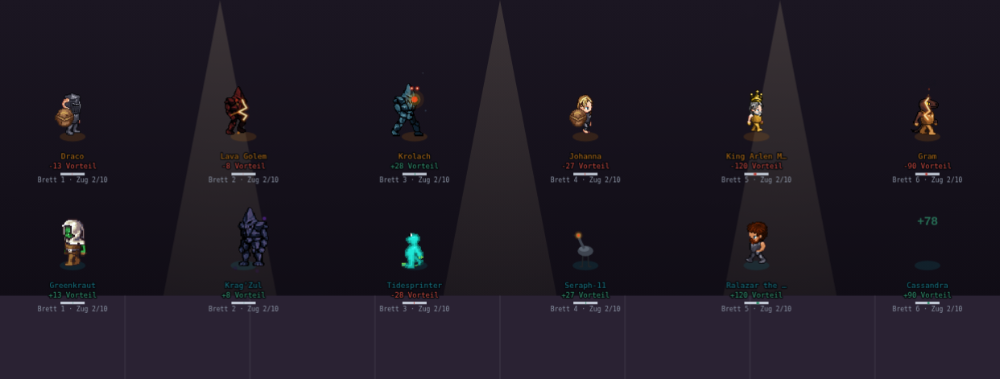
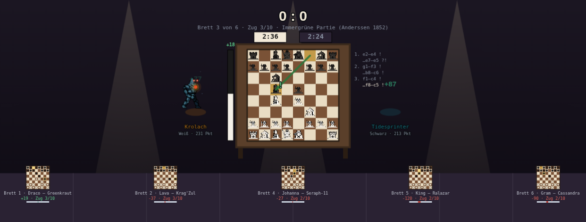
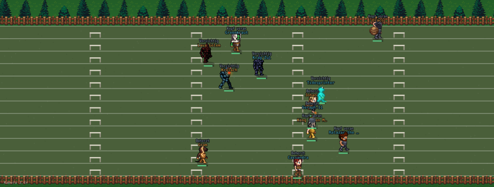
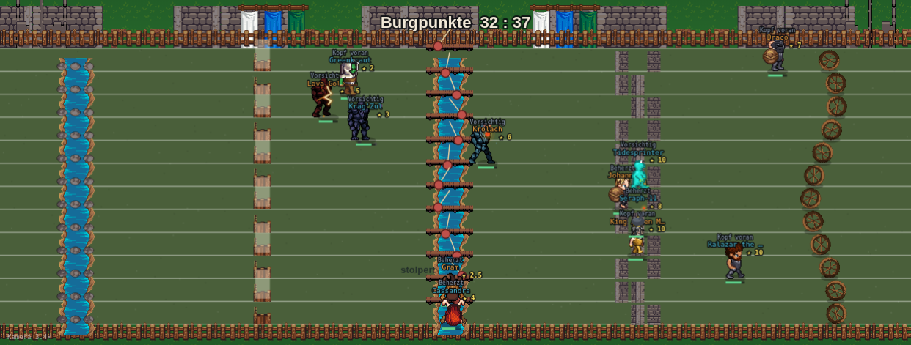
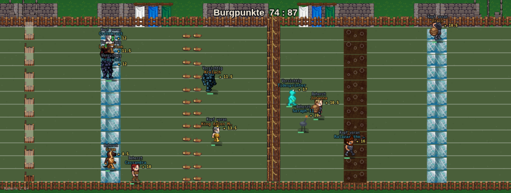

# Speed-Schach und Takeshi's Castle: echte Bilder, mehr Assets, eine sichtbare Wertung (Fable, 05.09.2026)

Stand `f251ab00` (`origin/main`, 05.09., nach PR #801 Spurt-Optik, #802 Takeshi-Mechanik, #803 Football).
Reine Recherche und Planung: **keine Zeile am Motor im Hauptcheckout geändert.** Beide Bühnenbilder
sind aber in einem eigenen Worktree **prototypisiert und gesichtet** — die fünf Beweisbilder in
diesem Ordner sind Screenshots der laufenden Engine (Playwright, `window.__arena.setDisc()`, über
einen eigenen HTTP-Port, damit die Kacheln laden). Alle Rangtreue-Zahlen sind **kaderfest**
(`scripts/lib/rangtreue-messung.mjs`, fünf echte Paarungen aus `kaderfamilie-live-save.json`,
n = 24), gemessen an demselben Worktree; die unveränderte Kopie reproduziert die eingecheckte
Takeshi-Zahl **bit-identisch** (0,886 / 0,073 / 0,951 / 0,126). Der vollständige Prototyp-Patch
liegt als `takeshi-schach-optik-prototyp-05-09.diff` daneben (347 Zeilen, `git apply`-fähig gegen
`f251ab00`) — als Vorlage für die Umsetzungsrunde, **nicht** als fertige Umsetzung.

Chris' Auftrag (05.09., nach den Screenshots): „zur Darstellung von Schach + Takeshi sowieso wir
brauchen mehr Assets und das soll cool aussehen! Am liebsten mit Seeds dass es verschiedene
Hindernisse gibt auf die die Spieler reagieren müssten wenn möglich? Und immer wenn Spieler es
schaffen gibts nen Punkt wenn nicht dann nicht und am Ende wird zusammengezählt oder so. Oder es
gibt verschiedene Schwierigkeiten bei den Hindernissen usw. Lass dir mal was einfallen."

---

## 0. Die Antwort in acht Sätzen

1. **Speed-Schach bekommt ein eigenes Bühnenbild nach dem Gewichtheben-Muster** (`art.schach`
   als Weiche neben `art.heben`): ein großes Fokus-Brett auf einem Tisch, beide Spieler daneben,
   zwei Schachuhren, ein Bewertungsbalken wie bei lichess, der letzte Zug mit Pfeil und
   Annotation (`!` / `?!`), eine Zugliste, und die fünf anderen Bretter klein am unteren Rand.
   **Prototyp steht** (`schach-optik-prototyp-05-09.png`), rein zeichnerisch, Wertung unverändert.
2. **Die Züge sind echt, aber Kulisse:** sechs berühmte Eröffnungen (Opera-Partie, Unsterbliche,
   Immergrüne, Damengambit, Najdorf, Spanisch) mit **genau 20 Halbzügen = rundenN × 2**. Der
   Durchgangs-Rechner bestimmt weiter Punkte und Vorteil; das Brett zeigt nur, *wo* gezogen
   wird, und markiert den enthüllten Zug als stark oder verpatzt. Kein Schachmotor, kein Risiko.
3. **Assets für Schach: ein einziger neuer Download** (Catacomb-Chess-Figuren, CC0, OpenGameArt,
   628 × 360 → zwölf 48er-Zellen, Schwarz per Umfärbung). Brett und Tisch sind Canvas — zwei
   Farben im Schachmuster sind schneller gezeichnet als geladen, und sie skalieren mit dem
   Fokus-/Mini-Brett verlustfrei. **Sitzende Figuren sind möglich:** der LPC-Generator führt
   eine `sit`-Animation (3 Bilder × 4 Richtungen), und **62 der 68** Baukasten-Ebenen haben sie
   (Abschnitt A.3) — Einbau als Schritt 2, der Prototyp zeigt noch stehende Figuren.
4. **Takeshi bekommt zehn verschiedene Fallen auf vierzehn Stationen** — alle aus den **zwei
   schon geholten LPC-Paketen** (Terrains, Medieval Decorations): Honeycomb-Labyrinth, Skipping
   Stones, Knock-Knock-Türen (Papier oder Holz, je Bahn anders), Bridge Ball mit Pendel,
   Slip-Way-Eisbahn, High-Rollers-Räder, Border Wall mit Strickleiter, Roller-Game-Walzen,
   Dragon-God-Schlammgrube, Final-Fall-Spanischer-Reiter. Dazu **Takeshis Burg** über der Bahn,
   Banner, das Burgtor am Ziel, Pranger und Holzstapel davor. **Prototyp steht** (zwei Bilder).
   Vierzehn neue Schnitte, kein neuer Credit.
5. **Seeds: ja, und sie sind gemessen unschädlich.** Drei Arten der Fallenfolge je Renn-Saat
   (Permutation, freie Ziehung, drei benannte Burg-Kurse) bewegen rho um −0,012 bis −0,018 bei
   einer Kader-Spannweite von 0,073 — von null nicht unterscheidbar, bei 2/3/5/6 je Seite überall
   ≥ 0,89. **Empfehlung: drei benannte Kurse** („Nordhof", „Sumpfpfad", „Die Mauern"), nicht die
   freie Ziehung — ein Kurs mit Namen ist etwas, das man wiedererkennt und über das man redet.
6. **Wertung: Chris' beide Vorschläge sind gemessen — und beide würden als PLATZIERUNGSERSATZ die
   Rangtreue zerstören** (binär 0,464, Schwierigkeitsstufen 0,470, mit halbem Punkt für den
   Durchbruch 0,557). Der Grund ist derselbe, den der Takeshi-Fix gerade beseitigt hat: ob eine
   Falle „geschafft" ist, entscheidet ein Wurf (56 % sauber bei TECHNIK 70). Zwölf Läufer nach
   vierzehn Münzwürfen zu ordnen, ist kein Maß.
7. **Deshalb beides — als zwei Größen, die zwei verschiedene Fragen beantworten:** die
   **Platzierung** (Zeit + Ausscheiden, 0,886) bleibt die Wertung, die das Spiel entscheidet.
   Die **Burgpunkte** (je Falle 1–3 Sterne nach Schwierigkeit; sauber = alle, durchgebrochen =
   die Hälfte, gestürzt = keine; laufend am Läufer und als Teamstand auf der Burgmauer) sind das
   sichtbare „Punkt wenn geschafft", das Chris will — und sie entscheiden, was die Platzierung
   nicht entscheiden kann: den **Spieler des Spieltags** dieser Disziplin und den Gleichstand
   zweier Ausgeschiedener. Falls die Summe das Rennen doch entscheiden soll, gibt es eine
   gemessene Fassung, die die Schranke hält (W4, 0,881 / bei 2 je Seite 0,842) — Abschnitt B.5.
8. **Die anderen 19 Disziplinen sind bit-identisch** — vollständig nachgemessen am Prototyp-Worktree
   (Abschnitt B.7). Aufwand für die Umsetzung: Schach 1 Tag (ohne Sitzen) + ½ Tag (Sitzen),
   Takeshi 1 Tag; beide ohne Motor-Risiko, weil alles hinter `art.schach` / `art.takeshi` liegt.

---

## Teil A — Speed-Schach: ein echtes Schachbrett

### A.1 Was heute gezeichnet wird, und warum es so aussieht

`BUEHNE_ART["speed-schach"]` (`engine.js:10367`) ist die Duell-Variante der Bühne (`duell:true`,
`rundenN:10`, `jeSeite:6`): Brett i ist mein Teilnehmer i gegen den Gegner i, jeder Durchgang
ein „Zug", der Vorteil die laufende Differenz der Durchgangspunkte (`verlauf`, `:10561`). Die
Wertung liest seit der Tennis/Fechten-Runde die **eigene** Punktsumme, nicht den Vorteil
(`MOTOREN[bd].wert`, `:17436`) — rho 0,889 / Saison 0,979 in der letzten Gesamtmessung.

Gezeichnet wird das alles von `zeichneBuehne()` (`:10956`), dem **gemeinsamen Reihenbild** aller
sieben Bühnen-Disziplinen: zwei Reihen stehender Figuren, darunter Name, „+X Vorteil", ein
Balken und „Brett n · Zug k/10". Genau das zeigt `schach-optik-vorher-05-09.png`:



Der eine Ausbruch aus dem Reihenbild ist Gewichtheben: `if(art.heben){ zeichneHeben(art); return; }`
(`:10963`) verzweigt vor der Reihen-Schleife in ein eigenes Bild (`zeichneHeben`, `:11043`) —
aktives Duell groß und mittig, Hantel mit Last, Duellstand groß, die wartenden Paare klein am
unteren Rand. **Das ist das Muster**, und es passt auf Schach fast wörtlich: „aktives Duell" wird
„Fokus-Brett", „Hantel" wird „Brett mit Figuren", „wartende Paare" werden „die anderen fünf Bretter".

Was Schach vom Heben unterscheidet, und was das Bild deshalb anders lösen muss: beim Heben läuft
ein Duell nach dem anderen (`duellNr`, `letzterHebenZug`); beim Schach laufen **alle sechs Bretter
gleichzeitig** — die Queue (`:10575`) enthüllt Runde für Runde je ein Ereignis auf jedem Brett,
alle 0,5 s eines. Der Fokus darf also nicht dem zuletzt enthüllten Zug folgen, sonst springt er
zwölfmal je Runde. Dafür gibt es die Regie (A.4).

### A.2 Assets — geprüft, geladen, entschieden

Netzzugang war in dieser Runde offen (OpenGameArt, Kenney, GitHub-Raw, Wikipedia — alle 200),
anders als in der Staffel-Runde. Geprüft wurden:

| Kandidat | Lizenz | Was es ist | Entscheidung |
|---|---|---|---|
| **„Chess pieces pixel art"** (Catacomb Chess, theidiotmachine, OpenGameArt) | **CC0** | `chess_clean.png` 628 × 360, Pixel-Umrisse auf grauem Grund: Bauer, Turm, Springer, Läufer, Dame, König in zwei Zeichnungsvarianten, dazu Alternativfiguren; Figuren ~42 × 41 px | **genommen** — pixelig wie der LPC-Baukasten, Schwarz durch Umfärben der Cremefüllung (im Schnitt-Skript, kein Handmalen) |
| „2D Chess Pack" (Screaming Brain Studios, OpenGameArt) | CC0 | 20 MB, gerenderte 128-px-Figuren in Holz/Marmor/Plastik/Rost, Top-Down und isometrisch, 29 fertige Bretter 512 × 552 | verworfen — gerenderte Halbtöne neben 64-px-Pixelfiguren sehen aus wie ein fremdes Spiel; die Bretter brauchen wir nicht (s. u.) |
| „Chess pieces" (OGA, CC-BY-SA 3.0) / „Chess Pieces Set" (GPL 2.0) | CC-BY-SA / GPL | Vektor-/Foto-Sets | verworfen — Stil und Lizenzlast |
| Kenney „Boardgame Pack" | CC0 | 490 Assets, Karten/Würfel/Spielsteine, keine erkennbaren Schachfiguren im Vorschaubild | nicht geladen |
| LPC-Fundus (`public/sprites/*`, `quellen.json`) | — | keine Bretter, keine Figuren; Tische/Bänke/Hocker in `decorations-medieval.png` vorhanden | Tisch als Canvas (s. u.), Hocker optional |

**Brett: Canvas, kein Asset.** Ein Schachbrett sind zwei Farben in acht mal acht Feldern. Als
Canvas-Rechtecke ist es scharf in jeder Größe (Fokus 24 px je Feld, Mini 6 px je Feld), braucht
keine Skalierung mit Halbtönen und lässt sich mit dem Zug-Highlight (gelbes Feld, Pfeil) direkt
übermalen. Ein Bild-Brett hätte zwei Größen gebraucht und beim Skalieren gefranst. Dasselbe gilt
für den Tisch: zwei braune Rechtecke und zwei Beine, wie die Hantel beim Heben („keine neue
Sprite-Pipeline, nur Primitiven").

**Figuren-Rückfall:** Lädt `schach_weiss.png` nicht, zeichnet der Prototyp Kreise (hell/dunkel mit
Rand) — dieselbe Regel wie bei jeder Kachel in `bodenSpurt` (jede Datei einzeln geprüft, kein
Satz als Ganzes). Auf den Mini-Brettern sind die Kreise ohnehin das Mittel der Wahl: 6-px-Felder
tragen keine 48er-Figur.

**Schnitt (reproduzierbar, gehört in `scripts/arena-assets-schneiden.mjs` bzw. ein
`buehne-assets-schneiden.mjs`):** Hintergrund (169,156,152) → transparent (Toleranz 20),
zwei Reihen à sechs Figuren aus `chess_clean.png` — Spalten x = 246–291 / 297–339 / 348–390 /
401–443 / 454–496 / 507–549, Zeilen y = 26–66 (Reihe 1) und 85–125 (Reihe 2) — in 48 × 48-Zellen
unten bündig zentriert → `schach_weiss.png` (288 × 96, Zeile 0 = Bauer, Turm, Springer, Läufer,
Dame, König; Zeile 1 = Zeichnungsvariante, ungenutzt). `schach_schwarz.png` = dieselbe Datei,
alle Pixel mit R > 150 und G > 140 (die Cremefüllung) auf (62,58,54). Ablageort in der Umsetzung:
`public/sprites/buehne/` mit eigenem `quellen.json` (Muster: `public/sprites/basketball/`), nicht
`arena/` — der Prototyp hat sie der Einfachheit halber in `arena/` geladen.

### A.3 Sitzende Spieler — der LPC-Generator hat die Animation

Chris' Wunsch „sitzend am Brett" ist ohne Handmalen erfüllbar: das GitHub-Repo des Universal LPC
Spritesheet Generators führt `spritesheets/<Ebene>/sit.png`, nachgeprüft am 05.09. per
GitHub-Raw (200): `body/bodies/male/sit.png` ist **192 × 256 = 3 Bilder × 4 Richtungen** zu
64 × 64 in LPC-Reihenfolge (oben / links / unten / rechts), also exakt das Raster, das
`zeichneSprite` schon kennt (`blickAus`, `:1906`).

**Deckung über den Baukasten, alle 68 Quellordner aus `public/sprites/baukasten/quellen.json`
einzeln abgefragt:** 62 haben `sit.png`. Es fehlen genau sechs: `cape/tattered/{bg,fg}`,
`cape/solid/{bg,fg}`, `hair/flat_top_fade/male`, `body/bodies/skeleton`. Für einen Umhang heißt
das: beim Sitzen ohne Umhang zeichnen (er hinge ohnehin hinter dem Hocker); für das Skelett und
die eine Frisur: stehen bleiben lassen (Rückfall pro Ebene, wie bei `hurt`).

Einbau (Schritt 2 der Umsetzung, ½ Tag):
1. `sit`-Blätter der 62 Ebenen byte-identisch nach `public/sprites/baukasten/` holen (dasselbe
   Verfahren wie bei `walk/run/idle/hurt` am 23.08., Alpha-Masken-Abgleich, `quellen.json`
   fortschreiben), und in die base64-Tabelle `SPRITES` der Engine nach demselben Muster wie
   `<ebene>_walk` als `<ebene>_sit` — `scripts/baue-battle-artefakt.mjs` kennt den Weg.
2. `ANIBILDER.sit = 3`; in `zeichneSprite` vor `let ani="walk"`: `if(u.sitzt)ani="sit";`
   (Rückfall: fehlt `<ebene>_sit`, zeichnet die Ebene ihr `walk`-Standbild — die Ebenen-Schleife
   prüft je Blatt, nicht je Figur).
3. `zeichneSchach` setzt `sitzt:true` für die zwei Fokus-Spieler und stellt je einen Hocker
   (`decorations-medieval.png`, die Hocker/Bänke bei y ≈ 1056–1120 — Koordinaten beim Einbau
   per Raster wie in Anhang B) unter sie. Richtung: links Sitzender blickt rechts (Reihe 3),
   rechts Sitzender links (Reihe 1) — Prototyp übergibt dafür `vx: ±4`.

### A.4 Das Bühnenbild — wie prototypisiert



Von oben nach unten, alles in `zeichneSchach(art)` (Anhang C, im Diff `:11146 ff.`):

| Element | Was es zeigt | Woher die Zahl kommt |
|---|---|---|
| **Duellstand** groß (`0 : 0`) | gewonnene Bretter je Seite, wie beim Heben | Vorzeichen von `a.vorteil` je fertigem Brett |
| Kopfzeile | „Brett 3 von 6 · Zug 3/10 · Immergrüne Partie (Anderssen 1852)" | `schachFokus`, `max(a.aktuell,b.aktuell)+1`, `SCHACH_PARTIEN[fb]` |
| **Zwei Schachuhren** | 3:00 Blitz; ein starker Zug kostet 8 s, ein verpatzter 20 s; wer am Zug ist, hat die helle Uhr | `runden[i].ereignis === erfolgWort` — dieselbe Information, die heute nur im Feed steht |
| **Bewertungsbalken** links (lichess-Art) | Weiß-Anteil 0,5 + 0,5 · Vorteil / max | `a.verlauf[a.aktuell]` — exakt die Zahl, die vorher als „+X Vorteil" unter der Figur stand |
| **Brett** 8 × 24 px auf dem Tisch | Stellung nach k Halbzügen, k = (a.aktuell+1) + (b.aktuell+1) | `schachStellung(partie, k)` — Züge anwenden, Rochade als Königszug ± 2 mit Turm |
| Letzter Zug | Start- und Zielfeld gelb, grüner Pfeil, am Zielfeld **`!`** (grün) oder **`?!`** (rot) | Ereignis des zuletzt enthüllten Zuges dieses Bretts |
| Zugliste rechts | die letzten acht Halbzüge, `1. e2–e4 !`, `…e7–e5 ?!` | Partie + Ereignisse |
| **Zwei Spieler** | Weiß links (eigenes Team, zieht in der Queue zuerst), Schwarz rechts, Name, „Weiß · 231 Pkt" | `zeichneSprite`, `u.summe` |
| **Fünf Mini-Bretter** | Stellung als Kreise, letzter Zug gelb, „Brett 1 · Draco – Greenkraut", Vorteil und Zug, Balken | wie oben je Brett |
| Schwebetexte (`+87`) | nur am Fokus-Brett, am jeweiligen Spieler | `floats` mit `_teilnehmer` |

**Die Partien** (`SCHACH_PARTIEN`, sechs Stück, je genau 20 Halbzüge in Koordinatennotation,
alle sechs in einem Skript gegen eine Grundstellung durchgespielt und auf „Zugfeld besetzt, Farbe
am Zug" geprüft): Opera-Partie (Morphy 1858), Unsterbliche (Anderssen 1851), Immergrüne
(Anderssen 1852), Damengambit orthodox, Sizilianisch Najdorf, Spanisch geschlossen. Historische
Partien sind gemeinfrei; für die Umsetzung könnte man die Liste auf zwölf erweitern und je
Renn-Saat sechs ziehen (gleicher `rr()`-Weg wie überall). Brett i spielt Partie i.

**Was Kulisse ist und was nicht — ehrlich gesagt:** Stellung, Pfeil, Uhr und Zugliste sind
*Illustration* der Ereignisfolge, die der Durchgangs-Rechner ohnehin würfelt. Die Annotation
(`!`/`?!`) und die Uhr sind dabei **wahr** (sie zeigen das Ereignis des Zuges), die Stellung ist
**plausibel** (eine echte Eröffnung, aber nicht *deshalb* stark oder schwach, weil der Rechner
das sagt). Das ist dieselbe Ehrlichkeit wie die Hantel beim Heben: die Kilos sind echt, die
Pose ist Sprite. Ein Schachmotor wäre der falsche Aufwand für eine Disziplin, deren Rangtreue
bereits 0,889 liest.

### A.5 Sechs Bretter gleichzeitig — die Regie

Alle sechs laufen im Gleichschritt (Runde r wird auf allen Brettern enthüllt, bevor Runde r+1
beginnt). Drei Regeln, im Prototyp die erste umgesetzt:

1. **Regie-Automatik:** alle 3 s springt der Fokus auf das Brett mit dem **engsten laufenden
   Vorteil** — das spannendste. Kein Sprung je Enthüllung, kein Flackern; das Bild wechselt
   zwanzigmal je Auftritt, ungefähr wie ein Fernsehschnitt.
2. **Klick pinnt:** ein Klick auf ein Mini-Brett oder auf den Namen in der Kaderleiste
   (`kaderL/kaderR`, dieselbe Auswahl-Mechanik wie die Rennplan-Ansage und der Basketball-Fokus)
   setzt den Fokus fest und schaltet die Regie ab; ein zweiter Klick löst. Umsetzung: ein
   `schachPin` neben `schachFokus`, Treffertest über die Mini-Brett-Rechtecke im `#cv`-Klick-Handler.
3. **Endstand:** sind alle Bretter fertig, zeigt das Fokus-Brett das Brett des **eigenen besten**
   Spielers (höchste `summe`) — das ist, was man am Ende ansehen will.

Überladen wirkt es nicht: das Fokus-Brett ist das einzige Element mit Figuren; die fünf Minis
sind bewusst Kreise auf 48 × 48 px mit zwei Textzeilen — das „was noch läuft"-Gedächtnis, wie die
wartenden Paare beim Heben.

### A.6 Umsetzung — Orte, Schritte, Abnahme

| # | Schritt | Ort | Umfang |
|---|---|---|---|
| 1 | `schach:true` in `BUEHNE_ART["speed-schach"]`; Weiche `if(art.schach){ zeichneSchach(art); return; }` direkt hinter der Heben-Weiche in `zeichneBuehne` | `engine.js:10375`, `:10963` | 2 Zeilen |
| 2 | `SCHACH_PARTIEN`, `schachGrund/schachStellung`, `zeichneSchachBrett`, `zeichneSchach` — aus dem Diff übernehmen (Anhang C) | hinter `zeichneHeben`, vor `stats()` (`:11145`) | ~130 Zeilen, rein zeichnerisch |
| 3 | Figuren-Blätter nach `public/sprites/buehne/` + `quellen.json` + Schnitt im Skript; Laden über eine eigene `SB_TEILE`-Liste nach dem Muster `BK_TEILE` (`:14226`), Rückfall Kreise | `:14211 ff.` | ½ h |
| 4 | Klick-Pin und Kaderleisten-Kopplung (A.5, Regel 2) | `#cv`-Klick-Handler, `kaderleiste` | 2 h |
| 5 | Sitzen (A.3): `sit`-Blätter, `ANIBILDER.sit`, `u.sitzt`, Hocker | Baukasten, `zeichneSprite` `:2089` | ½ Tag |
| 6 | Abnahme: `miss-alle-disziplinen.mjs 24 speed-schach` **bit-identisch** zur Basislinie (nur Zeichnen); Screenshot-Skript nach dem Muster `scripts/screenshot-gewichtheben.mjs` | — | gemessen am Prototyp: 0,889 / 0,060 / 0,979 / 0,021 = `main`, s. B.7 |

Dasselbe Bild trägt **I-Spy** nicht (kein Brett), aber das Muster „Fokus-Duell + Minis" schon;
und **Wettessen** — Chris' zweiter Fund, „kein Tisch, kein Essen" — wäre der nächste Kandidat für
eine eigene Weiche: langer Tisch quer, sechs gegen sechs an der Tafel, die Punktesäule als
Tellerstapel (`decorations-medieval.png` hat Fässer, Krüge und Tische; Essen fehlt im Fundus —
Kenney „Food Kit" (CC0) wäre die erste Suche). Eigener Auftrag, hier nur notiert.

---

## Teil B — Takeshi's Castle: zehn Fallen, drei Kurse, Burgpunkte

### B.1 Was heute gezeichnet wird, und warum alle vierzehn Fallen gleich aussehen

`BAHN_ART["takeshis-castle"]` (`engine.js:14805`) hat seit #802 vierzehn Stationen mit sieben
typisierten Fallen (`hindernisTypen`, zweimal durchlaufen) und dem Zeitpreis `huerdePreis 0,80` —
aber **keine `hindernisBilder`-Liste**. `bodenSpurt` (`:14455 ff.`) zeichnet je Station dann den
letzten Zweig der Kette: `hindernisWort` ist „Falle", nicht „Griff" und nicht „Kurve", also die
**Hürden-Pfosten** (`:14477`) — zwei graue Pfosten mit weißer Latte, vierzehnmal. Der Baum-Zaun-
Rasen-Rahmen ist derselbe wie beim Spurt, nur die Bahnfarbe (`#4a5f3a`) ist eigen.



Genau das hat Chris gesehen. Was passiert, steht nur im Feed („reißt die Falle", „nimmt die Falle
mit Gewalt", „scheidet aus — Nerven am Ende"), und `zeichneSpurt` (`:15604`) kennt keine
Fallen-Punkte, weil es sie nicht gibt: der Motor zählt `gestolpert` und `durchbruch`, aber nicht
*je Falle*, was daraus wurde.

### B.2 Das echte Format, auf sieben Typen abgebildet

Ergänzend zu `staffel-offene-fragen-plus-takeshis-castle-05-09.md` 2.5 (Ausscheide-Kaskade,
Wipeout-Zeitpreis, Ordnung nach Strecke) hier die **Spiele selbst** (Wikipedia „Takeshi's Castle",
Abschnitte Games / International — u. a. Skipping Stones, Knock Knock, Honeycomb Maze, Bridge
Ball, Final Fall, Slippery Wall / Border Wall, Sumo Rings, Dragon God Lake, Roller Game, Hello Mr.
Turtle, Avalanche, High Rollers, Slip Way, Mushroom Trip, Velcro Wall, Wet Paint, Tug of War), und
was jedes sportlich prüft — das ist die Zuordnung zu den sieben Sub-Skills, die #802 gesetzt hat:

| Sub-Skill (`lang`) | Spiel A (Durchgang 1) | Spiel B (Durchgang 2) | Was es prüft |
|---|---|---|---|
| TECHNIK „Falle lesen" | **Honeycomb Maze** — Wände mit Lücke, je Bahn woanders | **Slip Way** — Eisbahn, den Schwung lesen | Intelligenz, Aufmerksamkeit |
| WENDIGKEIT „Aufstehen" | **Skipping Stones** — Trittsteine über Wasser | **Roller Game** — wippende Walzen | Balance, Geschick |
| WUCHT „Durchbrettern" | **Knock Knock** — Türen; Papier oder Holz | **Border Wall** — Palisade mit Strickleiter | Kraft, Nicht-loslassen |
| STEHEN „Wille" | **Bridge Ball** — Planke über Wasser, Pendelball | **Dragon God Lake** — Schlammgrube | Durchhalten |
| ROBUST „Nehmerqualität" | **High Rollers** — rollende Räder | **Final Fall** — Spanischer Reiter | Einstecken |

Die zwei „Extras" der Show, die keine Falle sind, werden Kulisse: **Takeshis Burg** (Mauer, zwei
Türme, Banner) über der Bahn und das **Burgtor** am Ziel (der „Showdown"-Ort), davor Pranger,
Stock und Holzstapel — die Rüstkammer der Emperor's Guards.

### B.3 Assets — die zwei Pakete reichen; vierzehn neue Schnitte

Geprüft wurde zuerst, ob Fremdes nötig ist: **[LPC] Dungeon Elements** (Sharm, CC-BY 4.0; geladen,
enthält Schädel, Kessel, Feuer, Gitter — keine Fallen, keine Stacheln), **[LPC] Wooden Bridge
Rework** (CC-BY-SA 3.0, 96 × 256; überflüssig, `hind_balken` ist die bessere Planke), OGA-Suchen
„lpc trap / spikes / boulder / obstacle course" (leer). **Ergebnis: nichts Neues nötig.** Alles
Folgende ist aus `lpc-terrains.zip` und `decoration_medieval.zip` geschnitten, die
`scripts/arena-assets-schneiden.mjs` ohnehin lädt — dieselben Urheber, dieselben `HERKUNFT/`-Credits.

Neue Schnitte (Blatt, x, y, B × H — am 2×/3×-Raster gegengeprüft, s. Anhang B; in den
`SCHNITTE`-Block des Skripts und in `quellen.json` zu übernehmen):

| Zielname | Blatt | x | y | B×H | Was es zeigt | Verwendung |
|---|---|---:|---:|---|---|---|
| `falle_tuer` | `fence_medieval.png` | 128 | 512 | 32×64 | Holztor, geschlossen | Knock Knock (24×48 gezeichnet; Papier = weiße Lasur 38 %) |
| `falle_strickleiter` | `fence_medieval.png` | 384 | 64 | 64×64 | Strickleiter | Border Wall, über `hind_wand` (Ausschnitt 24 px breit) |
| `falle_spitzen` | `fence_medieval.png` | 288 | 224 | 96×128 | Spanischer Reiter (Kreuzpfähle) | Final Fall (Ausschnitt 0/96, 32×32) |
| `burg_mauer` | `fence_medieval.png` | 0 | 672 | 256×64 | Zinnenmauer | Burg über der Bahn (gekachelt) **und** Labyrinth-Stücke (36×56 → 18×28) |
| `burg_turm` | `fence_medieval.png` | 384 | 512 | 96×150 | Turm mit Torbogen | Burg, links und rechts |
| `burg_tor` | `fence_medieval.png` | 256 | 512 | 96×150 | Torhaus mit zwei Öffnungen | am Ziel, unter der Kamera |
| `deko_rad` | `decorations-medieval.png` | 416 | 1440 | 32×32 | Wagenrad | High Rollers (rotiert, pendelt 18 px) |
| `falle_walze` | `decorations-medieval.png` | 416 | 672 | 32×32 | liegender Stamm | Roller Game (zwei Walzen, wippen 3 px) |
| `boden_eis` | `terrain-v7.png` | 640 | 928 | 32×32 | Eis, voll deckend | Slip Way (48×30, α 0,9, drei Schlieren) |
| `deko_banner` | `decorations-medieval.png` | 0 | 1216 | 192×80 | Stange mit sechs Bannern | Burg (Ausschnitt 96 px, zweimal) |
| `deko_pranger` | `decorations-medieval.png` | 128 | 1408 | 128×64 | Pranger | vor dem Burgtor |
| `deko_stock` | `decorations-medieval.png` | 256 | 1440 | 128×32 | Fußblock | vor dem Burgtor |
| `deko_holz` | `decorations-medieval.png` | 352 | 640 | 64×64 | Holzstapel | vor dem Burgtor |
| `falle_fass` | `decorations-medieval.png` | 64 | 704 | 32×64 | Fass | vor dem Burgtor (Reserve für eine elfte Falle „Rice Bowl") |

Ohne neuen Schnitt, aus dem Bestand: `hind_wasser_l/r` (Skipping Stones, Bridge Ball),
`hind_balken` (Planke), `hind_wand` (Palisade), `boden_stein` (Trittsteine, per `clip` zu
Ellipsen), `boden_erde` (Schlamm, mit `multiply` abgedunkelt). Der Pendelball, die Schlammblasen,
die Eis-Schlieren und der Papier-Schimmer sind Primitiven — kein Blatt trägt so etwas, und sie
müssen sich nach `rennT` bewegen.

**Zehn Bilder, vierzehn Stationen — so hängen sie zusammen:** `fallenBild` ist eine Tabelle
`Typ → [Bild A, Bild B]`; Station i mit Typ t bekommt `fallenBild[t][floor(i / 7) % 2]`. Damit
folgt das Bild dem **Typ**, nicht der Stationsnummer — und wenn die Fallenfolge je Saat wechselt
(B.4), wechselt das Bild mit. Zwei Bilder je Typ sind der Grund, warum das zweite Durchlaufen
nicht wie eine Wiederholung aussieht.





Was die Bilder zeigen und was noch fehlt (Sichtprüfung): Mauer, Türme, Banner und Burgpunkte-Stand
über der Bahn; jede Station als eigene Kachelsäule über alle zwölf Bahnen; die Sterne je Läufer
rechts neben der Figur (`★ 11,5`), bei Finishern in der Platz-Zeile. Nicht im Prototyp: das
Burgtor sitzt unter der Kamera hinter der Ziellinie und ist bei Zoom 3,4 im Bild erst am Schluss
(gewollt — es „kommt näher"); die Pranger-Deko unter der Bahn liegt außerhalb des Bildausschnitts
bei engem Zoom; die Emperor's Guards als NPC-Sprites (Baukasten, grüne Rüstung, `idle`-Blatt)
neben dem Burgtor wären ein Nachmittag — hübsch, nicht nötig.

### B.4 Seeds — verschiedene Fallenfolgen je Rennen, gemessen unschädlich

Heute ist `hindernisTypen` **fest**: jedes Rennen hat dieselben vierzehn Fallen in derselben Folge.
Die Typen sind zwar schon variabel im Sinn von „verschieden", aber nicht im Sinn von „anders als
letztes Mal" — und Chris' „mit Seeds" meint das Zweite. Drei Fassungen sind gebaut und gemessen
(Patch in Anhang A, gated hinter `window.__SEQ_MODE`, in `bauSpurt` aus `seed` über einen
eigenen LCG mit **oberen** Bits — die Lektion aus `zieheFormkarten`):

| Fassung | Was | rho/Spiel (6 je Seite) | Spannweite | Saison | bei 2 / 3 / 5 je Seite |
|---|---|---:|---:|---:|---|
| Basis | feste Folge (heute) | 0,886 | 0,073 | 0,951 | 0,933 / 0,926 / 0,892 |
| **S1** Permutation | dieselben 14 (2× jeder Typ), Reihenfolge je Saat gemischt | 0,874 | 0,090 | 0,958 | 0,942 / 0,940 / 0,890 |
| S2 freie Ziehung | 14 Fallen je Saat frei aus 7 gezogen (Multimenge variiert) | 0,868 | 0,073 | 0,951 | — |
| **S3** drei Kurse | drei fest entworfene Folgen (je 2× jeder Typ), Kurs je Saat | 0,876 | 0,091 | 0,944 | 0,958 / 0,929 / 0,898 |

Alle drei bewegen rho um weniger als die Kader-Spannweite (0,073) — nach der Faustregel aus
`messgrundlage-kaderfest.md` von null nicht unterscheidbar — und halten die Schranke bei allen
Kadergrößen, die der Saisonplan würfelt (2/3/5/6, nie 4). Warum das so sein muss: bei S1 und S3
ist die **Multimenge** der Fallen gleich, also die Summe der Zeitpreise eines Läufers
reihenfolgeunabhängig bis auf Reserve- und Nerven-Nebeneffekte. S2 verändert die Multimenge und
damit, welche Sub-Skills in *diesem* Rennen zählen — die Saisonzahl bleibt, die Einzelspielzahl
sinkt minimal (0,868); das ist die Richtung, in der man nicht weitergehen sollte.

**Empfehlung: S3, drei benannte Kurse.** Nicht die freie Ziehung (S2), obwohl sie am
abwechslungsreichsten wäre — ein Kurs, der einen Namen hat („Der Nordhof", „Der Sumpfpfad",
„Die Mauern"), ist etwas, das der Spieler wiedererkennt und in der Vorschau lesen kann
(`fbar`: „Takeshi's Castle · Der Sumpfpfad"); eine Zufallsfolge ist nur Rauschen. Die drei Kurse
aus der Messung (Typfolgen in Anhang A) sind so gebaut, dass jeder mit einer anderen Falle
beginnt und kein Typ zweimal hintereinander kommt; die Bilder folgen den Typen (B.3), also sieht
jeder Kurs anders aus, und die Deko könnte je Kurs variieren (Banner-Farbe, Bahnfarbe — reine
Kosmetik). Sind es einmal fünf Kurse, ist das eine Zeile mehr, keine Messung mehr — die Multimenge
bleibt.

Umsetzung: `kurse:[[...],[...],[...]]` in `BAHN_ART["takeshis-castle"]`, in `bauSpurt` nach
`seed=normalisiereSaat(saat)` ein `kursIdx` aus dem Saat-LCG (obere Bits), `HUERDEN_TYP(i)` als
Funktion statt `hindernisTypen[i%7]` an der einen Lesestelle in `stepSpurt` (`:15400`) — Spurt
führt kein `kurse` und bleibt bit-identisch.

### B.5 Wertung — Chris' zwei Vorschläge gemessen, und was daraus wird

Alle Fassungen sind **reine `wert()`-Varianten** (Anhang A): die Mechanik läuft unverändert, nur
das Maß, an dem ein Läufer gemessen wird, wechselt. Dafür protokolliert der Patch je Läufer jede
Falle (`u.fallen[]`: Typ, Skill, Stopp-Anteil, Ausgang sauber / durchgebrochen / gestürzt) — ein
Protokoll, das ohnehin in die Umsetzung gehört, weil das Bild es braucht.

| Fassung | Was ein Läufer bekommt | 6 je Seite | Spannw. | Saison | 2 je Seite | 3 | 5 |
|---|---|---:|---:|---:|---:|---:|---:|
| **Basis** | Platzierung nach Zeit, Ausgeschiedene nach Strecke (heute) | **0,886** | 0,073 | 0,951 | 0,933 | 0,926 | 0,892 |
| **W1** (Chris a) | 1 Punkt je sauber genommener Falle, sonst 0, summiert | **0,464** | 0,227 | 0,678 | — | — | — |
| **W2** (Chris b) | Stufenpunkte je sauber genommener Falle (TECHNIK 2, WENDIGKEIT 1, WUCHT 3, STEHEN 2, ROBUST 3) | **0,470** | 0,232 | 0,685 | — | — | — |
| W2b | wie W2, Durchbruch zählt die halbe Stufe | 0,557 | 0,240 | 0,832 | — | — | — |
| W3 | Stufe × (1 − Stopp-Anteil) je Falle — die *stetige* Zeit, die der Sub-Skill an der Falle spart | 0,941 | 0,067 | 0,958 | 0,967 | 0,979 | 0,961 |
| W3b | W3, Sturz kostet die halbe Stufe | 0,855 | 0,148 | 0,937 | 0,842 | 0,874 | 0,872 |
| **W4** | W3b + Zielbonus (12 − Platz) / 2 für Finisher | **0,881** | 0,117 | 0,937 | 0,842 | 0,886 | 0,880 |
| S1 + W4 | Permutation und W4 zusammen | 0,846 | 0,120 | 0,944 | — | — | — |
| S3 + W4 | drei Kurse und W4 zusammen | — | — | — | 0,842 | 0,902 | 0,882 |

**Lesart, in drei Sätzen.** *Erstens:* die beiden Vorschläge, so wie sie formuliert sind, ordnen
zwölf Läufer nicht — 0,46 ist die Zahl der Basketball-Arena vor jeder Reparatur. Das ist kein
Kalibrierungsproblem, sondern Konstruktion: ob eine Falle „geschafft" ist, entscheidet ein Wurf
gegen `0,26 + TECHNIK · 0,006` (56 % bei Skill 70, `stepSpurt` `:15404`), und vierzehn Würfe
je Läufer ergeben eine Binomialverteilung, deren Rauschen größer ist als der Abstand zweier
Läufer. Genau dieser Münzwurf war die Diagnose von #802 („die Falle kostet nichts, wenn sie
gelingt"), und der Zeitpreis ist die Reparatur. Eine Punktewertung, die nur den Wurf zählt, wirft
die Reparatur weg. *Zweitens:* W3 liest **höher als die Platzierung**, weil es die stetige Größe
zählt — aber es zählt damit fast nur den Sub-Skill selbst (der Stopp-Anteil *ist* `1 − 0,8 ·
Skill/100`), also „was der Läufer kann", kaum „was passiert ist"; als angezeigte Punktzahl wäre
es dem Spieler nicht erklärbar („warum hat er 2,7 Sterne für die Tür bekommen?"). *Drittens:*
W4 — stetig plus Sturzabzug plus Zielbonus — hält die Schranke bei jeder Kadergröße (0,842–0,886)
und ist die einzige Summen-Wertung, die man an Chris' Stelle nehmen könnte; sie liegt aber überall
unter der Platzierung und mit größerer Spannweite.

**Entscheidung: zwei Größen, zwei Fragen.**

1. **Die Platzierung bleibt die Wertung, die das Spiel entscheidet** (`wert()` unverändert,
   Teamduell und Saisonpunkte wie heute). Sie ist gemessen die beste, sie ist das Format (ein
   Rennen), und sie ist frisch repariert.
2. **Burgpunkte** werden gebaut — nach Chris' Vorschlag (b), mit dem einen Zusatz, der W2 von
   0,470 auf 0,557 hebt und vor allem dem Bild recht gibt: **je Falle 1–3 Sterne** nach
   Schwierigkeit (`fallenStufe`: Räder/Spanischer Reiter/Türen/Wand 3, Labyrinth/Eis/Bridge
   Ball/Schlamm 2, Trittsteine/Walzen 1); **sauber = alle Sterne, durchgebrochen = die Hälfte,
   gestürzt = keine**. Laufend am Läufer (`★ 11,5`), als Teamstand groß auf der Burgmauer
   („Burgpunkte 74 : 87"), am Ende in der Wertungstabelle als eigene Spalte, und in der
   Kaderleiste. Das ist das „immer wenn Spieler es schaffen gibt's nen Punkt … am Ende wird
   zusammengezählt" — sichtbar, verständlich, ehrlich.
3. **Wofür die Burgpunkte entscheiden dürfen**, ohne der Rangtreue etwas zu nehmen: **(a)** den
   *Spieler des Spieltags* in dieser Disziplin (heute nach `wert()`; für Takeshi nach Burgpunkten
   — der Läufer mit den meisten Sternen ist der, den das Publikum gesehen hat), **(b)** den
   Gleichstand zweier Ausgeschiedener bei gleicher Strecke (heute Reihenfolge), **(c)** optional
   als **Mutator** „Burgpunkte zählen" (`MUTATOREN`), der auf W4 umschaltet — dann ist es die
   gemessene Fassung, nicht W1/W2. **Nicht** als Teamsieg-Kriterium: die Teamsumme der Burgpunkte
   ist die Summe von zwölf Münzwurf-Reihen und würde das Rennen zur Lotterie machen.

Wenn Chris die Summe **als** Wertung will — der Satz „oder so" lässt das offen —, ist W4 die
Antwort mit Zahlen: 0,881 / 0,842 / 0,886 / 0,880, überall bestanden, aber überall schlechter als
das, was da ist. Ich würde es nicht tun; ich würde es ihm zeigen.

### B.6 Umsetzung — Orte, Schritte, Abnahme

| # | Schritt | Ort | Umfang |
|---|---|---|---|
| 1 | **Fallen-Protokoll** `u.fallen[]` in `stepSpurt` (Typ, Skill, Stopp-Anteil, Ausgang) — drei Zeilen an den drei Ausgängen; `burgpunkte(u)` daneben; `fallenStufe` in `BAHN_ART` | `:15400–15428` | 10 Zeilen, **rho-neutral** (nachgemessen: Basis bit-identisch mit Protokoll) |
| 2 | **Kurse** (B.4): `kurse` in `BAHN_ART`, `kursIdx` aus der Saat in `bauSpurt`, `HUERDEN_TYP(i)` an der einen Lesestelle; Kursname in `fbar`/Einlauf | `:14828`, `:14960`, `:15400` | 15 Zeilen; Abnahme `miss-alle-disziplinen 24 takeshis-castle` ≥ 0,85, `--je-seite=2/3/5` ≥ 0,80, Spurt/Staffel/Zeitfahren/Klettern bit-identisch |
| 3 | **Bilder** (B.3): 14 Schnitte in `arena-assets-schneiden.mjs` + `quellen.json` + `README`; `takeshi:true`, `fallenBild`; `zeichneFalleTakeshi` und die Burg-Kulisse aus dem Diff; Zeile `if(BA().takeshi){ zeichneFalleTakeshi(i,x,y,b); continue; }` in der Bahn-Schleife von `bodenSpurt` | `:14455 ff.`, Diff | ½ Tag, rein zeichnerisch |
| 4 | **Burgpunkte-HUD**: Teamstand auf der Mauer, Sterne am Läufer, Spalte in `wtbl` (`setWertungKopf`), Kaderleiste; Feed-Zeile „nimmt die Tür sauber — 3 Sterne" | `zeichneSpurt` `:15604`, `wertung` | ½ Tag |
| 5 | Spieler des Spieltags / Tiebreak nach Burgpunkten (B.5, 3a/3b) — zwei Stellen, beide außerhalb von `wert()` | wo `wert()` für den MVP gelesen wird; `:15453` | 2 h |
| 6 | Sichtprüfung im Spiel („review noch mal ingame"), `vx` im Stopp (offener Punkt aus #802, 3.6) prüfen | — | Screenshot |
| 7 | Basislinie neu bauen, `stand-aller-disziplinen.md` nachziehen | `baue-rangtreue-basislinie.mjs` | ¼ Tag |

Reihenfolge-Regel: 1 messen, 2 messen, dann 3–5 (die nichts messen dürfen). Die Prototyp-Zahlen
oben sind mit 1 + 2 (als Messpatch) + 3 + 4 gleichzeitig entstanden — die Umsetzung soll sie
getrennt nachvollziehen.

### B.7 Isolation — alle zwanzig am Prototyp-Worktree

`scripts/miss-alle-disziplinen.mjs 24` gegen den Worktree mit **allen** Patches (Messpatch,
Schach-Bild, Takeshi-Bild, Burgpunkte-Protokoll), Wertung auf `platz`, Kursmodus aus:

| Disziplin | `main` rho / Spannweite / Saison / Spannweite | Prototyp-Worktree | Bewegung |
|---|---|---|---|
| staffel | 0,915 / 0,089 / 0,951 / 0,093 | 0,915 / 0,089 / 0,951 / 0,093 | — |
| speed-schach | 0,889 / 0,060 / 0,979 / 0,021 | 0,889 / 0,060 / 0,979 / 0,021 | — |
| gewichtheben | 0,887 / 0,224 / 0,944 / 0,261 | 0,887 / 0,224 / 0,944 / 0,261 | — |
| takeshis-castle | 0,886 / 0,073 / 0,951 / 0,126 | 0,886 / 0,073 / 0,951 / 0,126 | — |
| showcase | 0,880 / 0,140 / 0,944 / 0,063 | 0,880 / 0,140 / 0,944 / 0,063 | — |
| spurt | 0,871 / 0,236 / 0,905 / 0,190 | 0,871 / 0,236 / 0,905 / 0,190 | — |
| time-trial | 0,867 / 0,050 / 0,909 / 0,056 | 0,867 / 0,050 / 0,909 / 0,056 | — |
| wettessen | 0,844 / 0,233 / 0,916 / 0,126 | 0,844 / 0,233 / 0,916 / 0,126 | — |
| fechten | 0,840 / 0,230 / 0,874 / 0,252 | 0,840 / 0,230 / 0,874 / 0,252 | — |
| tennis | 0,814 / 0,176 / 0,839 / 0,294 | 0,814 / 0,176 / 0,839 / 0,294 | — |
| breaking | 0,801 / 0,114 / 0,874 / 0,119 | 0,801 / 0,114 / 0,874 / 0,119 | — |
| climbing | 0,790 / 0,192 / 0,851 / 0,308 | 0,790 / 0,192 / 0,851 / 0,308 | — |
| basketball | 0,772 / 0,088 / 0,923 / 0,231 | 0,772 / 0,088 / 0,923 / 0,231 | — |
| eiskunstlauf | 0,757 / 0,125 / 0,958 / 0,091 | 0,757 / 0,125 / 0,958 / 0,091 | — |
| i-spy | 0,692 / 0,384 / 0,727 / 0,441 | 0,692 / 0,384 / 0,727 / 0,441 | — |
| hockey | 0,669 / 0,181 / 0,832 / 0,259 | 0,669 / 0,181 / 0,832 / 0,259 | — |
| football | 0,516 / 0,172 / 0,811 / 0,168 | 0,516 / 0,172 / 0,811 / 0,168 | — |
| battlefield | 0,387 / 0,938 / 0,595 / 1,095 | 0,387 / 0,938 / 0,595 / 1,095 | — |
| tdm | 0,253 / 0,328 / 0,217 / 0,308 | 0,253 / 0,328 / 0,217 / 0,308 | — |
| mini-dm | 0,094 / 0,697 / 0,071 / 0,786 | 0,094 / 0,697 / 0,071 / 0,786 | — |

(Beide Läufe `miss-alle-disziplinen.mjs 24`, dieselbe Kader-Familie, derselbe Tag; `main` = unveränderter Hauptcheckout `f251ab00`.)

**Alle zwanzig lesen auf drei Nachkommastellen dieselben vier Zahlen wie der unveränderte
`main`** (Referenzlauf im Hauptcheckout am selben Tag). Konstruktiv ist das so: das Fallen-Protokoll schreibt nur, liest
nie; `zeichneSchach`/`zeichneFalleTakeshi` laufen ausschließlich im Zeichenpfad, den die Sonde
nicht betritt; `window.__WERT`/`__SEQ_MODE` sind ungesetzt.

---

## C. Aufwand gesamt und offene Entscheidungen für Chris

| Block | Aufwand | Risiko |
|---|---|---|
| Schach-Bild (A.6, 1–4) | 1 Tag | keins (Zeichenpfad) |
| Schach sitzend (A.6, 5) | ½ Tag | Baukasten-Pipeline; sechs Ebenen ohne `sit` (A.3) |
| Takeshi Bilder + Burg (B.6, 3) | ½ Tag | keins |
| Takeshi Protokoll + Kurse + Burgpunkte (B.6, 1, 2, 4, 5) | 1 Tag | Messung nach Schritt 2 |
| Basislinie, Doku (B.6, 7) | ¼ Tag | — |

Drei Fragen, die nur Chris beantworten kann — alle mit einer Voreinstellung, mit der die
Umsetzung starten kann:

1. **Burgpunkte als Anzeige (Voreinstellung) oder als Wertung (W4, Mutator)?** B.5 sagt Anzeige.
2. **Drei Kurse mit Namen (Voreinstellung) oder freie Ziehung?** B.4 sagt Kurse; die Namen sind
   Vorschläge.
3. **Sitzende Schachspieler jetzt oder später?** A.3 sagt: Schritt 2, weil der Rest des Bildes
   nicht darauf wartet.

---

## Anhang A — die Messsonde und die gemessenen Patches

`mess-varianten.mjs` (Scratchpad, nicht committet): öffnet `battle-mode.html` des Worktrees, lädt
die Kader-Familie, setzt je Variante `window.__WERT` (Wertungsmaß) und `window.__SEQ_MODE`
(Fallenfolge), ruft `disziplinMessen(seite,"takeshis-castle",{n:24,kaderFamilie,jeSeite})` aus
`scripts/lib/rangtreue-messung.mjs` — exakt die Funktion, die `miss-alle-disziplinen.mjs` nutzt.
Alle Varianten in **einer** Browser-Sitzung nacheinander; die Basis-Variante (`platz`, kein Modus)
reproduziert 0,886 / 0,073 / 0,951 / 0,126.

**Fallenfolge je Saat** (`bauSpurt`, direkt nach `seed=normalisiereSaat(saat); …`; im Diff `:14960`):
```js
window.__SEQ_TYPEN=null;
if(window.__SEQ_MODE&&BA().hindernisTypen){ const basis=BA().hindernisTypen; let s0=(Number(seed)>>>0)||1;
  const rnd=()=>{s0=(Math.imul(s0,1664525)+1013904223)>>>0; return (s0>>>8)/16777216;};   // obere Bits, s. zieheFormkarten
  if(window.__SEQ_MODE==='perm'){ const arr=[...basis,...basis]; for(let i=arr.length-1;i>0;i--){const j=Math.floor(rnd()*(i+1));[arr[i],arr[j]]=[arr[j],arr[i]];} window.__SEQ_TYPEN=arr; }
  else if(window.__SEQ_MODE==='draw'){ window.__SEQ_TYPEN=Array.from({length:14},()=>basis[Math.floor(rnd()*basis.length)]); }
  else if(window.__SEQ_MODE==='kurs'){ const K=window.__KURSE; window.__SEQ_TYPEN=K[Math.floor(rnd()*K.length)]; }
}
```
Die drei Kurse (Typfolgen; T = TECHNIK, Wd = WENDIGKEIT, W = WUCHT, St = STEHEN, R = ROBUST):
- **Nordhof** (= heutige Folge, zweimal): T Wd W St T R W · T Wd W St T R W
- **Sumpfpfad**: Wd T St W R T W · Wd St T W R T W
- **Die Mauern**: W T Wd R T St W · W T Wd St R T W

**Fallen-Protokoll** (`stepSpurt`, an der Lesestelle `:15400` und den drei Ausgängen):
```js
const _T=window.__SEQ_TYPEN||A.hindernisTypen;
const hTyp=_T[HUERDEN_N().indexOf(h)%_T.length];
const hSkill=u[hTyp]||0;
u.huerde=Math.max(u.huerde||0,(A.huerdePreis??0)*(hTyp==="WUCHT"?(A.wuchtPreisFaktor??1):1)*(1-0.8*hSkill/100));
u.fallen=u.fallen||[]; u.fallen.push({typ:hTyp,skill:hSkill,stoppAnteil:(1-0.8*hSkill/100),aus:'sauber'});
// … Durchbruch:  if(u.fallen&&u.fallen.length)u.fallen[u.fallen.length-1].aus='durchbruch';
// … Sturz (nach u.gestolpert++):  … .aus='sturz';
```

**Wertungsvarianten** (`MOTOREN[bd].wert` der Bahn, vor der Platzierungs-Zeile `:17401`):
```js
const V=window.__WERT||'platz';
if(V!=='platz'&&BAHN_ART[bd].hindernisTypen){
  const STUFE=window.__STUFE||{TECHNIK:2,WENDIGKEIT:1,WUCHT:3,STEHEN:2,ROBUST:3};
  const reihe=[...LAEUFER].sort((a,b)=>(a.fertig??99)-(b.fertig??99));
  const o={};
  for(const u of LAEUFER){ let p=0;
    for(const f of (u.fallen||[])){ const st=STUFE[f.typ]??1;
      if(V==='binaer') p+=f.aus==='sauber'?1:0;                                     // W1
      else if(V==='stufen') p+=f.aus==='sauber'?st:0;                               // W2
      else if(V==='stufen2') p+=f.aus==='sauber'?st:(f.aus==='durchbruch'?st/2:0);  // W2b (= Burgpunkte-Anzeige)
      else if(V==='stetig'||V==='stetigziel'||V==='stetigsturz')                     // W3 / W3b / W4
        p+=st*(1-f.stoppAnteil)-(V!=='stetig'&&f.aus==='sturz'?st*0.5:0);
    }
    if(V==='stetigziel'&&u.fertig!=null&&!u.raus) p+=(LAEUFER.length-reihe.indexOf(u))*0.5;
    o[u.n]=p; }
  return o;
}
```

## Anhang B — wie die Schnittkoordinaten entstanden sind

Kein Augenmaß: ein kleines Skript (`raster.mjs`, Scratchpad) vergrößert einen Blattausschnitt
2–3× mit Nearest-Neighbor und zeichnet ein 32er-Raster mit den **absoluten** Blattkoordinaten
hinein; daran wurden die Kästen abgelesen und jeder Schnitt danach als Datei angesehen. Für die
Schachfiguren wurden die Zellen aus dem Alphakanal gelesen (Spalten-/Zeilenläufe mit
Nicht-Hintergrund-Pixeln, Toleranz 20 gegen den Grauton), nicht geschätzt — dieselbe Methode wie
für die Baum-Kästen in `arena/README.md`.

## Anhang C — der Prototyp-Patch

`takeshi-schach-optik-prototyp-05-09.diff` (347 Zeilen, gegen `f251ab00`) enthält **alles**, was
oben beschrieben ist: Messpatch (Anhang A), `schach:true` + `zeichneSchach` + `SCHACH_PARTIEN`,
`takeshi:true` + `fallenBild` + `fallenStufe` + `zeichneFalleTakeshi` + Burg-Kulisse + Burgpunkte-
HUD. Dazu gehören die 16 geschnittenen PNGs (B.3 und A.2), die der Diff nicht trägt — sie sind
mit den Koordinaten oben in unter einer Minute reproduziert. Was aus dem Diff **nicht** in die
Umsetzung gehört: alles mit `window.__WERT`, `window.__SEQ_MODE`, `window.__KURSE`, `window.__STUFE`
— das sind Schalter der Sonde; in der Umsetzung werden daraus `BAHN_ART`-Felder (`kurse`,
`fallenStufe`) und eine feste Wertung.

## Quellen

- [OpenGameArt: Chess pieces pixel art (Catacomb Chess, theidiotmachine, CC0)](https://opengameart.org/content/chess-pieces-pixel-art) — `chess_clean.png`
- [OpenGameArt: 2D Chess Pack (Screaming Brain Studios, CC0)](https://opengameart.org/content/2d-chess-pack) — geprüft, verworfen
- [OpenGameArt: LPC Dungeon Elements (Sharm, CC-BY 4.0)](https://opengameart.org/content/lpc-dungeon-elements) — geprüft, nicht nötig
- [OpenGameArt: LPC Wooden Bridge Rework (CC-BY-SA 3.0)](https://opengameart.org/content/lpc-wooden-bridge-rework) — geprüft, nicht nötig
- [OpenGameArt: [LPC] Terrains](https://opengameart.org/content/lpc-terrains), [[LPC] Medieval Village Decorations](https://opengameart.org/content/lpc-medieval-village-decorations) — die zwei Quellpakete, Credits in `public/sprites/arena/HERKUNFT/`
- [GitHub: Universal LPC Spritesheet Character Generator](https://github.com/LiberatedPixelCup/Universal-LPC-Spritesheet-Character-Generator) — `spritesheets/**/sit.png`, 62 von 68 Baukasten-Ebenen (per Raw-URL geprüft)
- [Wikipedia: Takeshi's Castle](https://en.wikipedia.org/wiki/Takeshi%27s_Castle) — Spiele-Liste (Skipping Stones, Knock Knock, Honeycomb Maze, Bridge Ball, Final Fall, Slippery/Border Wall, Sumo Rings, Dragon God Lake, Roller Game, High Rollers, Avalanche, Slip Way, Velcro Wall …)
- Repo: `CLAUDE.md`, `docs/design/staffel-offene-fragen-plus-takeshis-castle-05-09.md`,
  `docs/design/spurt-offene-fragen-plus-optik-plan-05-09.md`, `docs/design/gewichtheben-buehnenbild-fortschritt.md`,
  `docs/design/messgrundlage-kaderfest.md`, `public/mockups/battle-mode.engine.js`,
  `public/sprites/arena/quellen.json`, `public/sprites/baukasten/quellen.json`,
  `scripts/arena-assets-schneiden.mjs`, `scripts/miss-alle-disziplinen.mjs`, `scripts/lib/rangtreue-messung.mjs`
