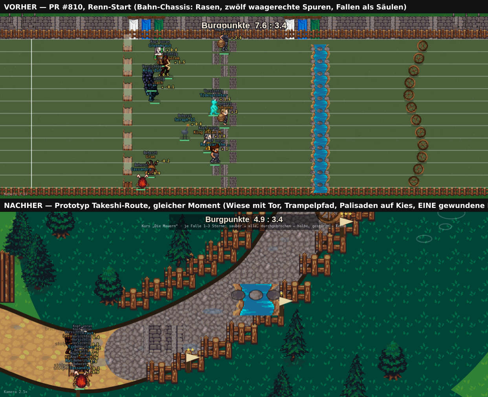
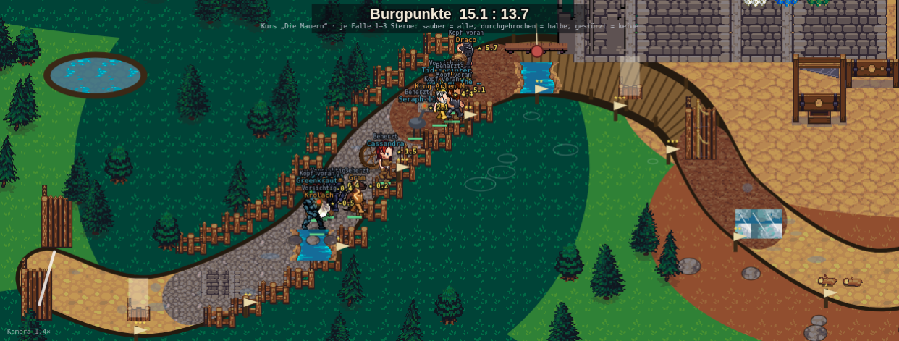
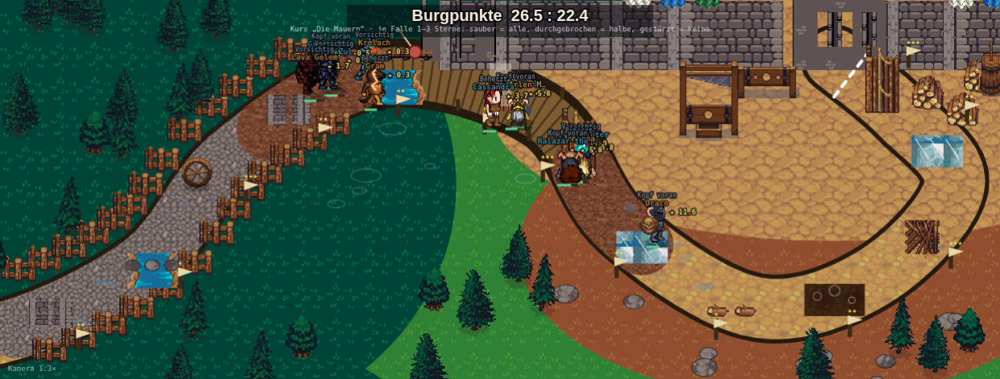
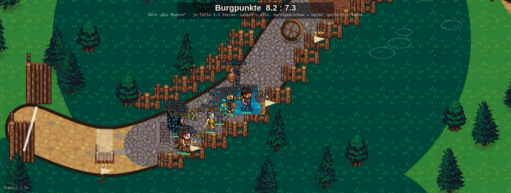
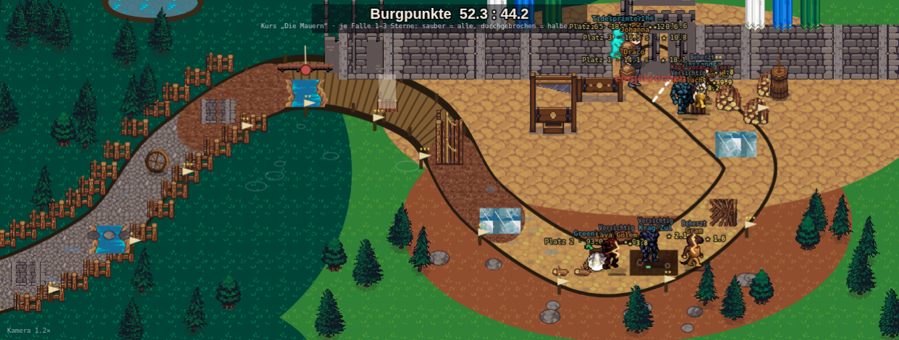

# Takeshi's Castle: eine Route durch Midoriyama statt einer Arena (Fable, 06.09.2026)

Stand: PR #810 (`1911b41d`, „Burgpunkte-Wertung, drei Kurse, zehn Fallen-Bilder", noch in Review) auf
`origin/main` `1c15ed11`. **Reine Recherche und Planung, keine Zeile im Hauptcheckout geändert.** Das
Konzept ist aber in einem eigenen Worktree auf dem Stand von #810 **prototypisiert und gesichtet**; die
sechs Bilder in diesem Ordner sind Screenshots der laufenden Engine (Playwright, eigener HTTP-Port,
`window.__arena.setDisc("takeshis-castle")`). Der Prototyp-Patch liegt als
`takeshi-schlammroute-prototyp-06-09.diff` daneben (269 Zeilen, `git apply`-fähig gegen `1911b41d`) —
Vorlage für die Umsetzung, nicht die Umsetzung.

Chris' Rückmeldung (06.09., nach den Screenshots von #810), wörtlich:

> „bei takeshi hätte ich mir so eine fortlaufende route gewünscht die nicht so arena mäßig aussieht
> sondern so schlamm, dann irgendwelche hindernisse wo man drüber balancieren muss bis zum schloss so
> eine route halt weißt du was ich meine?"

und die Korrektur dazu, ebenfalls 06.09.:

> „das soll nicht alles Schlamm sein! das war ein Beispiel, bitte forsche nach was Takeshi's Castle
> als Serie immer so geboten hat und orientiere dich daran."

Beides zusammen ist ein klarer Auftrag: **eine durchgehende, gewundene Route, die sichtbar an der Burg
endet — und unterwegs das Gelände der echten Sendung**, nicht ein Rasenrechteck mit zwölf Spuren und
nicht ein einheitlicher Matschstreifen.

---

## 0. Die Antwort in sieben Sätzen

1. **Was Chris gesehen hat, ist das Bahn-Chassis**: `bodenSpurt()` zeichnet für alle fünf Bahnen ein
   Rechteck von `0,14 H` bis `0,94 H` mit `jeSeite·2 = 12` waagerechten Spuren, und die Kamera
   (`camX`) ist eindimensional — sie streckt nur die x-Achse. Takeshi hat in #810 Burgmauer und zehn
   Fallen-Bilder bekommen, aber die Bühne darunter ist dieselbe wie beim Spurt (Abschnitt 1).
2. **Das echte Vorbild ist ein Gelände, keine Bahn.** Midoriyama („Grüner Berg") war ein fester,
   hügeliger Studio-Campus mit künstlichen Seen, Schlammgruben, Holzbauten und der Burg in einer Ecke;
   die Kandidaten zogen von General Tanis Sammelplatz durch verstreute Spielstationen bis zum
   Show-Down mit Karts vor der Burg (Abschnitt 2, mit Quellen).
3. **Das Konzept: ein Kartenbild.** Eine Route als Catmull-Rom-Kurve durch zwölf Wegpunkte, nach
   Bogenlänge parametrisiert; `u.pos` (0..1) wird zum Punkt auf der Kurve, `u.bahnZ` zum seitlichen
   Versatz quer dazu. **Die Simulation bleibt unangetastet** — nur die Abbildung
   `pos → Bildschirm` wechselt von „x = pos · Breite" zu „Punkt auf der Kurve" (Abschnitt 3).
4. **Fünf Terrain-Zonen entlang der Route, wie in der Sendung:** Sammelplatz mit Tor (Wiese,
   Trampelpfad) → Holzbauten (Kies, Palisaden — Knock Knock, Labyrinth, Grenzmauer) → der See (Steg,
   Schlammufer — Trittsteine, Hängebrücke, Walzen) → der Hang (Erdpfad, Felsen, trockenes Gras —
   rollende Kugeln, Forts) → Burghof (Pflaster, Show-Down). Schlamm gibt es, aber nur dort, wo er in
   Midoriyama war: an den Ufern und in der Grube (Abschnitt 4).
5. **Neun neue Bodenkacheln, kein neuer Download:** alle aus `lpc-terrains.zip`, das
   `scripts/arena-assets-schneiden.mjs` ohnehin lädt; Koordinaten aus den Terrain-Namen der
   TSX-Datei (`Mud_Brown`, `Dirt_Tan`, `Gravel_1`, `Stone_Tan`, `Grass_Dead`, `Water`, …) hergeleitet
   und als 3×3-Kachelung auf Nahtlosigkeit gesichtet (Abschnitt 5).
6. **Die zehn Fallen-Bilder aus #810 werden nicht neu gebaut, nur neu platziert:** derselbe Aufruf
   `zeichneFalleTakeshi(i, x, y, b)`, einmal je Station am Wegpunkt `routeXY(hindernisse[i])`, unter
   der Weltkamera, damit sie mitzoomen; dazu ein Wegpunkt-Fähnchen mit den Sternen der Falle.
7. **Rangtreue: bit-identisch.** `miss-alle-disziplinen.mjs 24 takeshis-castle` liest auf dem
   unveränderten #810 und auf dem Prototyp dieselben vier Zahlen — 0,866 / 0,126 / 0,937 / 0,056
   (Abschnitt 7). Konstruktiv so: `routeXY`, `laeuferXY`, `bodenTakeshiRoute` laufen nur im
   Zeichenpfad; `kameraUpdate` schreibt nur `cam`/`camR`, und die liest die Simulation nie.



---

## 1. Was heute gezeichnet wird, und warum es wie eine Arena aussieht

`bodenSpurt()` (`battle-mode.engine.js:14432` auf #810) ist die Bühne **aller fünf** Bahn-Disziplinen —
Spurt, Staffel, Zeitfahren, Klettern, Takeshi. Sie zeichnet:

| Schritt | Zeile | Was | Für Takeshi bedeutet das |
|---|---|---|---|
| Hintergrund | `:14437–14456` | Rasenkachel über die ganze Leinwand, bei `baeume===false` Flächenfarbe | grüne Fläche |
| Kulisse oben | `:14465–14477` | Takeshi: Zinnenmauer, Türme, Banner (#810); sonst Baumreihe | Mauer als Fries — **fest wie ein Tribünendach**, nicht Teil der Welt |
| Bahn | `:14496–14511` | Rechteck `oben=0,14 H .. unten=0,94 H` in `BA().boden` (`#4a5f3a`) | das grüne Rechteck |
| Spurlinien | `:14523–14526` | `BAHNEN_N()+1` waagerechte Linien | zwölf Spuren |
| Stationen | `:14532–14559` | je `hindernisse[i]` **eine Säule über alle Bahnen** (`for b<BAHNEN_N`) | vierzehn Säulen, je Spur ein Bild |
| Ziel | `:14562–14579` | senkrechte Linie bei `camX(1)`, Burgtor daneben | das Tor „am rechten Bildrand" |

Und die Kamera (`:15047–15069`) ist **eindimensional**: `cam={zoom, cx}`, `camX(pos)` streckt nur die
x-Achse (`80+(pos·strecke−links)·zoom`), `bahnY(b)` (`:15732`) bleibt eine feste Zeile je Spur. Alle
Läufer stehen deshalb immer auf geraden, parallelen Linien von links nach rechts — egal, was oben
drüber gemalt ist. Das ist die „Arena", die Chris meint, und sie lässt sich nicht durch mehr Deko
beheben, sondern nur durch eine andere Abbildung.

Wo die Läufer gelesen werden (die Stellen, die eine neue Abbildung anfassen muss):

| Stelle | Zeile (#810) | Liest |
|---|---|---|
| `zeichneSpurt` — Figur, Schatten, Name, Plan, Sterne | `:15742` | `camX(u.pos)`, `bahnY(u.bahnZ)` |
| Ansage-Marke (`gewaehlt`) | `:15813` | dito |
| Schwebetexte (`floats`, an `_laeufer` verankert) | `:15847` | dito |
| Rennplan-Ansage `schwebe()` | `:16768` | dito (nur Startwert, wird über `_laeufer` neu verankert) |
| Klick auf Läufer (Rennplan wählen) | `:16840` | dito |
| Stationen in `bodenSpurt` | `:14533`, `:14539` | `camX(h)`, `bahnY(b)` |
| Kamera | `:15056–15069` | `u.pos` der aktiven Läufer |

Sieben Stellen, alle im Zeichen- oder Bedienpfad. **Kein einziger Leser von `camX`/`bahnY` sitzt in
`stepSpurt`** — die Simulation kennt keine Pixel. Das ist der Grund, warum die Änderung rho-neutral
ist, bevor man sie misst.

---

## 2. Das Vorbild: Midoriyama, nicht Wipeout

Was die Sendung **tatsächlich** bot, aus drei Wikipedia-Sprachfassungen und der Fan-Seite Keshi Heads
(Quellen unten):

**Das Gelände.** Die Show wurde 1986–1990 auf einem festen Campus der TBS-Studios in Midoriyama
(Yokohama) gedreht: „extensive landscaping of a fixed campus … The setting included large man-made
lakes and elaborate permanent obstacles" (en). Der Name heißt „Grüner Berg": „a hilly, open-air site
with enough space to build a castle, dig ponds, and fill a field with mud pits" (Keshi Heads). „The
castle itself was built at one corner of the backlot … The surrounding area gave the production room
for everything else: the water games, the hill courses, the Show Down 'car park'" (Keshi Heads). Die
Spiele waren „spread across the surrounding hills" — erst die Neuauflage 2022 baute alles auf einem
zentralen Feld.

**Der Ablauf.** General Tani (in Deutschland „General Lee") sammelt die Kandidaten, sie stürmen durch
ein Tor los, durchlaufen je Folge sieben bis neun Stationen, und wer übrig bleibt, tritt im
**Show-Down** vor der Burg an: „In early episodes, the contestants stormed the castle in a
short-range water gun assault. Later episodes introduced carts with paper rings and eventually lasers
and light-sensitive targets" (en); auf Japanisch カート戦 (Kart-Schlacht) bzw. 城内戦 (Kampf in der
Burg).

**Die Spiele und ihr Boden** (japanische Originalnamen aus ja.wikipedia, deutsche/englische
Dub-Namen daneben; die Zuordnung zu den sieben Sub-Skill-Typen aus #802/#810 ist die aus
`takeshi-schach-optik-gameplay-plan-05-09.md` B.2):

| Schauplatz in der Sendung | Spiele (jp · en/de) | Unser Typ / Bild (#810) |
|---|---|---|
| **Sammelplatz, Wiese, das Tor** | 関門 (Tor) — General Tanis Aufmarsch; ザ・ロンゲストヤード (Football-Feld); すもうでポン (Sumo-Ringe) | Start |
| **Holzbauten auf ebenem Grund** | 自由への壁 (Knock Knock — vier Holz-/Papiertüren); 悪魔の館 (Devil's House / Honeycomb Maze — Kammern mit Dämonen); 国境の壁 (Border Wall — 2-m-Wand mit Rutsche); 遥かなる自由への壁 (acht Türen, Mehlkiste) | WUCHT `tuer`/`seilwand`, TECHNIK `labyrinth` |
| **Der See** | 竜神池 (Dragon God Pond / Skipping Stones — ~25 Trittsteine, einige an Ketten); ジブラルタル海峡 (Gibraltar Strait / Bridge Ball — Hängebrücke); 戦場に架ける橋 (Bridge over the Battlefield — Bauchrutschen über Walzen); 天国と地獄 (Heaven and Hell — Tarzan-Seil über den Graben); 跳んでおめでとう (Stabsprung über den Teich); どんぶらこっこ (Rice Bowl — Wasserrutsche in der Schale) | WENDIGKEIT `steine`/`walzen`, STEHEN `brueckenball` |
| **Schlamm** | とびだせ青春 (Bälle aus dem Matsch fangen); キノコでポン (Mushroom Trip — Drehpilz über dem Schlamm); 泥のダッシュ (Dash over the Mud) | STEHEN `schlamm` |
| **Der Hang** | 玉RUNでこれは玉 (Avalanche / High Rollers — bergauf, Kugeln rollen herab); 国境の坂 (nasser, rutschiger Hang); 第二砦 (Zweites Fort — Wasserpistolen-Duell bergauf); だるまさんがころんだ (Hügel in Daruma-Kostümen) | ROBUST `raeder`, TECHNIK `eis` (Slip Way) |
| **Vor der Burg** | 人喰い穴 (Man-eating Hole — unterirdischer Tunnel als letztes Tor); 第一砦 (Erstes Fort) | ROBUST `spitzen` (Final Fall) |
| **Burghof / Parkplatz** | カート戦 (Show-Down mit Karts, Wasserpistolen, später Laser) | Ziel |

**Was das gegen andere Formate abgrenzt.** *Wipeout* (2008) ist das Gegenmodell: ein Studio-Parcours
mit parallelen Startbahnen und einem Becken, „the Wipeout Zone … inside the studio" — genau die
Nebeneinander-Optik, die #810 heute hat. *Ninja Warrior/Sasuke* ist ein linearer Stage-Parcours,
ebenfalls Arena. **Takeshi's Castle ist das einzige der drei, das ein Gelände war** — mit Weg
dazwischen, mit Hügel, See und Burg. Das Kartenbild, das dazu passt, kennt jeder Spieler aus der
Overworld von *Super Mario World*: ein gewundener Pfad mit Stationen als Knoten, am Ende die Burg.
Und Hindernislauf-Veranstalter (Tough Mudder) zeichnen ihre Kurse genau so: **eine** gewundene Spur
mit nummerierten Hindernissen auf einer Karte.

**Entscheidung: Overworld-Logik mit Midoriyama-Inhalt.** Die Leinwand ist die Karte des Geländes,
die Route ist der Weg von Tanis Sammelplatz zur Burg, die Stationen sind Wegpunkte darauf, und der
Boden wechselt, wie er auf dem Studiogelände wechselte.

---

## 3. Das Rendering-Konzept: Kurve statt Gerade

### 3.1 Die Route

Zwölf Wegpunkte in Bruchteilen von `W`/`H` (also auflösungsunabhängig), dazwischen eine
Catmull-Rom-Kurve mit 24 Teilstücken je Abschnitt, daraus eine Bogenlängen-Tabelle. Damit ist die
Route mit **einer Zahl `s ∈ [0,1]`** adressierbar, und `s` ist genau die Rennposition `u.pos`:

```js
route:[[0.04,0.80],[0.13,0.86],[0.25,0.72],[0.32,0.50],[0.43,0.34],[0.55,0.42],
       [0.61,0.64],[0.71,0.80],[0.80,0.74],[0.86,0.56],[0.82,0.42],[0.77,0.31]],
routeBreite:56,
```

Start unten links, Anstieg nach oben Mitte, Abstieg über den See nach unten rechts, dann der Hang
hinauf zur Burg oben rechts. Zwei Serpentinen; kein gerades Stück länger als ein Fünftel der Breite.
Die Bogenlänge ist etwa 1,9 × `W` — die Route ist also fast doppelt so lang wie die alte Bahn, und
das Feld zieht sich entsprechend sichtbarer auseinander.

`routeXY(s)` liefert Punkt, Tangente und Normale (Binärsuche in der Bogenlängen-Tabelle, ~8 Schritte
bei 265 Stützpunkten). Die Tabelle wird je `(W, H, route)` einmal gebaut und gecacht (`routeCache`).

Entwurfsregeln für eine Route, die als Karte lesbar bleibt:

- **Start unten links, Burg oben rechts** — Leserichtung, und die Burg steht „oben auf dem Berg".
- **Mindestens zwei Richtungswechsel in y**, damit nie drei Stationen auf einer Linie liegen.
- **Kein Abschnitt kreuzt einen anderen** — die Kamera zoomt bis 3,4×, ein Kreuzungspunkt wäre
  dann ein zweiter Läuferpulk im Bild.
- **Die letzten 15 % laufen auf die Burg zu, nicht an ihr vorbei**: der letzte Wegpunkt IST das
  Tor, die vorletzten zwei liegen darunter.

### 3.2 Die Abbildung `pos → Bild` — und was mit den Spuren passiert

```js
function laeuferXY(u){
  const platz=rennFertig.indexOf(u);
  if(!istRoute())return {x:camX(u.pos)+(platz>=0?12+platz*9:0), y:bahnY(u.bahnZ)};
  const r=routeXY(u.pos), breite=BA().routeBreite||56;
  const q=((u.bahnZ+0.5)/BAHNEN_N()-0.5)*(breite-14);   // quer zur Route, nach Spur
  const v=platz>=0?(14+platz*8):0;                       // Eingelaufene: hinter dem Tor
  return weltZuSchirm(r.x+r.nx*q+r.tx*v, r.y+r.ny*q+r.ty*v);
}
```

**Die zwölf Spuren verschwinden nicht, sie werden schmal.** `u.bahnZ` (0..11, mit Spurwechseln
weich interpoliert, `stepSpurt :15437`) wird zum Versatz **quer zur Route** über `breite−14 = 42`
Weltpixel — bei Zoom 1 also 3,5 px je Spur, bei 3,4× rund 12 px. Das reicht, weil zusätzlich

- **die Zeichenreihenfolge nach Bildschirm-y sortiert** wird (der weiter unten stehende Läufer
  überdeckt den oberen — Tiefenstaffelung, wie im Feldspiel),
- **die Figur mit der Kamera mitwächst** (`sk = 0,9 + 0,12·zoom`, gedeckelt bei 1,3 — bei 1× ist sie
  so groß wie heute, bei 3,4× ein Drittel größer), und
- Name, Plan und Sterne im Bildschirmraum bleiben, also nicht mitskalieren.

Die Spur-Mechanik selbst — Rempler nur bei `|bahnZ−bahnZ'| ≤ 1,6`, Windschatten bei `< 0,6`, Wechsel
weg von Blockierern — bleibt Wort für Wort dieselbe; nur sieht man den Wechsel jetzt als Schritt zur
Seite auf dem Weg statt als Sprung in die Nachbarspur. Eingelaufene stehen **hinter dem Tor** im Hof,
nach Platz gestaffelt entlang der Tangente (`v`), statt rechts neben der Ziellinie.

### 3.3 Die Kamera: zweidimensional, aber dieselbe Idee

`kameraUpdate` behält seinen Zweck (dem Feld der noch Laufenden folgen, Zoom = Distanz zwischen
Erstem und Letztem) und bekommt für die Route eine 2-D-Fassung:

```js
if(istRoute()){
  // Kasten um die Weltpunkte der aktiven Läufer, plus 0,10 der Strecke voraus (nächste Falle
  // schon im Bild) und 0,04 zurück; Polster für Namen/Balken in Bildschirmpixeln durch den Zoom
  let x0..y1 = Hülle(routeXY(u.pos) für u aktiv, routeXY(maxP+0.10), routeXY(minP-0.04));
  const zielZoom=clamp(min(W/(bw), H/(bh)), 1, 3.4);
  camR = Kastenmitte, geklemmt, damit der Blick im Weltausschnitt [0,W]×[0,H] bleibt;
  weich nachziehen mit demselben t=min(1,dt·1.8) wie heute.
}
```

`cam.zoom` bleibt die Zahl, die das HUD zeigt („Kamera 2,5×"); neu ist `camR` als Weltmitte und
`weltZuSchirm(wx,wy)`. Bei Zoom 1 zeigt die Leinwand **die ganze Karte** — das ist das Bild, das man
vor dem Start und nach dem Einlauf sieht (`…-karte-06-09.png`). Weil die Burg jetzt Teil der Welt ist
und nicht mehr Fries, **kommt sie beim Heranzoomen wirklich näher** — was der Plan vom 05.09. wollte
(„das Burgtor … kommt näher"), aber mit der 1-D-Kamera nur für die x-Achse bekam.

### 3.4 Die Ebenen (Zeichenreihenfolge in `bodenTakeshiRoute`)

Alles bis auf das HUD läuft unter `ctx.translate(W/2−camR.x·z, H/2−camR.y·z); ctx.scale(z,z)` —
Kachelmuster (`createPattern`) skalieren dann automatisch mit, die Route wird bei 3,4× wirklich
190 px breit, und die Fallen-Bilder wachsen mit, statt als 32-px-Sprites auf einer breiten Straße
zu stehen.

| # | Ebene | Womit |
|---|---|---|
| 1 | Grundfläche Wiese | `boden_wiese` (Grass) über die ganze Welt |
| 2 | Umgebungen je Zone | Wald: `boden_wald` als Hülle um die Holzbauten-Zone + oberer/unterer Rand; Hang: `boden_hang` als Hülle um die Hang-Zone; See: `boden_schlamm`-Ufer (Hülle × 1,14) + `boden_see`; Burghof: `boden_pflaster`-Ellipse um das Routenende; kleine Tümpel (`boden_sumpf`) in Wiese/Wald |
| 3 | Die Route, Abschnitt für Abschnitt | dunkler Saum (`breite+8`), dann je Zone der Untergrund als Strich (`lineWidth=breite`, `lineJoin/lineCap round`): `boden_pfad`, `boden_kies`, **Steg** (Holzfarbe, Querbretter alle 9 px, Pfosten alle 44 px), `boden_pfad`, `boden_pflaster`; Schlammstreifen an Ein- und Ausstieg des Sees; Pfützen (saatfest, nicht auf Steg/Pflaster) |
| 4 | Bauten und Fels | Palisadenzaun (`zaun_holz`) beiderseits der Holzbauten-Zone alle 30 px; Felsbrocken (`boden_stein` in Ellipsen geclippt) am Hang |
| 5 | Das Tor | zwei `hind_wand`-Palisaden am Start, weiße Startlinie quer zur Route |
| 6 | Die Burg | `burg_tor` auf dem Endpunkt, je Seite zwei `burg_mauer`, außen `burg_turm`, zwei `deko_banner`, Pranger/Fußblock/Holzstapel/Fass im Hof, gestrichelte Ziellinie bei `s=0,985` |
| 7 | Fallen + Fähnchen | `zeichneFalleTakeshi(i, r.x, r.y+12, i%3)` je Station am Wegpunkt; Pfahl mit Fähnchen quer neben der Route, darauf `★`×`fallenStufe` |
| 8 | Bäume | `baum_1..4`, saatfest; nur wo Fuß **und** Krone weder Route, See, Hof, Burgzone noch Tümpel berühren; nach y sortiert |
| — | *(zeichneSpurt)* | Läufer, Schatten, Namen, Sterne, Ansage-Marke, Schwebetexte |
| 9 | HUD, Bildschirmraum | Burgpunkte-Band oben, Kursname, Zoom-Hinweis |

### 3.5 Die zehn Fallen — wiederverwendet, nicht neu gebaut

`zeichneFalleTakeshi(i,x,y,b)` (`:14392` auf #810) zeichnet heute je Spur `b` ein Bild bei `(x,y)`
in Bildschirmpixeln. Auf der Route wird es **einmal** je Station aufgerufen, in Weltkoordinaten
unter der Kamera-Transformation — die Funktion selbst ändert sich nicht. `b` wird zu `i % 3` (der
Parameter steuert nur, wo die Lücke im Labyrinth sitzt und ob die Tür Papier oder Holz ist). Die
Fallen, die eigenen Boden mitbringen (Trittsteine und Bridge Ball zeichnen Wasser, die Grube
Schlamm, Slip Way Eis), tun das weiter — so trägt jede Station ihr Terrain auch dann, wenn sie in
einer „fremden" Zone liegt (s. 4.3).

Neu ist nur das **Wegpunkt-Fähnchen**: ein Pfahl mit Wimpel `breite/2+10` neben der Route, darüber so
viele Sterne wie `fallenStufe[typ]`. Es macht die Karte als Kurs lesbar („da vorne kommt eine
Drei-Sterne-Falle") und ersetzt die Säulen-Optik, die heute anzeigt, wo eine Station ist.

---

## 4. Die fünf Zonen — Terrain wie in der Sendung

### 4.1 Definition

```js
zonen:[{bis:0.12,boden:"pfad",    um:"wiese"},   // Sammelplatz, das Tor
       {bis:0.36,boden:"kies",    um:"waelle"},  // Holzbauten: Türen, Labyrinth, Grenzmauer
       {bis:0.60,boden:"planken", um:"see"},     // der See: Steg, Schlammufer
       {bis:0.86,boden:"pfad",    um:"huegel"},  // der Hang: Felsen, trockenes Gras, Forts
       {bis:1.00,boden:"pflaster",um:"hof"}],    // Burghof, Show-Down
```

`boden` ist der Untergrund **der Route** in diesem Abschnitt, `um` die Umgebung, die als weiche
Hülle um die Routenpunkte dieses Abschnitts gelegt wird (`huelle(um, rand)` — Bounding-Ellipse der
Abschnittspunkte plus Rand). Die Grenzen sind Bogenlängen-Bruchteile, also dieselbe Größe wie
`hindernisse[]`.

### 4.2 Was je Zone zu sehen ist, und woher es kommt

| Zone | `s` | Route | Umgebung | In der Sendung |
|---|---|---|---|---|
| **Sammelplatz** | 0–0,12 | Trampelpfad `boden_pfad` (Dirt_Tan) | helle Wiese, zwei Palisaden als Tor, Startlinie | Tanis Aufmarsch, das Tor, Football-Feld, Sumo-Ringe |
| **Holzbauten** | 0,12–0,36 | Kies `boden_kies` (Gravel_1) | Wald-Hülle, Palisadenzaun beidseits | Knock Knock, Devil's House, Border Wall — gezimmerte Stationen |
| **Der See** | 0,36–0,60 | **Steg** (Holz, Querbretter, Pfosten) | `boden_see` (Water) mit Schlammufer `boden_schlamm` (Mud_Brown), Wellenringe | Dragon God Pond, Gibraltar Strait, Bridge over the Battlefield, Heaven and Hell |
| **Der Hang** | 0,60–0,86 | Erdpfad `boden_pfad` mit Felsbrocken | trockenes Gras `boden_hang` (Grass_Dead), wenige Bäume | Avalanche/High Rollers, nasser Hang, Zweites Fort |
| **Burghof** | 0,86–1 | Pflaster `boden_pflaster` (Stone_Tan) | Pflaster-Ellipse, Burg, Rüstkammer-Deko | Show-Down-„Parkplatz", Karts |

Schlamm erscheint damit an drei Stellen: **als Seeufer**, **als Ein-/Ausstiegsstreifen** der
Steg-Zone (je ±0,03 der Strecke), und **als Grube**, wo die Falle `schlamm` (Dragon God Lake)
liegt — plus Pfützen auf Pfad und Kies. Das ist der Schlamm der Sendung, nicht ein Schlamm-Kurs.





### 4.3 Wie die Fallen auf die Zonen fallen — und drei Wege, das zu ordnen

Die Stationen liegen bei `0,07; 0,14 … 0,91; 0,96`. Mit den Zonengrenzen oben landen Station 1 auf
der Wiese, 2–5 bei den Holzbauten, 6–8 am See, 9–12 am Hang, 13–14 im Hof. Welche **Falle** dort
steht, entscheidet der Kurs (`kurse[].typen`, per Saat). Beim Kurs „Nordhof" kommt so Bridge Ball
in die Holzbauten-Zone und die Strickleiter-Wand an den Hang — nicht falsch (die Falle bringt ihr
Wasser mit, s. 3.5), aber nicht so stimmig, wie es sein könnte.

| Weg | Was | Aufwand | Empfehlung |
|---|---|---|---|
| **A** Zonen fest, Fallen wie gewürfelt | der Prototyp | 0 | **Schritt 1.** Reicht, weil jede Falle ihr eigenes Terrain zeichnet |
| **B** Zonen folgen den Fallen | je Station bestimmt der Typ den Untergrund ihres Abschnitts (Wasser-Fallen → Steg/Ufer, Holz-Fallen → Kies, Hang-Fallen → Erdpfad) | 20 Zeilen (`zonenAusKurs()`) | nicht empfohlen: die Karte flackert dann zwischen fünf Böden, und ein „See" je Wasser-Falle ist ein Teich, kein See |
| **C** Eine Karte, drei Wege | die drei Kurse bekommen drei Wegpunkt-Listen **über dasselbe Gelände** (See, Holzhof, Hang, Burg liegen fest, wie in Midoriyama), und jede Route besucht die Zonen in der Reihenfolge, in der ihre Fallen kommen | drei Routen entwerfen, ½ Tag | **Schritt 2**, wenn Chris die Karte mag: „Sumpfpfad" führt zweimal über den See, „Die Mauern" länger durch den Holzhof, „Nordhof" über den Hang. Das ist genau das, was Folgen der Sendung unterschied: nicht das Gelände, sondern welche Stationen man durchlief |

C ist der ehrlichste Ausbau — und rein kosmetisch: `route` und `zonen` je Kurs statt je Disziplin,
`bauSpurt` setzt beim Kurswechsel `routeCache=null`. Die Fallenfolge bleibt die gemessene aus #810.

---

## 5. Assets: neun Kacheln aus dem Blatt, das schon geladen wird

Geprüft: braucht es ein weiteres Paket? **Nein.** `lpc-terrains.zip` (terrain-v7.png, 1024 × 2048,
CC-BY-SA 3.0/4.0, bluecarrot16, Zabin u. a. — dieselben Credits wie `boden_erde`/`rasen`) führt in
seiner TSX-Datei 34 benannte Terrains; die Namen sind die Landkarte des Blatts. Jeder Terrain-Block
ist 96 × 224 px (3 Spalten × 7 Reihen): Reihen 0–1 Innenecken, Reihen 2–4 der 3×3-Übergangssatz
(Mitte = die in der TSX genannte „tile"-Koordinate), **Reihen 5–6 volle Kacheln ohne Rand** — das
ist die Reihe, aus der auch `boden_erde` (Dirt_Brown, Reihe 5) stammt. Alle neuen Schnitte sind
Reihe-5-Kacheln (y = tile-y + 64), als 3×3-Kachelung bei 3× angesehen und nahtlos:

| Zielname | Terrain (TSX) | x | y | Verwendung |
|---|---|---:|---:|---|
| `boden_wiese` | Grass | 32 | 384 | Grundfläche (identisch mit dem Block von `rasen`, aber die volle Kachel) |
| `boden_wald` | Grass_Dark | 224 | 384 | Wald-Hüllen |
| `boden_pfad` | Dirt_Tan | 32 | 160 | Route auf Wiese und Hang (Trampelpfad mit Grasbüscheln) |
| `boden_kies` | Gravel_1 | 800 | 384 | Route bei den Holzbauten |
| `boden_schlamm` | Mud_Brown | 896 | 160 | Seeufer, Ein-/Ausstieg, (Grube zeichnet weiter `boden_erde`) |
| `boden_see` | Water | 128 | 608 | der See |
| `boden_sumpf` | Water_Shallows_Dirt | 32 | 608 | kleine Tümpel |
| `boden_hang` | Grass_Dead | 320 | 384 | trockener Hang |
| `boden_pflaster` | Stone_Tan | 704 | 832 | Burghof und Route darin |

In `scripts/arena-assets-schneiden.mjs` sind das neun Zeilen im `SCHNITTE`-Block
(`['boden_wiese','terrain',32,384,32,32,false]`, …), in `quellen.json` neun Einträge mit Paket
„[LPC] Terrains", Blatt `terrain-v7.png`, in `README.md` eine Tabellenzeile je Kachel. Kein neuer
Credit, kein neuer Download, ~4 KB.

Nicht gebraucht, aber geprüft: ein Holzboden-Blatt für den Steg (`decorations-medieval.png` hat
Bänke und Planken, aber keine kachelbare Bretterfläche — der Steg ist deshalb prozedural: Holzton,
Querbretter, Pfosten; sieht auf den Bildern besser aus als eine gedrehte Kachel). Das bereits
geprüfte **[LPC] Wooden Bridge Rework** (CC-BY-SA 3.0) wäre eine Option für eine gezeichnete
Bogenbrücke an der Stelle, wo die Route den See betritt — Kür, nicht Pflicht.

---

## 6. Der Prototyp — was er zeigt und was er nicht zeigt

Gebaut auf `1911b41d` (#810) in einem eigenen Worktree, `git apply`-fähiger Patch in
`takeshi-schlammroute-prototyp-06-09.diff`. Alles hinter `BA().route` bzw. `istRoute()`; Spurt,
Staffel, Zeitfahren und Klettern führen kein `route`-Feld und laufen durch den alten Code.





**Sichtprüfung (Playwright, 1300 × 700, sechs Momente 0–40 s, keine 404, keine Seitenfehler):** die
Route liest sich als Weg, nicht als Bahn; die fünf Böden sind auf einen Blick unterscheidbar; der
Pulk läuft **auf** der Route und dreht mit ihr (weil `bahnZ` quer zur Tangente wirkt); die Burg
wächst beim Heranzoomen; die Fallen sitzen an ihren Fähnchen und sind dieselben zehn Bilder wie in
#810.

**Bekannte Kanten, absichtlich nicht im Prototyp gelöst:**

1. **Eingelaufene stehen mit „Platz n · Zeit · ★"-Zeilen im Hof, über der Mauer.** Bei zwölf
   Finishern werden das zwölf Textzeilen auf Stein. Lösung in der Umsetzung: Eingelaufene ohne
   Textzeile im Hof aufstellen (nur Figur, nach Platz gestaffelt), die Platzierung in der
   Wertungstabelle lassen, die ohnehin da ist.
2. **Die Läufer schauen immer nach rechts** (`vx:4` in `zeichneSprite`). Auf den Abstiegen läuft die
   Figur seitwärts. Der Baukasten hat vier Blickrichtungen; `vx/vy` aus der Tangente
   (`r.tx, r.ty`) zu setzen sind zwei Zeilen — hier weggelassen, weil es die Sprite-Spiegelung
   berührt, die man erst im Spiel sehen muss.
3. **Die Zonen-Hüllen sind Ellipsen** (Bounding-Box der Abschnittspunkte plus Rand). Für See und
   Hof stimmt das, für Wald und Hang wirkt es an den Rändern rund. In der Umsetzung: die Hülle als
   Polygon aus den Routenpunkten ± `rand` entlang der Normalen (ein `beginPath` über `2·n`
   Punkte) — das schmiegt sich an die Route.
4. **Fallen-Bilder werden aufrecht gezeichnet**, auch wo die Route steil verläuft; ein 56 px breites
   Bild deckt dann nicht die ganze Routenbreite. Sieht auf den Bildern akzeptabel aus; bei Bedarf
   `ctx.rotate(atan2(ty,tx)·0,5)` — halbe Drehung, damit die Sprites nicht auf dem Kopf stehen.
5. **Kurs-Routen (4.3 C)** sind nicht gebaut; der Prototyp hat eine Route für alle drei Kurse.
6. **Der Rückfall ist inkonsistent:** `bodenSpurt` weicht nur bei geladener `boden_schlamm`-Kachel
   auf die Route aus, `laeuferXY` aber bei jedem `BA().route`. Fehlt die Kachel (Datei geöffnet
   statt ausgeliefert), stünden Routen-Läufer auf der alten Bahn. In der Umsetzung beide Weichen
   auf `istRoute()` ziehen — `bodenTakeshiRoute` hat für jede Kachel eine Farbfassung (`M(n,f)`), es
   braucht die Bahn als Rückfall nicht.

---

## 7. Rangtreue — bit-identisch, gemessen

`node scripts/miss-alle-disziplinen.mjs 24 takeshis-castle`, kaderfest (fünf Paarungen aus
`kaderfamilie-live-save.json`, Oly New Game Custom 19.8.2026), beide Läufe am selben Tag, je ein
eigener Worktree:

| Stand | rho je Spiel | Spannweite | rho Saison | Spannweite | Abnahme |
|---|---:|---:|---:|---:|---|
| #810 unverändert (`1911b41d`) | 0,866 | 0,126 | 0,937 | 0,056 | bestanden |
| #810 + Routen-Prototyp | 0,866 | 0,126 | 0,937 | 0,056 | bestanden |

`diff` der beiden Berichtszeilen: leer. Das ist konstruktiv so und nicht Glück: der Patch fügt
`routeTabelle/routeXY/laeuferXY/bodenTakeshiRoute` hinzu (nur aus `zeichneSpurt`, `bodenSpurt` und
dem Klick-Handler gerufen), ändert `kameraUpdate` (schreibt `cam`, `camR` — Werte, die `stepSpurt`
nie liest) und `zeichneSpurt`. `stepSpurt`, `bauSpurt`, `wert()`, `burgpunkte()`, `HUERDEN_TYP`
sind unangetastet; die Sonde betritt keinen Zeichenpfad. Die zweite Messung nach dem letzten
Patch-Stand (Zonen, See-Kappung) liest dieselben vier Zahlen.

---

## 8. Umsetzung — Orte, Schritte, Abnahme

Zeilen beziehen sich auf `public/mockups/battle-mode.engine.js` auf `1911b41d` (#810); die Umsetzung
setzt auf #810 auf, nicht auf `main`.

| # | Schritt | Ort | Umfang |
|---|---|---|---|
| 1 | **Kacheln**: neun Schnitte in `SCHNITTE`, `quellen.json`, `README.md`; `node scripts/arena-assets-schneiden.mjs` | `scripts/arena-assets-schneiden.mjs`, `public/sprites/arena/` | 30 Min. |
| 2 | **Laden**: neun Namen in `A_TEILE` | `:14211–14221` | 2 Zeilen |
| 3 | **Route + Zonen** in `BAHN_ART["takeshis-castle"]`: `route`, `routeBreite`, `zonen`, `tuempel` | `:14920` (neben `takeshi:true`) | 10 Zeilen, aus dem Diff |
| 4 | **Routen-Maschinerie** `routeTabelle`, `routeXY`, `istRoute`, `camR`, `weltZuSchirm`, `laeuferXY` | nach `camX`, `:15055` | 45 Zeilen, aus dem Diff |
| 5 | **Kamera** 2-D-Zweig in `kameraUpdate` | `:15056` | 14 Zeilen |
| 6 | **Leser umstellen** auf `laeuferXY(u)`: Figur `:15742`, Ansage-Marke `:15813`, Schwebetexte `:15847`, Klick `:16840`; Tiefensortierung + Sprite-Skalierung in `zeichneSpurt` | `zeichneSpurt`, Klick-Handler | 12 Zeilen |
| 7 | **`bodenTakeshiRoute()`** vor `bodenSpurt`, Weiche `if(istRoute())return bodenTakeshiRoute();` als erste Zeile von `bodenSpurt` | `:14432` | 110 Zeilen, aus dem Diff — Hüllen als Polygon (6.3), Eingelaufene ohne Textzeile (6.1) |
| 8 | **Blickrichtung** aus der Tangente (6.2) | `zeichneSpurt` | 2 Zeilen, im Spiel sichten |
| 9 | **Sichtprüfung** im Spiel: alle drei Kurse, Zoom 1 und 3,4, Ansage-Marke, Klick auf Läufer, Schwebetexte | Playwright, `takeshi-schlammroute-screenshots-06-09.mjs` in diesem Ordner | Screenshots in den PR |
| 10 | **Abnahme**: `miss-alle-disziplinen.mjs 24` — Takeshi und die 19 anderen bit-identisch zu #810 | — | ein Lauf |
| 11 | *Optional, Schritt 2:* Kurs-Routen (4.3 C): `route`/`zonen` je Kurs, `routeCache=null` in `bauSpurt` beim Kurswechsel | `:15073 ff.` | ½ Tag Entwurf |

Gesamt für 1–10: **ein Tag**, rein zeichnerisch, mit dem Diff als Vorlage. Kein Motor, keine
Formel, keine Wertung wird berührt — deshalb kann es parallel zum Opus-Review von #810 vorbereitet
und nach dessen Merge als eigener PR aufgesetzt werden.

**Reihenfolge-Regel:** #810 zuerst mergen. Dieser Plan setzt dessen Fallen-Bilder, `takeshi:true`,
`fallenStufe`, `kurse` und `burgpunkte()` voraus; ein Rebase auf `main` ohne #810 hätte keine
Fallen, die er platzieren könnte.

---

## 9. Offene Entscheidungen für Chris

1. **Karte oder Bahn — ist das die Richtung?** Das Vorher/Nachher-Bild oben ist die Frage. Wenn ja,
   Schritte 1–10.
2. **Drei Wege über eine Karte (4.3 C)?** Kostet einen halben Tag Entwurf, macht die Kurse
   wiedererkennbar („der Sumpfpfad geht zweimal über den See"). Empfehlung: ja, als zweiter PR.
3. **Wegpunkt-Fähnchen mit Sternen** — behalten (Karte lesbar) oder weg (aufgeräumter)?
4. **Show-Down-Karts im Burghof** als Deko: zwei `deko_rad`-Paare mit Kasten wären eine Stunde; die
   Emperor's Guards als NPC-Sprites (Baukasten, `idle`) am Tor ein Nachmittag. Beides Kür.
5. **Blickrichtung der Läufer** (6.2): auf den Abstiegen seitwärts laufen lassen wie jetzt, oder
   die vier Baukasten-Richtungen nutzen? Muss im Spiel angesehen werden.

---

## Anhang A — der Prototyp-Patch

`takeshi-schlammroute-prototyp-06-09.diff`, 269 Zeilen, gegen `1911b41d`:

```sh
git worktree add /tmp/takeshi-route 1911b41d
cd /tmp/takeshi-route
git apply <repo>/docs/design/takeshi-schlammroute-prototyp-06-09.diff
```

Dazu die neun Kacheln aus Abschnitt 5 nach `public/sprites/arena/` (im Diff nicht enthalten — sie
sind Binärdateien und werden vom Schneide-Skript erzeugt). Der Patch ist in sechs Blöcke gegliedert
(A Kacheln laden, B Route/Zonen, C Routen-Maschinerie, D Kamera, E `zeichneSpurt`-Leser,
F `bodenTakeshiRoute`), jeder mit einem Kommentar, der auf diesen Plan zeigt.

## Anhang B — Screenshot-Harness

Eigener HTTP-Server auf `public/` (Port 0, also frei), Playwright gegen
`/mockups/battle-mode.html`, Google-Fonts-Requests abgebrochen (der Agent-Proxy blockt sie, und
`networkidle` würde sonst warten), `setDisc("takeshis-castle")`, Arena-Tab, Start, Screenshots
des `#cv` bei 1,5 / 5 / 10 / 17 / 26 / 40 s; Server im `finally` beendet. Dasselbe Muster wie
`bahn-screenshots.mjs` der Wertungstabellen-Runde; die Datei liegt als `takeshi-schlammroute-screenshots-06-09.mjs` daneben.

## Quellen

- Wikipedia (en): *Takeshi's Castle* — Midoriyama-Campus, künstliche Seen, Dragon God's Pond, Show
  Down mit Wasserpistolen/Karts/Lasern. <https://en.wikipedia.org/wiki/Takeshi%27s_Castle>
- Wikipedia (ja): *風雲!たけし城* — Spielnamen und Schauplätze (竜神池, ジブラルタル海峡, 自由への壁,
  悪魔の館, 国境の壁, 玉RUN, 戦場に架ける橋, 天国と地獄, 人喰い穴, カート戦 u. a.).
  <https://ja.wikipedia.org/wiki/%E9%A2%A8%E9%9B%B2!%E3%81%9F%E3%81%91%E3%81%97%E5%9F%8E>
- Wikipedia (de): *Takeshi's Castle* — deutsche Spielnamen, Ablauf mit General Lee, Finale mit
  Sensor-Fahrzeugen. <https://de.wikipedia.org/wiki/Takeshi%E2%80%99s_Castle>
- Keshi Heads, *Takeshi's Castle Location — Midoriyama* (Lage der Burg in einer Ecke des Backlots,
  Wasserspiele, Hügelkurse, Show-Down-Parkplatz; 2022: Spiele auf dem zentralen Feld statt „spread
  across the surrounding hills"). <https://keshiheads.co.uk/FAQ-Takeshis-Castle-Location-Midoriyama>
  (Seite aus der Agenten-Umgebung nur über Suchauszüge lesbar, 403 beim Direktabruf.)
- Wikipedia (en): *Wipeout (2008 American game show)* — Studio-Parcours, „Wipeout Zone … inside
  the studio". <https://en.wikipedia.org/wiki/Wipeout_(2008_American_game_show)>
- Tough Mudder, *Course Map* — eine gewundene Spur mit nummerierten Hindernissen als
  Kartenbild. <https://toughmudder.com/course-map/>
- The Cutting Room Floor, *Super Mario World — Overworld Tilemaps*; Mario Universe, *SMW Maps* —
  Pfad-Knoten-Burg-Logik der Overworld. <https://tcrf.net/Development:Super_Mario_World_(SNES)/Background_Graphics_and_Tilemaps/Overworld_Tilemaps>,
  <https://www.mariouniverse.com/maps-snes-smw/>
- OpenGameArt, *[LPC] Terrains* (bluecarrot16, Zabin u. a., CC-BY-SA 3.0/4.0) — `terrain-v7.png`,
  `terrain-v7.tsx` mit den 34 Terrain-Namen. <https://opengameart.org/content/lpc-terrains>
- `docs/design/takeshi-schach-optik-gameplay-plan-05-09.md`, Teil B — Fallen-Typen, Bilder, Kurse,
  Burgpunkte; PR #810 — die Umsetzung, auf der dieser Plan aufsetzt.
