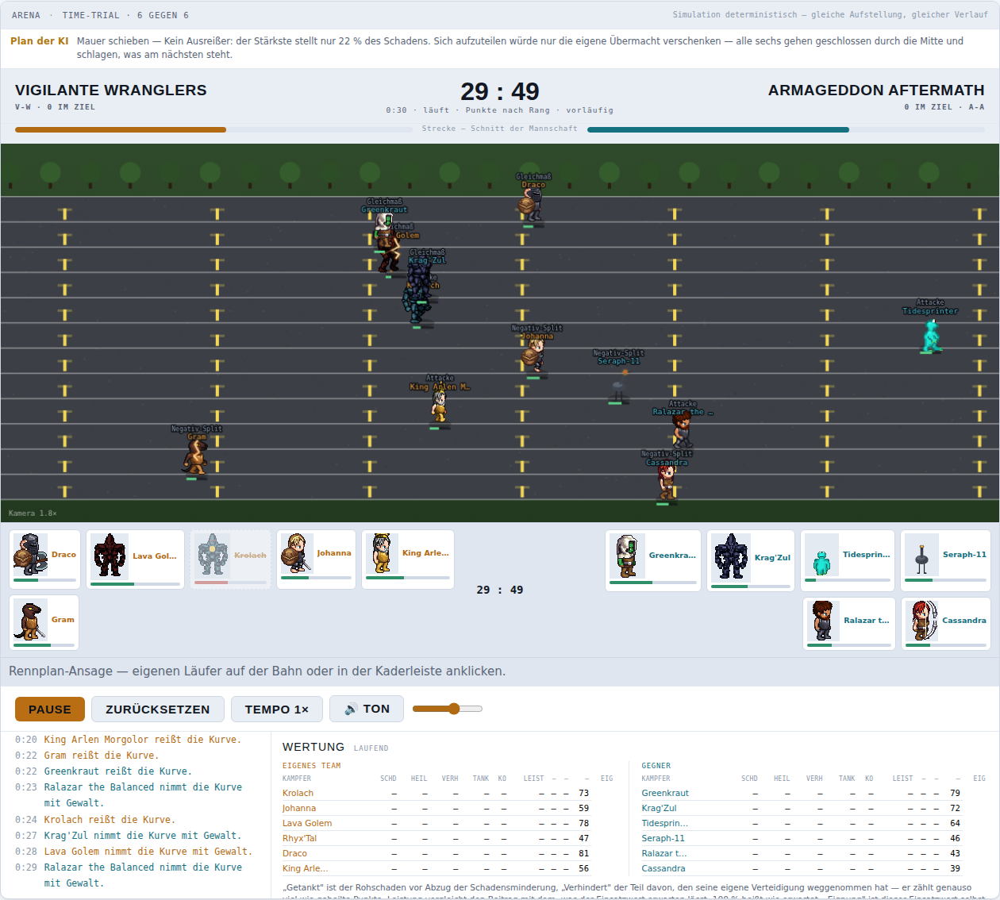
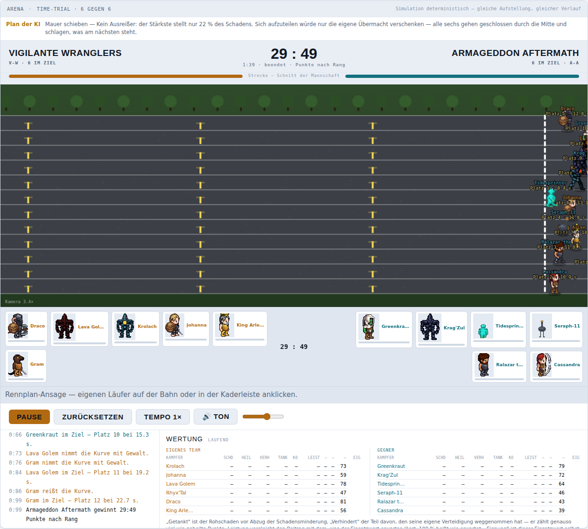

# Time-Trial: Wertung als Einzelzeitfahren — Befund, Recherche, Modell, Prototyp, Rezept (05.09.)

Reine Planung, kein Code auf `main`. Alle Zeilenangaben meinen `public/mockups/battle-mode.engine.js`
auf `f251ab00` (HEAD von `main` am 05.09.2026, PR #803 gemergt). Der Prototyp (Anhang A) lief in
einem eigenen `git worktree`; er ist **nicht** Teil dieses PRs, sondern liegt hier als Patch zum
Nachvollziehen. Alle Zahlen sind an der echten Kaderfamilie (fünf Team-Paarungen aus dem
`live-save`-Abbild, `data/generated/kaderfamilie-live-save.json`) nachgemessen.

Auslöser, von Chris selbst am Bildschirm entdeckt: die Anzeige über dem Zeitfahren zählt, wie viele
Läufer je Seite **schon im Ziel** sind — und steht deshalb am Ende immer „6 : 6". Seine Worte:
„Time Trial wäre eher sowas wie Einzelzeitfahren beim Radsport, also man ist solo unterwegs und
versucht die Zeiten der anderen zu schlagen. Da würde ich dann nach Rang am Ende Punkte vergeben
für die Teams -> wäre vermutlich am einfachsten."

---

## 0. Ergebnis vorab

1. **Der Fund stimmt und ist vollständig ein Anzeige-Fehler.** `updateHudBahn()` (Zeile 14140–14144)
   und die Kaderleisten-Mitte in `renderKader()` (Zeile 16957–16959) schreiben beide
   `rennFertig.filter(seite).length` — die Zahl der Angekommenen. Bei 6 gegen 6 ist das am Ende
   zwangsläufig 6 : 6, und unterwegs (0 : 4 nach vier Ankünften, 3 : 5 nach acht, dann 6 : 6)
   zeigt es nur, wer *zuerst* da war, nicht wie *viel* schneller. Die Zeit je Läufer entsteht
   sauber (`u.fertig = rennT`, Zeile 15589); sie wird nur nirgends zu einem Teamstand verrechnet.
2. **Außer der Anzeige hält heute nichts das Ergebnis fest.** Es gibt für die Bahn keine
   Siegermeldung, kein Endstand-Overlay (`finish()`/`renderEndstand()` sind Kampf-spezifisch) und
   keinen Produktionspfad: `ARENA_RESOLVED_DISCIPLINE_IDS` enthält nur Basketball, Gewichtheben,
   Hockey (`lib/resolve/battle-mode-arena-team-points.ts:141`), `arena-headless-runner.ts` kennt
   nur `spieleFeldspiel`/`spieleBuehneHeben`. Time-Trial wird in der Liga weiter über den alten
   PPS-Pfad aufgelöst — der Fehler wirkt also **nicht** in die Tabelle. Eine spätere Produktivierung
   hätte das „6 : 6" aber als `seiten` geerbt; deshalb gehört die Wertung in den Motor, nicht in
   die Anzeige allein. `MOTOREN["time-trial"].wert()` (Messung) rechnet bereits richtig mit
   `-(Platz)` und bleibt unangetastet.
3. **Derselbe Fehler steht in Spurt, Climbing und Takeshi's Castle** — dieselben zwei Zeilen
   gelten für alle fünf Bahnen. Nur die Staffel ist ein anderer Fall (alle sechs teilen eine
   Zeit; dort ist „1 : 0 — wer zuerst im Ziel ist" die richtige Antwort, s. Abschnitt 5.5).
4. **Empfohlenes Modell: eine gemeinsame Rangliste 1…N nach Zielzeit, Platz 1 = N Punkte,
   Platz N = 1 Punkt, Teamstand = Summe.** Bei 6 gegen 6 also 12, 11, …, 1 (Summe 78, ein Team
   holt zwischen 21 und 57). Das ist die Platzziffern-Wertung des Crosslaufs, nur so gedreht,
   dass wie überall in der Arena die größere Zahl gewinnt. Kopflastige Tabellen (Formel 1) und
   die Crosslauf-Regel „nur die besten fünf zählen" wurden auf denselben 500 Rennen mitgerechnet
   (Abschnitt 3.2): F1 dreht den Sieger in 4,4 % der Rennen, Cross-5 in keinem — beide bringen
   nichts, was die lineare Tabelle nicht hätte, und beide sind schwerer zu erklären.
5. **Gleichstand kommt vor — 4,4 % über alle Paarungen, aber 20 % in der engen Paarung**
   (Vigilante/Armageddon). Empfehlung: Summe der Zielzeiten entscheidet (kleiner gewinnt), wie die
   Mannschaftswertung der Tour de France. Gemessen liegen die beiden Zeitsummen bei Punktgleichstand
   im Median 1,87 s auseinander, mindestens 0,083 s — der Tiebreak entscheidet immer. Braucht
   Chris' Ja/Nein (Abschnitt 6, Frage 1); die Alternative „Unentschieden = 1 : 1" ist im
   Battle-Mode-Modell (Sieg 2 / Unentschieden 1 / Niederlage 0) ebenfalls zulässig.
6. **Ausfall gibt es im Zeitfahren nicht.** Kein `nervenKosten` in `BAHN_ART["time-trial"]`, also
   kein `u.raus`; „leer" bremst nur auf 74 %+ (`tempoVon`, Zeile 15209). In 800 gemessenen Rennen:
   0 Läufer ohne Zielzeit, langsamster 23,8 s bei 60 s Abbruchgrenze. Die Regel für den
   theoretischen Fall (nach Strecke hinter allen Angekommenen, Punkte nach Rang) ist dieselbe, die
   Takeshi mit `fertig = 90 + (1 − pos) · 10` schon fährt.
7. **Der Prototyp (52 Zeilen, Anhang A) ändert keine Zeile der Rennmechanik.** Nachgewiesen
   dreifach: Zielzeiten, Positionen und Plätze aller Läufer sind für vier Saaten vorher/nachher
   zeichengleich; die kaderfeste Messung `node scripts/miss-alle-disziplinen.mjs 24 time-trial`
   liefert vorher und nachher **0,867 / 0,050 / 0,909 / 0,056**; der Diff berührt weder
   `stepSpurt` noch `tempoVon` noch `bauSpurt` (dort nur das Zurücksetzen einer Anzeige-Flagge).
8. **Live-Anzeige mit „vorläufig":** Angekommene nach Zeit, Laufende dahinter nach Strecke. Der
   Stand steht damit ab Sekunde eins (Bildschirmfoto: „29 : 49 · Punkte nach Rang · vorläufig"
   bei 0 im Ziel) und konvergiert von selbst auf den Endstand — wie die virtuelle Zwischenwertung
   im Radsport-Fernsehen.

---

## 1. Befund am Code

### 1.1 Was die Anzeige heute rechnet

```js
// updateHudBahn(), Zeile 14140-14144
const imZiel=(s)=>rennFertig.filter(x=>x.seite===s).length;
document.getElementById("aliveL").textContent=String(imZiel(0));
document.getElementById("aliveR").textContent=String(imZiel(1));
// Der Punktestand ist die Zahl der Laeufer im Ziel — die Reihenfolge entscheidet.
document.getElementById("score").textContent=imZiel(0)+" : "+imZiel(1);
```

und noch einmal in `renderKader()`, Zeile 16957–16959, für die Mitte der Kaderleiste (`#kmitte`):

```js
if(m)m.textContent=istBahn(disc)
  ? (rennFertig.filter(x=>x.seite===0).length+" : "+rennFertig.filter(x=>x.seite===1).length)
```

Der Kommentar „die Reihenfolge entscheidet" verrät den Irrtum: die Reihenfolge entscheidet zwar,
aber ein Zähler *vergisst* sie. `aliveL`/`aliveR` („6 im Ziel") sind dabei nicht falsch — sie
behaupten nur, was sie zählen. Falsch ist die große Zahl in der Mitte, die überall sonst in der
Arena der *Punktestand* ist.

So sieht es in vier Rennen aus (`window.__arena.bahnLauf("time-trial", saat)`, Standardkader
SQUAD/OPP, Zieleinlauf-Zähler zu drei Zeitpunkten abgeleitet aus den Zielzeiten):

| Saat | nach 4 Ankünften | nach 8 | am Ende | tatsächlich (Rangpunkte 12…1) |
|---|---|---|---|---|
| 1337 | 0 : 4 | 3 : 5 | **6 : 6** | 27 : 51 |
| 9256 | 0 : 4 | 4 : 4 | **6 : 6** | 30 : 48 |
| 17175 | 0 : 4 | 3 : 5 | **6 : 6** | 27 : 51 |
| 20260905 | 0 : 4 | 3 : 5 | **6 : 6** | 26 : 52 |

Saat 1337 im Detail — der rechte Kader (OPP, mit Tidesprinter) fährt hier vier Läufer auf die
ersten vier Plätze, und die Anzeige sagt am Ende „6 : 6":

| Platz | Seite | Zeit | Punkte | Plan | Läufer |
|---:|---|---:|---:|---|---|
| 1 | R | 8,98 s | 12 | Attacke | Tidesprinter |
| 2 | R | 10,63 s | 11 | Negativ-Split | Seraph-11 |
| 3 | R | 10,67 s | 10 | Attacke | Ralazar the Balanced |
| 4 | R | 11,28 s | 9 | Negativ-Split | Cassandra |
| 5 | L | 12,45 s | 8 | Negativ-Split | Johanna |
| 6 | L | 12,78 s | 7 | Attacke | King Arlen Morgolor |
| 7 | L | 13,47 s | 6 | Gleichmaß | Draco |
| 8 | R | 15,32 s | 5 | Gleichmaß | Krag'Zul |
| 9 | R | 15,52 s | 4 | Gleichmaß | Greenkraut |
| 10 | L | 15,98 s | 3 | Attacke | Krolach |
| 11 | L | 19,32 s | 2 | Gleichmaß | Lava Golem |
| 12 | L | 20,85 s | 1 | Negativ-Split | Gram |

### 1.2 Wo die Zeit entsteht — und warum die Reihenfolge stimmt

`stepSpurt(dt)` (Zeile 15278 ff.) bewegt jeden Läufer mit `u.pos += u.v·dt/strecke`; beim
Überschreiten von `pos ≥ 1` (Zeile 15579–15592):

```js
u.fertig=rennT;rennFertig.push(u);
feed(u.seite,u.n+" im Ziel — Platz "+rennFertig.length+" bei "+rennT.toFixed(1)+" s.");
```

`rennT` ist die gemeinsame Rennuhr in Simulationssekunden; **alle zwölf starten bei `rennT = 0`**
(`bauSpurt`, kein `startT` außerhalb der Staffel). Deshalb ist die Ankunftsreihenfolge im
Zeitfahren identisch mit der Zeit-Rangfolge, und `rennFertig` ist bereits die sortierte
Rangliste — die Platzangabe am Läufer auf der Leinwand („Platz 3 · 10,7 s", `zeichneSpurt`, Zeile
15654) ist korrekt. Das Rennen endet mit `rennFertig.length >= LAEUFER.length || rennT > 60`
(Zeile 15595), das setzt `done` direkt — `finish()` (Zeile 15957) wird für die Bahn nie aufgerufen.

Die Konfiguration `BAHN_ART["time-trial"]` (Zeile 14641–14690) ist für ein Zeitfahren richtig:
`schatten:false, tackle:false` (kein Sog, kein Rempler), neun Kurven (`hindernisse`), drei Pläne
Gleichmaß/Negativ-Split/Attacke. Daran ändert dieses Dokument nichts.

### 1.3 Was das Rennen sonst noch „entscheidet": nichts

Geprüft, damit die Diagnose vollständig ist:

| Stelle | Befund |
|---|---|
| `finish()` / `renderEndstand()` (15957, 16992) | Kampf-spezifisch (`U`, `live()`, K/T/B-Spalten). Für die Bahn wird weder eine Siegermeldung in den Ticker geschrieben noch das Overlay `#endstand` gezeigt. `#phase` springt auf „beendet", sonst passiert nichts. |
| `MOTOREN[bd].wert()` (17365–17403) | Für Nicht-Staffel: `-(Platz)` je Läufer, Platz aus `sort((a,b)=>(a.fertig??99)-(b.fertig??99))`. Das ist der Mess-Wert für rho — **richtig**, und er ist der Grund, warum die Rangtreue 0,867 heißt, obwohl die Anzeige 6 : 6 sagt. Kein Teamstand. |
| `bahnSerie()` (17585) | Messreihe (Platz-/Zeitmittel je Läufer über n Rennen). Kein Teamstand. |
| `bahnLauf()` (18299) | Sonde: Rangliste je Läufer mit `platz`, `zeit`, `pos`. Kein Teamstand. |
| `spieleFeldspiel()` / `spieleBuehneHeben()` (17949, 17994) | Die beiden Produktions-Einstiege liefern `{disziplin, seiten, boxscore}`; für Bahn-Disziplinen gibt es **keinen**. |
| `lib/resolve/battle-mode-arena-team-points.ts:141` | `ARENA_RESOLVED_DISCIPLINE_IDS = {basketball, gewichtheben, hockey}`. Time-Trial ist nicht drin. |
| `lib/battle/arena-headless-runner.ts:102` | `ARENA_BUEHNE_HEBEN_DISCIPLINE_IDS = {gewichtheben}`; sonst nur `spieleFeldspiel`. Kein Bahn-Chassis. |
| `lib/data/dataAdapter.ts:58` | Produktions-Stammdaten: `time-trial … playerCount: 4`. Die Saison würfelt je Disziplin 2…6 (`season-discipline-schedule.ts:60–75`). **Das reale Rennen ist also nicht 6 gegen 6, sondern 2…6 gegen 2…6** — die Wertung muss für N = 4 … 12 Läufer gelten, nicht nur für 12. |

Fazit: Die falsche Anzeige hat heute keine Wirkung auf Saison oder Liga-Tabelle. Sie hat aber
auch keinen Ort, an dem die richtige Wertung *schon* stünde — es gibt sie schlicht nicht.

### 1.4 Derselbe Fehler in drei weiteren Bahnen

`updateHudBahn()` und `renderKader()` gelten für alle fünf `BAHN_ART`-Einträge. Spurt (4 gegen 4),
Climbing (6 gegen 6) und Takeshi's Castle (6 gegen 6) zeigen exakt dasselbe: am Ende steht die
Zahl der Angekommenen. Bei Takeshi kommt hinzu, dass Ausgeschiedene ebenfalls in `rennFertig`
gepusht werden (Zeile 15453–15454) — auch dort also am Ende 6 : 6, egal wer wie oft im Wasser lag.
Die Staffel ist der eine Fall, in dem der Zähler *sinnvoll* etwas sagt (die Mannschaft, die zuerst
6 hat, hat gewonnen), aber auch dort steht am Ende 6 : 6.

### 1.5 Nebenfunde (nicht Teil dieses Auftrags)

- Die Wertungstafel unter dem Rennen (`renderWertung`, Zeile 13983) zeigt für die Bahn die
  Kampf-Spalten Schd/Heil/Verh/Tank/KO — alle „–". Ein Bahn-Kopf (Platz, Zeit, Kurven sauber /
  mit Gewalt / gerissen, Reserve, Punkte, Eig) wäre die passende Tafel; `setWertungKopf()` kennt
  bislang nur `kampf` und `feldspiel`.
- „Plan der KI" (`#arenaplan`) zeigt im Time-Trial den TDM-Text („Mauer schieben — Kein Ausreißer …").
- Der Ticker-Zeitstempel (`feed()`, Zeile 15950) schreibt `"0:"+floor(sekunden)` ohne
  Minutenumbruch — auf der Bahn stehen dort „0:66" und „0:99" (Bildschirmfoto in 4.3), während
  die Kopfzeile korrekt „1:39" zeigt.

---

## 2. Recherche: Wie Einzelleistungen zu einer Mannschaftswertung werden

Gesucht war nicht „ob 1. Platz die meisten Punkte bekommt" (das ist überall so), sondern die
konkreten Tabellen und ihre Begründung — damit die Wahl in Abschnitt 3 begründet und nicht geraten
ist. Zwei Familien, dazu der Sonderfall Radsport.

### 2.1 Platzziffern — jeder zählt, Summe entscheidet (Crosslauf)

Im Crosslauf (NCAA, NFHS, Schul- und Vereinssport weltweit) bekommt jeder Läufer als Punktzahl
seinen **Platz im Gesamtfeld** (1 für den Sieger, 2 für den Zweiten …), die **fünf besten je
Mannschaft** werden addiert, und die **kleinste Summe gewinnt**; ein „perfect score" ist 15
(Plätze 1–5). Der sechste und siebte Läufer sind „displacers": sie zählen nicht selbst, drücken
aber die Plätze — und damit die Punkte — der gegnerischen Zähler nach hinten. Gleichstand: der
bessere sechste Läufer entscheidet, danach der siebte. (Quellen: [Cross Country Rules and
Scoring Methodology (PDF)](https://cdn1.sportngin.com/attachments/document/48b2-2856049/Cross-Country-Rules-and-Scoring-Methodology.pdf),
[How Cross Country Works — University of Michigan](https://mgoblue.com/news/2018/8/22/how-cross-country-works),
[How does cross country scoring work? — TrackBarn](https://trackbarn.com/blogs/faq/how-does-cross-country-scoring-work),
[Cross Country 101 — SHS](https://shscrosscountry.com/cross-country-101-how-a-meet-is-scored/).)

Für uns wichtig: **das ist mathematisch dieselbe Wertung wie „Platz 1 = N Punkte, Platz N = 1
Punkt, alle zählen"** — die Summe der Platzziffern und die Summe von `N − Platz + 1` ordnen die
beiden Mannschaften immer gleich (bei gleicher Läuferzahl je Seite ist die eine Summe eine
Konstante minus die andere). Der Crosslauf hat diese Wertung seit über hundert Jahren in
Gebrauch; sie belohnt Tiefe, nicht nur den Star, und jeder Platz zählt gleich viel.

### 2.2 Feste Punkte je Platz — die Spitze wiegt mehr (Leichtathletik-Duell, Schwimmen, Formel 1)

- **Leichtathletik-Dual-Meet (NFHS):** je Ereignis 5-3-1 oder 6-4-3-2-1; die Verbände wählen die
  Spreizung nach Feldgröße ([NFHS Track & Field Rules](https://nfhs.org/sports/track-field/rules),
  [Track and Field Scoring — SHHS](https://havenxctf.com/track-and-field-scoring/)).
- **Schwimmen-Dual-Meet (NCAA Rule 7):** Einzelstrecken 9-4-3-2-1-0, höchstens drei Zähler je
  Team; bei fünf Bahnen oder weniger 5-3-1-0 mit höchstens zwei Zählern
  ([College swim and dive 101 — Duke Chronicle](https://dukechronicle.com/article/duke-swim-and-dive-college-sports-101-rules-season-format-scoring-points-competition-brian-barnes-20241206),
  [Swimming and Diving Meet Scoring — Utah](https://utahutes.com/sports/2023/1/4/swimming-and-diving-meet-scoring)).
- **Formel 1 (seit 2010):** 25-18-15-12-10-8-6-4-2-1. Die Spreizung zwischen Platz 1 und 2
  (7 Punkte, größer als jeder andere Abstand) ist ausdrücklich gewollt, damit sich der Sieg
  lohnt: unter 10-8-6-… war ein zweiter Platz 80 % eines Sieges wert, jetzt 72 %
  ([History of the F1 points system — Autosport](https://www.autosport.com/f1/news/history-of-the-f1-points-system-with-proposed-structure-for-2025/10603210/),
  [F1 points system explained — Silverstone](https://www.silverstone.co.uk/news/f1-points-system-explained)).

Gemeinsam ist diesen Tabellen: sie sind für **viele Teams in einem Rennen** gebaut (F1) oder für
**viele Ereignisse je Wettkampf** (Dual Meet), wo nur die Spitze jedes Ereignisses zählt. Unser
Zeitfahren ist *ein* Ereignis mit *zwei* Teams und *allen* Läufern im selben Feld — das ist die
Crosslauf-Situation, nicht die F1-Situation.

### 2.3 Radsport: Zeit statt Platz

- **UCI-Mixed-Relay-Mannschaftszeitfahren (WM):** sechs Fahrer je Nation (3 Frauen, 3 Männer),
  gewertet wird die Zeit, mit der der **zweite** Fahrer der Schlussgruppe die Linie überquert —
  wer Fahrer abhängt, verliert ([UCI Road World Championships – Mixed team relay —
  Wikipedia](https://en.wikipedia.org/wiki/UCI_Road_World_Championships_%E2%80%93_Mixed_team_relay),
  [Spotlight on the World Championship Team Time Trial Mixed Relay — Ekoï](https://www.ekoi.com/en/blog/spotlight-on-the-world-championship-team-time-trial-mixed-relay)).
- **Tour de France, Mannschaftswertung:** je Etappe die Summe der Zeiten der **drei besten**
  Fahrer eines Teams; kleinste Summe führt ([Team classification —
  Wikipedia](https://en.wikipedia.org/wiki/Team_classification),
  [TOUR Magazin: Classifications and jerseys](https://www.tour-magazin.de/en/professional-cycling/latest-news/tour-de-france-2026-an-explanation-of-the-rules-and-jersey-colours/)).

Der Radsport hat, was wir auch haben: eine Stoppuhr je Läufer (`u.fertig`). Eine reine
Zeitsummen-Wertung wäre deshalb möglich — sie ist aber als Anzeige schlecht lesbar („71,3 s : 78,9 s"
sagt niemandem, wie deutlich das ist) und im Modell des Projekts systemfremd: alle anderen
Chassis zeigen ganze Punkte. Die Zeitsumme eignet sich dafür hervorragend als **Tiebreak**
(Abschnitt 3.3).

### 2.4 Was nicht passt: Leistungs-Punktetabellen und die Liga-Tabelle

- Die **Punktewertung der Leichtathletik** (Mehrkampf, Länderkampf) rechnet Leistungen in Punkte
  um, nicht Plätze ([Punktewertung (Leichtathletik) —
  Wikipedia](https://de.wikipedia.org/wiki/Punktewertung_(Leichtathletik))). Das setzt eine
  kalibrierte Leistungsskala voraus, die unsere Simulationssekunden nicht haben.
- Die projekteigene **`references/sheets/rank-to-points.json`** (`getRankToPointsValue`,
  `lib/resolve/rank-to-points.ts`) ordnet 16 Liga-Ränge Team-Punkten zu (Spielerzahl 6: 19,9 /
  18,6 / 17,4 …). Sie ist für die Saisontabelle gebaut, mit Dezimalen, und sie wurde für den
  Battle Mode ausdrücklich abgelöst: Chris am 30.08., „Sieg = 2, Unentschieden = 1, Niederlage = 0.
  Das ist gesetzt." (`battle-mode-arena-team-points.ts`, Kopfkommentar). Die Rennwertung muss also
  nur eine Frage beantworten: **wer hat das Duell gewonnen** — und sie darf ein Unentschieden
  liefern, muss es aber nicht.

---

## 3. Das Modell

### 3.1 Die Regel

1. Alle Läufer beider Seiten stehen in **einer** Rangliste, sortiert nach Zielzeit `u.fertig`
   (aufsteigend). Wer keine Zielzeit hat, steht hinter allen Angekommenen, untereinander nach
   zurückgelegter Strecke `u.pos` (absteigend).
2. Platz r bekommt **N − r + 1 Punkte**, N = Zahl der Läufer im Rennen (`LAEUFER.length`).
3. Der Teamstand ist die **Summe der Punkte der eigenen Läufer**.
4. Größere Summe gewinnt. Bei Gleichstand: Abschnitt 3.3.

Für 6 gegen 6:

| Platz | 1 | 2 | 3 | 4 | 5 | 6 | 7 | 8 | 9 | 10 | 11 | 12 |
|---|---|---|---|---|---|---|---|---|---|---|---|---|
| Punkte | 12 | 11 | 10 | 9 | 8 | 7 | 6 | 5 | 4 | 3 | 2 | 1 |

Summe 78; ein Team holt zwischen 21 (Plätze 7–12) und 57 (Plätze 1–6); Gleichstand bei 39 : 39.
Für 4 gegen 4 (der Produktionsstandard des Time-Trial): 8…1, Summe 36, Gleichstand 18 : 18. Für
2 gegen 2: 4…1. Die Formel braucht keine Tabelle je Feldgröße, und sie gilt auch, wenn die Seiten
ungleich besetzt sind (3 gegen 6 ist im Battle Mode erlaubt): Punkte hängen am Platz im Feld,
nicht an der Kadergröße.

### 3.2 Warum linear — auf denselben Rennen nachgerechnet

Drei Tabellen wurden auf **denselben 500 Rennen** (fünf Kaderfamilien-Paarungen × 100 Saaten,
Prototyp aus Anhang A) nebeneinander ausgewertet:

| Tabelle | Unentschieden | dreht den Sieger gegenüber linear | Seite des Rennsiegers (Platz 1) verliert die Wertung |
|---|---:|---:|---:|
| **linear** 12…1 | 22 (4,4 %) | — | 88 von 478 entschiedenen |
| F1 25-18-15-12-10-8-6-4-2-1-0-0 | 0 | 22 (4,4 %) | 66 |
| Cross-5 (nur die besten fünf je Seite, Platzziffern) | 12 | 0 | — |

Lesart:

- **Cross-5 unterscheidet sich von linear in keinem einzigen Rennen** — der sechste Läufer als
  reiner „displacer" ändert bei zwei Teams nichts an der Rangfolge. Die Crosslauf-Regel bringt
  hier nur Erklärungsaufwand.
- **F1 dreht 22 Rennen**, ausschließlich in den beiden engen Paarungen (Vigilante/Armageddon 19,
  Piratecrew/Raginglunatics 3). Das sind genau die Rennen, in denen die Tiefe des einen Teams
  gegen den Star des anderen steht. F1 gibt dem Star recht; linear der Tiefe. In der Paarung
  Mortalsin/Natureswrath verliert die Seite des Rennsiegers **59 von 100** Rennen — mit beiden
  Tabellen, weil dort ein Star gegen fünf bessere Läufer steht. Die Wertung „Star gewinnt alles"
  wäre also ohnehin nicht F1, sondern „nur Platz 1 zählt" — und das ist Spurt-Logik, kein
  Mannschaftszeitfahren.
- Chris' Satz „nach Rang am Ende Punkte vergeben für die Teams — wäre vermutlich am einfachsten"
  meint genau die lineare Tabelle: sie ist in einem Satz erklärt („der Erste bekommt zwölf, der
  Letzte einen"), sie ist die bewährte Crosslauf-Wertung, und jeder Läufer im Kader trägt
  sichtbar etwas bei — der sechste Mann, der von Platz 11 auf Platz 8 klettert, bringt drei
  Punkte, bei F1 null.

Was **nicht** empfohlen wird: die Rangtreue-Zahl als Argument. rho misst je Läufer (`wert()`) und
ist von der Teamwertung unabhängig — jede der drei Tabellen lässt 0,867 unverändert.

### 3.3 Gleichstand

Über alle Paarungen 4,4 %, in der engen Paarung Vigilante/Armageddon **20 von 100**. Das ist zu
häufig, um es zu übergehen. Zwei zulässige Antworten:

| | Regel | Für | Gegen |
|---|---|---|---|
| **A (empfohlen)** | Summe der Zielzeiten aller Läufer entscheidet, kleinere gewinnt | Ein Zeitfahren hat eine Stoppuhr; die Zeit *ist* die Leistung, der Rang nur ihre Vergröberung. Vorbild TdF-Mannschaftswertung. Gemessen an den 22 Gleichständen: Zeitsummen-Abstand im Median 1,87 s, minimal 0,083 s — der Tiebreak entscheidet immer, und er ist nicht vom Star abhängig (die Seite des Rennsiegers gewinnt ihn in 11 von 22). | Ein zweiter Rechenweg, den die Anzeige erklären muss („39 : 39, Zeit 71,3 s : 73,2 s"). |
| **B** | Unentschieden bleibt Unentschieden (1 : 1 im Sieg-2-Modell) | Nichts zu erklären; das Battle-Mode-Modell sieht Unentschieden vor. | Ein Zeitfahren, das „unentschieden" endet, ist im Sport unbekannt; 20 % Unentschieden in einer engen Paarung sind viel. |

Empfehlung A. Falls Chris B will, ist es eine gestrichene Zeile im Rezept.

### 3.4 Ausfall

Im Zeitfahren nicht vorhanden: `BAHN_ART["time-trial"]` hat kein `nervenKosten`, also wird
`u.raus` nie gesetzt (Zeile 15441–15459 greift nur bei Takeshi). „Leer" (Reserve verbraucht) senkt
das Tempo auf `0,74 + STEHEN·0,0012` (Zeile 15209), der Läufer kommt an. Die Abbruchgrenze
`rennT > 60` (Zeile 15595) wäre der einzige Weg zu einem Läufer ohne Zielzeit; gemessen in 800
Rennen (300 Standardkader + 500 Kaderfamilie): **0 Läufer ohne Zielzeit**, langsamste Zielzeit
23,8 s, Median der Spanne Erster–Letzter 7,2 s (Kaderfamilie) bzw. 10,9 s (Standardkader).

Die Regel in 3.1 (ohne Zielzeit → hinter allen, nach Strecke) deckt den Fall trotzdem ab und ist
absichtlich dieselbe Ordnung, die Takeshi's Castle mit `u.fertig = 90 + (1 − pos)·10` (Zeile 15453,
Patch T0) schon fährt: wer weiter kam, hat mehr geleistet, und er bekommt weiter Punkte nach Rang
— null Punkte für einen Ausgeschiedenen wären eine zweite Strafe für dieselbe Sache.

### 3.5 Die Live-Anzeige: vorläufig, aber ehrlich

Während des Rennens sind die Angekommenen nach Zeit fest, die Laufenden ordnen sich nach
Strecke ein. Daraus ergibt sich zu jedem Zeitpunkt ein vorläufiger Stand, der die Frage
beantwortet, die der Zuschauer wirklich hat: *wenn es jetzt so bliebe — wer führt, und wie
deutlich?* Er wird mit „vorläufig" beschriftet, solange `done` nicht gesetzt ist. Am Ende ist
der Stand exakt und endgültig.

Das ist der Unterschied zum Zähler: „0 : 4 nach vier Ankünften" wusste auch, dass rechts vorn
liegt — aber „14 : 30 · vorläufig" sagt außerdem, dass die eigenen Läufer im Feld dahinter noch
Boden gutmachen. Genau das macht eine Rennplan-Ansage (Abschnitt „RENNPLAN-ANSAGE", Zeile 15221 ff.)
zu einer Entscheidung mit sichtbarer Wirkung.

---

## 4. Prototyp und Messung

Der Prototyp (Anhang A, 52 Zeilen) sitzt in einem eigenen `git worktree` auf `main`
(`f251ab00`). Er besteht aus einer Konfigurationsflagge `wertung:"rang"` in
`BAHN_ART["time-trial"]`, einer reinen Auswertefunktion `bahnRangliste()`, dem Umbau der beiden
Anzeigestellen, einer Siegermeldung am Ende und zwei Feldern in der `bahnLauf`-Sonde.

### 4.1 Rennmechanik unangetastet — dreifach nachgewiesen

1. **Zeichengleiche Rennen.** `bahnLauf("time-trial", saat)` für 1337, 9256, 17175, 20260905
   vorher (main) und nachher (Worktree): Name, Zielzeit, Position, Platz und Seite aller 48 Läufer
   identisch, Rennzeit identisch (Vergleich der JSON-Ausgaben, Skript in Anhang B).
2. **Kaderfeste Messung.** `node scripts/miss-alle-disziplinen.mjs 24 time-trial`, Kaderquelle
   `live-save (Oly New Game Custom 19.8.2026)`:

   | | rho je Spiel (Median) | Spannweite | rho Saison (Median) | Spannweite |
   |---|---:|---:|---:|---:|
   | main `f251ab00` | 0,867 | 0,050 | 0,909 | 0,056 |
   | Prototyp | 0,867 | 0,050 | 0,909 | 0,056 |

   Identisch, wie es sein muss: `MOTOREN["time-trial"].wert()` (Messwert je Läufer) ist nicht
   Teil des Diffs, `stepSpurt`/`tempoVon`/`kurvenFaktor` auch nicht.
3. **Diff-Lesung.** Der einzige Eingriff in eine Motorfunktion ist `bahnEndeGemeldet=false;` in
   `bauSpurt` — das Zurücksetzen einer Anzeige-Flagge, keine Rechengröße.

### 4.2 Die Wertung an der Kaderfamilie

`bahnLauf` mit `kaderSetzen` je Paarung, 100 Saaten je Paarung (Skript in Anhang B):

| Paarung | Siege links | Siege rechts | Unentschieden | Punktdifferenz Median | Seite des Rennsiegers gewinnt |
|---|---:|---:|---:|---:|---:|
| Vigilante / Armageddon | 23 | 57 | 20 | 4 | 57 / 80 |
| Coldsteel / Direlegion | 100 | 0 | 0 | 22 | 97 / 100 |
| Goldengladiators / Silversoldiers | 100 | 0 | 0 | 30 | 100 / 100 |
| Mortalsin / Natureswrath | 100 | 0 | 0 | 16 | 41 / 100 |
| Piratecrew / Raginglunatics | 95 | 3 | 2 | 6 | 95 / 98 |

Histogramm |Punktdifferenz| (n = 500): 0: 22 · 2: 42 · 4: 42 · 6: 35 · 8: 19 · 10: 20 · 12: 16 ·
14: 29 · 16: 33 · 18: 36 · 20: 28 · 22: 29 · 24: 42 · 26: 26 · 28: 22 · 30: 17 · 32: 22 · 34: 9 · 36: 11.
(Die Differenz ist immer gerade, weil beide Summen zusammen 78 ergeben.) 21 % der Rennen enden
mit höchstens vier Punkten Abstand — die Wertung liefert enge *und* deutliche Ausgänge, je nach
Paarung, was der Zähler nie konnte.

### 4.3 So sieht es aus



Mitten im Rennen (Standardkader in der UI-Aufstellung, 30 s Zuschauzeit = rund 7 s Rennzeit):
„**29 : 49** · 0:30 · läuft · Punkte nach Rang · vorläufig", links „0 im Ziel", rechts „0 im
Ziel", Kaderleisten-Mitte „29 : 49". Der vorläufige Stand kommt hier allein aus den Positionen
auf der Strecke — niemand ist im Ziel, und die Anzeige sagt trotzdem schon, wie das Feld liegt.



Am Ende desselben Rennens (per DOM abgenommen): „**29 : 49** · beendet · Punkte nach Rang",
„6 im Ziel" beidseits, Kaderleisten-Mitte „29 : 49", letzte Ticker-Zeilen „Gram im Ziel — Platz 12
bei 22.7 s." und neu „**Armageddon Aftermath gewinnt 29:49 Punkte nach Rang**". Dass der
vorläufige Stand nach sieben Sekunden schon dem Endstand entsprach, ist in diesem Rennen Zufall
(die Reihenfolge stand früh fest); in engen Rennen wandert er bis zur letzten Ankunft.

---

## 5. Rezept — umsetzungsreif

### 5.1 Code-Orte (alle in `public/mockups/battle-mode.engine.js`, Zeilen auf `f251ab00`)

| # | Ort | Änderung |
|---|---|---|
| 1 | `BAHN_ART["time-trial"]`, nach Zeile 14664 | `wertung:"rang"` mit Kommentar. Andere Bahnen bekommen die Flagge **noch nicht** (Abschnitt 5.5). |
| 2 | vor `function updateHudBahn()`, Zeile 14118 | `function bahnRangliste()` (Anhang A) und `let bahnEndeGemeldet=false;`. Reine Auswertung: liest `u.fertig`, `u.pos`, `u.seite`, `u.id`; schreibt nichts. Gibt `{reihe, punkte: Map<id,Punkte>, seiten:[L,R]}` zurück. |
| 3 | `updateHudBahn()`, Zeile 14143–14144 | Bei `BA().wertung==="rang"`: `#score` = `seiten[0]+" : "+seiten[1]`, `#klsuffix` = „Punkte nach Rang" bzw. „… · vorläufig"; bei `done` einmalig `feed(…,true)` mit Sieger und Stand. Sonst der alte Zähler (bit-identisch für Spurt/Climbing/Takeshi/Staffel). `#aliveL`/`#aliveR` bleiben „N im Ziel". |
| 4 | `bauSpurt()`, Zeile 14960 | `bahnEndeGemeldet=false;` |
| 5 | `renderKader()`, Zeile 16958–16959 | `#kmitte` bei `wertung:"rang"` aus `bahnRangliste().seiten`, sonst wie bisher. |
| 6 | `bahnLauf()`, Zeile 18319–18327 | `wertung`, `seiten` im Ergebnis, `punkte` je Läufer — damit Playwright die Wertung von außen abnimmt. |
| 7 (Tiebreak A) | in `bahnRangliste()` | zusätzlich `zeitSumme:[L,R]` (Summe `u.fertig`, ohne Zielzeit 90 wie in `bahnSerie`); Sieger = größere Punktsumme, bei Gleichstand kleinere Zeitsumme; nur bei beidem gleich „Unentschieden". Anzeige: bei Gleichstand der Punkte zeigt `#klsuffix` „Punkte nach Rang · Zeit entscheidet: 71,3 s : 73,2 s". |

Nicht anfassen: `stepSpurt`, `tempoVon`, `kurvenFaktor`, `MOTOREN[bd].wert()`, `bahnSerie`,
`BAHN_ART["time-trial"].rezept/plaene/…`. Die Abnahme dafür ist Abschnitt 4.1: beide Zahlenreihen
müssen vorher/nachher identisch bleiben.

### 5.2 Anzeige

- **Kopfzeile:** große Zahl = Punktsumme („27 : 51"), Unterzeile „0:47 · läuft · Punkte nach Rang ·
  vorläufig" bzw. „… · beendet · Punkte nach Rang". Die Teamnamen-Zeilen behalten „6 im Ziel" —
  das ist die Information, die der alte Zähler richtig hatte, und sie bleibt an ihrem Platz.
- **Kaderleisten-Mitte:** dieselbe Punktsumme. Empfohlen zusätzlich (nicht im Prototyp): der
  Kachel-Titel je Läufer „Johanna — Platz 5 · 8 Punkte · 12,5 s" nach der Ankunft, vorher
  „Johanna — vorläufig Platz 7"; die Kachel trägt schon `fertig` und `id`.
- **Ticker am Ende:** „Armageddon Aftermath gewinnt 27:51 Punkte nach Rang" (groß), analog zu
  `finish()` im Kampf („… gewinnt 6:2 Disziplinpunkte").
- **Leinwand:** unverändert — „Platz 3 · 10,7 s" am Läufer ist bereits richtig.
- **Endstand-Overlay:** für die Bahn gibt es keins; das ist ein eigener Auftrag (Abschnitt 6,
  Frage 3), nicht Teil dieses Rezepts.

### 5.3 Produktionspfad — später, aber mit dieser Wertung

Wenn Time-Trial produktiv über die Arena aufgelöst wird (wie Hockey in
`docs/design/hockey-produktivierung.md`), braucht es nach dem dortigen Muster einen dritten
Einstiegspunkt neben `spieleFeldspiel`/`spieleBuehneHeben`:

```js
spieleBahn:(bd,saat)=>{
  if(!BAHN_ART[bd]||BAHN_ART[bd].wertung!=="rang")return null;
  const M=MOTOREN[bd]; const g=M.sichern(); if(M.vorher)M.vorher();
  M.bau(saat); M.lauf();
  const wert=M.wert(), namen=M.namen();
  const boxscore=namen.map(n=>({name:n,wert:wert[n]??0}));
  const w=bahnRangliste();
  M.zurueck(g);
  return {disziplin:bd, seiten:w.seiten, zeitSumme:w.zeitSumme, boxscore};
},
```

`seiten` ist dann die Rangpunkt-Summe (nicht „6 : 6"), `zeitSumme` der Tiebreak — dasselbe
Muster wie `gesamtKg` beim Gewichtheben. Dazu in `arena-headless-runner.ts` eine Menge
`ARENA_BAHN_RANG_DISCIPLINE_IDS` (analog `ARENA_BUEHNE_HEBEN_DISCIPLINE_IDS`) und zuletzt der
Eintrag in `ARENA_RESOLVED_DISCIPLINE_IDS`. Eine eigene PPS-Referenz (`ziehe-…-pps-referenz.ts`)
wäre ebenfalls nötig. Das ist ausdrücklich **nicht** Teil dieses Auftrags — aber der Grund, warum
`bahnRangliste()` im Motor liegt und nicht in `updateHudBahn()`: die Produktivierung muss dieselbe
Funktion aufrufen, nicht eine zweite Kopie.

### 5.4 Tests

- Playwright, neu (`tests/…/time-trial-wertung.spec.ts`): `bahnLauf("time-trial", 1337)` →
  `seiten[0]+seiten[1] === 78`, `laeufer.map(u=>u.punkte)` gleich `[12,11,…,1]` in Zeit-Reihenfolge,
  `wertung === "rang"`; für `spurt` weiterhin `wertung === "zieleinlauf"` (Flagge nicht gesetzt).
- Playwright, UI: nach `setDisc("time-trial")` und Ende des Rennens ist `#score` ungleich „6 : 6",
  `#klsuffix` gleich „Punkte nach Rang", `#kmitte` gleich `#score`, letzte Ticker-Zeile enthält
  „gewinnt" oder „Unentschieden".
- Bestehend: `scripts/pruefe-rangtreue-schranke.mjs` unverändert grün (Abschnitt 4.1).

### 5.5 Die anderen Bahnen

Spurt, Climbing und Takeshi's Castle haben denselben Zähler und würden mit derselben Flagge
`wertung:"rang"` dieselbe Wertung bekommen — ohne weitere Codezeile, weil `bahnRangliste()` über
`LAEUFER` und `BA()` läuft. Für Takeshi ordnet die Regel Ausgeschiedene nach Strecke ein, exakt
wie Patch T0 es schon tut. Empfehlung: **Time-Trial zuerst** (Chris' Fund, und die Disziplin, in
der die Rangwertung am eindeutigsten das Vorbild ist), die drei anderen in einem zweiten Schritt
nach seinem Ja (Abschnitt 6, Frage 2). Die **Staffel** bleibt beim Zähler oder bekommt
`wertung:"zieleinlauf-team"` („1 : 0 — die Mannschaft, die zuerst im Ziel ist"); Rangpunkte wären
dort sinnlos, weil alle sechs dieselbe Zeit haben.

---

## 6. Offene Fragen an Chris

1. **Gleichstand:** Zeitsumme entscheidet (A, empfohlen) — oder Unentschieden lassen (B)?
2. **Dieselbe Wertung für Spurt, Climbing, Takeshi's Castle?** Technisch je eine Zeile; die
   Frage ist, ob er sie dort auch will (bei Spurt mit Remplern ist „Platz" ein etwas anderes Maß
   als im Zeitfahren, aber die Anzeige „4 : 4" ist dort genauso leer).
3. **Endstand-Overlay für die Bahn** (Rangliste 1–12 mit Zeit, Punkten, Kurvenbilanz, Reserve):
   eigener Auftrag, oder reicht Kopfzeile + Ticker?

---

## Anhang A — Der Prototyp als Patch (nicht Teil dieses PRs)

Gegen `main` `f251ab00`, `public/mockups/battle-mode.engine.js`, 49 Zeilen neu, 4 geändert.

```diff
@@ -14115,6 +14115,28 @@
   // beides gibt es im Rennen nicht. Vorher lief sie deshalb gar nicht, und ueber dem
   // Rennen stand dauerhaft "0 : 0" und "0:00". Hier stehen die Groessen, die ein Rennen
   // wirklich hat: verstrichene Zeit, wie viele im Ziel sind, und wie weit das Feld ist.
+  // RANGPUNKTE FUER DIE BAHN (Prototyp, Chris' Fund 05.09.). Eine gemeinsame Rangliste
+  // ueber BEIDE Seiten: wer im Ziel ist, nach Zielzeit; wer noch unterwegs ist, dahinter
+  // nach Strecke (vorlaeufig — so zeigt der Stand waehrend des Rennens, wo es gerade
+  // steht, und konvergiert von selbst auf den Endstand). Platz 1 bekommt N Punkte
+  // (N = Laeufer im Rennen, bei 6 gegen 6 also 12), der Letzte einen. Der Teamstand ist
+  // die Summe — dieselbe Idee wie die Platzziffern-Wertung im Crosslauf, nur so gedreht,
+  // dass wie ueberall sonst in der Arena die GROESSERE Zahl gewinnt.
+  // Liest nur u.fertig/u.pos/u.seite, schreibt nichts: reine Auswertung.
+  function bahnRangliste(){
+    const N=LAEUFER.length;
+    const reihe=[...LAEUFER].sort((a,b)=>{
+      const fa=a.fertig!=null, fb=b.fertig!=null;
+      if(fa&&fb)return a.fertig-b.fertig;
+      if(fa!==fb)return fa?-1:1;
+      return b.pos-a.pos;
+    });
+    const punkte=new Map(), seiten=[0,0];
+    reihe.forEach((u,i)=>{const p=N-i; punkte.set(u.id,p); seiten[u.seite]+=p;});
+    return {reihe,punkte,seiten};
+  }
+  let bahnEndeGemeldet=false;
+
   function updateHudBahn(){
     // Anzeige in ECHTEN Sekunden, nicht in Simulationssekunden: rennT selbst bleibt die
     // unangetastete physikalische Zeitbasis (Cooldowns, Ermuedung ...); was hier steht,
@@ -14140,8 +14162,22 @@
     const imZiel=(s)=>rennFertig.filter(x=>x.seite===s).length;
     document.getElementById("aliveL").textContent=String(imZiel(0));
     document.getElementById("aliveR").textContent=String(imZiel(1));
-    // Der Punktestand ist die Zahl der Laeufer im Ziel — die Reihenfolge entscheidet.
-    document.getElementById("score").textContent=imZiel(0)+" : "+imZiel(1);
+    if(BA().wertung==="rang"){
+      // Chris' Fund (05.09.): "X im Ziel : Y im Ziel" steht am Ende IMMER 6:6 und sagt
+      // nichts darueber, wer schneller war. Jetzt Rangpunkte, s. bahnRangliste().
+      const w=bahnRangliste();
+      document.getElementById("score").textContent=w.seiten[0]+" : "+w.seiten[1];
+      document.getElementById("klsuffix").textContent=done?"Punkte nach Rang":"Punkte nach Rang · vorläufig";
+      if(done&&!bahnEndeGemeldet){
+        bahnEndeGemeldet=true;
+        const [pL,pR]=w.seiten;
+        feed(0,(pL>pR?VEREIN[0].name+" gewinnt ":pR>pL?VEREIN[1].name+" gewinnt ":"Unentschieden ")
+          +pL+":"+pR+" Punkte nach Rang",true);
+      }
+    } else {
+      // Der Punktestand ist die Zahl der Laeufer im Ziel — die Reihenfolge entscheidet.
+      document.getElementById("score").textContent=imZiel(0)+" : "+imZiel(1);
+    }
     // Die Balken zeigen den Streckenschnitt der Mannschaft, nicht Leben.
     const schnitt=(s)=>{const g=LAEUFER.filter(u=>u.seite===s);
       return g.length?g.reduce((a,u)=>a+u.pos,0)/g.length:0;};
@@ -14662,6 +14698,11 @@
       kraftBasis:290, kraftSpanne:2.7,
       label:"Time-Trial", jeSeite:6, hindernisse:[0.10,0.20,0.30,0.40,0.50,0.60,0.70,0.80,0.90],
       hindernisWort:"Kurve", boden:"#3c3f45", schatten:false, tackle:false, grundTempo:96, tempoSpanne:0.82,
+      // WERTUNG NACH RANG (Chris' Fund 05.09., docs/design/time-trial-einzelzeitfahren-
+      // wertung-plan-05-09.md): alle Laeufer beider Seiten in EINER Rangliste nach Zielzeit,
+      // Platz 1 bekommt 2n Punkte, Platz 2n einen — Teamstand ist die Summe. Nur Anzeige und
+      // Auswertung (s. bahnRangliste), keine Zeile der Rennmechanik haengt daran.
+      wertung:"rang",
       rezept:{
         // Dexterity stand hier in SECHS von sieben Werten und las sich mit 32 %, wo die
         // Matrix 25 sagt — waehrend Intelligence (18) und Awareness (12) bei 6 und 0
@@ -14958,6 +14999,7 @@
 
   function bauSpurt(saat){
     seed=normalisiereSaat(saat); rennT=0; done=false; LAEUFER=[]; rennFertig=[]; floats.length=0;
+    bahnEndeGemeldet=false;
     cam={zoom:1,cx:0.5}; bahnWahl=null;
     const d=bahnDisc, art=BA(), n=art.jeSeite;
@@ -16956,7 +16998,8 @@
     }
     const m=document.getElementById("kmitte");
     if(m)m.textContent=istBahn(disc)
-      ? (rennFertig.filter(x=>x.seite===0).length+" : "+rennFertig.filter(x=>x.seite===1).length)
+      ? (BA().wertung==="rang"?bahnRangliste().seiten.join(" : ")
+        :(rennFertig.filter(x=>x.seite===0).length+" : "+rennFertig.filter(x=>x.seite===1).length))
       : (istBuehne(disc)&&BB().duell)
       ? (TEILNEHMER.filter(x=>x.side===0&&x.aktuell+1>=BB().rundenN&&x.vorteil>0).length+" : "+
          TEILNEHMER.filter(x=>x.side===1&&x.aktuell+1>=BB().rundenN&&x.vorteil>0).length)
@@ -18316,9 +18359,11 @@
           stepSpurt(1/60); guard++;
         }
       } finally { stumm=false; }
+      const w=bahnRangliste();
       const erg={disziplin:bd, saat:saat||1337, zeit:+rennT.toFixed(3),
+        wertung:BAHN_ART[bd].wertung||"zieleinlauf", seiten:w.seiten,
         laeufer:[...LAEUFER].sort((a,b)=>(a.fertig??99)-(b.fertig??99)).map((u,pl)=>({
-          platz:pl+1, n:u.n, seite:u.seite, plan:u.plan,
+          platz:pl+1, n:u.n, seite:u.seite, plan:u.plan, punkte:w.punkte.get(u.id),
           ab:+u.ab.toFixed(4), tempo:u.tempo, sucht:u.sucht,
           zeit:u.fertig==null?null:+u.fertig.toFixed(4), pos:+u.pos.toFixed(5),
           bein:u.bein==null?null:u.bein,   // nur Staffel: welchen Abschnitt er laeuft
```

Für Tiebreak A (Abschnitt 3.3) kommt in `bahnRangliste()` eine Zeile dazu:
`const zeitSumme=[0,1].map(s=>LAEUFER.filter(u=>u.seite===s).reduce((a,u)=>a+(u.fertig??90),0));`
und `zeitSumme` in die Rückgabe; die Siegerbestimmung in der Ticker-Zeile und in `spieleBahn`
liest sie bei Punktgleichstand.

## Anhang B — Sonden (Playwright gegen `public/mockups/battle-mode.html`, alle im Scratch-Verzeichnis, nicht im Repo)

| Zweck | Kern des Aufrufs |
|---|---|
| Vier Rennen, Rangliste + Zähler-Vergleich, JSON-Abgleich vorher/nachher | `window.__arena.bahnLauf("time-trial", saat)` für 1337 / 9256 / 17175 / 20260905; Vergleich von `n, zeit, pos, platz, seite` je Läufer und `zeit` je Rennen zwischen beiden Checkouts |
| Statistik Standardkader, 300 Saaten (`1337 + i·7919`) | Unentschieden, DNF, Zeitspanne, Zähler-Halbzeitstand gegen Endwertung |
| Statistik Kaderfamilie, 5 × 100 Saaten | `window.__arena.kaderSetzen({heim, gast})` je Variante aus `data/generated/kaderfamilie-live-save.json`, dann `bahnLauf`; Siege je Seite, Unentschieden, Differenz-Histogramm, „Seite des Rennsiegers gewinnt" |
| Tabellenvergleich linear / F1 / Cross-5 auf denselben 500 Rennen | wie zuvor; je Rennen drei Summen, Vorzeichenvergleich, bei linearem Gleichstand Zeitsummen-Differenz |
| Rangtreue, kaderfest, vorher/nachher | `node scripts/miss-alle-disziplinen.mjs 24 time-trial` in beiden Checkouts |
| Bildschirmfoto | `setDisc("time-trial")`, Klick `#play`, nach 30 s und nach `#phase === "beendet"` DOM-Text und Screenshot von `#p2 .frame` |
