# Hockeyschlaeger fuer Vollbild-/ReiherMech-Kreaturen — Griffpunkte und Beweisbilder

Folgeauftrag zu `docs/design/sprite-handpunkte.md`: dort ging es nur um den NORMALEN
Zeichenpfad (`body_walk`/`bodyw_walk`), der Schlaeger selbst war zu diesem Zeitpunkt schon
gezeichnet, aber laut Kommentar an `zeichneHockeyschlaeger` ausdruecklich **nicht
verdrahtet** fuer alles andere. Chris' Auftrag danach, woertlich: *"könntest du den golems
auch nen hockey stick geben eigentlich bräuchten alle models einen, selbst ne taube aber
keine ahnung wie die den stick führt, quer im mund oder so haha"*.

Betroffen sind drei Stellen in `public/mockups/battle-mode.engine.js`, die bislang leer
ausgingen:

- `if(b.vollbild)` in `zeichneSprite()` — Golems, Kraken, Werwolf, Spinne, Roboter, Geist,
  Froschmensch, Drachen, Piratenschiff, Mechs, Treant, Krokodil.
- `if(b.reiherMech)` in `zeichneSprite()` — Seraph-11.
- der Vollbild-/ReiherMech-Zweig in der Kader-Vorschau (`figur()`), fuer dieselben
  Kreaturen, nur auf die kleinere 40x50-Ikone umgerechnet.

Alle drei haengen jetzt am selben Zustand wie der Standardkoerper: nur wenn
`istFeldspiel(disc)`/`feldspiel` UND `istHockey()` — Basketball und jede andere Disziplin
bleiben unveraendert (s. Abschnitt "Nur im Eishockey" unten).

## Zwei Halteweisen

**Gegriffen** — dieselbe `HOCKEY_PHASEN`-Mechanik wie beim Standardkoerper: der
Ankerpunkt ist die Hand, Schaft und Kelle haengen von dort ab, die Kelle laeuft bei
"halten" bis aufs Eis. Fuer alles mit Haenden und aufrechtem Rumpf.

**Quer** — neue Phase `HOCKEY_PHASEN.quer`: `schaftA=PI/2` ist die echte Waagerechte
(unabhaengig von der Blickrichtung — ein quer im Mund haengender Gegenstand liegt gleich,
ob die Kreatur nach links oder rechts blickt), und der Ankerpunkt ist NICHT das Griffende
wie bei den drei gegriffenen Posen, sondern die **Mitte** des Schafts. Ohne diese
Umrechnung haengt der Stock einseitig heraus, statt symmetrisch quer zu liegen — genau das
Problem, das Chris' eigener Vorschlag ("quer im Mund") loesen sollte. Fuer alles ohne
Haende: Taube (Vigil), Seraph-11, Krokodil, Kraken, Drachen, Spinne, Schiff.

## Wie gemessen wurde

Anders als bei `body_walk`/`bodyw_walk` (dort: automatischer Pixel-Scan der Silhouette,
s. `scripts/messe-sprite-handpunkte.py`) sind die Vollbild-Blaetter dafuer ungeeignet — zu
wenige Frames (`cols` meist 3, kein 9er-Laufzyklus), zu kleine/uneinheitliche native
Aufloesung, und mehrere Blaetter haben gar keine eigene Hand-/Maulkontur. Gemessen wurde
deshalb per Augenschein an hochskalierten `renderProbe`-PNGs mit einem 8px-Gitter (Skript:
lokal erzeugt nach demselben Muster wie `scripts/erzeuge-sprite-handpunkte-beweisbild.mjs`,
kein neues Skript im Repo, da es nur zum einmaligen Ablesen der Griffpunkte diente) und
sofort mit dem echten `zeichneHockeyschlaeger()` gegengeprueft — die Beweisbilder unten
sind mit dem **fertigen** Code gerendert (`renderFeldBoden("hockey")` + `renderProbe(name,
"walk", true, dir)` fuer `dir` 0..3), nicht mit einer separaten Markierungs-Zeichnung.

Koordinaten in `VOLLBILD_SCHLAEGER` (s. `public/mockups/battle-mode.engine.js`, kurz nach
`zeichneHockeyschlaeger`) sind Zell-Koordinaten (0..63) im selben 64x64-Rahmen, in dem
`renderProbe` zeichnet — unabhaengig von der nativen Blattgroesse (`cw`/`ch`) jedes
einzelnen Vollbild-Eintrags, weil der `b.vollbild`-Zweig IMMER auf `dh=64*Z` skaliert.

## Ergebnis je Kreatur

Reihenfolge der vier Bilder je Montage: hinten, links, vorn, rechts (wie `blickAus()`).

### Gegriffen

| Typ (Beispiel) | Bild | Befund |
|---|---|---|
| `golem` (Lava Golem, auch Krolach/Krag'Zul/Vorrak/Terradon) | 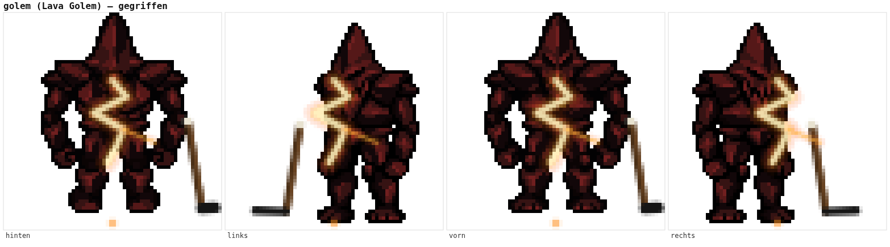 | Faust klar als eigene Form sichtbar, **gemessen** in Front UND Profil. |
| `werwolf` (Brightpaw) | 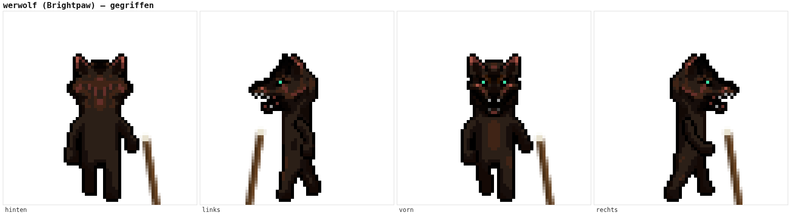 | Front zeigt eine klar abgesetzte haengende Pranke (**gemessen**). Profil zeigt eine geduckte Vierbeiner-Laufpose ohne freie Pranke — dort **Naeherung** (gleiche Hoehe, leicht nach vorn verschoben), keine Messung. |
| `roboter` (Alarm) | 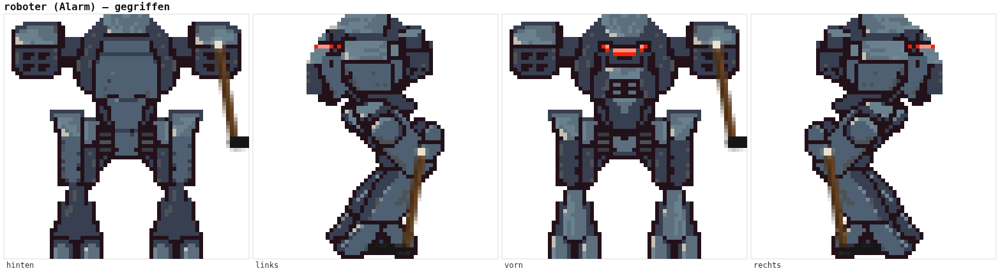 | Front zeigt beide Faeuste angehoben auf Kopfhoehe (**gemessen**, eigene Pose dieses Blatts/Frames — deshalb haengt die Kelle in der Front-Ansicht sichtbar in der Luft statt aufs Eis zu reichen, s. Einschraenkungen unten). Profil zeigt eine gesenkte Faust seitlich am Torso (**gemessen**). |
| `mech_gross` (Robofighter) | 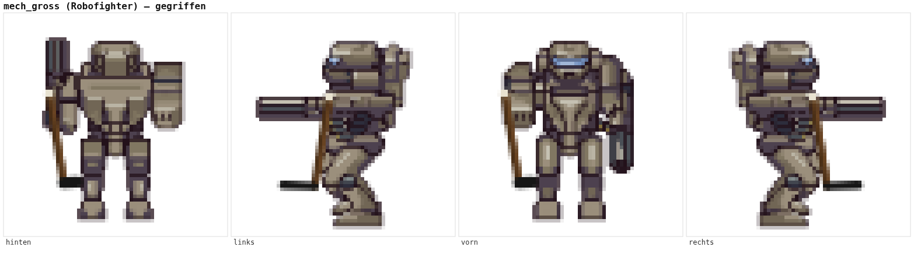 | Eine Seite hat eine Faust (**gemessen**), die andere eine eingebaute Kanone statt einer Hand. Profil: Greifpunkt am Gewehrschaft (**gemessen**). |
| `mech_transformer` (Tavascron) | 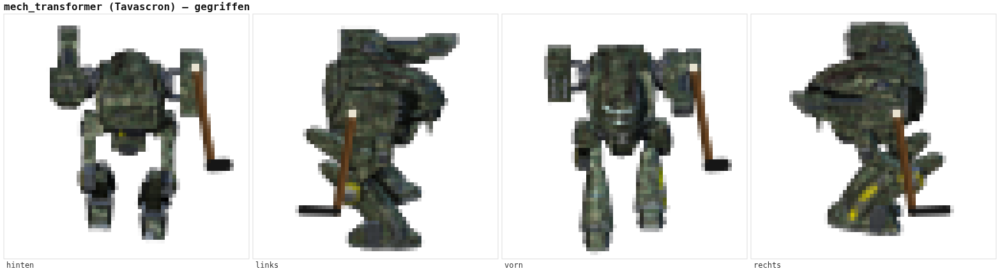 | Front zeigt zwei Faeuste (**gemessen**). Profil zeigt eine ungewoehnliche, schwer lesbare Haltung — Greifpunkt dort eine vorsichtige **Naeherung**, keine praezise Messung. |
| `treant` (Treantos) | 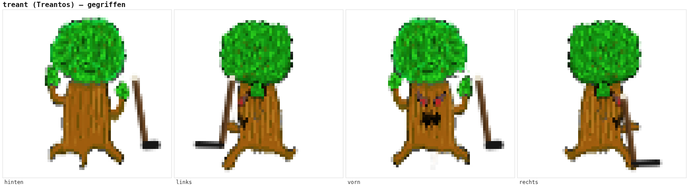 | Front zeigt eine hochgereckte Asthand mit Blattbuendel (**gemessen**, kleiner sichtbarer Spalt zwischen Hand und Griffband — die Astform ist am Blatt nicht scharf genug abgegrenzt fuer ein pixelgenaues Andocken). Profil zeigt keinen frei stehenden Ast — **Naeherung**. |
| `froschmensch` (Tidesprinter) | 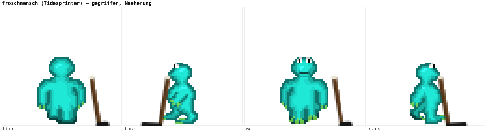 | **Keine eigene Handkontur am Blatt** (kleiner geduckter Koerper, Arme eng am Rumpf wie im Ruheframe des Standardkoerpers, s. `sprite-handpunkte.md`, Abschnitt "eng am Rumpf, kein Fund"). Der Schlaeger lehnt an der Rumpfseite auf Schulterhoehe — **Naeherung, keine Messung**. |

### Quer

| Typ (Beispiel) | Bild | Befund |
|---|---|---|
| `kraken` (Abysskraken) | 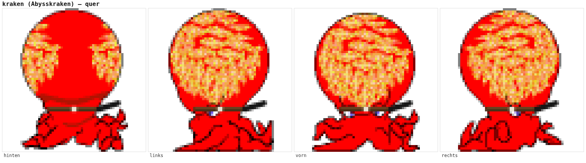 | Bauchiger Mantelkoerper ohne Tentakel-"Hand" — Ansatzpunkt der Tentakel am Mantel (sichtbar als Verengung mit Augenpaar) ist ueber alle vier Richtungen fast gleich (**gemessen**, das Blatt sieht in allen Richtungen fast gleich aus). |
| `drache_gold` (Butterfly) | 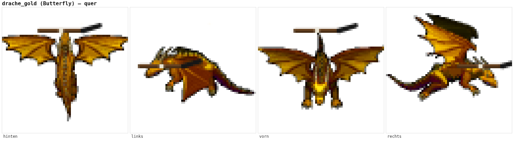 | Front/Ruecken zeigen die Kreatur von oben mit der Kopfspitze oben mittig (**gemessen**, beide Richtungen sehen auf diesem Blatt nahezu gleich aus). Profil zeigt Kopf/Maul klar an einem Ende (**gemessen**). |
| `drache_hydra` (Leviathan) | 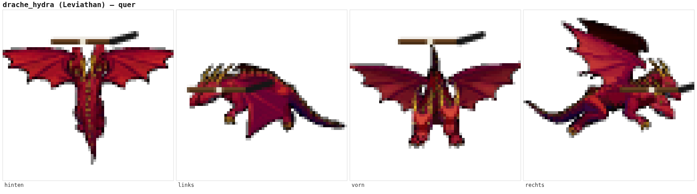 | Dasselbe Blattrig wie `drache_gold`, dieselben Punkte. |
| `schiff_pirat` (Aegirion, auch Kreischende Kogge) | 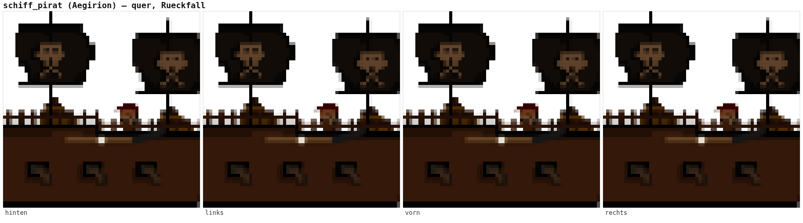 | **Keine Anatomie ueberhaupt** — ein einzelnes Standbild ohne Gesicht/Figur (`rows:1`). Reine Rueckfallregel (Mitte des Rumpfs), **keine Messung moeglich**. Der Schlaeger liegt quer auf der Reling — plausibel, aber ausdruecklich keine anatomische Messung. |
| `spinne` (Arachna) | 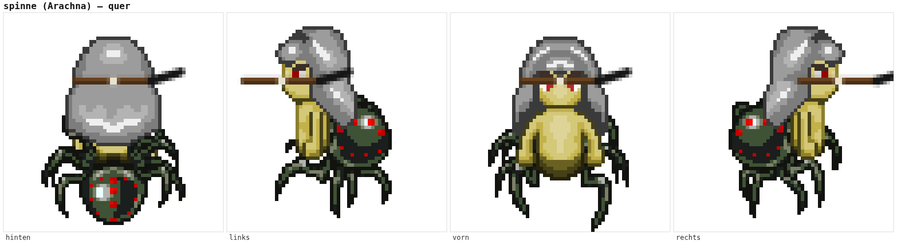 | Kopf-/Kieferpartie klar als eigene Form vom Hinterleib abgesetzt (**gemessen**, beide Richtungen deutlich). |
| `krokodil` (Shroomgator) | 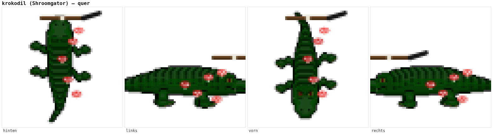 | Front/Ruecken (Draufsicht) zeigen die Schnauzenspitze oben mittig (**gemessen**). Profil zeigt den Kopf klar an einem Ende — ACHTUNG seitenverkehrt zur Blickrichtung (Blick "rechts" zeigt den Kopf LINKS im Bild und umgekehrt, direkt am gerenderten Bild nachgemessen, nicht der alten Zeilen-Kommentierung im VOLLBILD-Eintrag entnommen, die von einer anderen Zuordnung ausging). |
| `taube` (Vigil) | 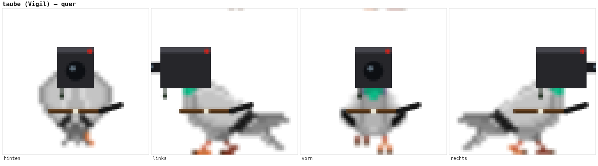 | Dieselbe **gemessene** Kamera-Kopf-Position wie `b.kamera` (`kameraVersatz`), nur auf Schnabelhoehe statt Kameramitte. |
| `reiherMech` (Seraph-11) | 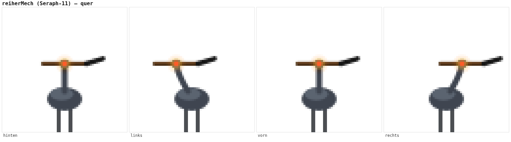 | Kein Vollbild-Blatt, sondern prozedural gezeichnet (`zeichneReiherMech`) — die Kopfposition kommt direkt aus der Zeichenfunktion zurueck, ist also fuer jedes Bild die **exakte**, gerade gezeichnete Position, keine separate Messung/Schaetzung noetig. |

### Sonderfall: `geist` (Nocture) landet bei QUER, nicht bei GEGRIFFEN

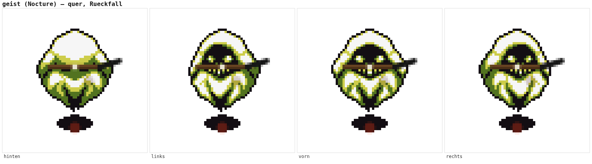

Chris' eigene Aufzaehlung nennt "Geist" bei den gegriffenen Beispielen (aufrechte
Silhouette, wirkt humanoid). Am Blatt zeigt sich aber: **keine Arm-/Handkontur** — eine
reine schwebende Robe ohne Gliedmassen. Genau der Fall, fuer den der Auftrag die
Rueckfallregel vorsieht ("mittig, quer, auf Rumpfhoehe") — deshalb hier ehrlich bei QUER
einsortiert statt eine nicht vorhandene Hand zu erfinden. Ergebnis zufaellig sehr
uberzeugend: der Schaft liegt genau auf Kieferhoehe der Kapuze, wie durch die
Zaehne gebissen.

## Einschraenkungen — ehrlich, nicht schoengeredet

- **`roboter` (Alarm), Front/Ruecken**: die gemessene Handposition liegt bei diesem Blatt
  ungewoehnlich hoch (angehobene Faust auf Kopfhoehe statt Hueft-/Taillenhoehe wie bei
  jeder anderen Kreatur hier). Mit der festen Schaftlaenge aus `HOCKEY_PHASEN.halten`
  reicht die Kelle deshalb NICHT bis aufs Eis, anders als beim Standardkoerper und den
  meisten anderen Vollbild-Kreaturen — der Schlaeger wird sichtbar gehalten, haengt aber
  in der Luft statt am Boden aufzusetzen. Keine erfundene Zahl als Reparatur: die Position
  ist echt gemessen, nur die Anatomie dieses Blatts (Boxer-Haltung) passt nicht ideal zur
  Schaftlaenge, die fuer eine Hueft-Hand kalibriert wurde.
- **`treant`, Front/Ruecken**: kleiner sichtbarer Pixel-Abstand zwischen Astspitze und
  Griffband — die Blattform ist an dieser Stelle zu weich/rundlich fuer ein pixelgenaues
  Andocken, mehrfach nachjustiert (s. Git-Historie dieser Datei), aber kein Nullabstand
  erreichbar ohne die Kelle selbst zu verformen.
- **Vier Kreaturen ohne eigene Messung** (siehe Tabellen oben, jeweils markiert):
  `froschmensch`, die Profil-Ansicht von `werwolf`/`treant`, und `schiff_pirat` komplett.
  Alle vier nutzen die im Auftrag vorgesehene Rueckfallregel (mittig/seitlich auf
  Rumpfhoehe, quer bei `schiff_pirat`) statt einer erfundenen Messung.
- **`roboter_braun`**: im `VOLLBILD`-Katalog registriert, aber von KEINER Kreatur benutzt
  (kein `BAU`-Eintrag verweist darauf) — deshalb kein eigener Griffpunkt/Beweisbild noetig.

## Nur im Eishockey

Alle drei Aufrufstellen pruefen denselben Zustand wie der Standardkoerper:

- `zeichneSprite()` (Arena, `b.vollbild`/`b.reiherMech`): `feldspiel&&istHockey()&&!u.down`
  — identisch zum bestehenden Aufruf im normalen Zeichenpfad.
- `figur()` (Kader-Vorschau/Board-Kachel): `istFeldspiel(disc)&&istHockey()` — `figur()`
  bekommt anders als `zeichneSprite()` kein `feldspiel`-Flag als Parameter, das globale
  `disc` uebernimmt hier dieselbe Rolle (derselbe Check, den `renderKader()` fuer die
  Feldspiel-Punkteanzeige schon nutzt). Nachgemessen ueber den ECHTEN Disziplinwechsel
  (`window.__arena.setDisc("hockey")`, dieselbe Funktion, die auch die UI beim
  Disziplin-Umschalten aufruft) statt nur ueber die Debug-Kurzform `renderFeldBoden()`,
  die `disc` unveraendert laesst und deshalb einen falschen Negativ-Befund liefern wuerde.

Kontrollbild Basketball (`Lava Golem`, `figur()`-Ikone, `disc="basketball"`): **kein**
Schlaeger — Voraussetzung `istFeldspiel(disc)&&istHockey()` bleibt falsch,
`miss-hockey-korridor.mjs 16` liefert vor und nach dieser Aenderung identische Zahlen
(reine Zeichnung, keine Mechanik angefasst).

## Reproduzieren

```sh
node scripts/zeige-feldspiel-arena.mjs hockey /tmp 10 25 40   # Sichtcheck in der echten Arena
node scripts/miss-hockey-korridor.mjs 16                       # Mechanik unveraendert
npx vitest run tests/battle-arena-ein-modell-ueberall.test.ts
```

Playwright-Browser: `/opt/pw-browsers/chromium-1194/chrome-linux/chrome`.
