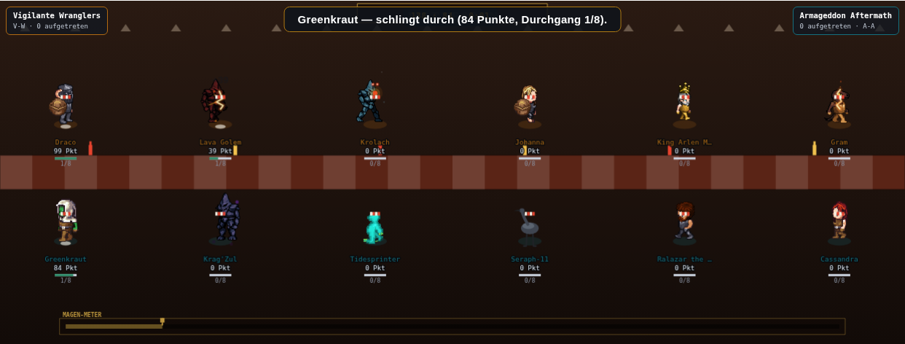
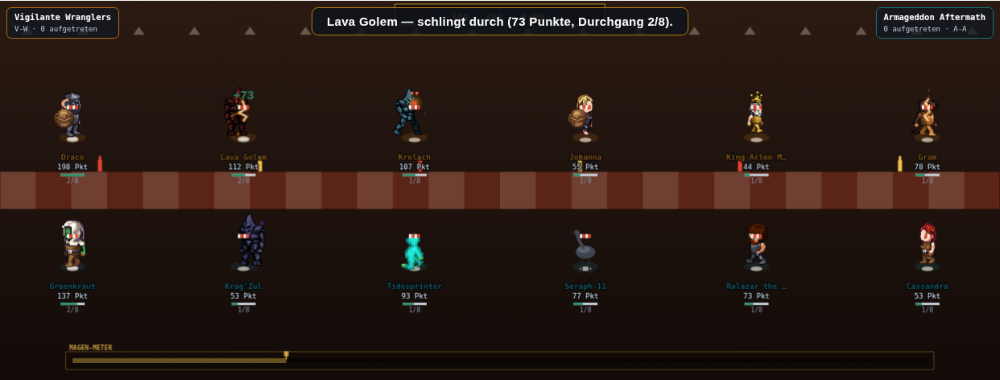

# Wettessen: die Tafel, die es in der React-Bühne längst gibt (17.09.)

Setzt `docs/pm-briefings/opus-plan-naechste-drei-disziplinen-17-09.md` Abschnitt 3.2 um — **D2.a,
D2.b und D2.c**, also `zeichneWettessen()`/`bodenWettessen()` (Assets +25, Movement +35),
`stepWettessen()` (Movement +25) und `TON_KATALOG.wettessen` (Assets, in A2+A4 bereits mitgezählt).
**D2.d (Gabel-/Teller-Requisite, Schling-/Pause-Pose) ist bewusst NICHT Teil dieser PR** — die
optionale `DISZIPLIN_PROP`-Ergänzung wurde ausgelassen, weil sie mit anderer laufender
`DISZIPLIN_PROP`-Arbeit kollidieren könnte (s. Plan, Abschnitt 6.1). Wettessen steht danach bei
**Assets 65 / Movement 75**, nicht bei den optionalen 100/90 aus D2.d — Gesamt **72,50**, nicht
80,00.

## Was gebaut wurde

### D2.a — `zeichneWettessen()` + `bodenWettessen()`

- **Boden-Dispatch** (`zeichneBuehne()`, Zeile ~14862 im alten Zählstand): eine weitere `else if`-
  Zeile für `art.wettessen`, genau der Erweiterungspunkt, den der Kommentar dort seit der
  Showcase-Runde ausdrücklich ankündigt (*„Fällt ein späterer Agent eine weitere eigene
  Bodenfunktion dazu, ist das eine weitere else-if-Zeile hier, keine Umstrukturierung."*).
- **Zeichen-Dispatch**: `if(art.wettessen){ zeichneWettessen(art); return; }`, eingehängt direkt
  nach dem Fechten-Zweig, neben den fünf bestehenden (heben/schach/cypher/tennis/fechten).
- **Neues Flag `wettessen:true`** in `BUEHNE_ART.wettessen` — rein deskriptiv, wie
  `fechten:true`/`tennis:true`/`showcase:true` vor ihr; keine Wirkung auf
  `rezept`/`wert()`/`rundenN`/`failAbzug`/`failWort`/`erfolgWort`.
- **`bodenWettessen()`** (Vorbild `bodenShowcase()`): eine Bankett-Halle statt des generischen
  violetten Drei-Scheinwerferkegel-Podests — warmes Kerzenlicht, ein Neon-Schild „WETTESSEN“,
  eine Wimpelkette, und eine lange karierte Bankettafel quer durch die Bildmitte, mit Ketchup-/
  Senf-Flaschen als Dekoration. Stoppt beim Betreten alle vier bestehenden Publikums-Loops
  (Heben/Schach/Eiskunstlauf/Showcase), falls wir gerade von einer dieser Bühnen herkommen —
  dasselbe Wechsel-Fall-Muster wie `bodenShowcase()`.
- **`zeichneWettessen()`** (Vorbild `zeichneFechten()`/`zeichneTennis()`, ~95 Zeilen): **aufgesetzt
  auf die generische Zwei-Reihen-Geometrie** statt eines vollständigen Layoutbruchs — dieselbe
  Positionsformel wie der generische Zweig (`90+(W-180)*i/(g.length-1)`, Heim oben bei `H*0.32`,
  Gast unten bei `H*0.66`). Die beiden Reihen sitzen sich an der Bankettafel ohnehin schon
  gegenüber; „frontal“ kommt aus dem Boden, nicht aus einer neuen Koordinatenformel — dieselbe
  risikoarme Wahl, die D1 (Climbing) für die Bahn getroffen hat („Aufbau 1:1 …, Eigenes
  aufsetzen, statt … ein zweites Mal zu zeichnen“).

  Drei bespoke Ergänzungen aus `platter.tsx`, alle rein zeichnerisch:
  1. **Latz-Serviette** (rot-weiß gestreift) am Hals jedes Essers — ohne `DISZIPLIN_PROP` (kein
     Requisiten-Overlay, D2.d bewusst ausgelassen), direkt als eigenes Canvas-Primitiv über der
     Figur.
  2. **Tellerstapel** unter jedem Esser — wächst mit `u.aktuell+1`, also der Zahl bereits
     enthüllter Durchgänge (`BUEHNE_ART.wettessen.rundenN:8`).
  3. **Magen-Meter mit Gabel-Marker des Führenden** am unteren Bildrand.

### D2.b — `stepWettessen()`

Neuer Zweig in `buehnenBewegung()`, nach dem Muster der fünf vorhandenen
(`art.duett`/`art.cypher`/`art.heben`/`art.schach`/`art.fechten`), mit
`typeof stepWettessen==="function"`-Wächter. Wettessen trägt **kein** `duell:true` (anders als
Fechten/Schach/Tennis) — jeder Esser läuft für sich, es gibt kein `u.brett` und keinen Gegner; die
Zustandsmaschine ist deshalb eine reine Pro-Teilnehmer-Schleife wie `stepHeben()`.

**Vier Zustände** (`u.vizEssPhase`), in genau der im Auftrag vorgegebenen Reihenfolge:

| Zustand | Auslöser | Dauer | Ton |
|---|---|---:|---|
| `greifen` | frisch enthüllter Durchgang (`u.aktuell` wechselt) | 0,10 s | `biss` |
| `schlingen` | nur beim `erfolgWort`-Ausgang („schlingt durch“) | 0,16 s | `schlingen` |
| `kauen` | folgt immer auf `schlingen` | 0,16 s | — |
| `pause` | folgt auf `kauen` ODER direkt auf `greifen` bei Fehlschlag | 0,12 s / 0,30 s | `pause` (nur beim Fehlschlag-Einstieg) → `gong` beim Verlassen |

Bei einem Fehlschlag (`failWort` „muss kurz pausieren“) springt `greifen` **direkt und länger**
in `pause` (0,30 s statt 0,12 s) — genau Chris' eigenes Wort dafür. Läuft `pause` ab, wechselt der
Esser in `warten` (Ruhepose ohne eigene Uhr, dieselbe Rolle wie `stepHeben()`s `"boden"`), und
`TON_KATALOG.wettessen.gong` markiert diesen Übergang als Durchgangsende.

**Timing-Budget unter `art.rundenDauer` (0,65 s)**: Erfolgspfad 0,10+0,16+0,16+0,12 = 0,54 s
(83 % von 0,65 s, 17 % Puffer). Fehlschlagpfad (kein `schlingen`/`kauen`) 0,10+0,30 = 0,40 s, erst
recht darunter — dieselbe Rechnung wie bei `stepHeben()`/`stepCypher()`.

**Vertrag wörtlich wie bei `stepFechten()`/`stepSchach()`/`stepKuer()`**: niemals `rr()`, niemals
`u.summe`/`u.runden`/`u.aktuell`/`u.vorteil`/`u.zweikampf`/`u.lunge`/`buehneAkt`/`buehneZeiger`/
`done` anfassen — geschrieben werden ausschließlich vier neue, präsentationale `viz*`-Felder
(`vizEssPhase`/`vizEssT`/`vizEssAktuell`/`vizEssErfolg`). Gelesen werden nur `u.aktuell` und
`u.runden[u.aktuell].ereignis` (gegen `art.erfolgWort`/`art.failWort` verglichen, nie gegen ein
Stringliteral direkt) — beide von der Simulation geschrieben, hier nie verändert.

### D2.c — `TON_KATALOG.wettessen`

Vier Ereignisse an genau den Kanten, die `stepWettessen()` ohnehin sieht:

| Ereignis | Primitive(n) | Kante |
|---|---|---|
| `biss` | `tonKlick` | frisch enthüllter Durchgang beginnt (`u.aktuell` wechselt) |
| `schlingen` | `tonDoppelton` (aufsteigend) | Erfolgsausgang, Übergang `greifen` → `schlingen` |
| `pause` | `tonBuzzer` | Fehlschlagausgang, Übergang `greifen` → `pause` |
| `gong` | `tonMetall` (dumpf) | Durchgangsende — `pause` läuft ab |

**Kein Publikums-Loop** — dieselbe Begründung wie bei Climbing/Spurt/Time-Trial: Risiko ohne
Punkte, A4 ist binär (Katalogeintrag vorhanden oder nicht).

## Rho-Sicherheit

Alle drei Bausteine sind reine Präsentation:

- `bodenWettessen()`/`zeichneWettessen()` lesen ausschließlich `BB()`/`art`, `TEILNEHMER`
  (`u.summe`/`u.aktuell`/`u.n`/`u.lunge`/`u.vizEssPhase`/`u.vizEssT`, alle nur lesend) und
  zeichnen — kein Schreibzugriff auf ein Rezept-/Score-Feld, kein `rr()`-Aufruf. Für I-Spy und
  Showcase ändert sich keine einzige Zeile: `art.wettessen` ist bei beiden `false`, sie laufen
  unverändert über ihre eigenen bzw. den generischen Zweig.
- `stepWettessen()` schreibt ausschließlich die vier neuen `viz*`-Felder (s. oben); `sfx()` ruft
  nachweislich nie `rr()` auf und ist ohne `AudioContext` (z. B. in Node/Playwright ohne
  Audio-Gerät) ein stiller No-Op.
- `BUEHNE_ART.wettessen.wettessen:true` ist ein zusätzliches Flag ohne Leser außer den drei neuen
  Dispatch-Zeilen — `rezept`/`jeSeite`/`rundenN`/`rundenDauer`/`failAbzug`/`failWort`/`erfolgWort`
  bleiben Zeichen für Zeichen unverändert.

## Verifikation

```
node --check public/mockups/battle-mode.engine.js
```
→ **bestanden.**

```
npx tsc --noEmit
```
Diff gegen einen frisch aus `origin/main` (`d85ab462`) ausgecheckten Worktree (derselbe
Node-Modul-Resolution-Pfad, da beide Worktrees unter demselben Repo hängen): **0 Zeilen** —
dieselben 906 vorbestehenden Fehlermeldungen auf beiden Seiten, unverändert; sie stammen nicht aus
dieser Änderung.

```
npx tsx scripts/pruefe-slot-invariante.ts
```
→ **hält**, maximale Abweichung 0,005 Pp über alle 20 Disziplinen × 6 Kadergrößen (mini-dm @ n=2 —
nicht wettessen, nicht durch diese PR beeinflusst).

```
node scripts/miss-alle-disziplinen.mjs 24
```
→ **alle zwanzig Zeilen bit-identisch zur eingecheckten Basislinie**, `wettessen` liefert exakt
**rho 0,845** — die Plan-Vorgabe. Details: s. Abschnitt „Rho-Ergebnis“ unten.

```
npm run ci:rangtreue-schranke
```
→ **Bestanden** — alle zwanzig Disziplinen `Aenderung ±0,000, Status ok`, absolute 0,80-Schranke
hält unverändert.

### Sicht-QA (Playwright, `scripts/screenshot-disziplin.mjs`)



`setDisc('wettessen')`, 1,5 s nach Spielstart. Zu sehen: die karierte Bankettafel quer durch die
Bildmitte statt des generischen violetten Podests, zwölf Esser mit rot-weißen Latz-Servietten am
Hals, ein erster kleiner Tellerstapel unter dem Esser mit dem ersten enthüllten Durchgang, und das
Magen-Meter am unteren Rand mit dem Gabel-Marker knapp hinter dem linken Anschlag (der Führende
hat gerade seinen ersten Durchgang geschafft, 1/8).



Dieselbe Bühne 9 s nach Spielstart: mehrere Esser stehen bei 2/8 (sichtbar größere Tellerstapel
unter Draco/Lava Golem/Greenkraut), Punktestände sind gewachsen, und der Gabel-Marker im
Magen-Meter ist sichtbar weiter nach rechts gewandert (auf ca. ¼ der Balkenlänge, passend zu
2/8 = 0,25) — der Meter füllt sich also tatsächlich über den Auftritt hinweg, statt (wie ein
erster, verworfener Entwurf es tat) sofort beim ersten Biss am rechten Anschlag zu stehen. Dazu
mehr im Abschnitt „Ein Fund unterwegs“ unten.

**Gegenprobe: I-Spy und Showcase bleiben unverändert.** Zwei Paare Screenshots (Arbeitsbaum vs.
eine aus `origin/main` (`d85ab462`) ausgecheckte, unveränderte Kopie von
`battle-mode.engine.js`), `setDisc('i-spy'|'showcase')`, 3,0 s nach Spielstart, pixelweise
verglichen (`PIL.ImageChops.difference`):

| Disziplin | Diff `origin/main` vs. Arbeitsbaum | Diff `origin/main` vs. `origin/main` (Kontrollmessung) |
|---|---|---|
| `i-spy` | 150 abweichende Pixel, bbox 23×12 px | 121 abweichende Pixel, bbox 23×11 px |
| `showcase` | 2.713 abweichende Pixel, bbox 64×197 px | 2.837 abweichende Pixel, bbox 64×208 px |

Dieselbe Größenordnung wie die Kontrollmessung (zwei unabhängige `origin/main`-Läufe desselben,
unveränderten Codes) — beide Disziplinen zeichnen kontinuierliche, echtzeitgetriebene Effekte
(I-Spys tickende Uhr-/Vorteils-Floattexte, Showcases Spotlight-Wechsel), deren Phase bei exakt
„3000 ms nach Klick“ von der tatsächlichen Browser-Frame-Taktung abhängt, nicht vom Code. Beide
Screenshots sind damit **effektiv unverändert** — dasselbe Timing-Rauschen, das die
Climbing-Runde (PR #963) für Takeshi's Castle/Time-Trial schon dokumentiert hat, kein Effekt
dieser PR.

## Ein Fund unterwegs

Der erste Entwurf des Magen-Meters normalisierte den Gabel-Marker über
`leader.summe / maxSumme`, wobei `maxSumme = Math.max(1, ...TEILNEHMER.map(u=>u.summe))` — also
genau das Maximum, das der Führende per Definition selbst trägt. Der Bruch war damit **immer
exakt 1**, unabhängig vom Spielstand: die Gabel hätte schon beim allerersten Biss am rechten
Anschlag gestanden, statt sich über den Auftritt hinweg zu füllen (genau das Gegenteil eines
„Magens“, der sich langsam füllt). Behoben durch `(leader.aktuell+1)/art.rundenN` — den Anteil
der acht Durchgänge, die der Führende schon geschafft hat. Das wächst tatsächlich über den
Auftritt (0 → 1 über acht Durchgänge), unabhängig vom Punktestand, und ist an den beiden
Screenshots oben sichtbar nachvollzogen (1/8 → 2/8). **Rein zeichnerisch** — betrifft
ausschließlich `zeichneWettessen()`, keine Zeile in `stepWettessen()` oder im Rezept.

## Nicht Teil dieser PR

- **D2.d (Gabel-/Teller-Requisite, Schling-/Pause-Pose)**: bewusst ausgelassen (s. Auftrag oben
  und Plan Abschnitt 6.1) — `DISZIPLIN_PROP` ist die Tabelle, an der möglicherweise parallel
  laufende Arbeit ebenfalls ansetzen will. Wettessen bleibt bei Assets 65 / Movement 75 statt
  100/90, Gesamt 72,50 statt 80,00.
- Keine Änderung an `BUEHNE_ART.wettessen`s Rezept, an `rundenN`/`rundenDauer`/`failAbzug`, an
  `MOTOREN.buehne.wert()` oder an `WERTUNG_AUFTRITT()` — nur zwei neue Zeichenfunktionen, eine
  neue Bewegungsfunktion und vier neue, rein lesende `viz*`-Felder.
- Showcase und I-Spy sind von dieser PR nicht berührt (s. Gegenprobe oben) — Showcase hat
  inzwischen ohnehin einen eigenen Zweig (`art.showcase`), I-Spy durchläuft weiterhin den
  generischen Zweig.
