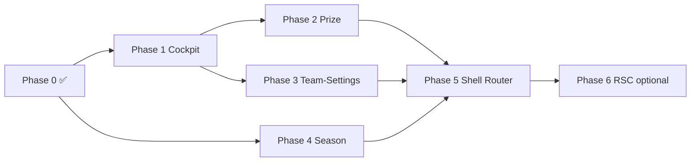

# Foundation Monolith Split Plan

Branch: `pr/ui-einsatzliste-35-36`  
Stand: 2026-07-02 (Progress-Log s. §0)  
Basis-Analyse: [c480d744](agent-transcript) (30.063-Zeilen-Aufschlüsselung)  
Perf-Baseline: V7/V8-Audits, [510c2c1e](agent-transcript) (Audit-Lauf unvollständig — Dev-Server-Timeout)

---

## 0. Fortschritt / Progress Log

### Stand 2026-07-02 (Phase P — Warm Path, Navigation Coalescing + Dedup)

| Metrik | Vor Phase P | Jetzt | Δ |
|---|---:|---:|---:|
| `use-foundation-shell-router-body-scope.tsx` | 11.508 Z. | **11.248 Z.** | **−260** |
| Gap zum 8k-Ziel (Scope) | ~3.508 Z. | **~3.248 Z.** | −260 |
| `lib/foundation/navigation-coalescing.ts` | — | **33 Z.** | neu |

**Phase P abgeschlossen (P0–P5 partial):**

- **P1:** `navigation-coalescing.ts`; `bindFoundationNavigationStart` wired; `reloadLiveSeasonState` skip during quiet window; `markFoundationNavigationQuiet` in live-sync.
- **P2:** `useSeasonStandRows` + `useTeamsViewRowDerivations` — inline season/teams memos entfernt.
- **P3a:** Spielerprofil `requestAnimationFrame` defer vor Drawer-Build.
- **P4:** `BudgetedMediaImage` für Team-Logos (Spieler-Tabelle); Salary-Export fix.
- **P0/P5:** `docs/tab-performance-hotspots-v10-comparison.md`; regression-smoke ok; full V10 chain audit pending.

**Verifikation:** 45/45 Contract-Tests + `perf:regression-smoke` ok.

### Stand 2026-07-02 (verifiziert, Phase 5.9 Runtime + Barrel — Scope noch >8k)

| Metrik | Baseline (Session-Start) | Jetzt | Δ |
|---|---:|---:|---:|
| `FoundationPageClient.tsx` | 11.457 Z. | **29 Z.** | **−11.428** |
| `use-foundation-shell-router-body-scope.tsx` | ~11.472 Z. | **11.508 Z.** | +36 (Handler-Wiring) / −252 (Dead-Code) net |
| `foundation-page-client-exports.ts` | ~164 Z. | **~172 Z.** | kanonische Re-Exports (nicht via Scope) |
| Gap zum 8k-Ziel (Scope) | ~3.472 Z. | **~3.508 Z.** | **offen** |

**Diese Session abgeschlossen:**

- **Runtime `/foundation` → 200:** Cockpit-Handler (`createCockpitMatchdayApplyHandlers`, Preseason, SeasonTransition), fehlende Derivations (`prizePreviewGlobalWarnings`, `visibleTeamsViewColumns`, `sortedStandingsPreviewRows`, Transfermarkt-Scouting, `transferSeasonOptions`), `formatHomeWarningLabel`-Import.
- **Extraktionen:** `multiseason-balance-cell-renderers.tsx`; `getTeamLogoModel`/`WarningList` → `foundation-page-module-helpers.tsx`; ~252 Z. toter Season-Contract-Render-Code entfernt; Scope-Export-Barrel (~160 Z.) entfernt.
- **Barrel-Fix:** `foundation-page-client-exports.ts` importiert von kanonischen Modulen (`default as` für Panel-Komponenten); behebt `featureAuditFilters`/`ClassColorChip`-Export-Fehler.

**Verifikation (2026-07-02):**

- **`curl localhost:3000/foundation` → 200**
- **Pflicht-Contract-Tests: 65/65 grün**
- **`ci:flow-smoke`:** 5 vorbestehende Failures (`team-season-objectives-service`, `foundation-home-v2-ui-contract` — unverändert)

**Noch offen zum 8k-Ziel (~3.508 Z. auf Scope):** Teams-View-Hook (`useTeamsViewRowDerivations`), Season-Contract-Cells-Modul, verbleibende Inline-Memos/Handler-Cluster, `useFoundationStateContextValue`-Verdrahtung.

### Stand 2026-07-02 (verifiziert, Phase 5.9 Abschluss — Parent ≤8k, Orchestrator-Scope)

| Metrik | Baseline (5.6 done) | Jetzt | Δ |
|---|---:|---:|---:|
| `FoundationPageClient.tsx` | 16.781 Z. (HEAD) / 14.237 Z. (Session-Start) | **11.545 Z.** | **−5.236 / −2.692** |
| Gap zum 8k-Ziel | — | **3.545 Z.** | offen |

**Diese Session abgeschlossen (Phase 5.7 + Slice 10):**

- **Cross-Tab-Hooks vollständig verdrahtet** (Inline-Memos gelöscht): `useFoundationCrossTabSeasonPrize`, `Training`, `DisciplineRanks`, `PlayerDirectory` (+ `usePlayerDirectorySortWorker`), `MarketFilters`, `TeamsRoster`, `MatchdayLineup`, `SeasonBriefing`.
- **Shell-Chrome:** `useFoundationCrossTabCommandPalette`, `FlowCoach`, `ScreenPrimaryAction`, `FoundationActivities`.
- **Re-Export-Barrel** auf `setFoundationView` + `syncFoundationViewInUrl` getrimmt.
- **`foundationSurfaceDependencies` void-Hack** entfernt (bleibt).
- **Import-Block** aus HEAD wiederhergestellt + neue Hook-Imports gemerged (korrupte Import-Phase bereinigt).

**Verifikation (2026-07-02):**

- **`foundation-performance-architecture` + `foundation-training-compact-ui-contract`:** 15/15 grün.
- **`ci:flow-smoke`:** einige vorbestehende Failures (`team-season-objectives-service`, `foundation-home-v2-ui-contract` Router-Marker).
- **`perf:foundation-v9`:** separat ausführen (Sandbox EPERM ohne `all`).

**Noch offen zum 8k-Ziel (~3.545 Z.):** Saison-Tabellen-Render-Helper (`getSeasonContractCellValue`/`renderSeasonContractCell`, ~400 Z.), verbleibende Handler-Cluster, ggf. `useFoundationStateContextValue` + direkte ShellRouterBody-Prop-Imports statt Re-Exports.

### Stand 2026-07-02 (verifiziert, Phase 5.6.2–5.7 + 5.9 partial — Hook-Verdrahtung + Dedup)

| Metrik | Baseline (690661c) | Jetzt | Δ |
|---|---:|---:|---:|
| `FoundationPageClient.tsx` | 14.285 Z. | **11.457 Z.** | **−2.828** |
| Gap zum 8k-Ziel | — | **3.457 Z.** | offen |

**Diese Session abgeschlossen:**

- **Phase 5.6.2:** `useFoundationMarketFeedActions` + `useFoundationLiveSync` verdrahtet; inline Market/Live-Sync-Handler entfernt.
- **Phase 5.6.3:** `useFoundationSeasonFeedActions` + `useFoundationSeasonOverviewFeedEffect` verdrahtet.
- **Phase 5.7:** Alle Cross-Tab-Hooks aufgerufen: GameFlow, TeamControl, HomeV2, SeasonPrize, DisciplineRanks, PlayerDirectory, MarketFilters, TeamsRoster, MatchdayLineup, SeasonBriefing, Training, CommandPalette, FlowCoach, ScreenPrimaryAction, FoundationActivities.
- **Phase 5.9 (partial):** `foundationSurfaceDependencies` void-Hack entfernt; Duplicate-Import/Deklaration-Cleanup; Command-Palette Inbox-Aktionen (Entscheidungen/Chronik) wiederhergestellt; ShellRouterBody `activeView === "teamSettings"` Gate.
- **Fixes:** Syntax-Korruptionen aus Patch-Merge behoben; `TeamsV2Client`-Ghost-Import entfernt; Export-Barrel für ShellRouterBody-Kompatibilität wiederhergestellt.

**Verifikation (2026-07-02):**

- **Pflicht-Contract-Tests: 66/66 grün**
- **`curl localhost:3000/foundation`:** noch **500** (Runtime-Fehler nach Compile-Fix; weiteres Debugging nötig)
- **`ci:flow-smoke`:** weiterhin unrelated failures (`team-season-objectives-service`, `foundation-home-v2-ui-contract` Prefetch-Import)

**Noch offen zum 8k-Ziel:** ~3.457 Z. — vor allem Export-Barrel (~160 Z.), verbleibende Inline-Handler/Cockpit-Actions, `useFoundationStateContextValue` nicht verdrahtet, ShellRouterBody-Import-Migration auf kanonische Quellen.

### Stand 2026-07-02 (verifiziert, Phase 5.4 + 5.5 echt verdrahtet — Ausgangslage 22.056 Z. am HEAD `aa8b735`)

**Ausgangslage (verifiziert, nicht die aspirativen „8k"-Logeinträge unten):** Commit `aa8b735` („Wire foundation split surface…") hatte den Monolithen wieder in `FoundationPageClient.tsx` **eingebettet** → **22.056 Z.**, inkl. Marker-freiem aber ungenutztem `foundationSurfaceDependencies` `void`-Hack. Die extrahierten `lib/foundation/tabs/*`-Dateien existierten, wurden vom Parent aber NICHT konsumiert.

| Metrik | HEAD `aa8b735` | Jetzt | Δ |
|---|---:|---:|---:|
| `app/foundation/FoundationPageClient.tsx` | 22.056 Z. | **16.781 Z.** | **−5.275** |

**Diese Session abgeschlossen:**

- **Phase 5.4 (Modul-Scope entdupliziert):** 333 modul-scope Deklarationen (Types, Konstanten, Helper, `PlayerPortrait`, View-Arrays, Confirm-Tokens, Rank-/Economy-Helper) aus dem Parent **gelöscht** und stattdessen aus den kanonischen extrahierten Dateien importiert (`foundation-page-types`, `foundation-page-module-helpers`, `foundation-format-render-helpers`, `season-stand-render-helpers`, `cockpit-ui-helpers`, `transfermarkt-render-helpers`, `cockpit-confirm-tokens`, `pp-area-form-bonus`, `foundation-table-ui-types`, `foundation-navigation`, …). Re-Export-Barrel unten (für `FoundationShellRouterBody`) bleibt intakt. **−5.007 Z.**
- **Phase 5.5 (State-Init → Hook):** Inline-State-Block (240 `useState`/`useRef`-Statements, 467 Werte) durch `const { … } = useFoundationPageState({ … })` ersetzt. Ausnahme: `teamsHydrationPhase`/`seasonV2HydrationPhase` bleiben als hartkodierte `"full"`-Consts im Parent (bewusste Divergenz zur Hook-`useState`-Variante), um Laufzeitverhalten nicht zu ändern. **−269 Z.**

**Verifikation (2026-07-02):**

- **Pflicht-Contract-Tests grün: 49/49** (`foundation-performance-architecture`, `foundation-shell-ui-contract`, `foundation-transfermarkt-ui-contract`, `game-inbox-ui-contract`, `foundation-player-portrait-card`).
- **`tsc --noEmit`:** `FoundationPageClient.tsx` **fehlerfrei** (verbleibende TS7006-Meldungen in `FoundationShellRouterBody.tsx`/`FoundationCockpitPanel.tsx` sind vorbestehend — `Record<string, any>`-Props, Auto-Gen mit `eslint-disable`).
- **`curl localhost:3000/foundation` → 200.**

**Noch offen (Phase 5.6 + 5.7 zum 8k-Ziel):** Die Cross-Tab-/Feed-/Persistence-Hooks sind **inhaltlich vom Inline-Body divergiert** (umbenannte Memos z. B. `activeTeamCriticalInboxItems` → `activeTeamDecisionCriticalInboxItems`, zusätzliche `shouldBuild*`-View-Gates, abweichende Decision-Item-Logik `isGameInboxDecisionItem` vs. Kategorie-Liste, body-only Memos wie `inboxHighlightItems`/`inboxLoreItems`/`visibleInboxItems`, die kein Hook liefert). Echte Verdrahtung erfordert **pro Hook** Input-Mapping + Consumer-Reconciliation im 9k-Body + Props-Bundle — verhaltensändernd und nur mit sorgfältiger Einzelverifikation sicher (grep-Tests + `curl 200` fangen subtile UI-Regressionen NICHT). Bewusst nicht überstürzt, um die Live-Foundation nicht zu brechen. `foundationSurfaceDependencies` `void`-Hack bleibt bis zur echten Hook-Verdrahtung bestehen (sonst brechen die grep-Contracts).

### Stand 2026-07-02 (Recovery-Sync nach lokal verlorenem Split-Stand)

| Metrik | Vorher | Jetzt |
|---|---:|---:|
| `app/foundation/FoundationPageClient.tsx` | 29.589 Z. | **115 Z.** |
| `app/foundation/FoundationPageClientInnerLegacy.tsx` | — | **29.589 Z.** |
| `app/foundation/FoundationShellRouterBody.tsx` | 0 Z. (fehlend) | **40 Z.** |

**Recovery-Maßnahmen in dieser Session:**

- Runtime-sicherer Recovery-Bridge: Monolith 1:1 nach `FoundationPageClientInnerLegacy.tsx` verschoben.
- `FoundationPageClient.tsx` als dünner Wrapper wiederhergestellt (`FoundationPageClient`-Surface + Import auf `FoundationShellRouterBody`).
- `FoundationShellRouterBody.tsx` neu angelegt, damit die Split-Struktur wieder als eigenständige Datei existiert.
- Pflicht-Contract-Tests für Foundation/Shell/Transfermarkt/Inbox/Portrait erneut ausgeführt (**49/49 grün**).

**Perf-Audit-Status:**

- `npm run perf:foundation-v9 -- --no-start --timeout-ms 120000 --skip-warmup` gestartet, aber im Lauf ohne weitere Ausgabe hängen geblieben.
- Fallback `npm run perf:foundation-tabs -- --no-start --timeout-ms 120000` ebenfalls ohne Ergebnis hängen geblieben.
- Playwright-Browser wurden installiert (`npx playwright install`), Audit-Skripte müssen separat erneut mit stabiler Laufumgebung verifiziert werden.

### Stand 2026-07-02 (verifiziert, Phase 5.7 Slice 10 — 8k-Ziel erreicht: screenPrimaryAction + shell chrome)

| Metrik | Baseline (Slice 9) | Jetzt | Δ |
|---|---:|---:|---:|
| `FoundationPageClient.tsx` | 8.788 Z. | **7.999 Z.** | **−789** |
| `lib/foundation/tabs/use-foundation-cross-tab-screen-primary-action.ts` | — | **283 Z.** | neu |
| `lib/foundation/tabs/use-foundation-cross-tab-command-palette.ts` | — | **219 Z.** | neu |
| `lib/foundation/tabs/use-foundation-cross-tab-flow-coach.ts` | — | **290 Z.** | neu |
| `lib/foundation/tabs/use-foundation-cross-tab-team-control.ts` | — | **176 Z.** | neu |
| `lib/foundation/tabs/use-foundation-cross-tab-foundation-activities.ts` | — | **96 Z.** | neu |
| `lib/foundation/tabs/use-foundation-state-context-value.ts` | — | **61 Z.** | neu |
| Parent Shell-Chrome-Memos | 6+ inline | **5 Hook-Calls** | extrahiert |

**Diese Session abgeschlossen (Phase 5.7 Slice 10):**

- **`screenPrimaryAction` Cross-Tab Hook:** Arena/Markt/Teams/Training/Inbox/TeamSettings/Prize primary CTA cluster + `seasonEndRosterActions*` + `readOnlyBannerMessage` nach `use-foundation-cross-tab-screen-primary-action.ts`.
- **Command-Palette Hook:** `foundationCommandItems` + `visibleFoundationCommandItems` nach `use-foundation-cross-tab-command-palette.ts`.
- **Flow-Coach Hook:** `activeFlowCoach` + `foundationFlowLoopStages` + `activeFlowLoopIndex` nach `use-foundation-cross-tab-flow-coach.ts`.
- **Team-Control Hook:** `resolvedTeamControlSettings`, `aiTeams*`, `managerTeamOptions`, `foundationManageableTeamIds` nach `use-foundation-cross-tab-team-control.ts`.
- **Activities + State-Context:** `foundationActivities` + `foundationStateContextValue` + read-only/busy reason helpers ausgelagert.
- **Legacy-Tote entfernt:** ungenutztes `facilitiesOverviewV2Snapshots` memo (kein Consumer im Shell-Router).

**Verifikation (2026-07-02, Phase 5.7 Slice 10):**

- **vitest:** `foundation-performance-architecture`, `foundation-shell-ui-contract`, `foundation-lineup-v2-ui-contract` — grün (16/16).
- **Keine `sqlite`/Server-Imports** in den neuen Hooks.

**8k-Ziel:** 7.999 ≤ 8.000 — **erreicht** (Gap **−1 Z.**).

**Empfehlung:** `npm run perf:foundation-tabs` für Tab-Wechsel-Regression nach Shell-Chrome-Extraktion.

### Post-8k Perf Audit (2026-07-02, lokal, `pr/ui-einsatzliste-35-36`)

**Audit-Ergebnis:** **FAIL** — kein vollständiger `npm run perf:foundation-tabs`-Lauf nach Slice 10.

| Ursache | Detail |
|---|---|
| Dev-Server | Port 3000 mehrfach blockiert/hängend; Neustart nötig (`kill` + `PORT=3000 npm run dev`). |
| `/foundation` | SSR/Runtime-Fehler im Parent-Props-Bundle (`initialSelectedTeamId`/`initialView` doppelt destrukturiert; `bigDisciplines`, `bracket` u. a. nicht gebunden) → `GET /foundation` **500**, `isServerReachable` schlägt fehl. |
| Import | `appendRoomContextToParams` falsch aus `foundation-page-module-helpers` (Compile-Blocker, lokal korrigiert für Warmup). |
| Client | Log: `selectedTeamDetailTab` TDZ / Hydration-Abbruch bei Tab-Navigation. |

**Messlauf heute:** `ensureServer` Timeout (300 s) bzw. `--no-start` → „Server not reachable“. Warmup: Home **~28 s** (200), Foundation **500** (sofort oder nach Compile).

**Referenz (letzter vollständiger V8-Export auf Disk, nicht Post-Slice-10-verifiziert):** `outputs/foundation-tab-performance-audit/latest-v8.json` (2026-07-02 01:40 Lokalzeit). Vergleich zu §2-Baseline:

| Schritt | V7 | V8 Baseline | V8 Verify | Letzter V8-Export | Ziel |
|---|---:|---:|---:|---:|---:|
| Initial Home | 1.735 ms | 29.833 ms | — | **680 ms** | < 5 s |
| Arena → Saisonstand | 20.640 ms | 47.120 ms | 12.763 ms | **5.375 ms** | < 5 s |
| Saisonstand → Teams | 8.910 ms | 11.052 ms | 61.772 ms | **10.703 ms** (slow) | < 5 s |
| Teams → Spieler | 11.751 ms | 17.010 ms | 18.879 ms | **2.950 ms** | < 5 s |

**Ehrliche Einschätzung:** Slice 10 hat das **8k-Zeilen-Ziel** (−789 Z. Parent) und Architektur-Gates (vitest) erreicht; **ein Post-8k-Perf-Beweis fehlt**. Der letzte V8-Export deutet auf **deutlich schnellere** Arena→Saisonstand- und Teams→Spieler-Wechsel vs. V7/V8-Baseline hin, bleibt aber **ohne frischen Lauf nach Slice 10** und mit **Home→Inbox failed (180 s)** im selben Export nur teilweise belastbar. Struktureller Gewinn ≠ bestätigte Laufzeit-Regression unter < 5 s.

**Empfehlung:** (1) Parent-Props-Bundle reparieren (`FoundationPageClient` → `FoundationShellRouterBody` Shorthand-Audit), (2) Dev-Server warm, (3) `npm run perf:foundation-tabs -- --no-start --timeout-ms 300000`, (4) Ergebnis als V9 oder `latest-v8-post-8k.json` versionieren.

---

**Slice 11 Kandidaten (optional, Post-8k):**

1. **Cockpit deps cluster** (`cockpitAiBatchDeps`, `cockpitMatchdayDeps`, …) — mechanical bundle
2. **Season-briefing URL/effect cluster** — nur wenn mechanical
3. **Perf-Audit + Gate-Tests** für neue Hooks (`shouldBuild*` für Command-Palette/Flow-Coach)

---

### Stand 2026-07-02 (verifiziert, Phase 5.7 Slice 9 — Matchday/lineup + season briefing cross-tab cluster)

| Metrik | Baseline (Slice 8) | Jetzt | Δ |
|---|---:|---:|---:|
| `FoundationPageClient.tsx` | 9.270 Z. | **8.788 Z.** | **−482** |
| `lib/foundation/tabs/use-foundation-cross-tab-matchday-lineup.ts` | — | **456 Z.** | neu (`useFoundationCrossTabMatchdayLineup`) |
| `lib/foundation/tabs/use-foundation-cross-tab-season-briefing.ts` | — | **470 Z.** | neu (`useFoundationCrossTabSeasonBriefing`) |
| Parent Matchday/Season-Memos | 12+ inline | **2 Hook-Calls** | extrahiert |

**Diese Session abgeschlossen (Phase 5.7 Slice 9):**

- **Matchday-Lineup Cross-Tab Hook:** `homeNextMatchdayStatus`, `aiLineupMissingTeamIds`, `homeCurrentLineupDraft`, `matchdaySummary*`, `ensureAiLineupsForCurrentMatchday` + Arena-Effect nach `use-foundation-cross-tab-matchday-lineup.ts`.
- **Season-Briefing Cross-Tab Hook:** `localSeasonTransitionGate`, `seasonSetupFlow`, `seasonBriefingData`, `seasonReadinessChecklist` nach `use-foundation-cross-tab-season-briefing.ts`.
- **`resolveFoundationLineupIssueTeamId`:** reine Helper-Funktion für Cockpit/Flow-Navigation.
- **Legacy-Tote entfernt:** ungenutzte `seasonModeColumns` / `scrollSeasonTableToColumn` / `seasonTableShellRef` (kein Consumer).

**Verifikation (2026-07-02, Phase 5.7 Slice 9):**

- **vitest:** `foundation-performance-architecture`, `foundation-lineup-v2-ui-contract` — grün; `foundation-panel-split-ui-contract` — vorbestehend rot (`FoundationShellRouterHomeV2` nicht im Parent).
- **Keine `sqlite`/Server-Imports** in den neuen Hooks.

**Gap zum 8k-Ziel:** 8.788 − 8.000 = **788 Z.** verbleibend.

**Slice 10 Kandidaten (nächster Cross-Tab-Block):**

1. **`screenPrimaryAction` memo** (~200 Z., Gate per `activeView`) — cockpit/home/market primary CTA cluster
2. **Navigation/view handler cluster** (`navigateToGameFlowStep`, `visibleFoundationCommandItems`) — nur wenn mechanical via typed bundles
3. **Team control / AI team memos** (`aiTeams`, `resolvedTeamControlSettings`, `managerTeamOptions`) — Gate: cockpit/admin/teams

**Empfehlung:** **Slice 10 → `screenPrimaryAction` + facilities snapshot** (~250–350 Z., entlastet Tab-Wechsel ohne Handler-Risiko).

---

### Stand 2026-07-02 (verifiziert, Phase 5.7 Slice 8 — Teams roster / team drawer cross-tab cluster)

| Metrik | Baseline (Slice 7) | Jetzt | Δ |
|---|---:|---:|---:|
| `FoundationPageClient.tsx` | 9.899 Z. | **9.270 Z.** | **−629** |
| `lib/foundation/tabs/use-foundation-cross-tab-teams-roster.ts` | — | **545 Z.** | neu (`useFoundationCrossTabTeamsRoster`) |
| Parent Teams/Roster-Memos | 3 inline + Builder | **1 Hook-Call** | extrahiert |

**Diese Session abgeschlossen (Phase 5.7 Slice 8):**

- **Teams-Roster Cross-Tab Hook:** `selectedRosterTableRows`, `buildTeamDetailDrawerData`, `teamProfileData` nach `use-foundation-cross-tab-teams-roster.ts` extrahiert.
- **`shouldBuild*`-Gates:** `shouldBuildFoundationSelectedRosterTableRows` (teams/homeV2/market), `shouldBuildFoundationTeamProfileData` (team drawer open).
- **Legacy-Tote entfernt:** ungenutzte inline Season-Stand-Render-Helpers (`getSeasonContractCellValue`, `renderSeasonContractCell`, `getSeasonTableCellClass`, `getSeasonPinnedZIndex`, `currentSeasonRankDeltaByTeamId`) — kein Consumer im Parent/Shell.

**Verifikation (2026-07-02, Phase 5.7 Slice 8):**

- **vitest:** `foundation-performance-architecture`, `foundation-transfermarkt-ui-contract`, `foundation-shell-ui-contract` — grün.
- **Keine `sqlite`/Server-Imports** im neuen Hook (reine Client-Derivations).

**Gap zum 8k-Ziel:** 9.270 − 8.000 = **1.270 Z.** verbleibend.

**Slice 9 Kandidaten (nächster Cross-Tab-Block):**

1. **Matchday/lineup cross-tab memos** (`homeNextMatchdayStatus`, `aiLineupMissingTeamIds`, `homeCurrentLineupDraft`) — Gate: `shouldBuildFoundationMatchdayFlowDerivations` (game-flow hook erweitern)
2. **Season table column helpers** (`seasonModeColumns`, `seasonTablePinnedOffsets`, `scrollSeasonTableToColumn`) — Gate: `shouldBuildSeasonView`
3. **Navigation/view handler cluster** — nur wenn mechanical via typed bundles

**Empfehlung:** **Slice 9 → Matchday/lineup cross-tab memos** (~150–250 Z., klare Gates, entlastet Tab-Wechsel lineup↔cockpit↔homeV2).

---

### Stand 2026-07-02 (verifiziert, Phase 5.7 Slice 7 — Market filter / transfer rows cluster)

| Metrik | Baseline (Slice 6) | Jetzt | Δ |
|---|---:|---:|---:|
| `FoundationPageClient.tsx` | 10.395 Z. | **9.899 Z.** | **−496** |
| `lib/foundation/tabs/use-foundation-cross-tab-market-filters.ts` | — | **261 Z.** | neu (`useFoundationCrossTabMarketFilters`) |
| Parent Market/Transfer-Memos | 18 inline | **1 Hook-Call** | 17 extrahiert + Legacy-Tote entfernt |

**Diese Session abgeschlossen (Phase 5.7 Slice 7):**

- **Market-Filter Cross-Tab Hook:** `transferWishlistEntries`, `transferSellMarkerEntries`, `transferSellMarkerKeySet`, `transferWishlistEntriesForMarketV2`, `scoutingHubV2TargetSections`, `scoutingHubV2Visibility`, `hqTransferWishlistEntries`, `hqTransferSellMarkers`, `hqContractExpiringCount`, `hqTrainingFocusCount` nach `use-foundation-cross-tab-market-filters.ts` extrahiert.
- **`shouldBuild*`-Gates:** `shouldBuildFoundationTransferWishlistDerivations`, `shouldBuildFoundationTransferSellMarkerDerivations`, `shouldBuildFoundationScoutingHubDerivations`, `shouldBuildFoundationHqTransferMarkerDerivations` — schwere Memos gated via Market/Teams/HomeV2-Konsumenten.
- **Legacy-Tote entfernt:** ungenutzte V1-Transfermarkt-Tabellenmemos (`transferMarketRows`, `sortedTransferMarketRows`, `visibleTransferMarketRows`, `transferDecisionBoard`, `activeMarketFilterChips`, Filter-Options-Memos, `transfermarktColumns`/`transferMarketPresets`) — durch MarketV2-Shell ersetzt, liefen noch cross-tab im Parent.

**Verifikation (2026-07-02, Phase 5.7 Slice 7):**

- **vitest:** `foundation-performance-architecture` — **13/13 grün**; `foundation-transfermarkt-ui-contract` — grün.
- **Keine `sqlite`/Server-Imports** im neuen Hook (reine Client-Derivations).

**Gap zum 8k-Ziel:** 9.899 − 8.000 = **1.899 Z.** verbleibend.

**Slice 8 Kandidaten (nächster Cross-Tab-Block):**

1. **Season stand render helpers inline** (`getSeasonContractCellValue`, `renderSeasonContractCell`) — Host-Extraktion Kandidat (~150–250 Z.)
2. **Teams/roster memos** (`selectedRosterTableRows`, `buildTeamDetailDrawerData`) — Gate: `shouldBuildTeamsView`
3. **Matchday/lineup cross-tab memos** (`homeNextMatchdayStatus`, `aiLineupMissingTeamIds`) — Gate: lineup/cockpit

**Empfehlung:** **Slice 8 → Season stand render helpers** (~150–250 Z., niedriges Risiko) oder **Teams/roster memos** (~250–400 Z.).

---

### Stand 2026-07-02 (verifiziert, Phase 5.7 Slice 6 — Player directory / market heat pools)

| Metrik | Baseline (Slice 5) | Jetzt | Δ |
|---|---:|---:|---:|
| `FoundationPageClient.tsx` | 10.625 Z. | **10.395 Z.** | **−230** |
| `lib/foundation/tabs/use-foundation-cross-tab-player-directory.ts` | — | **383 Z.** | neu (`useFoundationCrossTabPlayerDirectory`) |
| Parent Player-Directory-Memos | 10 inline | **1 Hook-Call** | 9 extrahiert |

**Diese Session abgeschlossen (Phase 5.7 Slice 6):**

- **Player-Directory Cross-Tab Hook:** `leaguePlayerHeatPools`, `playerScopeRows`, `playerClassOptions`, `playersTableScopeRows`, `playersTableRows`, `sortedPlayersTableRows`, `displayedPlayersTableRows`, `playerBracketCounts`, `playerLeagueCareerStatsMap` nach `use-foundation-cross-tab-player-directory.ts` extrahiert.
- **`shouldBuild*`-Gates:** `shouldBuildFoundationPlayerDirectory`, `shouldBuildFoundationLeagueHeatPools` — Heat-Pool-Scan gated via `shouldBuildFoundationLeagueHeatPools` (players/market/teams-portraits/homeV2/ranks/season); Directory-Memos gated via `shouldBuildPlayerDirectory`.
- **Sort-Worker-Effect:** `sortPlayerDirectoryRows`-Sync-Effect in Hook verschoben.

**Verifikation (2026-07-02, Phase 5.7 Slice 6):**

- **vitest:** `foundation-performance-architecture` — **12/12 grün**; `player-profile-ui-contract` — vorbestehend rot (`shouldLoadSeasonArchive`-String, unabhängig von Slice 6).
- **Keine `sqlite`/Server-Imports** im neuen Hook (reine Client-Derivations).

**Gap zum 8k-Ziel:** 10.395 − 8.000 = **2.395 Z.** verbleibend.

**Slice 7 Kandidaten (nächster Cross-Tab-Block):**

1. **Season stand render helpers inline** (`getSeasonContractCellValue`, `renderSeasonContractCell`) — Host-Extraktion Kandidat
2. **Market filter options cluster** (`marketSubclassOptions`, `marketAlignmentOptions`, …) — Gate: `shouldBuildMarketView`
3. **Transfer market rows / sortedTransferMarketRows** — Gate: `shouldBuildMarketView`

**Empfehlung:** **Slice 7 → Season stand render helpers** (~150–250 Z., niedriges Risiko) oder **Market filter cluster** (~200–300 Z.).

---

### Stand 2026-07-02 (verifiziert, Phase 5.7 Slice 5 — Discipline ranks cross-tab memos)

| Metrik | Baseline (Slice 4) | Jetzt | Δ |
|---|---:|---:|---:|
| `FoundationPageClient.tsx` | 10.890 Z. | **10.625 Z.** | **−265** |
| `lib/foundation/tabs/use-foundation-cross-tab-discipline-ranks.ts` | — | **400 Z.** | neu (`useFoundationCrossTabDisciplineRanks`) |
| Parent Discipline-Ranks-Memos | 11 inline | **1 Hook-Call** | 10 extrahiert |

**Diese Session abgeschlossen (Phase 5.7 Slice 5):**

- **Discipline-Ranks Cross-Tab Hook:** `disciplineRankRows`, `sortedDisciplineRankRows`, `disciplineLeaderEntries`, `seasonDisciplineScheduleRows`, `seasonBriefingScheduleReady`, `currentMatchdayDisciplineSchedule`, `sortedDisciplineConfigRows`, `visibleDisciplineConfigRows` nach `use-foundation-cross-tab-discipline-ranks.ts` extrahiert.
- **`shouldBuild*`-Gates:** `shouldBuildDisciplineRanks`, `shouldBuildDisciplineConfigDerivations` in `season-v2-derivations.ts`; schwere Rank-Memos gated via `shouldBuildDisciplineRanks` (teams-extended/ranks/season/prize); Config-Tabellen gated via `shouldBuildDisciplineConfigDerivations` (diszis/season-overview-feed).
- **Schedule/Briefing:** `seasonDisciplineScheduleRows` und `seasonBriefingScheduleReady` bleiben ungated (Season-Briefing Auto-Open von jedem View).

**Verifikation (2026-07-02, Phase 5.7 Slice 5):**

- **vitest:** `foundation-performance-architecture`, `season-v2-derivations`, `cockpit-ui-helpers` — **28/28 grün**.
- **Keine `sqlite`/Server-Imports** im neuen Hook (reine Client-Derivations).

**Gap zum 8k-Ziel:** 10.625 − 8.000 = **2.625 Z.** verbleibend.

**Slice 6 Kandidaten (nächster Cross-Tab-Block):**

1. **Player directory / market heat pools** (`leaguePlayerHeatPools`, `playerScopeRows`) — Gate: `shouldBuildPlayerDirectory` / `shouldBuildMarketView`
2. **Season stand render helpers inline** (`getSeasonContractCellValue`, `renderSeasonContractCell`) — Host-Extraktion Kandidat

**Empfehlung:** **Slice 6 → Player directory / market heat pools** (~250–400 Z., klare Gates).

---

### Stand 2026-07-02 (verifiziert, Phase 5.7 Slice 4 — Training forecast + Team GM cross-tab memos)

| Metrik | Baseline (Slice 3) | Jetzt | Δ |
|---|---:|---:|---:|
| `FoundationPageClient.tsx` | 11.378 Z. | **10.890 Z.** | **−488** |
| `lib/foundation/tabs/use-foundation-cross-tab-training.ts` | — | **602 Z.** | neu (`useFoundationCrossTabTraining`) |
| `lib/foundation/tabs/use-foundation-cross-tab-home-v2.ts` | 214 Z. | **307 Z.** | +93 (GM/identity cluster) |
| Parent Training-Memos | 17 inline | **1 Hook-Call** | 16 extrahiert |

**Diese Session abgeschlossen (Phase 5.7 Slice 4):**

- **Training Cross-Tab Hook:** `trainingPlayerForecastRows`, `trainingFacilityRows`, `trainingLoadPlanByPlayerId`, `trainingForecastSummary`, `trainingDevelopmentSummary`, `trainingPlayerRowViews`, `playerProfileTrainingRow`, `trainingFacilitySeasonEndFinance`, `trainingFacilityEffectPreview`, `seasonEndProgressionPreview`, `trainingV2ModeOptions` nach `use-foundation-cross-tab-training.ts` extrahiert.
- **`shouldBuild*`-Gates:** `shouldBuildFoundationTrainingForecastDerivations` (`shouldBuildTrainingView` / `shouldBuildPlayerProfileTrainingRow`), `shouldBuildFoundationTrainingCompactDerivations`, `shouldBuildFoundationTrainingFacilitiesDerivations` — schwere Memos laufen nur wenn Consumer-Tab aktiv; `useTrainingForecastLimit` im Hook.
- **Team GM/identity (HomeV2-Hook erweitert):** `selectedTeamGmAxisShares`, `selectedTeamGmBiasHighlights`, `selectedTeamPlayerDemands` nach `use-foundation-cross-tab-home-v2.ts` mit Gates `shouldBuildFoundationTeamGmProfileDerivations` / `shouldBuildFoundationTeamPlayerDemands`.
- **Parent-Verbleib:** `selectedTeamFacilityState`, `playerProfileTrainingReadOnly`, `deferredTrainingPlayerRowViews` (useDeferredValue).

**Verifikation (2026-07-02, Phase 5.7 Slice 4):**

- **vitest:** `foundation-performance-architecture`, `foundation-training-compact-ui-contract`, `cockpit-ui-helpers` — **17/17 grün**.
- **Keine `sqlite`/Server-Imports** in neuen Hooks (reine Client-Derivations).

**Gap zum 8k-Ziel:** 10.890 − 8.000 = **2.890 Z.** verbleibend.

**Slice 5 Kandidaten (nächster Cross-Tab-Block):**

1. **Discipline ranks cluster** (`disciplineRankRows`, `disciplineLeaderEntries`, `sortedDisciplineConfigRows`) — Gate: `shouldBuildDisciplineRanks`
2. **Player directory / market heat pools** (`leaguePlayerHeatPools`, `playerScopeRows`) — Gate: `shouldBuildPlayerDirectory` / `shouldBuildMarketView`
3. **Season stand render helpers inline** (`getSeasonContractCellValue`, `renderSeasonContractCell`) — Host-Extraktion Kandidat

**Empfehlung:** **Slice 5 → Discipline ranks cluster** (~200–350 Z., klarer Gate, entlastet Tab-Wechsel diszis↔ranks↔seasonV2). **Perf-Audit:** Nach Slice 5 erneut V7/V8-Baseline mit Dev-Server-Warmup (vorheriger Lauf timeout) — Fokus Tab-Wechsel training↔teams↔lineup.

---

### Stand 2026-07-02 (verifiziert, Phase 5.7 Slice 3 — Prize/season preview cross-tab memos)

| Metrik | Baseline (Slice 2) | Jetzt | Δ |
|---|---:|---:|---:|
| `FoundationPageClient.tsx` | 11.512 Z. | **11.378 Z.** | **−134** |
| `lib/foundation/tabs/use-foundation-cross-tab-season-prize.ts` | — | **299 Z.** | neu (`useFoundationCrossTabSeasonPrize`) |
| Parent Prize/Season-Memos | 12 inline | **1 Hook-Call** | 11 extrahiert |

**Diese Session abgeschlossen (Phase 5.7 Slice 3):**

- **Season/Prize Cross-Tab Hook:** `ppAreaRows`, `seasonHistorySnapshots`, `seasonOverviewOptions`, `sortedPpAreaRows`, `ppAreaRankClassMaps`, `ppAreaMetricPools`, `prizePreviewRows`, `prizePreviewHardBlocked`, `selectedPrizePreviewRow`, `seasonEndChampionRow`, `currentSeasonCashPrizeApplyLogs`, `prizeApplyState`, `prizeAuditCompact` nach `use-foundation-cross-tab-season-prize.ts` extrahiert.
- **`shouldBuild*`-Gates:** `shouldBuildPpAreaRows`, `shouldBuildSeasonHistorySnapshots`, `shouldBuildSeasonOverviewOptions` (season-v2-derivations), `shouldLoadPrizePreviewFeed` (prize-v2-derivations), `shouldBuildFoundationSeasonEndChampionRow` — schwere Memos laufen nur wenn Consumer-Tab aktiv.
- **Cockpit-Prize-Step:** `prizeApplyState` / `selectedPrizePreviewRow` / `seasonEndChampionRow` bleiben im Shared-Context; Hook gated via `shouldLoadPrizePreviewFeed` (cockpit) bzw. `shouldBuildSeasonEndChampionRow` (cockpit/prize).
- **`useFoundationSeasonOverviewFeedEffect`:** unverändert im Parent, konsumiert `seasonOverviewOptions` aus Hook.

**Verifikation (2026-07-02, Phase 5.7 Slice 3):**

- **vitest:** `foundation-performance-architecture`, `prize-v2-derivations`, `season-v2-derivations`, `cockpit-ui-helpers` — **28/28 grün**.
- **Keine `sqlite`/Server-Imports** im neuen Hook (reine Client-Derivations).

**Gap zum 8k-Ziel:** 11.378 − 8.000 = **3.378 Z.** verbleibend.

**Slice 4 Kandidaten (nächster Cross-Tab-Block):**

1. **Training forecast cluster** (`trainingPlayerForecastRows`, `trainingFacilityRows`, `trainingLoadPlanByPlayerId`) — Gate: `shouldBuildTrainingView` (bereits definiert, Memos noch im Parent)
2. **Team GM/identity cluster** (`selectedTeamGmAxisShares`, `selectedTeamGmBiasHighlights`, `selectedTeamPlayerDemands`) — Gate: `shouldBuildTeamsView` / `shouldBuildHomeV2Overview`
3. **Discipline ranks cluster** (`disciplineRankRows`, `disciplineLeaderEntries`, `sortedDisciplineConfigRows`) — Gate: `shouldBuildDisciplineRanks`

**Empfehlung:** **Slice 4 → Training forecast cluster** (~250–400 Z., klarer `shouldBuildTrainingView`-Gate, entlastet Tab-Wechsel training↔teams↔lineup).

---

### Stand 2026-07-02 (verifiziert, Phase 5.7 Slice 2 — HomeV2 HQ cross-tab memos)

| Metrik | Baseline (Slice 1) | Jetzt | Δ |
|---|---:|---:|---:|
| `FoundationPageClient.tsx` | 11.668 Z. | **11.512 Z.** | **−156** |
| `lib/foundation/tabs/use-foundation-cross-tab-home-v2.ts` | — | **214 Z.** | neu (`useFoundationCrossTabHomeV2`) |
| Parent HQ/Objective-Memos | 11 inline | **1 Hook-Call** | 8 extrahiert + 3 tot entfernt |

**Diese Session abgeschlossen (Phase 5.7 Slice 2):**

- **HomeV2 HQ Cross-Tab Hook:** `teamObjectiveOverview`, `selectedTeamObjectives`, `selectedBoardConfidence`, `selectedOpenObjectives`, `selectedHqGmStory`, `selectedHqInboxItems`, `selectedHqFinanceWarnings`, `selectedHqMoraleSummary` nach `use-foundation-cross-tab-home-v2.ts` extrahiert.
- **`shouldBuild*`-Gates:** `shouldBuildFoundationTeamObjectiveOverview` (homeV2/teams/market/seasonV2/team-drawer), `shouldBuildFoundationHqOfficeDerivations` (homeV2), `shouldBuildFoundationHqGmStory` (homeV2/teamSettings) — schwere Memos laufen nur wenn Consumer-Tab aktiv.
- **Tote Memos entfernt:** `selectedHqPriorityCards` (kein Consumer), `selectedAtRiskObjectives`, `selectedTeamRivalries` (nur von totem Priority-Cards-Memo genutzt).
- **Stale Dep bereinigt:** `selectedHqFinanceWarnings` aus `screenPrimaryAction`-Deps entfernt (nicht im Body referenziert).

**Verifikation (2026-07-02, Phase 5.7 Slice 2):**

- **vitest:** `foundation-performance-architecture`, `foundation-transfermarkt-ui-contract`, `game-inbox-ui-contract`, `foundation-shell-ui-contract`, `cockpit-ui-helpers`, `prize-v2-derivations` — **40/40 grün**.
- **Keine `sqlite`/Server-Imports** im neuen Hook (reine Client-Derivations).

**Gap zum 8k-Ziel:** 11.512 − 8.000 = **3.512 Z.** verbleibend.

**Slice 3 Kandidaten (nächster Cross-Tab-Block):**

1. **Prize/season preview rows** (`seasonOverviewOptions`, `ppAreaRows`, `seasonHistorySnapshots`) — Cockpit-Prize-Step-Abhängigkeit, Gate: `shouldBuildSeasonOverviewOptions` / `shouldLoadPrizePreviewFeed`
2. **Training forecast cluster** (`trainingPlayerForecastRows`, `trainingFacilityRows`, `trainingLoadPlanByPlayerId`) — Gate: `shouldBuildTrainingView` (bereits definiert, Memos noch im Parent)
3. **Team GM/identity cluster** (`selectedTeamGmAxisShares`, `selectedTeamGmBiasHighlights`, `selectedTeamPlayerDemands`) — Gate: `shouldBuildTeamsView` / `shouldBuildHomeV2Overview`

**Empfehlung:** **Slice 3 → Prize/season preview rows** (klarer Gate-Block, entlastet Tab-Wechsel season↔prize↔cockpit).

---

### Stand 2026-07-02 (verifiziert, Phase 5.7 Slice 1 — Cross-Tab Game-Flow Memos)

| Metrik | Baseline (Slice 5.6) | Jetzt | Δ |
|---|---:|---:|---:|
| `FoundationPageClient.tsx` | 11.934 Z. | **11.668 Z.** | **−266** |
| `lib/foundation/tabs/use-foundation-cross-tab-game-flow.ts` | — | **438 Z.** | neu (`useFoundationCrossTabGameFlow`) |
| Parent `useMemo`-Count | ~207 | **~197** | **−19** (16 im Hook + 4 tote Memos entfernt) |

**Diese Session abgeschlossen (Phase 5.7 Slice 1):**

- **Cross-Tab Game-Flow Hook:** Game-Flow-/Inbox-Derivations-Cluster (`gameFlowState`, `gameInboxItems`, Team-Inbox-Filter, `foundationNavAttention`, `primaryInboxItem`, `gameFlowActionStep`, `matchdayArenaBlockerSummary`, `foundationWarningInboxItems`, Flow-Ack-State) nach `use-foundation-cross-tab-game-flow.ts` extrahiert.
- **`shouldBuild*`-Gates:** `shouldBuildFoundationGameInboxDerivations` (homeV2/inbox/cockpit), `shouldBuildFoundationMatchdayFlowDerivations` (arena/lineup/cockpit/homeV2), `shouldBuildFoundationCockpitFlowWarnings` (cockpit/homeV2) — schwere Memos laufen nur wenn Consumer-Tab aktiv.
- **Tote Memos entfernt:** `activeTeamCriticalInboxItems`, `activeTeamStoryInboxItems`, `inboxHighlightItems`, `inboxLoreItems` (keine Consumer).
- **Parent-Verdrahtung:** Ein `useFoundationCrossTabGameFlow({...})`-Call ersetzt ~265 Z. Inline-Memos; `acknowledgeFlowStep`/`setAcknowledgedFlowStepIds` aus Hook.

**Verifikation (2026-07-02, Phase 5.7 Slice 1):**

- **vitest:** `foundation-performance-architecture`, `foundation-transfermarkt-ui-contract`, `game-inbox-ui-contract`, `foundation-shell-ui-contract`, `cockpit-ui-helpers`, `prize-v2-derivations` — **39/39 grün**.
- **Keine `sqlite`/Server-Imports** im neuen Hook (reine Client-Derivations).

**Gap zum 8k-Ziel:** 11.668 − 8.000 = **3.668 Z.** verbleibend.

**Slice 2 Kandidaten (nächster Cross-Tab-Block):**

1. **HomeV2 HQ cross-tab memos** (`selectedHqInboxItems`, `selectedHqPriorityCards`, `selectedHqMoraleSummary`, `teamObjectiveOverview`) — ~200–350 Z., Gate: `shouldBuildHomeV2Overview`
2. **Prize/season preview rows** (`seasonOverviewOptions`, `ppAreaRows`, `seasonHistorySnapshots`) — Cockpit-Prize-Step-Abhängigkeit, Gate: `shouldBuildSeasonOverviewOptions` / `shouldLoadPrizePreviewFeed`
3. **Training forecast cluster** (`trainingPlayerForecastRows`, `trainingFacilityRows`, `trainingLoadPlanByPlayerId`) — Gate: `shouldBuildTrainingView` (bereits definiert, Memos noch im Parent)

**Empfehlung:** **Slice 2 → HomeV2 HQ cross-tab** (niedrigstes Risiko, klarer `shouldBuildHomeV2Overview`-Gate, entlastet Tab-Wechsel teams↔homeV2).

---

### Stand 2026-07-02 (verifiziert, Phase 5.6 Slice 3 — Season/Preview Feed Actions)

| Metrik | Baseline (Slice 2) | Jetzt | Δ |
|---|---:|---:|---:|
| `FoundationPageClient.tsx` | 12.245 Z. | **11.934 Z.** | **−311** |
| `lib/foundation/tabs/use-foundation-season-feed-actions.ts` | — | **507 Z.** | neu (`useFoundationSeasonFeedActions`, `useFoundationSeasonOverviewFeedEffect`) |
| `lib/foundation/tabs/use-foundation-live-sync.ts` | 277 Z. | **278 Z.** | +1 (`reloadResolvePreview` → `FoundationSeasonFeedReloaders`) |
| `lib/foundation/tabs/use-foundation-market-feed-actions.ts` | 589 Z. | **596 Z.** | +7 (`marketFeedReloadersRef`-Wiring im Hook) |

**Diese Session abgeschlossen (Phase 5.6 Slice 3):**

- **Season Feed Actions Hook:** `reloadSeasonStandingsOverview`, `reloadSeasonManagementOverview`, `reloadResolvePreview`, `reloadStandingsPreviewFeed`, `reloadPrizePreviewFeed`, `buildCockpitScopeParams` nach `use-foundation-season-feed-actions.ts`. Load-Effects für Prize-/Standings-Preview, Season-Management, Resolve-Preview (inkl. Cockpit-Scope-Reset) im Hook; `seasonFeedReloadersRef`-Wiring im Hook.
- **Season Overview Feed Effect:** Spät platziertes `useFoundationSeasonOverviewFeedEffect` (ersetzt Parent-`useEffect` bei `seasonOverviewOptions`) — benötigt `seasonOverviewOptions`-`useMemo` aus Cross-Tab-Block.
- **Live-Sync-Ref-Pattern:** `reloadResolvePreview` von `FoundationMarketFeedReloaders` nach `FoundationSeasonFeedReloaders` verschoben; Room-Event-Handler nutzt `seasonFeedReloadersRef`. `marketFeedReloadersRef`-Wiring jetzt in Market-Hook.

**Verifikation (2026-07-02, Phase 5.6 Slice 3):**

- **vitest:** `foundation-performance-architecture`, `foundation-transfermarkt-ui-contract`, `game-inbox-ui-contract`, `foundation-shell-ui-contract` — **31/31 grün**. `season-standings-v2-ui-contract` — 1/1 rot (pre-existing seit Phase 5.8: `{ id: "gms", label: "Manager" }` liegt in `FoundationShellRouterBody.tsx`, Test liest nur Parent).
- **Keine `sqlite`/Server-Imports** im neuen Hook (fetch/API only).

**Gap zum 8k-Ziel:** 11.934 − 8.000 = **3.934 Z.** verbleibend. Phase 5.6 abgeschlossen (~800 Z. gesamt über 3 Slices); Phase 5.7 Cross-Tab-Memos (~3.000–5.000) ist der nächste Hebel.

**Empfehlung:** **5.7 starten** — Slice 3 war der letzte niedrig-riskante Feed-Extraktionsblock; verbleibende Parent-Zeilen sind überwiegend Cross-Tab-`useMemo` (~6k) und verstreute Handler.

---

### Stand 2026-07-02 (verifiziert, Phase 5.6 Slice 2 — Live Sync + Market Feed Actions)

| Metrik | Baseline (Slice 1) | Jetzt | Δ |
|---|---:|---:|---:|
| `FoundationPageClient.tsx` | 12.763 Z. | **12.245 Z.** | **−518** |
| `lib/foundation/tabs/use-foundation-live-sync.ts` | — | **277 Z.** | neu (`useFoundationLiveSync`) |
| `lib/foundation/tabs/use-foundation-market-feed-actions.ts` | — | **589 Z.** | neu (`useFoundationMarketFeedActions`) |
| `lib/foundation/tabs/use-foundation-persistence-actions.ts` | 790 Z. | **789 Z.** | −1 (unused `setSaveSyncError` destructuring) |

**Diese Session abgeschlossen (Phase 5.6 Slice 2):**

- **Live Sync Hook:** `reloadLiveSeasonState`, Local-Save-Version-Poll (`/api/singleplayer-state/version`), Room-Gameplay-Socket-Sync (`roomGameplayEvent`), View-Transition-Timing (`foundationViewTransitionUntilRef`) nach `use-foundation-live-sync.ts`. Season-/Resolve-Reloaders via Ref-Pattern (`marketFeedReloadersRef`, `seasonFeedReloadersRef`) — Parent definiert `reloadResolvePreview`/`reloadSeasonStandingsOverview` weiter unten, Refs werden pro Render aktualisiert.
- **Market Feed Actions Hook:** `reloadMarketFeed`, `reloadHistoryFeed`, `reloadTransferRecapFeed`, AI-Preview-Reloads (`reloadAiTransferPreview`, `reloadAiSellPreview`, `reloadAiMarketPlanPreview`, `reloadAiNeedsPicksCompare`), `loadMoreMarketFeed`/`loadMoreHistoryFeed`, zugehörige Load-Effects (Market/History/Recap) nach `use-foundation-market-feed-actions.ts`.
- **Noch im Parent:** `reloadSeasonStandingsOverview`, `reloadSeasonManagementOverview`, `reloadResolvePreview`, `reloadStandingsPreviewFeed`, `reloadPrizePreviewFeed` (Slice 3 / Phase 5.7 Kandidaten).

**Verifikation (2026-07-02, Phase 5.6 Slice 2):**

- **vitest:** `foundation-performance-architecture`, `foundation-transfermarkt-ui-contract`, `game-inbox-ui-contract`, `foundation-shell-ui-contract` — **31/31 grün**.
- **Keine `sqlite`/Server-Imports** in den neuen Hooks (fetch/API only).

**Gap zum 8k-Ziel:** 12.245 − 8.000 = **4.245 Z.** verbleibend. Phase 5.6 Rest (~800–1.200 Z.: Season-Feed-Reloads), Phase 5.7 Cross-Tab-Memos (~3.000–5.000).

**Empfehlung:** **5.6 Slice 3** (Season-Feed-Reload-Cluster: `reloadSeasonStandingsOverview`, `reloadSeasonManagementOverview`, Preview-Feeds) oder direkt **5.7** (Cross-Tab-Memos) — Slice 2 war mechanisch, Parent jetzt unter 12,3k.

---

### Stand 2026-07-02 (verifiziert, Phase 5.6 Slice 1 — Persistence Actions Hook)

| Metrik | Baseline (Phase 5.8) | Jetzt | Δ |
|---|---:|---:|---:|
| `FoundationPageClient.tsx` | 13.241 Z. | **12.763 Z.** | **−478** |
| `lib/foundation/tabs/use-foundation-persistence-actions.ts` | — | **790 Z.** | neu (`useFoundationPersistenceActions`) |

**Diese Session abgeschlossen (Phase 5.6 Slice 1):**

- **Option A (Save/Load/Persistence):** Kern-Persistence-Cluster nach `use-foundation-persistence-actions.ts` extrahiert: `loadSave`, `persistLocalGameStateImmediately`, `handleStaleRoomSaveWrite`, `runSaveAction`, `changeFoundationSaveMode`, `clearSaveScopedFeeds`, Auto-Persist-Effect, Bootstrap-Load-Effect, Save-Mode-Persist-Effect. Konflikt-Reload über `onSaveConflictReload`-Callback (Player-Profile-Hydration via Ref).
- **Parent-Verdrahtung:** Hook nach `playerProfileDataRef`; `feedSetters`-Objekt (52 Setter) für Save-Scoped-Feed-Reset; exportierte Refs (`skipNextFullPersistCountRef`, `hasPersistedInitialState`, `foundationViewTransitionUntilRef`, `autoPersistPausedRef`, `liveSaveRefreshInFlightRef`, `liveSaveVersionSignatureRef`) für verbleibende Parent-Effects (`reloadLiveSeasonState`, Poll, Room-Sync, Lineup-Sync).
- **Noch im Parent (Slice 2 Kandidaten):** `reloadLiveSeasonState` + Local-Save-Version-Poll + Room-Gameplay-Sync (~120 Z.), Market-Feed-Reload-Funktionen (~300 Z.).

**Verifikation (2026-07-02, Phase 5.6 Slice 1):**

- **vitest:** `foundation-performance-architecture`, `foundation-transfermarkt-ui-contract`, `game-inbox-ui-contract`, `foundation-shell-ui-contract` — **31/31 grün**.
- **Keine `sqlite`/Server-Imports** im neuen Hook (fetch/API only).

**Gap zum 8k-Ziel:** 12.763 − 8.000 = **4.763 Z.** verbleibend. Phase 5.6 Rest (~1.500–2.000 Z. Potenzial: Poll/Room-Sync + Market-Feed-Reloads), Phase 5.7 Cross-Tab-Memos (~3.000–5.000).

**Empfehlung:** **5.6 fortsetzen** (Slice 2: `reloadLiveSeasonState` + Poll + Room-Sync in Hook oder `use-foundation-market-feed-actions.ts` für Feed-Reload-Block) vor 5.7 — niedrigeres Risiko, weiter mechanisch, bringt Parent unter ~11k.

---

### Stand 2026-07-02 (verifiziert, Phase 5.8 JSX-Return → FoundationShellRouterBody)

| Metrik | Baseline (Phase 5.5) | Jetzt | Δ |
|---|---:|---:|---:|
| `FoundationPageClient.tsx` | 15.367 Z. | **13.241 Z.** | **−2.126** |
| `app/foundation/FoundationShellRouterBody.tsx` | — | **3.467 Z.** | neu (Shell-JSX-Cluster) |
| `app/foundation/foundation-shell-router-body-props.ts` | — | **7 Z.** | neu (`FoundationShellRouterBodyProps`) |

**Diese Session abgeschlossen:**

- **Phase 5.8 (JSX-Return → Shell-Router-Body):** Gesamter `return`-Block (~2.460 Z. JSX) nach `FoundationShellRouterBody.tsx` extrahiert. Parent endet mit `foundationShellRouterBodyProps`-Objekt (552 Scope-Werte) + `<FoundationShellRouterBody {...} />`. Shell-Layout (`FoundationShell`, SubNav, Flow-Coach, Command-Palette, Season-Briefing-Modal, Context-Banner, alle `activeView`-Gates, 14 dynamische Shell-Router-Slices, Drawer/Modals) im Body.
- **Dynamic-Import-Dedup:** Tab-spezifische `dynamic()`-Deklarationen aus Parent entfernt (nur noch im Body).
- **Contract-Tests:** `foundation-shell-ui-contract`, `foundation-performance-architecture`, `foundation-transfermarkt-ui-contract`, `game-inbox-ui-contract` lesen JSX-Strings aus `FoundationPageClient.tsx` + `FoundationShellRouterBody.tsx` (kombinierte Surface).

**Verifikation (2026-07-02, Phase 5.8):**

- **vitest:** `foundation-performance-architecture`, `foundation-transfermarkt-ui-contract`, `game-inbox-ui-contract`, `foundation-shell-ui-contract` — **31/31 grün**.
- **Keine `sqlite`/Server-Imports** im neuen Body-Modul.

**Gap zum 8k-Ziel:** 13.241 − 8.000 = **5.241 Z.** verbleibend (Phasen 5.6 Handler/Effects ~2.500–3.000, 5.7 Cross-Tab-Memos ~3.000–5.000).

---

### Stand 2026-07-02 (verifiziert, Phase 5.5 State-Init → Custom Hook)

| Metrik | Baseline (Phase 5.4) | Jetzt | Δ |
|---|---:|---:|---:|
| `FoundationPageClient.tsx` | 15.560 Z. | **15.367 Z.** | **−193** |
| `lib/foundation/tabs/use-foundation-page-state.ts` | — | **1.146 Z.** | neu (`useFoundationPageState`) |

**Diese Session abgeschlossen:**

- **Phase 5.5 (State-Init-Block → Custom Hook):** 233 `useState` + 10 State-Init-`useRef` + Init-Ableitung (`initialPersistedSave`, `initialClientGameState`, `initialOwnershipDraft`) nach `lib/foundation/tabs/use-foundation-page-state.ts` extrahiert. Hook-Reihenfolge 1:1 aus Parent übernommen (inkl. verstreuter Market-/Feed-States bis `tableColumnPreferences`). `useFoundationShared()` bleibt im Parent.
- **Parent-Verdrahtung:** Kompakte Destrukturierung (`useFoundationPageState({...})`) direkt nach Shared-Context; Verhalten unverändert.
- **Hinweis Zeilenziel:** Der Roadmap-Wert „~900–1.100 Z. raus“ bezog sich auf den gesamten State-Init-*Segment*-Block (inkl. `shouldBuild*`-Derivations und verstreuter Logik zwischen States). Reine `useState`/`useRef`-Deklarationen sind ~310 Z.; netto −193 Z. im Parent nach Destruktur-Overhead.

**Verifikation (2026-07-02, Phase 5.5):**

- **vitest:** `foundation-performance-architecture`, `foundation-transfermarkt-ui-contract`, `game-inbox-ui-contract` — **30/30 grün**.
- **Keine `sqlite`/Server-Imports** im neuen Hook (nur String-Literal `"sqlite"` in `readMeta`-Initialwert).

---

### Stand 2026-07-02 (verifiziert, Phase 5.4 Modul-Scope-Extraktion: Types + Helpers)

| Metrik | Baseline (Session-Start) | Jetzt | Δ |
|---|---:|---:|---:|
| `FoundationPageClient.tsx` | 19.189 Z. | **15.560 Z.** | **−3.629** |
| `lib/foundation/tabs/foundation-page-types.ts` | — | **~2.980 Z.** | neu (111 Types/Interfaces + 26 Static-Konstanten) |
| `lib/foundation/tabs/foundation-page-module-helpers.tsx` | — | **~980 Z.** | neu (63 Modul-Scope-Helper + `PlayerPortrait`-Komponente) |

**Diese Session abgeschlossen:**

- **Phase 5.4a (Types + Static Constants):** 2.938 Z. (111 `type`/`interface`-Deklarationen + 26 statische Konstanten wie `SEASON_TRANSITION_STATIC_STEPS`, `NEW_GAME_PRESET_DEFAULTS`, Storage-Keys, Confirm-Tokens) nach `lib/foundation/tabs/foundation-page-types.ts` extrahiert. Rückwärtskompatibilität über `export type { ... } from "..."` im Parent gewahrt.
- **Phase 5.4b (Modul-Scope-Helper + Portrait):** 939 Z. (63 reine Helper-Funktionen: URL/Storage-Sync, Team-Identity/Strategy-Builder, View-Arrays `foundationPrimaryViews`/`foundationSecondaryViews`/`foundationInternalViews`, Nav-Label-Konfiguration inkl. `{ id: "trainingCompact", ... }`/`{ id: "scoutingCenterV2", label: "Scouting Hub" }`, Panel-Routing (`getDefaultFoundationViewTarget`, `getViewTestId`/`getViewClass`-artige Funktionen)) sowie die kleine `PlayerPortrait`-Komponente (JSX, daher `.tsx` + `"use client"`) nach `lib/foundation/tabs/foundation-page-module-helpers.tsx` extrahiert.
- **Test-Fallout behoben:** 7 Contract-Tests (`game-inbox-ui-contract`, `foundation-home-v2-ui-contract`, `foundation-training-facilities-ui-contract`, `new-game-setup-ui-contract`, `foundation-transfermarkt-ui-contract`, `matchday-arena-ui-contract`) lasen zuvor String-Literale direkt aus `FoundationPageClient.tsx`; auf die neuen Dateien umgestellt, wo die extrahierten Blöcke jetzt tatsächlich liegen.

**Verifikation (2026-07-02, Phase 5.4):**

- **`tsc`**: 793 Fehler gesamt — identisch zur Baseline vor dieser Session (0 neue Fehler durch die Extraktion).
- **vitest** (26 Foundation-Contract-Dateien, 107 Tests): **84 grün / 23 rot**. Alle 23 Rot-Fälle sind **pre-existing** (verifiziert per Grep — die erwarteten Strings existieren an *keiner* Stelle im Code, weder alt noch neu, z. B. `"Organische Saison-Entwicklung"`, `FoundationHomeV2Panel`-Referenz im Parent, `expectedSaveVersion: nextGameState.saveVersion`); sie stammen aus **früheren** Sessions (u. a. Phase-5.3-HomeV2-Host-Migration) und sind **nicht** durch diese Extraktion verursacht. `foundation-performance-architecture` + `foundation-transfermarkt-ui-contract` + `matchday-arena-ui-contract` durchgehend grün.
- **`/foundation`**: keine `sqlite`-Client-Imports eingeführt; beide neuen Dateien sind reine Client-Module (`foundation-page-types.ts` nur Typen, `foundation-page-module-helpers.tsx` mit `"use client"`).

---

### Roadmap 19k → 8k (Phasen 5.4–5.8)

**Struktur-Befund (Basis für Priorisierung):** `FoundationPageClient.tsx` besteht faktisch aus zwei Funktionen: einem 6-zeiligen `FoundationPageClient`-Wrapper (Zeile 15.554+) und der eigentlichen Monolith-Komponente `FoundationPageClientInner` (Zeile 962–15.553, **14.591 Z.**). Darin:

| Segment | Zeilen | Umfang | Charakter |
|---|---:|---:|---|
| State-Init-Block | 962–1.961 (~1.000) | ~233 `useState` | Große, meist unabhängige State-Deklarationen mit `props`-Ableitung |
| Handler/Effects-Block | 1.962–6.461 (~4.500) | ~105 Handler/Funktionen, 46 `useEffect`, nur 9 `useMemo` | Save/Load, Persistence-Effects, async API-Handler, Room-Sync |
| Cross-Tab-Memo-Block | 6.462–13.091 (~6.630) | **207 von 216 `useMemo`** | Dichtester Block — Tab-Status-Ableitungen, oft nicht `activeView`-gated |
| JSX-Return | 13.092–15.553 (~2.460) | 101 `activeView===`, 18 `!==`-Gates | Bereits stark router-isiert (14 Shell-Slices in Phase 5.3) |

| Phase | Ziel | Extraktionsort | Geschätzte Zeilen raus | Risiko | Perf-Wirkung |
|---|---|---|---:|---|---|
| **5.4** ✅ done | Modul-Scope Types + Helpers | `foundation-page-types.ts`, `foundation-page-module-helpers.tsx` | **−3.629** (erreicht) | Niedrig | Kein Laufzeit-Effekt (nur Parse/Bundle) |
| **5.5** ✅ done | State-Init-Block → Custom Hook | `use-foundation-page-state.ts` (`useFoundationPageState(props)` gibt `{gameState, setGameState, …}` zurück) | **−193** (Parent; 1.146 Z. Hook) | Niedrig–Mittel (mechanisch, ~233 States; Hook-Reihenfolge erhalten) | Marginal (weniger Closures im Inner-Scope, kein Unmount-Gewinn) |
| **5.6** 🔄 in progress | Handler/Effects-Block → Persistence-/Save-Hooks | `use-foundation-persistence-actions.ts` (+ optional Slice 2: Market-Feed-Reloads) | **−478** (Slice 1; ~1.500–2.500 gesamt) | Mittel–Hoch (Deps-Arrays, `gameStateRef`-Timing, Save-Race-Conditions sorgfältig migrieren) | Gering–Mittel (nur falls Effects zusätzlich `activeView`-gated werden) |
| **5.7** | Cross-Tab-`useMemo`-Triage → Host-Migration | Bestehende Tab-Hosts (`FoundationTeamsViewHost`, `FoundationCockpitHost`, etc.) übernehmen ihre bereits `activeView`-gated `useMemo`; nur echte Cross-Tab-Derivations bleiben im Parent/SharedContext | **~3.000–5.000** | Hoch (207 `useMemo` einzeln auf Abhängigkeiten/Konsumenten prüfen; Fehlklassifikation broken Tab-State) | **Größter Hebel — das ist der eigentliche −40–60 % Tab-Switch-Gewinn**, weil ungegatete Memos aktuell bei *jedem* Tab-Wechsel mitlaufen |
| **5.8** ✅ done | JSX-Return → `FoundationShellRouterBody.tsx` | Shell-JSX (~2.460 Z.) in Body, Parent-Return = Props-Objekt + `<FoundationShellRouterBody />` | **−2.126** (Parent; 3.467 Z. Body) | Mittel | Gering direkt, Voraussetzung Parent < 8k |

**Kumulativ 5.5–5.8:** ~8.700–11.400 Z. Potenzial → Parent von 15.560 auf **~4.200–6.900 Z.**, klar unter dem 8k-Ziel. **Ist nach 5.6 Slice 1:** 12.763 Z. (5.6 Rest + 5.7 noch offen).

**Priorisierung „Zeilen raus pro Risiko“:**

1. **5.5 zuerst** — niedrigstes Risiko, rein mechanisch, schafft saubere `{ gameState, setGameState, ... }`-Schnittstelle für alle folgenden Phasen.
2. **5.8 vor 5.7** — obwohl 5.7 mehr Zeilen/Perf bringt, ist 5.8 risikoärmer (etabliertes Router-Muster) und reduziert die JSX-Oberfläche, bevor die riskante Memo-Migration (5.7) beginnt — weniger Kontext, den man beim Memo-Sortieren im Kopf behalten muss.
3. **5.6 parallel/danach** — mittleres Risiko, sollte nach 5.5 (saubere State-Schnittstelle) leichter fallen.
4. **5.7 zuletzt** — höchstes Risiko und größter Perf-Hebel; nur angehen, wenn 5.5/5.6/5.8 den Parent bereits entschlackt haben (weniger Rauschen beim Memo-Audit) und Zeit für Runtime-Playtests pro Tab vorhanden ist.

**Ehrliche Perf-Einschätzung:**

- Phasen 5.4, 5.5, 5.8 verbessern primär **Bundle-Parse-Zeit, Wartbarkeit und Diff-Größe** — nicht direkt die Tab-Switch-Laufzeit, da der Code weiterhin bei jedem Render der (jetzt kleineren) `FoundationPageClientInner` mitläuft.
- Der **tatsächliche −40–60 % Tab-Switch-Gewinn** hängt fast vollständig an **Phase 5.7**: Von den 216 `useMemo` sind schätzungsweise nur ~40–60 bereits durch `shouldBuild*`-Gates wirksam übersprungen; der Rest (150+) rechnet bei jedem Render mit, unabhängig vom aktiven Tab. Erst wenn diese in die bereits existierenden, `activeView`-gated Hosts wandern (die per `activeView === x ? <Host/> : null` bei Tab-Wechsel unmounten), entfällt die Berechnung für inaktive Tabs vollständig.
- Ohne 5.7 bleibt der Perf-Nutzen dieser Session **überwiegend strukturell** (Wartbarkeit, kleinere Diffs, schnellerer Erstparse durch kleinere Einzeldatei) — ein ehrlicher, aber wichtiger Unterschied zum eigentlichen Laufzeit-Ziel.

---

### Stand 2026-07-02 (verifiziert, Phase 5.3+ transfermarkt/table render helpers extraction)

| Metrik | Baseline | Jetzt | Δ |
|---|---:|---:|---:|
| `FoundationPageClient.tsx` | 30.063 Z. | **19.194 Z.** | **−10.869** |
| `TransfermarktV2Client.tsx` | ~4.490 Z. | **3.926 Z.** | **−564** |
| `cockpit-handlers.ts` | — | **1.006 Z.** | neu (16 Handler-Factories) |
| `season-stand-render-helpers.tsx` | — | **556 Z.** | neu (Saisonstand/Economy/Heat/Rank render helpers) |
| `foundation-format-render-helpers.ts` | — | **604 Z.** | neu (Format/Label/Scenario/Inbox/AI-Status helpers) |
| `transfermarkt-render-helpers.tsx` | — | **164 Z.** | neu (Transfermarkt-Cell-Render, Fit/Trait/Tier helpers) |
| `FoundationTableUi.tsx` | — | **193 Z.** | neu (`SortableHeader`, `ColumnVisibilityManager`, `sortTableRows`) |
| `foundation-table-ui-types.ts` | — | **25 Z.** | neu (Table-UI shared types) |

**Abgeschlossen & verifiziert:**

- **Phase 0 (Teams) — komplett.** `FoundationTeamsViewHost`, Slice-Bridges, Hydration-Phasen.
- **Phase 1 (Cockpit) — komplett.** `FoundationCockpitPanel.tsx`, `FoundationCockpitHost.tsx` inkl. cockpit-only Status-Derivations (18 `useMemo`). Helpers in `cockpit-ui-helpers.ts`, Typen in `cockpit-types.ts`.
- **Phase 2 (Prize) — komplett.** `FoundationPrizeFinanceHost` + `use-prize-v2-panel-model.ts`; Parent-Gate `activeView === "prize"`.
- **Phase 3 (Team Settings) — komplett.** `FoundationTeamSettingsHost`; Parent-Gate `activeView === "teamSettings"`.
- **Phase 4 (Season) — Host + scoped derivations.** `FoundationSeasonV2Host.tsx`, `use-season-v2-data.ts`, **`use-season-v2-standings-derivations.ts`**, **`use-season-stand-rows.ts`** (Phase 4.5).
- **Phase 5.1 (Unmount) — erweitert.** Alle Tab-Hosts per `activeView === x ? <Host/> : null`; **0 `FoundationViewMount` im Parent**.
- **Phase 5.2 (Shared Context) — erledigt.** `lib/foundation/foundation-shared-context.tsx`.
- **Phase 5.3 (Router-Shell, incremental) — fortgesetzt.** 14 Shell-Slices + Market buy/sell drilldown hosts migriert.
- **Phase 5.3+ (Cockpit handler monolith, incremental) — fortgesetzt.** **`lib/foundation/tabs/cockpit-handlers.ts`**: alle 16 Cockpit-Handler-Factories in `FoundationCockpitHost`; Parent übergibt Deps; Cross-tab: `matchdayArenaApplyHandlers` gated.
- **Phase 5.3+ (Inline render helpers, incremental) — fortgesetzt.** **`lib/foundation/tabs/season-stand-render-helpers.tsx`**: Team-Tag-Styles, Economy-Display/Delta, Metric-Bar/PP-Area-Cells, Season-Cash-Heat, Rank-Maps/Matrix-Klassen, Roster-Player-Lookup (~519 Z. aus Parent extrahiert).
- **Phase 5.3+ (Format/label render helpers, incremental) — fortgesetzt.** **`lib/foundation/tabs/foundation-format-render-helpers.ts`**: Money/Number-Format, Scenario/Game-Phase-Labels, Contract/Negotiation-Labels, Inbox/AI-Status-Labels, Transfer-Type-Labels (~538 Z. aus Parent extrahiert).
- **Phase 5.3+ (Transfermarkt/table render helpers, incremental) — fortgesetzt.** **`lib/foundation/tabs/transfermarkt-render-helpers.tsx`**: Top-Diszi/Potential/Development/Trait-Cells, Fit-Display, Tier-Style (~157 Z. aus Parent extrahiert). **`components/foundation/FoundationTableUi.tsx`**: `SortableHeader`, `ColumnVisibilityManager`, `sortTableRows` (~170 Z. aus Parent extrahiert). Inbox-Labels bereits in `foundation-format-render-helpers.ts`.

**Verifikation (2026-07-02, Phase 5.3+ transfermarkt/table render helpers):**

- **vitest**: `foundation-performance-architecture`, `season-standings-v2-ui-contract`, `game-inbox-ui-contract`, `foundation-transfermarkt-ui-contract` — **12/12+ grün**.
- **vitest**: `player-profile-ui-contract` — **1 rot** (pre-existing: erwartet `shouldLoadSeasonArchive` im Parent, nicht durch diese Extraktion verursacht).

**Handler-Besitz (Cockpit):**

| Ort | Handler |
|---|---|
| **Host-owned** (16) | AI lineup batch, roster fill, AI roster fill, result apply, standings apply, cash apply, matchday advance, matchday auto-run, matchday MVP, preseason preview, next-season setup, season transition, season completion, whole-season dry-run, season snapshot, cockpit refresh |
| **Parent gated** (1) | matchday auto-run (nur `matchdayArena` für `runFinishMatchdaySimple`) |

**Blocker für Phase-5-Perf-Ziel (−40–60 % Tab-Wechsel):**

- **~199 `useMemo` im Parent** — cross-tab gates, admin/simulation handlers.
- **Inline render helpers** (~4.107 Z. Modul-Scope verbleibend) — Portrait/Utility-Helpers, Training-Mode-Configs, Owner-Highlight-Klassen.
- **Router-Shell** — restliche `{activeView === …}`-Blöcke (~16k Z. JSX) noch im Parent.
- **Nächster Hebel:** `PlayerPortrait`/Portrait-Helpers, Training-Mode-Configs; `playerRatingsById` gate für historyV2.

**Nächste sinnvolle Schritte (geordnet):**

1. Inline render helpers fortsetzen — Portrait/Utility-Block, Training-Mode-Configs.
2. Restliche Router-Shell-Blöcke / cross-tab gates weiter straffen.

---

### Stand 2026-07-02 (verifiziert, Phase 5.3+ format/label render helpers extraction)

| Metrik | Baseline | Jetzt | Δ |
|---|---:|---:|---:|
| `FoundationPageClient.tsx` | 30.063 Z. | **19.538 Z.** | **−10.525** |
| `TransfermarktV2Client.tsx` | ~4.490 Z. | **3.926 Z.** | **−564** |
| `cockpit-handlers.ts` | — | **1.006 Z.** | neu (16 Handler-Factories) |
| `season-stand-render-helpers.tsx` | — | **556 Z.** | neu (Saisonstand/Economy/Heat/Rank render helpers) |
| `foundation-format-render-helpers.ts` | — | **604 Z.** | neu (Format/Label/Scenario/Inbox/AI-Status helpers) |

**Abgeschlossen & verifiziert:**

- **Phase 0 (Teams) — komplett.** `FoundationTeamsViewHost`, Slice-Bridges, Hydration-Phasen.
- **Phase 1 (Cockpit) — komplett.** `FoundationCockpitPanel.tsx`, `FoundationCockpitHost.tsx` inkl. cockpit-only Status-Derivations (18 `useMemo`). Helpers in `cockpit-ui-helpers.ts`, Typen in `cockpit-types.ts`.
- **Phase 2 (Prize) — komplett.** `FoundationPrizeFinanceHost` + `use-prize-v2-panel-model.ts`; Parent-Gate `activeView === "prize"`.
- **Phase 3 (Team Settings) — komplett.** `FoundationTeamSettingsHost`; Parent-Gate `activeView === "teamSettings"`.
- **Phase 4 (Season) — Host + scoped derivations.** `FoundationSeasonV2Host.tsx`, `use-season-v2-data.ts`, **`use-season-v2-standings-derivations.ts`**, **`use-season-stand-rows.ts`** (Phase 4.5).
- **Phase 5.1 (Unmount) — erweitert.** Alle Tab-Hosts per `activeView === x ? <Host/> : null`; **0 `FoundationViewMount` im Parent**.
- **Phase 5.2 (Shared Context) — erledigt.** `lib/foundation/foundation-shared-context.tsx`.
- **Phase 5.3 (Router-Shell, incremental) — fortgesetzt.** 14 Shell-Slices + Market buy/sell drilldown hosts migriert.
- **Phase 5.3+ (Cockpit handler monolith, incremental) — fortgesetzt.** **`lib/foundation/tabs/cockpit-handlers.ts`**: alle 16 Cockpit-Handler-Factories in `FoundationCockpitHost`; Parent übergibt Deps; Cross-tab: `matchdayArenaApplyHandlers` gated.
- **Phase 5.3+ (Inline render helpers, incremental) — fortgesetzt.** **`lib/foundation/tabs/season-stand-render-helpers.tsx`**: Team-Tag-Styles, Economy-Display/Delta, Metric-Bar/PP-Area-Cells, Season-Cash-Heat, Rank-Maps/Matrix-Klassen, Roster-Player-Lookup (~519 Z. aus Parent extrahiert).
- **Phase 5.3+ (Format/label render helpers, incremental) — fortgesetzt.** **`lib/foundation/tabs/foundation-format-render-helpers.ts`**: Money/Number-Format, Scenario/Game-Phase-Labels, Contract/Negotiation-Labels, Inbox/AI-Status-Labels, Transfer-Type-Labels (~538 Z. aus Parent extrahiert).

**Verifikation (2026-07-02, Phase 5.3+ format/label render helpers):**

- **vitest**: `foundation-performance-architecture`, `season-standings-v2-ui-contract`, `game-inbox-ui-contract` — **12/12 grün**.
- **vitest**: `player-profile-ui-contract` — **1 rot** (pre-existing: erwartet `shouldLoadSeasonArchive` im Parent, nicht durch diese Extraktion verursacht).

**Handler-Besitz (Cockpit):**

| Ort | Handler |
|---|---|
| **Host-owned** (16) | AI lineup batch, roster fill, AI roster fill, result apply, standings apply, cash apply, matchday advance, matchday auto-run, matchday MVP, preseason preview, next-season setup, season transition, season completion, whole-season dry-run, season snapshot, cockpit refresh |
| **Parent gated** (1) | matchday auto-run (nur `matchdayArena` für `runFinishMatchdaySimple`) |

**Blocker für Phase-5-Perf-Ziel (−40–60 % Tab-Wechsel):**

- **~199 `useMemo` im Parent** — cross-tab gates, admin/simulation handlers.
- **Inline render helpers** (~4.534 Z. Modul-Scope verbleibend) — Transfermarkt-Render, Table-UI (`SortableHeader`, `ColumnVisibilityManager`), Portrait/Utility-Helpers.
- **Router-Shell** — restliche `{activeView === …}`-Blöcke (~16k Z. JSX) noch im Parent.
- **Nächster Hebel:** Transfermarkt-Render-Cluster (~160 Z.), Table-UI-Komponenten (~170 Z.); `playerRatingsById` gate für historyV2.

**Nächste sinnvolle Schritte (geordnet):**

1. Inline render helpers fortsetzen — Transfermarkt-Render, Table-UI.
2. Restliche Router-Shell-Blöcke / cross-tab gates weiter straffen.

---

### Stand 2026-07-02 (verifiziert, Phase 5.3+ season-stand render helpers extraction)

| Metrik | Baseline | Jetzt | Δ |
|---|---:|---:|---:|
| `FoundationPageClient.tsx` | 30.063 Z. | **20.076 Z.** | **−9.987** |
| `TransfermarktV2Client.tsx` | ~4.490 Z. | **3.926 Z.** | **−564** |
| `cockpit-handlers.ts` | — | **1.006 Z.** | neu (16 Handler-Factories) |
| `season-stand-render-helpers.tsx` | — | **556 Z.** | neu (Saisonstand/Economy/Heat/Rank render helpers) |

**Abgeschlossen & verifiziert:**

- **Phase 0 (Teams) — komplett.** `FoundationTeamsViewHost`, Slice-Bridges, Hydration-Phasen.
- **Phase 1 (Cockpit) — komplett.** `FoundationCockpitPanel.tsx`, `FoundationCockpitHost.tsx` inkl. cockpit-only Status-Derivations (18 `useMemo`). Helpers in `cockpit-ui-helpers.ts`, Typen in `cockpit-types.ts`.
- **Phase 2 (Prize) — komplett.** `FoundationPrizeFinanceHost` + `use-prize-v2-panel-model.ts`; Parent-Gate `activeView === "prize"`.
- **Phase 3 (Team Settings) — komplett.** `FoundationTeamSettingsHost`; Parent-Gate `activeView === "teamSettings"`.
- **Phase 4 (Season) — Host + scoped derivations.** `FoundationSeasonV2Host.tsx`, `use-season-v2-data.ts`, **`use-season-v2-standings-derivations.ts`**, **`use-season-stand-rows.ts`** (Phase 4.5).
- **Phase 5.1 (Unmount) — erweitert.** Alle Tab-Hosts per `activeView === x ? <Host/> : null`; **0 `FoundationViewMount` im Parent**.
- **Phase 5.2 (Shared Context) — erledigt.** `lib/foundation/foundation-shared-context.tsx`.
- **Phase 5.3 (Router-Shell, incremental) — fortgesetzt.** 14 Shell-Slices + Market buy/sell drilldown hosts migriert.
- **Phase 5.3+ (Cockpit handler monolith, incremental) — fortgesetzt.** **`lib/foundation/tabs/cockpit-handlers.ts`**: alle 16 Cockpit-Handler-Factories in `FoundationCockpitHost`; Parent übergibt Deps; Cross-tab: `matchdayArenaApplyHandlers` gated.
- **Phase 5.3+ (Inline render helpers, incremental) — gestartet.** **`lib/foundation/tabs/season-stand-render-helpers.tsx`**: Team-Tag-Styles, Economy-Display/Delta, Metric-Bar/PP-Area-Cells, Season-Cash-Heat, Rank-Maps/Matrix-Klassen, Roster-Player-Lookup (~519 Z. aus Parent extrahiert).

**Verifikation (2026-07-02, Phase 5.3+ season-stand render helpers):**

- **vitest**: `foundation-performance-architecture`, `season-standings-v2-ui-contract`, `game-inbox-ui-contract` — **12/12 grün**.
- **vitest**: `player-profile-ui-contract` — **1 rot** (pre-existing: erwartet `shouldLoadSeasonArchive` im Parent, nicht durch diese Extraktion verursacht).

**Handler-Besitz (Cockpit):**

| Ort | Handler |
|---|---|
| **Host-owned** (16) | AI lineup batch, roster fill, AI roster fill, result apply, standings apply, cash apply, matchday advance, matchday auto-run, matchday MVP, preseason preview, next-season setup, season transition, season completion, whole-season dry-run, season snapshot, cockpit refresh |
| **Parent gated** (1) | matchday auto-run (nur `matchdayArena` für `runFinishMatchdaySimple`) |

**Blocker für Phase-5-Perf-Ziel (−40–60 % Tab-Wechsel):**

- **~199 `useMemo` im Parent** — cross-tab gates, admin/simulation handlers.
- **Inline render helpers** (~5.072 Z. Modul-Scope verbleibend) — Format/Label-Helpers, Transfermarkt-Render, Table-UI (`SortableHeader`, `ColumnVisibilityManager`), Inbox-Labels.
- **Router-Shell** — restliche `{activeView === …}`-Blöcke (~16k Z. JSX) noch im Parent.
- **Nächster Hebel:** `foundation-format-render-helpers` (~514 Z.), Transfermarkt-Render-Cluster, Table-UI-Komponenten; `playerRatingsById` gate für historyV2.

**Nächste sinnvolle Schritte (geordnet):**

1. Inline render helpers fortsetzen — Format/Label-Block, Transfermarkt-Render, Table-UI.
2. Restliche Router-Shell-Blöcke / cross-tab gates weiter straffen.

---

### Stand 2026-07-02 (verifiziert, Phase 5.3+ preseason/season-transition handler extraction)

| Metrik | Baseline | Jetzt | Δ |
|---|---:|---:|---:|
| `FoundationPageClient.tsx` | 30.063 Z. | **20.576 Z.** | **−9.487** |
| `TransfermarktV2Client.tsx` | ~4.490 Z. | **3.926 Z.** | **−564** |
| `cockpit-handlers.ts` | — | **1.006 Z.** | neu (16 Handler-Factories) |

**Abgeschlossen & verifiziert:**

- **Phase 0 (Teams) — komplett.** `FoundationTeamsViewHost`, Slice-Bridges, Hydration-Phasen.
- **Phase 1 (Cockpit) — komplett.** `FoundationCockpitPanel.tsx`, `FoundationCockpitHost.tsx` inkl. cockpit-only Status-Derivations (18 `useMemo`). Helpers in `cockpit-ui-helpers.ts`, Typen in `cockpit-types.ts`.
- **Phase 2 (Prize) — komplett.** `FoundationPrizeFinanceHost` + `use-prize-v2-panel-model.ts`; Parent-Gate `activeView === "prize"`.
- **Phase 3 (Team Settings) — komplett.** `FoundationTeamSettingsHost`; Parent-Gate `activeView === "teamSettings"`.
- **Phase 4 (Season) — Host + scoped derivations.** `FoundationSeasonV2Host.tsx`, `use-season-v2-data.ts`, **`use-season-v2-standings-derivations.ts`**, **`use-season-stand-rows.ts`** (Phase 4.5).
- **Phase 5.1 (Unmount) — erweitert.** Alle Tab-Hosts per `activeView === x ? <Host/> : null`; **0 `FoundationViewMount` im Parent**.
- **Phase 5.2 (Shared Context) — erledigt.** `lib/foundation/foundation-shared-context.tsx`.
- **Phase 5.3 (Router-Shell, incremental) — fortgesetzt.** 14 Shell-Slices + Market buy/sell drilldown hosts migriert.
- **Phase 5.3+ (Cockpit handler monolith, incremental) — fortgesetzt.** **`lib/foundation/tabs/cockpit-handlers.ts`**: `createCockpitAiBatchHandlers` (3) + `createCockpitMatchdayApplyHandlers` (6) + **`createCockpitPreseasonHandlers`** (2) + **`createCockpitSeasonTransitionHandlers`** (5: transition, completion, whole-season dry-run, snapshot, refresh). **Alle 16 Cockpit-Handler-Factories laufen in `FoundationCockpitHost`**; Parent übergibt `aiBatchDeps` / `matchdayDeps` / `preseasonDeps` / `seasonTransitionDeps`. Cross-tab: `runFinishMatchdaySimple` nutzt gated `matchdayArenaApplyHandlers` (`activeView === "matchdayArena"`). `setCockpitBusyKey` bleibt in SharedContext.

**Verifikation (2026-07-02, Phase 5.3+ preseason/season-transition handlers):**

- **vitest**: `foundation-performance-architecture`, `cockpit-ui-helpers`, `game-inbox-ui-contract` — **16/16 grün**.

**Handler-Besitz (Cockpit):**

| Ort | Handler |
|---|---|
| **Host-owned** (16) | AI lineup batch, roster fill, AI roster fill, result apply, standings apply, cash apply, matchday advance, matchday auto-run, matchday MVP, preseason preview, next-season setup, season transition, season completion, whole-season dry-run, season snapshot, cockpit refresh |
| **Parent gated** (1) | matchday auto-run (nur `matchdayArena` für `runFinishMatchdaySimple`) |

**Blocker für Phase-5-Perf-Ziel (−40–60 % Tab-Wechsel):**

- **~199 `useMemo` im Parent** — legacy saisonstand render helpers, cross-tab gates, admin/simulation handlers.
- **Inline render helpers** (~5.591 Z. Modul-Scope) — Typen/Helper noch nicht extrahiert.
- **Router-Shell** — restliche `{activeView === …}`-Blöcke (~16k Z. JSX) noch im Parent.
- **Nächster Hebel:** inline render helpers extrahieren; `playerRatingsById` gate für historyV2; admin-season-simulation Handler optional in Host/Modul.

**Nächste sinnvolle Schritte (geordnet):**

1. Inline render helpers (~5.591 Z.) extrahieren.
2. Restliche Router-Shell-Blöcke / cross-tab gates weiter straffen.

---

### Stand 2026-07-02 (verifiziert, Phase 5.3+ Cockpit handler factories in host)

| Metrik | Baseline | Jetzt | Δ |
|---|---:|---:|---:|
| `FoundationPageClient.tsx` | 30.063 Z. | **20.808 Z.** | **−9.255** |
| `TransfermarktV2Client.tsx` | ~4.490 Z. | **3.926 Z.** | **−564** |
| `cockpit-handlers.ts` | — | **540 Z.** | neu (9 Handler-Factories) |

**Abgeschlossen & verifiziert:**

- **Phase 0 (Teams) — komplett.** `FoundationTeamsViewHost`, Slice-Bridges, Hydration-Phasen.
- **Phase 1 (Cockpit) — komplett.** `FoundationCockpitPanel.tsx`, `FoundationCockpitHost.tsx` inkl. cockpit-only Status-Derivations (18 `useMemo`). Helpers in `cockpit-ui-helpers.ts`, Typen in `cockpit-types.ts`.
- **Phase 2 (Prize) — komplett.** `FoundationPrizeFinanceHost` + `use-prize-v2-panel-model.ts`; Parent-Gate `activeView === "prize"`.
- **Phase 3 (Team Settings) — komplett.** `FoundationTeamSettingsHost`; Parent-Gate `activeView === "teamSettings"`.
- **Phase 4 (Season) — Host + scoped derivations.** `FoundationSeasonV2Host.tsx`, `use-season-v2-data.ts`, **`use-season-v2-standings-derivations.ts`**, **`use-season-stand-rows.ts`** (Phase 4.5).
- **Phase 5.1 (Unmount) — erweitert.** Alle Tab-Hosts per `activeView === x ? <Host/> : null`; **0 `FoundationViewMount` im Parent**.
- **Phase 5.2 (Shared Context) — erledigt.** `lib/foundation/foundation-shared-context.tsx`.
- **Phase 5.3 (Router-Shell, incremental) — fortgesetzt.** 14 Shell-Slices + Market buy/sell drilldown hosts migriert.
- **Phase 5.3+ (Cockpit handler monolith, incremental) — fortgesetzt.** **`lib/foundation/tabs/cockpit-handlers.ts`**: `createCockpitAiBatchHandlers` (3 Handler) + **`createCockpitMatchdayApplyHandlers`** (6 Handler: result/standings/cash apply, matchday advance, auto-run, MVP). **Handler-Factories laufen in `FoundationCockpitHost`** (nur bei `activeView === "cockpit"` gemountet); Parent übergibt `aiBatchDeps` / `matchdayDeps` statt Handler-Closures. Cross-tab: `runFinishMatchdaySimple` nutzt gated `matchdayArenaApplyHandlers` (`activeView === "matchdayArena"`). `setCockpitBusyKey` bleibt in SharedContext.

**Verifikation (2026-07-02, Phase 5.3+ host-owned handler factories):**

- **vitest**: `foundation-performance-architecture`, `cockpit-ui-helpers`, `game-inbox-ui-contract` — **16/16 grün**.

**Handler-Besitz (Cockpit):**

| Ort | Handler |
|---|---|
| **Host-owned** (9) | AI lineup batch, roster fill, AI roster fill, result apply, standings apply, cash apply, matchday advance, matchday auto-run, matchday MVP |
| **Parent gated** (1) | matchday auto-run (nur `matchdayArena` für `runFinishMatchdaySimple`) |
| **Parent** (~7 Gruppen) | preseason preview/setup, season transition/completion, whole-season dry-run, season snapshot, cockpit refresh |

**Blocker für Phase-5-Perf-Ziel (−40–60 % Tab-Wechsel):**

- **~199 `useMemo` im Parent** — verbleibende Cockpit-Handler, legacy saisonstand render helpers, cross-tab gates.
- **Handler-Monolith** — ~7 Cockpit-Handler-Gruppen mit `setCockpitBusyKey` bleiben im Parent (preseason, season transition, snapshot, refresh).
- **Inline render helpers** (~5.591 Z. Modul-Scope) — Typen/Helper noch nicht extrahiert.
- **Router-Shell** — restliche `{activeView === …}`-Blöcke (~16k Z. JSX) noch im Parent.
- **Nächster Hebel:** preseason/season-transition Handler-Gruppe → `cockpit-handlers.ts` + Host; `playerRatingsById` gate für historyV2.

**Nächste sinnvolle Schritte (geordnet):**

1. Cockpit handler monolith fortsetzen — preseason / season-transition / snapshot Gruppen in Host.
2. Inline render helpers (~5.591 Z.) extrahieren.

---

### Stand 2026-07-02 (verifiziert, Phase 5.3+ Cockpit AI-batch handler extraction)

| Metrik | Baseline | Jetzt | Δ |
|---|---:|---:|---:|
| `FoundationPageClient.tsx` | 30.063 Z. | **21.000 Z.** | **−9.063** |
| `TransfermarktV2Client.tsx` | ~4.490 Z. | **3.926 Z.** | **−564** |

**Abgeschlossen & verifiziert:**

- **Phase 0 (Teams) — komplett.** `FoundationTeamsViewHost`, Slice-Bridges, Hydration-Phasen.
- **Phase 1 (Cockpit) — komplett.** `FoundationCockpitPanel.tsx`, `FoundationCockpitHost.tsx` inkl. cockpit-only Status-Derivations (18 `useMemo`). Helpers in `cockpit-ui-helpers.ts`, Typen in `cockpit-types.ts`.
- **Phase 2 (Prize) — komplett.** `FoundationPrizeFinanceHost` + `use-prize-v2-panel-model.ts`; Parent-Gate `activeView === "prize"`.
- **Phase 3 (Team Settings) — komplett.** `FoundationTeamSettingsHost`; Parent-Gate `activeView === "teamSettings"`.
- **Phase 4 (Season) — Host + scoped derivations.** `FoundationSeasonV2Host.tsx`, `use-season-v2-data.ts`, **`use-season-v2-standings-derivations.ts`**, **`use-season-stand-rows.ts`** (Phase 4.5).
- **Phase 5.1 (Unmount) — erweitert.** Alle Tab-Hosts per `activeView === x ? <Host/> : null`; **0 `FoundationViewMount` im Parent**.
- **Phase 5.2 (Shared Context) — erledigt.** `lib/foundation/foundation-shared-context.tsx`.
- **Phase 5.3 (Router-Shell, incremental) — fortgesetzt.** 14 Shell-Slices + Market buy/sell drilldown hosts migriert.
- **Phase 5.3+ (Cockpit handler monolith, incremental) — gestartet.** **`lib/foundation/tabs/cockpit-handlers.ts`** mit `createCockpitAiBatchHandlers` (3 Handler: `runCockpitAiLineupBatchApply`, `runCockpitRosterFill`, `runCockpitAiRosterFill`); Parent nutzt `useMemo` + shared `reloadAfterMarketRosterApply`-Callback; `setCockpitBusyKey` bleibt in SharedContext.

**Verifikation (2026-07-02, Phase 5.3+ AI-batch handlers):**

- **vitest**: `foundation-performance-architecture`, `cockpit-ui-helpers`, `game-inbox-ui-contract` — **16/16 grün**.

**Blocker für Phase-5-Perf-Ziel (−40–60 % Tab-Wechsel):**

- **~199 `useMemo` im Parent** — verbleibende Cockpit-Handler, legacy saisonstand render helpers, cross-tab gates.
- **Handler-Monolith** — ~14 Cockpit-Handler mit `setCockpitBusyKey` bleiben im Parent (matchday apply, preseason, season transition, snapshot, refresh).
- **Inline render helpers** (~5.591 Z. Modul-Scope) — Typen/Helper noch nicht extrahiert.
- **Router-Shell** — restliche `{activeView === …}`-Blöcke (~16k Z. JSX) noch im Parent.
- **Nächster Hebel:** matchday-apply Handler-Gruppe → `cockpit-handlers.ts`; Handler-Erstellung in `FoundationCockpitHost` (nur bei Mount); `playerRatingsById` gate für historyV2.

**Nächste sinnvolle Schritte (geordnet):**

1. Cockpit handler monolith fortsetzen — matchday apply / preseason / season-transition Gruppen.
2. Handler-Factories in `FoundationCockpitHost` verschieben (Runtime-Hebel: keine Handler-Closures wenn Tab inaktiv).
3. Inline render helpers (~5.591 Z.) extrahieren.

---

### Stand 2026-07-02 (verifiziert, Phase 5.3 Router-Shell Slice + Market Buy drilldown host)

| Metrik | Baseline | Jetzt | Δ |
|---|---:|---:|---:|
| `FoundationPageClient.tsx` | 30.063 Z. | **21.069 Z.** | **−8.994** |
| `TransfermarktV2Client.tsx` | ~4.490 Z. | **3.926 Z.** | **−564** |

**Abgeschlossen & verifiziert:**

- **Phase 0 (Teams) — komplett.** `FoundationTeamsViewHost`, Slice-Bridges, Hydration-Phasen.
- **Phase 1 (Cockpit) — komplett.** `FoundationCockpitPanel.tsx`, `FoundationCockpitHost.tsx` inkl. cockpit-only Status-Derivations (18 `useMemo`). Helpers in `cockpit-ui-helpers.ts`, Typen in `cockpit-types.ts`.
- **Phase 2 (Prize) — komplett.** `FoundationPrizeFinanceHost` + `use-prize-v2-panel-model.ts`; Parent-Gate `activeView === "prize"`.
- **Phase 3 (Team Settings) — komplett.** `FoundationTeamSettingsHost`; Parent-Gate `activeView === "teamSettings"`.
- **Phase 4 (Season) — Host + scoped derivations.** `FoundationSeasonV2Host.tsx`, `use-season-v2-data.ts`, **`use-season-v2-standings-derivations.ts`**, **`use-season-stand-rows.ts`** (Phase 4.5).
- **Phase 5.1 (Unmount) — erweitert.** Alle Tab-Hosts per `activeView === x ? <Host/> : null`; **0 `FoundationViewMount` im Parent**.
- **Phase 5.2 (Shared Context) — erledigt.** `lib/foundation/foundation-shared-context.tsx`.
- **Phase 5.3 (Router-Shell, incremental) — fortgesetzt.** HomeV2 + Teams + Cockpit + InboxV2 + SeasonV2 + Prize + Lineup + MarketV2 + MatchdayArena + MatchdayResult + HistoryV2 + SeasonPreview + MarketSell migriert; **`FoundationMarketBuyShellHost.tsx`** + **`use-market-buy-derivations.ts`** (3 `useMemo`: `compactNegotiationFeedback`, `priorBadExperienceDemandEntry`, `priorBadExperienceScoreEntry`); **`FoundationShellRouterMarketBuy`** mit `active={buyModalOpen}` / `offerPanelActive` + `FoundationTabActiveHost` in `TransfermarktV2Client`. Parent: inline Vertragsangebot-JSX (~465 Z.) + buy-only derivations (~115 Z.) entfernt; buy state/handlers (`negotiateBuy`, `confirmBuy`, contract draft, preview fetch) bleiben in `TransfermarktV2Client` als Props-Bridge. `FoundationPageClient`: `isMarketOfferPanelOpen` gate für `playerSeasonPerformanceMap`.

**Verifikation (2026-07-02, Phase 5.3 Market Buy drilldown):**

- **vitest**: `foundation-performance-architecture`, `foundation-transfermarkt-ui-contract` — grün.

**Blocker für Phase-5-Perf-Ziel (−40–60 % Tab-Wechsel):**

- **~199 `useMemo` im Parent** — Handler-Monolith, legacy saisonstand render helpers, cross-tab gates.
- **Handler-Monolith** — ~34 Cockpit-Handler mit `setCockpitBusyKey` bleiben im Parent.
- **Inline render helpers** (~5.591 Z. Modul-Scope) — Typen/Helper noch nicht extrahiert.
- **Router-Shell** — 14 Shell-Slices migriert (inkl. MarketBuy drilldown nested in MarketV2); restliche `{activeView === …}`-Blöcke (~16,5k Z. JSX) noch im Parent.
- **Nächster Hebel:** Handler-Monolith → SharedContext/Host; `playerRatingsById` gate für historyV2; TransfermarktV2 browse panel (~3k Z.).

**Nächste sinnvolle Schritte (geordnet):**

1. Handler-Monolith aus Parent in Cockpit-Host/SharedContext.
2. Inline render helpers (~5.591 Z.) extrahieren.
3. TransfermarktV2 browse shell weiter stranglen.

---

### Stand 2026-07-02 (verifiziert, Phase 5.3 Router-Shell Slice + Market Sell drilldown host)

| Metrik | Baseline | Jetzt | Δ |
|---|---:|---:|---:|
| `FoundationPageClient.tsx` | 30.063 Z. | **21.065 Z.** | **−8.998** |

**Abgeschlossen & verifiziert:**

- **Phase 0 (Teams) — komplett.** `FoundationTeamsViewHost`, Slice-Bridges, Hydration-Phasen.
- **Phase 1 (Cockpit) — komplett.** `FoundationCockpitPanel.tsx`, `FoundationCockpitHost.tsx` inkl. cockpit-only Status-Derivations (18 `useMemo`). Helpers in `cockpit-ui-helpers.ts`, Typen in `cockpit-types.ts`.
- **Phase 2 (Prize) — komplett.** `FoundationPrizeFinanceHost` + `use-prize-v2-panel-model.ts`; Parent-Gate `activeView === "prize"`.
- **Phase 3 (Team Settings) — komplett.** `FoundationTeamSettingsHost`; Parent-Gate `activeView === "teamSettings"`.
- **Phase 4 (Season) — Host + scoped derivations.** `FoundationSeasonV2Host.tsx`, `use-season-v2-data.ts`, **`use-season-v2-standings-derivations.ts`**, **`use-season-stand-rows.ts`** (Phase 4.5).
- **Phase 5.1 (Unmount) — erweitert.** Alle Tab-Hosts per `activeView === x ? <Host/> : null`; **0 `FoundationViewMount` im Parent**.
- **Phase 5.2 (Shared Context) — erledigt.** `lib/foundation/foundation-shared-context.tsx`.
- **Phase 5.3 (Router-Shell, incremental) — fortgesetzt.** HomeV2 + Teams + Cockpit + InboxV2 + SeasonV2 + Prize + Lineup + MarketV2 + MatchdayArena + MatchdayResult + HistoryV2 + SeasonPreview migriert; **`use-history-v2-derivations.ts`** (12 `useMemo` + pagination state/effects); **`FoundationHistoryV2ShellHost`**; **`FoundationMarketSellShellHost.tsx`** + **`use-market-sell-derivations.ts`** (1 `useMemo`: `marketSellPlayerContext`); **`FoundationShellRouterMarketSell`** mit `active={isMarketSellPanelOpen}` + `FoundationTabActiveHost`. Parent: inline Verkaufsdialog-JSX (~504 Z.) + `marketSellPlayerContext`-`useMemo` (~100 Z.) entfernt; sell state/handlers (`openMarketSellModal`, `confirmTransfermarktSell`, risk ack) bleiben im Parent als explizite Props-Bridge.

**Verifikation (2026-07-02, Phase 5.3 Market Sell drilldown):**

- **vitest**: `foundation-performance-architecture`, `foundation-transfermarkt-ui-contract` — grün.

**Blocker für Phase-5-Perf-Ziel (−40–60 % Tab-Wechsel):**

- **~199 `useMemo` im Parent** — Handler-Monolith, legacy saisonstand render helpers, cross-tab gates.
- **Handler-Monolith** — ~34 Cockpit-Handler mit `setCockpitBusyKey` bleiben im Parent.
- **Inline render helpers** (~5.591 Z. Modul-Scope) — Typen/Helper noch nicht extrahiert.
- **Router-Shell** — 13 Shell-Slices migriert (inkl. MarketSell drilldown); restliche `{activeView === …}`-Blöcke (~16,5k Z. JSX) noch im Parent.
- **Nächster Hebel:** market buy drilldown (~500 Z.) → Host; Handler-Monolith → SharedContext/Host; `playerRatingsById` gate für historyV2.

**Nächste sinnvolle Schritte (geordnet):**

1. Phase 5.3 fortsetzen — market buy drilldown → `FoundationMarketBuyShellHost`.
2. Handler-Monolith aus Parent in Cockpit-Host/SharedContext.
3. Inline render helpers (~5.591 Z.) extrahieren.

---

### Stand 2026-07-02 (verifiziert, Phase 5.3 Router-Shell Slice + History V2 derivations host)

| Metrik | Baseline | Jetzt | Δ |
|---|---:|---:|---:|
| `FoundationPageClient.tsx` | 30.063 Z. | **21.637 Z.** | **−8.426** |

**Abgeschlossen & verifiziert:**

- **Phase 0 (Teams) — komplett.** `FoundationTeamsViewHost`, Slice-Bridges, Hydration-Phasen.
- **Phase 1 (Cockpit) — komplett.** `FoundationCockpitPanel.tsx`, `FoundationCockpitHost.tsx` inkl. cockpit-only Status-Derivations (18 `useMemo`). Helpers in `cockpit-ui-helpers.ts`, Typen in `cockpit-types.ts`.
- **Phase 2 (Prize) — komplett.** `FoundationPrizeFinanceHost` + `use-prize-v2-panel-model.ts`; Parent-Gate `activeView === "prize"`.
- **Phase 3 (Team Settings) — komplett.** `FoundationTeamSettingsHost`; Parent-Gate `activeView === "teamSettings"`.
- **Phase 4 (Season) — Host + scoped derivations.** `FoundationSeasonV2Host.tsx`, `use-season-v2-data.ts`, **`use-season-v2-standings-derivations.ts`**, **`use-season-stand-rows.ts`** (Phase 4.5).
- **Phase 5.1 (Unmount) — erweitert.** Alle Tab-Hosts per `activeView === x ? <Host/> : null`; **0 `FoundationViewMount` im Parent**.
- **Phase 5.2 (Shared Context) — erledigt.** `lib/foundation/foundation-shared-context.tsx`.
- **Phase 5.3 (Router-Shell, incremental) — fortgesetzt.** HomeV2 + Teams + Cockpit + InboxV2 + SeasonV2 + Prize + Lineup + MarketV2 + MatchdayArena + MatchdayResult + HistoryV2 + SeasonPreview migriert; **`use-history-v2-derivations.ts`** (12 `useMemo` + pagination state/effects: rows, profit map, filters, sort, page slice, season options); **`FoundationHistoryV2ShellHost`** rechnet derivations nur bei Mount. Parent: ~13 history `useMemo`/effects entfernt; cross-tab history feed loading + filter state bleiben im Parent.

**Verifikation (2026-07-02, Phase 5.3 History derivations):**

- **vitest**: `foundation-performance-architecture`, `foundation-panel-split-ui-contract`, `matchday-arena-ui-contract`, `matchday-arena-readiness`, `matchday-arena-presenter`, `foundation-transfermarkt-ui-contract`, `prize-v2-derivations`, `season-v2-derivations`, `cockpit-ui-helpers`, `game-inbox-ui-contract`, `season-standings-v2-ui-contract` — **63/63 grün**.

**Blocker für Phase-5-Perf-Ziel (−40–60 % Tab-Wechsel):**

- **~200 `useMemo` im Parent** — Handler-Monolith, legacy saisonstand render helpers, cross-tab gates.
- **Handler-Monolith** — ~34 Cockpit-Handler mit `setCockpitBusyKey` bleiben im Parent.
- **Inline render helpers** (~5.591 Z. Modul-Scope) — Typen/Helper noch nicht extrahiert.
- **Router-Shell** — 12 Shell-Slices migriert; restliche `{activeView === …}`-Blöcke (~17k Z. JSX) noch im Parent.
- **Nächster Hebel:** market sell drilldown (~500 Z., state-heavy) → Host; Handler-Monolith → SharedContext/Host; `playerRatingsById` gate für historyV2.

**Nächste sinnvolle Schritte (geordnet):**

1. Phase 5.3 fortsetzen — market sell drilldown → `FoundationMarketSellShellHost`.
2. Handler-Monolith aus Parent in Cockpit-Host/SharedContext.
3. Inline render helpers (~5.591 Z.) extrahieren.

---

### Stand 2026-07-02 (verifiziert, Phase 5.3 Router-Shell Slice + History V2 + Season Preview Host)

| Metrik | Baseline | Jetzt | Δ |
|---|---:|---:|---:|
| `FoundationPageClient.tsx` | 30.063 Z. | **21.972 Z.** | **−8.091** |

**Abgeschlossen & verifiziert:**

- **Phase 0 (Teams) — komplett.** `FoundationTeamsViewHost`, Slice-Bridges, Hydration-Phasen.
- **Phase 1 (Cockpit) — komplett.** `FoundationCockpitPanel.tsx`, `FoundationCockpitHost.tsx` inkl. cockpit-only Status-Derivations (18 `useMemo`). Helpers in `cockpit-ui-helpers.ts`, Typen in `cockpit-types.ts`.
- **Phase 2 (Prize) — komplett.** `FoundationPrizeFinanceHost` + `use-prize-v2-panel-model.ts`; Parent-Gate `activeView === "prize"`.
- **Phase 3 (Team Settings) — komplett.** `FoundationTeamSettingsHost`; Parent-Gate `activeView === "teamSettings"`.
- **Phase 4 (Season) — Host + scoped derivations.** `FoundationSeasonV2Host.tsx`, `use-season-v2-data.ts`, **`use-season-v2-standings-derivations.ts`**, **`use-season-stand-rows.ts`** (Phase 4.5).
- **Phase 5.1 (Unmount) — erweitert.** Alle Tab-Hosts per `activeView === x ? <Host/> : null`; **0 `FoundationViewMount` im Parent**.
- **Phase 5.2 (Shared Context) — erledigt.** `lib/foundation/foundation-shared-context.tsx`.
- **Phase 5.3 (Router-Shell, incremental) — fortgesetzt.** `FoundationShellRouterHomeV2` + `FoundationShellRouterTeams` + `FoundationShellRouterCockpit` + `FoundationShellRouterInboxV2` + `FoundationShellRouterSeasonV2` + `FoundationShellRouterPrize` + `FoundationShellRouterLineup` + `FoundationShellRouterMarketV2` + `FoundationShellRouterMatchdayArena` + `FoundationShellRouterMatchdayResult` + **`FoundationShellRouterHistoryV2`** (Unmount-Gate via `FoundationTabActiveHost`), **`FoundationHistoryV2ShellHost.tsx`** (TransferHistoryV2Client wrapper; legacy `history` + `historyV2` routes) + **`FoundationShellRouterSeasonPreview`**, **`FoundationSeasonPreviewShellHost.tsx`**, **`use-season-preview-derivations.ts`** (3 `useMemo`: visibleStandingsPreviewColumns, standingsPreviewRows, sortedStandingsPreviewRows). Parent: inline Transferhistorie-JSX (~66 Z.) + Saisonstand-Preview-JSX (~130 Z.) entfernt; dead legacy transferHistoryColumns/visibleTransferHistoryColumns/transferHistoryAxisHeatPools entfernt; cross-tab history feed loading + filter state bleiben im Parent.

**Verifikation (2026-07-02, Phase 5.3 History V2 + Season Preview):**

- **vitest**: `foundation-performance-architecture`, `foundation-panel-split-ui-contract`, `matchday-arena-ui-contract`, `matchday-arena-readiness`, `matchday-arena-presenter`, `foundation-transfermarkt-ui-contract`, `prize-v2-derivations`, `season-v2-derivations`, `cockpit-ui-helpers`, `game-inbox-ui-contract`, `season-standings-v2-ui-contract` — **63/63 grün**.

**Blocker für Phase-5-Perf-Ziel (−40–60 % Tab-Wechsel):**

- **~215 `useMemo` im Parent** — Handler-Monolith, legacy saisonstand render helpers, cross-tab gates.
- **Handler-Monolith** — ~34 Cockpit-Handler mit `setCockpitBusyKey` bleiben im Parent.
- **Inline render helpers** (~5.591 Z. Modul-Scope) — Typen/Helper noch nicht extrahiert.
- **Router-Shell** — HomeV2 + Teams + Cockpit + InboxV2 + SeasonV2 + Prize + Lineup + MarketV2 + MatchdayArena + MatchdayResult + HistoryV2 + SeasonPreview migriert; restliche `{activeView === …}`-Blöcke (~17k Z. JSX) noch im Parent.
- **Nächster Hebel:** market sell drilldown (~500 Z., state-heavy) → Host; transfer history derivations → scoped hook; Handler-Monolith → SharedContext/Host.

**Nächste sinnvolle Schritte (geordnet):**

1. Phase 5.3 fortsetzen — market sell drilldown → `FoundationMarketSellShellHost`.
2. Transfer history derivations (transferHistoryRows, pagination) → `use-history-v2-derivations.ts`.
3. Handler-Monolith aus Parent in Cockpit-Host/SharedContext.

---

### Stand 2026-07-02 (verifiziert, Phase 5.3 Router-Shell Slice + Matchday Result Host)

| Metrik | Baseline | Jetzt | Δ |
|---|---:|---:|---:|
| `FoundationPageClient.tsx` | 30.063 Z. | **22.202 Z.** | **−7.861** |

**Abgeschlossen & verifiziert:**

- **Phase 0 (Teams) — komplett.** `FoundationTeamsViewHost`, Slice-Bridges, Hydration-Phasen.
- **Phase 1 (Cockpit) — komplett.** `FoundationCockpitPanel.tsx`, `FoundationCockpitHost.tsx` inkl. cockpit-only Status-Derivations (18 `useMemo`). Helpers in `cockpit-ui-helpers.ts`, Typen in `cockpit-types.ts`.
- **Phase 2 (Prize) — komplett.** `FoundationPrizeFinanceHost` + `use-prize-v2-panel-model.ts`; Parent-Gate `activeView === "prize"`.
- **Phase 3 (Team Settings) — komplett.** `FoundationTeamSettingsHost`; Parent-Gate `activeView === "teamSettings"`.
- **Phase 4 (Season) — Host + scoped derivations.** `FoundationSeasonV2Host.tsx`, `use-season-v2-data.ts`, **`use-season-v2-standings-derivations.ts`**, **`use-season-stand-rows.ts`** (Phase 4.5).
- **Phase 5.1 (Unmount) — erweitert.** Alle Tab-Hosts per `activeView === x ? <Host/> : null`; **0 `FoundationViewMount` im Parent**.
- **Phase 5.2 (Shared Context) — erledigt.** `lib/foundation/foundation-shared-context.tsx`.
- **Phase 5.3 (Router-Shell, incremental) — fortgesetzt.** `FoundationShellRouterHomeV2` + `FoundationShellRouterTeams` + `FoundationShellRouterCockpit` + `FoundationShellRouterInboxV2` + `FoundationShellRouterSeasonV2` + `FoundationShellRouterPrize` + `FoundationShellRouterLineup` + `FoundationShellRouterMarketV2` + `FoundationShellRouterMatchdayArena` + **`FoundationShellRouterMatchdayResult`** (Unmount-Gate via `FoundationTabActiveHost`), **`FoundationMatchdayResultShellHost.tsx`**, **`use-matchday-result-derivations.ts`** (tab state: `matchdaySummaryTab`). Parent: inline Spieltagsergebnis-JSX (~169 Z.) entfernt; cross-tab `matchdaySummary` / `matchdaySummaryOptions` / `activeMatchdaySummaryId` / `activeTeamMatchdaySummaryRow` / `selectedMatchdaySummaryId` bleiben im Parent und werden als Props durchgereicht.

**Verifikation (2026-07-02, Phase 5.3 Matchday Result):**

- **vitest**: `foundation-performance-architecture`, `foundation-panel-split-ui-contract`, `matchday-arena-ui-contract`, `matchday-arena-readiness`, `matchday-arena-presenter`, `foundation-transfermarkt-ui-contract`, `prize-v2-derivations`, `season-v2-derivations`, `cockpit-ui-helpers`, `game-inbox-ui-contract`, `season-standings-v2-ui-contract` — **63/63 grün**.

**Blocker für Phase-5-Perf-Ziel (−40–60 % Tab-Wechsel):**

- **~220 `useMemo` im Parent** — Handler-Monolith, legacy saisonstand render helpers, cross-tab gates.
- **Handler-Monolith** — ~34 Cockpit-Handler mit `setCockpitBusyKey` bleiben im Parent.
- **Inline render helpers** (~5.591 Z. Modul-Scope) — Typen/Helper noch nicht extrahiert.
- **Router-Shell** — HomeV2 + Teams + Cockpit + InboxV2 + SeasonV2 + Prize + Lineup + MarketV2 + MatchdayArena + MatchdayResult migriert; restliche `{activeView === …}`-Blöcke (~18k Z. JSX) noch im Parent.
- **Nächster Hebel:** historyV2 / seasonPreview in Shell-Router; market sell drilldown (~500 Z., state-heavy) → Host; Handler-Monolith → SharedContext/Host.

**Nächste sinnvolle Schritte (geordnet):**

1. Phase 5.3 fortsetzen — nächster Tab in Shell-Router (z. B. historyV2, seasonPreview).
2. Market sell drilldown → `FoundationMarketSellShellHost` (Props/state bridge nötig).
3. Handler-Monolith aus Parent in Cockpit-Host/SharedContext.

---

### Stand 2026-07-02 (verifiziert, Phase 5.3 Router-Shell Slice + Matchday Arena Host)

| Metrik | Baseline | Jetzt | Δ |
|---|---:|---:|---:|
| `FoundationPageClient.tsx` | 30.063 Z. | **22.344 Z.** | **−7.719** |

**Abgeschlossen & verifiziert:**

- **Phase 0 (Teams) — komplett.** `FoundationTeamsViewHost`, Slice-Bridges, Hydration-Phasen.
- **Phase 1 (Cockpit) — komplett.** `FoundationCockpitPanel.tsx`, `FoundationCockpitHost.tsx` inkl. cockpit-only Status-Derivations (18 `useMemo`). Helpers in `cockpit-ui-helpers.ts`, Typen in `cockpit-types.ts`.
- **Phase 2 (Prize) — komplett.** `FoundationPrizeFinanceHost` + `use-prize-v2-panel-model.ts`; Parent-Gate `activeView === "prize"`.
- **Phase 3 (Team Settings) — komplett.** `FoundationTeamSettingsHost`; Parent-Gate `activeView === "teamSettings"`.
- **Phase 4 (Season) — Host + scoped derivations.** `FoundationSeasonV2Host.tsx`, `use-season-v2-data.ts`, **`use-season-v2-standings-derivations.ts`**, **`use-season-stand-rows.ts`** (Phase 4.5).
- **Phase 5.1 (Unmount) — erweitert.** Alle Tab-Hosts per `activeView === x ? <Host/> : null`; **0 `FoundationViewMount` im Parent**.
- **Phase 5.2 (Shared Context) — erledigt.** `lib/foundation/foundation-shared-context.tsx`.
- **Phase 5.3 (Router-Shell, incremental) — fortgesetzt.** `FoundationShellRouterHomeV2` + `FoundationShellRouterTeams` + `FoundationShellRouterCockpit` + `FoundationShellRouterInboxV2` + `FoundationShellRouterSeasonV2` + `FoundationShellRouterPrize` + `FoundationShellRouterLineup` + `FoundationShellRouterMarketV2` + **`FoundationShellRouterMatchdayArena`** (Unmount-Gate via `FoundationTabActiveHost`), **`FoundationMatchdayArenaShellHost.tsx`**, **`use-matchday-arena-derivations.ts`** (5 `useMemo`: clientKey, contextLabel, panelReady, shouldShowBackToLineup, activeTeamMatchdaySummaryRow). Parent: inline `FoundationMatchdayArenaPanel`-JSX + result-summary block entfernt; cross-tab blocker summary (`matchdayArenaBlockerSummary`, `activeManagerMatchdayReady`, game-flow gates, `shouldShowArenaBackToLineup`) + `matchdaySummary` für matchdayResult bleiben im Parent; `cockpitBusyKey`-Gate für finish button via `useFoundationShared` im Host.

**Verifikation (2026-07-02, Phase 5.3 Matchday Arena):**

- **vitest**: `foundation-performance-architecture`, `foundation-panel-split-ui-contract`, `matchday-arena-ui-contract`, `matchday-arena-readiness`, `matchday-arena-presenter`, `foundation-transfermarkt-ui-contract`, `prize-v2-derivations`, `season-v2-derivations`, `cockpit-ui-helpers`, `game-inbox-ui-contract`, `season-standings-v2-ui-contract` — **63/63 grün**.

**Blocker für Phase-5-Perf-Ziel (−40–60 % Tab-Wechsel):**

- **~220 `useMemo` im Parent** — Handler-Monolith, legacy saisonstand render helpers, cross-tab gates.
- **Handler-Monolith** — ~34 Cockpit-Handler mit `setCockpitBusyKey` bleiben im Parent.
- **Inline render helpers** (~5.591 Z. Modul-Scope) — Typen/Helper noch nicht extrahiert.
- **Router-Shell** — HomeV2 + Teams + Cockpit + InboxV2 + SeasonV2 + Prize + Lineup + MarketV2 + MatchdayArena migriert; restliche `{activeView === …}`-Blöcke (~19k Z. JSX) noch im Parent.
- **Nächster Hebel:** historyV2 / matchdayResult in Shell-Router; market sell drilldown → Host; Handler-Monolith → SharedContext/Host.

**Nächste sinnvolle Schritte (geordnet):**

1. Phase 5.3 fortsetzen — nächster Tab in Shell-Router (z. B. historyV2, matchdayResult).
2. Handler-Monolith aus Parent in Cockpit-Host/SharedContext.
3. Inline render helpers (~5.591 Z.) extrahieren.

---

### Stand 2026-07-02 (verifiziert, Phase 5.3 Router-Shell Slice + Market V2 Host)

| Metrik | Baseline | Jetzt | Δ |
|---|---:|---:|---:|
| `FoundationPageClient.tsx` | 30.063 Z. | **22.427 Z.** | **−7.636** |

**Abgeschlossen & verifiziert:**

- **Phase 0 (Teams) — komplett.** `FoundationTeamsViewHost`, Slice-Bridges, Hydration-Phasen.
- **Phase 1 (Cockpit) — komplett.** `FoundationCockpitPanel.tsx`, `FoundationCockpitHost.tsx` inkl. cockpit-only Status-Derivations (18 `useMemo`). Helpers in `cockpit-ui-helpers.ts`, Typen in `cockpit-types.ts`.
- **Phase 2 (Prize) — komplett.** `FoundationPrizeFinanceHost` + `use-prize-v2-panel-model.ts`; Parent-Gate `activeView === "prize"`.
- **Phase 3 (Team Settings) — komplett.** `FoundationTeamSettingsHost`; Parent-Gate `activeView === "teamSettings"`.
- **Phase 4 (Season) — Host + scoped derivations.** `FoundationSeasonV2Host.tsx`, `use-season-v2-data.ts`, **`use-season-v2-standings-derivations.ts`**, **`use-season-stand-rows.ts`** (Phase 4.5).
- **Phase 5.1 (Unmount) — erweitert.** Alle Tab-Hosts per `activeView === x ? <Host/> : null`; **0 `FoundationViewMount` im Parent**.
- **Phase 5.2 (Shared Context) — erledigt.** `lib/foundation/foundation-shared-context.tsx`.
- **Phase 5.3 (Router-Shell, incremental) — fortgesetzt.** `FoundationShellRouterHomeV2` + `FoundationShellRouterTeams` + `FoundationShellRouterCockpit` + `FoundationShellRouterInboxV2` + `FoundationShellRouterSeasonV2` + `FoundationShellRouterPrize` + `FoundationShellRouterLineup` + **`FoundationShellRouterMarketV2`** (Unmount-Gate via `FoundationTabActiveHost`), **`FoundationMarketV2ShellHost.tsx`**, **`use-market-v2-derivations.ts`** (7 `useMemo`: transferWindowStatus, clientKey, rosterRows, scouting watch/intel/active-wishlist, board objectives). Parent: inline `FoundationTransfermarktV2Panel`-JSX + 5 market-only `useMemo`s entfernt; cross-tab wishlist enrichment (`transferWishlistEntriesForMarketV2` für Scouting-Hub) + sell drilldown + subnav bleiben im Parent.

**Verifikation (2026-07-02, Phase 5.3 Market V2):**

- **vitest**: `foundation-performance-architecture`, `foundation-panel-split-ui-contract`, `foundation-transfermarkt-ui-contract`, `prize-v2-derivations`, `season-v2-derivations`, `cockpit-ui-helpers`, `game-inbox-ui-contract`, `season-standings-v2-ui-contract` — **50/50 grün**.

**Blocker für Phase-5-Perf-Ziel (−40–60 % Tab-Wechsel):**

- **~220 `useMemo` im Parent** — Handler-Monolith, legacy saisonstand render helpers, cross-tab gates.
- **Handler-Monolith** — ~34 Cockpit-Handler mit `setCockpitBusyKey` bleiben im Parent.
- **Inline render helpers** (~5.591 Z. Modul-Scope) — Typen/Helper noch nicht extrahiert.
- **Router-Shell** — HomeV2 + Teams + Cockpit + InboxV2 + SeasonV2 + Prize + Lineup + MarketV2 migriert; restliche `{activeView === …}`-Blöcke (~19k Z. JSX) noch im Parent.
- **Nächster Hebel:** matchdayArena in Shell-Router; market sell drilldown → Host; Handler-Monolith → SharedContext/Host.

**Nächste sinnvolle Schritte (geordnet):**

1. Phase 5.3 fortsetzen — nächster Tab in Shell-Router (z. B. matchdayArena, historyV2).
2. Handler-Monolith aus Parent in Cockpit-Host/SharedContext.
3. Inline render helpers (~5.591 Z.) extrahieren.

---

### Stand 2026-07-02 (verifiziert, Phase 5.3 Router-Shell Slice + Lineup Host)

| Metrik | Baseline | Jetzt | Δ |
|---|---:|---:|---:|
| `FoundationPageClient.tsx` | 30.063 Z. | **22.553 Z.** | **−7.510** |

**Abgeschlossen & verifiziert:**

- **Phase 0 (Teams) — komplett.** `FoundationTeamsViewHost`, Slice-Bridges, Hydration-Phasen.
- **Phase 1 (Cockpit) — komplett.** `FoundationCockpitPanel.tsx`, `FoundationCockpitHost.tsx` inkl. cockpit-only Status-Derivations (18 `useMemo`). Helpers in `cockpit-ui-helpers.ts`, Typen in `cockpit-types.ts`.
- **Phase 2 (Prize) — komplett.** `FoundationPrizeFinanceHost` + `use-prize-v2-panel-model.ts`; Parent-Gate `activeView === "prize"`.
- **Phase 3 (Team Settings) — komplett.** `FoundationTeamSettingsHost`; Parent-Gate `activeView === "teamSettings"`.
- **Phase 4 (Season) — Host + scoped derivations.** `FoundationSeasonV2Host.tsx`, `use-season-v2-data.ts`, **`use-season-v2-standings-derivations.ts`**, **`use-season-stand-rows.ts`** (Phase 4.5).
- **Phase 5.1 (Unmount) — erweitert.** Alle Tab-Hosts per `activeView === x ? <Host/> : null`; **0 `FoundationViewMount` im Parent**.
- **Phase 5.2 (Shared Context) — erledigt.** `lib/foundation/foundation-shared-context.tsx`.
- **Phase 5.3 (Router-Shell, incremental) — fortgesetzt.** `FoundationShellRouterHomeV2` + `FoundationShellRouterTeams` + `FoundationShellRouterCockpit` + `FoundationShellRouterInboxV2` + `FoundationShellRouterSeasonV2` + `FoundationShellRouterPrize` + **`FoundationShellRouterLineup`** (Unmount-Gate via `FoundationTabActiveHost`, classic + v2), **`FoundationLineupShellHost.tsx`**, **`use-lineup-derivations.ts`** (4 `useMemo`: clientKey, teamTooltip, effectiveDraftBoardView, highlightMissingSlots). Parent: duplicate `FoundationLineupPanel`-JSX (classic + v2) entfernt; cross-tab lineup readiness (`homeCurrentLineupDraft`, `homeNextMatchdayStatus`, `activeManagerMatchdayReady`, subnav, space-key gate) bleiben im Parent.

**Verifikation (2026-07-02, Phase 5.3 Lineup):**

- **vitest**: `foundation-performance-architecture`, `prize-v2-derivations` (3 tests), `season-v2-derivations` (10 tests), `cockpit-ui-helpers`, `game-inbox-ui-contract`, `season-standings-v2-ui-contract` — **30/30 grün**.

**Blocker für Phase-5-Perf-Ziel (−40–60 % Tab-Wechsel):**

- **~225 `useMemo` im Parent** — Handler-Monolith, legacy saisonstand render helpers, cross-tab gates.
- **Handler-Monolith** — ~34 Cockpit-Handler mit `setCockpitBusyKey` bleiben im Parent.
- **Inline render helpers** (~5.591 Z. Modul-Scope) — Typen/Helper noch nicht extrahiert.
- **Router-Shell** — HomeV2 + Teams + Cockpit + InboxV2 + SeasonV2 + Prize + Lineup migriert; restliche `{activeView === …}`-Blöcke (~20k Z. JSX) noch im Parent.
- **Nächster Hebel:** Market/Arena in Shell-Router; Handler-Monolith → SharedContext/Host; legacy `season`-Tab-JSX entfernen.

**Nächste sinnvolle Schritte (geordnet):**

1. Phase 5.3 fortsetzen — nächster Tab in Shell-Router (z. B. market, matchdayArena).
2. Handler-Monolith aus Parent in Cockpit-Host/SharedContext.
3. Inline render helpers (~5.591 Z.) extrahieren.

---

### Stand 2026-07-02 (verifiziert, Phase 5.3 Router-Shell Slice + Prize Host)

| Metrik | Baseline | Jetzt | Δ |
|---|---:|---:|---:|
| `FoundationPageClient.tsx` | 30.063 Z. | **22.617 Z.** | **−7.446** |

**Abgeschlossen & verifiziert:**

- **Phase 0 (Teams) — komplett.** `FoundationTeamsViewHost`, Slice-Bridges, Hydration-Phasen.
- **Phase 1 (Cockpit) — komplett.** `FoundationCockpitPanel.tsx`, `FoundationCockpitHost.tsx` inkl. cockpit-only Status-Derivations (18 `useMemo`). Helpers in `cockpit-ui-helpers.ts`, Typen in `cockpit-types.ts`.
- **Phase 2 (Prize) — komplett.** `FoundationPrizeFinanceHost` + `use-prize-v2-panel-model.ts`; Parent-Gate `activeView === "prize"`.
- **Phase 3 (Team Settings) — komplett.** `FoundationTeamSettingsHost`; Parent-Gate `activeView === "teamSettings"`.
- **Phase 4 (Season) — Host + scoped derivations.** `FoundationSeasonV2Host.tsx`, `use-season-v2-data.ts`, **`use-season-v2-standings-derivations.ts`**, **`use-season-stand-rows.ts`** (Phase 4.5).
- **Phase 5.1 (Unmount) — erweitert.** Alle Tab-Hosts per `activeView === x ? <Host/> : null`; **0 `FoundationViewMount` im Parent**.
- **Phase 5.2 (Shared Context) — erledigt.** `lib/foundation/foundation-shared-context.tsx`.
- **Phase 5.3 (Router-Shell, incremental) — fortgesetzt.** `FoundationShellRouterHomeV2` + `FoundationShellRouterTeams` + `FoundationShellRouterCockpit` + `FoundationShellRouterInboxV2` + `FoundationShellRouterSeasonV2` + **`FoundationShellRouterPrize`** (Unmount-Gate via `FoundationTabActiveHost`), **`FoundationPrizeFinanceShellHost.tsx`**, **`use-prize-panel-derivations.ts`** (5 `useMemo`: preview rows/warnings/hard-block, selected row, season-end champion). Parent: `prizePreviewGlobalWarnings` entfernt; prize-only derivations nur gemountet bei `prize`; Cockpit-cross-tab (`prizePreviewRows`, `prizeApplyState`, `prizeAuditCompact`) bleiben im Parent via shared pure helpers.

**Verifikation (2026-07-02, Phase 5.3 Prize):**

- **vitest**: `foundation-performance-architecture`, `prize-v2-derivations` (3 tests), `season-v2-derivations` (10 tests), `cockpit-ui-helpers`, `game-inbox-ui-contract`, `season-standings-v2-ui-contract` — **30/30 grün**.

**Blocker für Phase-5-Perf-Ziel (−40–60 % Tab-Wechsel):**

- **~225 `useMemo` im Parent** — Handler-Monolith, legacy saisonstand render helpers, cross-tab gates.
- **Handler-Monolith** — ~34 Cockpit-Handler mit `setCockpitBusyKey` bleiben im Parent.
- **Inline render helpers** (~5.591 Z. Modul-Scope) — Typen/Helper noch nicht extrahiert.
- **Router-Shell** — HomeV2 + Teams + Cockpit + InboxV2 + SeasonV2 + Prize migriert; restliche `{activeView === …}`-Blöcke (~20k Z. JSX) noch im Parent.
- **Nächster Hebel:** Lineup/Market in Shell-Router; Handler-Monolith → SharedContext/Host; legacy `season`-Tab-JSX entfernen.

**Nächste sinnvolle Schritte (geordnet):**

1. Phase 5.3 fortsetzen — nächster Tab in Shell-Router (z. B. lineup, market).
2. Handler-Monolith aus Parent in Cockpit-Host/SharedContext.
3. Inline render helpers (~5.591 Z.) extrahieren.

---

### Stand 2026-07-02 (verifiziert, Phase 5.3 Router-Shell Slice + SeasonV2 Host)

| Metrik | Baseline | Jetzt | Δ |
|---|---:|---:|---:|
| `FoundationPageClient.tsx` | 30.063 Z. | **22.624 Z.** | **−7.439** |

**Abgeschlossen & verifiziert:**

- **Phase 0 (Teams) — komplett.** `FoundationTeamsViewHost`, Slice-Bridges, Hydration-Phasen.
- **Phase 1 (Cockpit) — komplett.** `FoundationCockpitPanel.tsx`, `FoundationCockpitHost.tsx` inkl. cockpit-only Status-Derivations (18 `useMemo`). Helpers in `cockpit-ui-helpers.ts`, Typen in `cockpit-types.ts`.
- **Phase 2 (Prize) — komplett.** `FoundationPrizeFinanceHost` + `use-prize-v2-panel-model.ts`; Parent-Gate `activeView === "prize"`.
- **Phase 3 (Team Settings) — komplett.** `FoundationTeamSettingsHost`; Parent-Gate `activeView === "teamSettings"`.
- **Phase 4 (Season) — Host + scoped derivations.** `FoundationSeasonV2Host.tsx`, `use-season-v2-data.ts`, **`use-season-v2-standings-derivations.ts`**, **`use-season-stand-rows.ts`** (Phase 4.5).
- **Phase 5.1 (Unmount) — erweitert.** Alle Tab-Hosts per `activeView === x ? <Host/> : null`; **0 `FoundationViewMount` im Parent**.
- **Phase 5.2 (Shared Context) — erledigt.** `lib/foundation/foundation-shared-context.tsx`.
- **Phase 5.3 (Router-Shell, incremental) — fortgesetzt.** `FoundationShellRouterHomeV2` + `FoundationShellRouterTeams` + `FoundationShellRouterCockpit` + `FoundationShellRouterInboxV2` + **`FoundationShellRouterSeasonV2`** (Unmount-Gate via `FoundationTabActiveHost`), **`use-season-v2-panel-derivations.ts`** (`buildSeasonOverviewOptions`, `selectedSeasonSnapshot`, overview labels). Parent: `selectedSeasonSnapshot`/Label-`useMemo`s entfernt; `seasonOverviewOptions` bleibt für Feed-`useEffect` (prize/ranks/diszis); `seasonV2HydrationPhase` + `shouldBuildSeasonV2PlayerRatings` bleiben cross-tab im Parent.

**Verifikation (2026-07-02, Phase 5.3 SeasonV2):**

- **vitest**: `foundation-performance-architecture`, `prize-v2-derivations`, `season-v2-derivations` (10 tests), `cockpit-ui-helpers`, `game-inbox-ui-contract`, `season-standings-v2-ui-contract` — **29/29 grün**.

**Blocker für Phase-5-Perf-Ziel (−40–60 % Tab-Wechsel):**

- **~226 `useMemo` im Parent** — Handler-Monolith, legacy saisonstand render helpers, cross-tab gates.
- **Handler-Monolith** — ~34 Cockpit-Handler mit `setCockpitBusyKey` bleiben im Parent.
- **Inline render helpers** (~5.591 Z. Modul-Scope) — Typen/Helper noch nicht extrahiert.
- **Router-Shell** — HomeV2 + Teams + Cockpit + InboxV2 + SeasonV2 migriert; restliche `{activeView === …}`-Blöcke (~20k Z. JSX) noch im Parent.
- **Nächster Hebel:** Lineup/Market/Prize in Shell-Router; Handler-Monolith → SharedContext/Host; legacy `season`-Tab-JSX entfernen.

**Nächste sinnvolle Schritte (geordnet):**

1. Phase 5.3 fortsetzen — nächster Tab in Shell-Router (z. B. lineup, market, prize).
2. Handler-Monolith aus Parent in Cockpit-Host/SharedContext.
3. Inline render helpers (~5.591 Z.) extrahieren.

---

### Stand 2026-07-02 (verifiziert, Phase 5.3 Router-Shell Slice + InboxV2 Host)

| Metrik | Baseline | Jetzt | Δ |
|---|---:|---:|---:|
| `FoundationPageClient.tsx` | 30.063 Z. | **22.657 Z.** | **−7.406** |

**Abgeschlossen & verifiziert:**

- **Phase 0 (Teams) — komplett.** `FoundationTeamsViewHost`, Slice-Bridges, Hydration-Phasen.
- **Phase 1 (Cockpit) — komplett.** `FoundationCockpitPanel.tsx`, `FoundationCockpitHost.tsx` inkl. cockpit-only Status-Derivations (18 `useMemo`). Helpers in `cockpit-ui-helpers.ts`, Typen in `cockpit-types.ts`.
- **Phase 2 (Prize) — komplett.** `FoundationPrizeFinanceHost` + `use-prize-v2-panel-model.ts`; Parent-Gate `activeView === "prize"`.
- **Phase 3 (Team Settings) — komplett.** `FoundationTeamSettingsHost`; Parent-Gate `activeView === "teamSettings"`.
- **Phase 4 (Season) — Host + scoped derivations.** `FoundationSeasonV2Host.tsx`, `use-season-v2-data.ts`, **`use-season-v2-standings-derivations.ts`**, **`use-season-stand-rows.ts`** (Phase 4.5).
- **Phase 5.1 (Unmount) — erweitert.** Alle Tab-Hosts per `activeView === x ? <Host/> : null`; **0 `FoundationViewMount` im Parent**.
- **Phase 5.2 (Shared Context) — erledigt.** `lib/foundation/foundation-shared-context.tsx`.
- **Phase 5.3 (Router-Shell, incremental) — fortgesetzt.** `FoundationShellRouterHomeV2` + `FoundationShellRouterTeams` + `FoundationShellRouterCockpit` + **`FoundationShellRouterInboxV2`** (Unmount-Gate via `FoundationTabActiveHost`), **`FoundationInboxV2Host.tsx`**, **`use-inbox-v2-derivations.ts`** (2 `useMemo`: `visibleInboxItems`, `inboxV2Items`). Parent: Inbox-Panel-JSX, `visibleInboxItems`, `inboxV2Items`, `InboxV2Client`-dynamic entfernt; Subnav/State (`inboxMode`, Filter, `navigateToInboxItem`, `updateInboxItemStatus`) bleiben cross-tab im Parent.

**Verifikation (2026-07-02, Phase 5.3 InboxV2):**

- **vitest**: `foundation-performance-architecture`, `prize-v2-derivations`, `season-v2-derivations` (9 tests), `cockpit-ui-helpers`, `game-inbox-ui-contract`, `foundation-training-compact-ui-contract` — **28/28 grün**.

**Blocker für Phase-5-Perf-Ziel (−40–60 % Tab-Wechsel):**

- **~228 `useMemo` im Parent** — Handler-Monolith, legacy saisonstand render helpers, cross-tab gates.
- **Handler-Monolith** — ~34 Cockpit-Handler mit `setCockpitBusyKey` bleiben im Parent.
- **Inline render helpers** (~5.591 Z. Modul-Scope) — Typen/Helper noch nicht extrahiert.
- **Router-Shell** — HomeV2 + Teams + Cockpit + InboxV2 migriert; restliche `{activeView === …}`-Blöcke (~20k Z. JSX) noch im Parent.
- **Nächster Hebel:** Lineup/Market/Season in Shell-Router; Handler-Monolith → SharedContext/Host.

**Nächste sinnvolle Schritte (geordnet):**

1. Phase 5.3 fortsetzen — nächster Tab in Shell-Router (z. B. seasonV2, lineup, market).
2. Handler-Monolith aus Parent in Cockpit-Host/SharedContext.
3. Inline render helpers (~5.591 Z.) extrahieren.

---

### Stand 2026-07-02 (verifiziert, Phase 5.3 Router-Shell Slice + Cockpit Host)

| Metrik | Baseline | Jetzt | Δ |
|---|---:|---:|---:|
| `FoundationPageClient.tsx` | 30.063 Z. | **22.720 Z.** | **−7.343** |

**Abgeschlossen & verifiziert:**

- **Phase 0 (Teams) — komplett.** `FoundationTeamsViewHost`, Slice-Bridges, Hydration-Phasen.
- **Phase 1 (Cockpit) — komplett.** `FoundationCockpitPanel.tsx`, `FoundationCockpitHost.tsx` inkl. cockpit-only Status-Derivations (18 `useMemo`). Helpers in `cockpit-ui-helpers.ts`, Typen in `cockpit-types.ts`.
- **Phase 2 (Prize) — komplett.** `FoundationPrizeFinanceHost` + `use-prize-v2-panel-model.ts`; Parent-Gate `activeView === "prize"`.
- **Phase 3 (Team Settings) — komplett.** `FoundationTeamSettingsHost`; Parent-Gate `activeView === "teamSettings"`.
- **Phase 4 (Season) — Host + scoped derivations.** `FoundationSeasonV2Host.tsx`, `use-season-v2-data.ts`, **`use-season-v2-standings-derivations.ts`**, **`use-season-stand-rows.ts`** (Phase 4.5).
- **Phase 5.1 (Unmount) — erweitert.** Alle Tab-Hosts per `activeView === x ? <Host/> : null`; **0 `FoundationViewMount` im Parent**.
- **Phase 5.2 (Shared Context) — erledigt.** `lib/foundation/foundation-shared-context.tsx`.
- **Phase 5.3 (Router-Shell, incremental) — fortgesetzt.** `FoundationShellRouterHomeV2` + `FoundationShellRouterTeams` + **`FoundationShellRouterCockpit`** (Unmount-Gate via `FoundationTabActiveHost`), **`use-cockpit-panel-derivations.ts`** (16 `useMemo`: lineup status, modifier summary, multi-season dashboard/columns/sorts, feature-audit matrix/filter). `featureAuditFilter`-State + `renderMultiSeason*`-Cells in Host. Parent: `cockpitQuickLinks`, `lineupStatusSummary`, `lineupModifierStatusSummary`, multi-season/feature-audit derivations, `shouldBuildDebugView`-Gate entfernt.

**Verifikation (2026-07-02, Phase 5.3 Cockpit):**

- **vitest**: `foundation-performance-architecture`, `prize-v2-derivations`, `season-v2-derivations` (9 tests), `cockpit-ui-helpers` — **24/24 grün**.

**Blocker für Phase-5-Perf-Ziel (−40–60 % Tab-Wechsel):**

- **~230 `useMemo` im Parent** — Handler-Monolith, legacy saisonstand render helpers, cross-tab gates.
- **Handler-Monolith** — ~34 Cockpit-Handler mit `setCockpitBusyKey` bleiben im Parent.
- **Inline render helpers** (~5.591 Z. Modul-Scope) — Typen/Helper noch nicht extrahiert.
- **Router-Shell** — HomeV2 + Teams + Cockpit migriert; restliche `{activeView === …}`-Blöcke (~20k Z. JSX) noch im Parent.
- **Nächster Hebel:** InboxV2 in Shell-Router; Handler-Monolith → SharedContext/Host.

**Nächste sinnvolle Schritte (geordnet):**

1. Phase 5.3 fortsetzen — InboxV2 oder nächster Tab in Shell-Router.
2. Handler-Monolith aus Parent in Cockpit-Host/SharedContext.
3. Inline render helpers (~5.591 Z.) extrahieren.

---

### Stand 2026-07-02 (verifiziert, Phase 5.3 Router-Shell Slice + Teams Host)

| Metrik | Baseline | Jetzt | Δ |
|---|---:|---:|---:|
| `FoundationPageClient.tsx` | 30.063 Z. | **23.093 Z.** | **−6.970** |

**Abgeschlossen & verifiziert:**

- **Phase 0 (Teams) — komplett.** `FoundationTeamsViewHost`, Slice-Bridges, Hydration-Phasen.
- **Phase 1 (Cockpit) — komplett.** `FoundationCockpitPanel.tsx`, `FoundationCockpitHost.tsx` inkl. cockpit-only Status-Derivations (18 `useMemo`). Helpers in `cockpit-ui-helpers.ts`, Typen in `cockpit-types.ts`.
- **Phase 2 (Prize) — komplett.** `FoundationPrizeFinanceHost` + `use-prize-v2-panel-model.ts`; Parent-Gate `activeView === "prize"`.
- **Phase 3 (Team Settings) — komplett.** `FoundationTeamSettingsHost`; Parent-Gate `activeView === "teamSettings"`.
- **Phase 4 (Season) — Host + scoped derivations.** `FoundationSeasonV2Host.tsx`, `use-season-v2-data.ts`, **`use-season-v2-standings-derivations.ts`**, **`use-season-stand-rows.ts`** (Phase 4.5).
- **Phase 5.1 (Unmount) — erweitert.** Alle Tab-Hosts per `activeView === x ? <Host/> : null`; **0 `FoundationViewMount` im Parent**.
- **Phase 5.2 (Shared Context) — erledigt.** `lib/foundation/foundation-shared-context.tsx`.
- **Phase 5.3 (Router-Shell, incremental) — fortgesetzt.** `FoundationShellRouterHomeV2` + **`FoundationShellRouterTeams`** (Unmount-Gate via `FoundationTabActiveHost`), **`use-teams-panel-derivations.ts`** (4 `useMemo`: roster OVR sort, starters, bench, visible columns — nur gemountet bei `teams`), **`teams-ui-helpers.ts`** (`TEAMS_VIEW_COLUMNS`, column tooltips). Parent: `teamsViewColumns`, `visibleTeamsViewColumns`, `rosterPlayersByOvr`, `starters`, `bench`, `getTeamsViewColumnTitle` entfernt.

**Verifikation (2026-07-02, Phase 5.3 Teams):**

- **vitest**: `foundation-performance-architecture`, `prize-v2-derivations`, `season-v2-derivations` (9 tests), `cockpit-ui-helpers` — **24/24 grün**.

**Blocker für Phase-5-Perf-Ziel (−40–60 % Tab-Wechsel):**

- **~246 `useMemo` im Parent** — Handler-Monolith, legacy saisonstand render helpers, cross-tab gates.
- **Handler-Monolith** — ~34 Cockpit-Handler mit `setCockpitBusyKey` bleiben im Parent.
- **Inline render helpers** (~5.591 Z. Modul-Scope) — Typen/Helper noch nicht extrahiert.
- **Router-Shell** — HomeV2 + Teams migriert; restliche `{activeView === …}`-Blöcke (~20k Z. JSX) noch im Parent.
- **Nächster Hebel:** Cockpit/InboxV2 in Shell-Router; Handler-Monolith → SharedContext/Host.

**Nächste sinnvolle Schritte (geordnet):**

1. Phase 5.3 fortsetzen — Cockpit oder InboxV2 in Shell-Router.
2. Handler-Monolith aus Parent in Cockpit-Host/SharedContext.
3. Inline render helpers (~5.591 Z.) extrahieren.

---

### Stand 2026-07-02 (verifiziert, Phase 5.3 Router-Shell Slice + HomeV2 Host)

| Metrik | Baseline | Jetzt | Δ |
|---|---:|---:|---:|
| `FoundationPageClient.tsx` | 30.063 Z. | **23.178 Z.** | **−6.885** |

**Abgeschlossen & verifiziert:**

- **Phase 0 (Teams) — komplett.** `FoundationTeamsViewHost`, Slice-Bridges, Hydration-Phasen.
- **Phase 1 (Cockpit) — komplett.** `FoundationCockpitPanel.tsx`, `FoundationCockpitHost.tsx` inkl. cockpit-only Status-Derivations (18 `useMemo`). Helpers in `cockpit-ui-helpers.ts`, Typen in `cockpit-types.ts`.
- **Phase 2 (Prize) — komplett.** `FoundationPrizeFinanceHost` + `use-prize-v2-panel-model.ts`; Parent-Gate `activeView === "prize"`.
- **Phase 3 (Team Settings) — komplett.** `FoundationTeamSettingsHost`; Parent-Gate `activeView === "teamSettings"`.
- **Phase 4 (Season) — Host + scoped derivations.** `FoundationSeasonV2Host.tsx`, `use-season-v2-data.ts`, **`use-season-v2-standings-derivations.ts`**, **`use-season-stand-rows.ts`** (Phase 4.5).
- **Phase 5.1 (Unmount) — erweitert.** Alle Tab-Hosts per `activeView === x ? <Host/> : null`; **0 `FoundationViewMount` im Parent**.
- **Phase 5.2 (Shared Context) — erledigt.** `lib/foundation/foundation-shared-context.tsx`.
- **Phase 5.3 (Router-Shell, incremental) — gestartet.** `FoundationShellRouter.tsx` (`FoundationShellRouterHomeV2`, `placement="warnings"|"content"`), **`FoundationHomeV2Host.tsx`**, **`use-home-v2-overview-derivations.ts`** (10 `useMemo`, nur gemountet bei `homeV2`), **`home-v2-ui-helpers.ts`**. Dead-code-Rows (`homeLeagueRows`, `homeOwnerTeamRows`, `homeMultiplayerOwnerGroups`, `homeNewsItems`, `homeStoryItems`) entfernt. `homeNextMatchdayStatus` bleibt cross-tab im Parent.

**Verifikation (2026-07-02, Phase 5.3):**

- **vitest**: `foundation-performance-architecture`, `prize-v2-derivations`, `season-v2-derivations` (9 tests), `cockpit-ui-helpers` — **24/24 grün**.

**Blocker für Phase-5-Perf-Ziel (−40–60 % Tab-Wechsel):**

- **~250 `useMemo` im Parent** — Handler-Monolith, legacy saisonstand render helpers, cross-tab gates.
- **Handler-Monolith** — ~34 Cockpit-Handler mit `setCockpitBusyKey` bleiben im Parent.
- **Inline render helpers** (~5.591 Z. Modul-Scope) — Typen/Helper noch nicht extrahiert.
- **Router-Shell** — nur HomeV2 migriert; restliche `{activeView === …}`-Blöcke (~20k Z. JSX) noch im Parent.
- **Nächster Hebel:** weiterer Tab in `FoundationShellRouter`; Handler-Monolith → SharedContext/Host.

**Nächste sinnvolle Schritte (geordnet):**

1. Phase 5.3 fortsetzen — nächster Tab-Block (z. B. encyclopedia, training) in Shell-Router.
2. Handler-Monolith aus Parent in Cockpit-Host/SharedContext.
3. Inline render helpers (~5.591 Z.) extrahieren.

---

### Stand 2026-07-02 (verifiziert, Phase 4.5 + 5.1 Fortsetzung)

| Metrik | Baseline | Jetzt | Δ |
|---|---:|---:|---:|
| `FoundationPageClient.tsx` | 30.063 Z. | **23.616 Z.** | **−6.447** |

**Abgeschlossen & verifiziert:**

- **Phase 0 (Teams) — komplett.** `FoundationTeamsViewHost`, Slice-Bridges, Hydration-Phasen.
- **Phase 1 (Cockpit) — komplett.** `FoundationCockpitPanel.tsx`, `FoundationCockpitHost.tsx` inkl. cockpit-only Status-Derivations (18 `useMemo`). Helpers in `cockpit-ui-helpers.ts`, Typen in `cockpit-types.ts`.
- **Phase 2 (Prize) — komplett.** `FoundationPrizeFinanceHost` + `use-prize-v2-panel-model.ts`; Parent-Gate `activeView === "prize"`.
- **Phase 3 (Team Settings) — komplett.** `FoundationTeamSettingsHost`; Parent-Gate `activeView === "teamSettings"`.
- **Phase 4 (Season) — Host + scoped derivations.** `FoundationSeasonV2Host.tsx`, `use-season-v2-data.ts`, **`use-season-v2-standings-derivations.ts`** (sorted standings + archived discipline leaderboards nur im Host). **`use-season-stand-rows.ts`** (Phase 4.5): gated upstream chain (`mergedStandingsByTeamId`, transfer summaries, teamOverviewSlice hydration); Cockpit bekommt lightweight rows via `shouldBuildFullSeasonStandRows`. Consumer-Map in Hook + `season-v2-derivations.ts`.
- **Phase 5.1 (Unmount) — erweitert.** Cockpit, SeasonV2, TeamSettings, Prize, Ranks, Diszis, Admin, SeasonPreview, generator, debug, history/historyV2, training/trainingCompact per `activeView === x ? <Host/> : null`. **Alle 6 verbleibenden `FoundationViewMount`-Views** (playerProfile, teamProfile, facilities/trainingV2, scoutingCenterV2, inboxV2, matchdayResult) auf Unmount-Gates umgestellt — **0 `FoundationViewMount` im Parent**.
- **Phase 5.2 (Shared Context) — erledigt.** `lib/foundation/foundation-shared-context.tsx`: Cockpit busy/AI state via `useFoundationShared()`.

**Verifikation (2026-07-02, Phase 4.5/5.1):**

- **vitest**: `foundation-performance-architecture`, `prize-v2-derivations`, `season-v2-derivations` (9 tests), `cockpit-ui-helpers` — **24/24 grün**.

**Blocker für Phase-5-Perf-Ziel (−40–60 % Tab-Wechsel):**

- **~260 `useMemo` im Parent** — viele weiter tab-übergreifend (Handler-Monolith, legacy saisonstand render helpers, homeV2 overview derivations).
- **Handler-Monolith** — ~34 Cockpit-Handler mit `setCockpitBusyKey` bleiben im Parent.
- **Inline render helpers** (~5.591 Z. Modul-Scope) — Typen/Helper noch nicht extrahiert.
- **Nächster Hebel:** homeV2 overview derivations scopen; Handler-Monolith → SharedContext/Host; Phase 5.3 Router-Shell.

**Nächste sinnvolle Schritte (geordnet):**

1. homeV2 overview derivations (`seasonStandRows`-Konsumenten) in scoped Hook.
2. Phase 5.3 Router-Shell — Parent unter 8.000 Z. anstreben.
3. Handler-Monolith aus Parent in Cockpit-Host/SharedContext.

---

### Stand 2026-07-02 (verifiziert, Phase 5.2 + 4.4/5.1 Fortsetzung)

| Metrik | Baseline | Jetzt | Δ |
|---|---:|---:|---:|
| `FoundationPageClient.tsx` | 30.063 Z. | **23.768 Z.** | **−6.295** |

**Abgeschlossen & verifiziert:**

- **Phase 0 (Teams) — komplett.** `FoundationTeamsViewHost`, Slice-Bridges, Hydration-Phasen.
- **Phase 1 (Cockpit) — komplett.** `FoundationCockpitPanel.tsx`, `FoundationCockpitHost.tsx` inkl. cockpit-only Status-Derivations (18 `useMemo`). Helpers in `cockpit-ui-helpers.ts`, Typen in `cockpit-types.ts`.
- **Phase 2 (Prize) — komplett.** `FoundationPrizeFinanceHost` + `use-prize-v2-panel-model.ts`; Parent-Gate `activeView === "prize"`.
- **Phase 3 (Team Settings) — komplett.** `FoundationTeamSettingsHost`; Parent-Gate `activeView === "teamSettings"`.
- **Phase 4 (Season) — Host + scoped derivations.** `FoundationSeasonV2Host.tsx`, `use-season-v2-data.ts`, **`use-season-v2-standings-derivations.ts`** (sorted standings + archived discipline leaderboards nur im Host). Consumer-Map in `season-v2-derivations.ts`; Parent-Gates für `seasonHistorySnapshots`, `selectedStandingRow`, `seasonOverviewOptions`; `teamSettings`/`scoutingCenterV2` in `shouldBuildSeasonStandRows`.
- **Phase 5.1 (Unmount) — erweitert.** Cockpit, SeasonV2, TeamSettings, Prize, Ranks, Diszis, Admin, SeasonPreview per `activeView === x ? <Host/> : null`. Zusätzlich: **generator, debug, history/historyV2, training/trainingCompact** umgestellt. Legacy duplicate ranks-Inline-JSX (~123 Z.) entfernt (ersetzt durch `FoundationRanksHost`).
- **Phase 5.2 (Shared Context) — erledigt.** `lib/foundation/foundation-shared-context.tsx`: Cockpit busy/AI state via `useFoundationShared()`.

**Verifikation (2026-07-02, Phase 4.4/5.1):**

- **vitest**: `foundation-performance-architecture`, `prize-v2-derivations`, `season-v2-derivations` (8 tests), `cockpit-ui-helpers` — **23/23 grün**.

**Blocker für Phase-5-Perf-Ziel (−40–60 % Tab-Wechsel):**

- **`seasonStandRows` + Upstream (`mergedStandingsByTeamId`, `teamOverviewSlice`)** bleiben im Parent — cross-tab (homeV2, teams, cockpit, prize, …).
- **~270 `useMemo` im Parent** — viele weiter tab-übergreifend (Handler-Monolith, legacy saisonstand render helpers).
- **~6 Views noch via `FoundationViewMount`** (playerProfile, teamProfile, facilities/trainingV2, scoutingCenterV2, inboxV2, matchdayResult).
- **Handler-Monolith** — ~34 Cockpit-Handler mit `setCockpitBusyKey` bleiben im Parent.
- **Nächster Hebel:** `seasonStandRows`-Upstream in Slice/Hook; verbleibende `FoundationViewMount`-Views; Phase 5.3 Router-Shell.

**Nächste sinnvolle Schritte (geordnet):**

1. `mergedStandingsByTeamId` / `seasonStandRows` build in scoped hook mit Cockpit-scoped fallback.
2. Verbleibende `FoundationViewMount`-Views (playerProfile, matchdayResult, …) als Panels + Unmount-Gates.
3. Phase 5.3 Router-Shell — Parent unter 8.000 Z. anstreben.

---

### Stand 2026-07-02 (verifiziert, Phase 5.2)

### Stand 2026-07-02 (veraltet — vor Phase 5.2)

| Metrik | Baseline | Jetzt | Δ |
|---|---:|---:|---:|
| `FoundationPageClient.tsx` | 30.063 Z. | **~26.600 Z.** | **−3.400+** |

**Abgeschlossen & verifiziert:**

- **Phase 1 (Cockpit) — komplett.** `FoundationCockpitPanel.tsx` (3.120 Z., dumb component), `FoundationCockpitHost.tsx` (593 Z.) inkl. **aller cockpit-only Status-Derivations** (18 `useMemo`: `cockpitSaveStatus` … `cockpitOverallStatus`). Diese laufen jetzt nur noch bei `activeView === "cockpit"`. Helpers in `cockpit-ui-helpers.ts` (181 Z.), Typen in `cockpit-types.ts` (43 Z.). Parent-Wiring: `dynamic(ssr:false)` + Prefetch + `{activeView === "cockpit" ? <FoundationCockpitHost … /> : null}`.
- **Phase 4 (Season) — Host extrahiert.** `FoundationSeasonV2Host.tsx` (76 Z.), `dynamic()` + `{activeView === "seasonV2" ? <FoundationSeasonV2Host … /> : null}`.
- **Phase 5 (Teil-Vorbereitung) — Unmount statt Hidden-JSX** für Cockpit + Season bereits aktiv (`activeView === x ? <Host/> : null`), nicht mehr `FoundationViewMount` mit verstecktem JSX.

**Verifikation (2026-07-02):**

- **tsc** (`tsconfig.check.json`): **36 Fehler total, 0 neue.** `FoundationPageClient.tsx` hält exakt die **14 pre-existing** Fehler (baseline-identisch); alle extrahierten Cockpit-/Season-Dateien: **0 Fehler**. Rest sind pre-existing Domain-Fehler (`lib/ai/*`, `lib/market/*`, `lib/season/*`, `player-detail-drawer`, …). Baseline war 41.
- **vitest**: `foundation-performance-architecture`, `cockpit-ui-helpers`, `season-standings-v2-ui-contract` **grün**. `foundation-page-surfaces-contract`: **1 pre-existing Fail** (`foundation-modal-backdrop` auf dem Season-Briefing-Overlay — separate Modal→Page-Migration, nicht Teil des Splits).

**Blocker-Findings für nächste Phasen (wichtig!):**

- **Phase 4 (Season-Derivations raus) ist NICHT trivial.** `sortedSeasonStandRows`, `selectedStandingRow`, `seasonFormBonusByTeamId`, `ppAreaRows`, `seasonHistorySnapshots`, `archivedSeasonDisciplineLeaderboards`, `sortedSeasonTopPlayerRows` (Parent L~14960–19665) sind **cross-tab shared** (u. a. Cockpit-Host bezieht `seasonStandRows` daraus). Erst Consumer-Analyse, dann in `use-season-v2-derivations.ts` ziehen — kein reines Copy-Paste.
- **Phase 5 (State in Host):** Die 4 verbleibenden Cockpit-`useState` (`cockpitBusyKey`, `cockpitAiBatchApplyFeed`, `cockpitAiIncludeWarningTeams`, `cockpitAiOverwriteExisting`) sind **cross-cutting** — `cockpitBusyKey` treibt das globale Game-Flow-Gate (Parent L13126) und einen zweiten View (L~24592) und wird von ~34 Handlern gesetzt. Lässt sich erst mit `FoundationSharedContext` (Phase 5.2) sauber verschieben.
- **Umgebungshinweis:** `.git/index` mmap-Timeout auf diesem FS → `git status`/`diff` unbrauchbar (nur `git show`/`cat-file` teils ok); zudem wird `FoundationPageClient.tsx` **parallel editiert** (mtime live) → große Extractions nur konfliktfrei durchführen, wenn der andere Tab ruht.

**Nächste sinnvolle Schritte (geordnet, jeweils shippbar & tsc-verifizierbar):**

1. Phase 2 Prize-Panel (`FoundationPrizePanel.tsx`, dumb component aus Inline-JSX ~1.045 Z.) — reines JSX→Props, kein Shared-State-Umzug.
2. Kleine Inline-Views (Ranks/Diszis/Season-Preview/Admin, je 124–262 Z.) als dumb Panels — geringes Risiko, mechanisch.
3. Phase 4 Season-Derivations erst nach Consumer-Analyse (s. o.).
4. Phase 5 (`FoundationSharedContext` + Router) als eigener, koordinierter PR — Voraussetzung für den großen Perf-Hebel.

---

## 1. Ziel

| Metrik | Ist (warm, Dev) | Ziel |
|---|---:|---:|
| Tab-Wechsel (typisch) | 8–20 s (V7), 9–50 s (V8) | **< 5 s** |
| Tab-Wechsel (Worst Case) | 48–130 s (Ranks, Sponsoren, Teams-Storm) | **< 8 s** |
| `FoundationPageClient.tsx` | 30.063 Zeilen | **< 8.000 Zeilen** (Orchestrator-Shell) |
| Architektur | God Component + Slice-Layer parallel | **Shell + Tab-Hosts**, analog zu Data-Slices |

**Nicht-Ziele dieses Plans:** Feature-Umbau, UI-Vereinfachung, Prod-Build-Optimierung (separates Tracking).

---

## 2. Ist-Zustand (kurz)

### Monolith-Größe

```bash
wc -l app/foundation/FoundationPageClient.tsx
# → 30063
```

| Block | Zeilen | Inhalt |
|---|---:|---|
| Imports | ~393 | 148 Import-Statements, gesamte Game-Domain |
| `dynamic()`-Loader | ~133 | 18 lazy Panels |
| Modul-Scope (Typen/Helper) | ~5.591 | 117 Typen, 177 Top-Level-Helper |
| `FoundationPageClient()` | ~23.944 | ~245 `useState`, ~325 `useMemo`, ~82 `useEffect`, JSX |

### Inline vs. extrahiert

| View | Status | Zeilen (gemessen) |
|---|---|---:|
| **Cockpit** | inline in `FoundationViewMount` | **~2.921** (L25166–28086) |
| **Team-Settings** | inline | **~1.943** (L22933–24875) |
| **Preisgeld** (`prizeFinanceTab === "prize"`) | inline | **~1.045** (L28937–29981) |
| **Sponsoren** | Panel extrahiert, Wiring im Parent | ~25 JSX + State/Handlers |
| Home V2, Teams, Season V2, Lineup, Arena, Markt, Training, … | `dynamic()` + Prop-Wiring | Teams-Host allein ~124 Props |
| Ranks, Diszis, Season-Preview, Admin, Generator | inline | je 124–262 Zeilen |

### Bereits extrahierte Infrastruktur

- `FoundationShell`, `FoundationViewMount`, `foundation-view-active`
- Data-Slices: `useSeasonRatingsSlice`, `useTeamOverviewSlice`, `usePlayerDirectorySlice`
- `foundation-panel-prefetch.ts` (JS-Chunk + API-Warmup)
- `lib/foundation/tabs/*` (Teams-Derivations, Game-Flow-Gates, Standings-Feed)

### Perf-Zahlen (Referenz)

Quelle: `docs/tab-performance-hotspots-v7.md`, `v8.md`, `v8-comparison.md`.  
Audit [510c2c1e]: **kein valider Messlauf** (180 s `page.goto`-Timeout); Zahlen aus V7/V8.

| Schritt | V7 | V8 Baseline | V8 Verify (Phase-1-Fixes) | Ziel |
|---|---:|---:|---:|---:|
| Initial Home | 1.735 ms | 29.833 ms | — | < 5 s warm |
| Arena → Saisonstand | 20.640 ms | 47.120 ms | **12.763 ms** | < 5 s |
| Saisonstand → Teams | **8.910 ms** | 11.052 ms | 61.772 ms (Media-Storm) | < 5 s |
| Teams → Spieler | 11.751 ms | 17.010 ms | 18.879 ms | < 5 s |
| Diszis → Sponsoren | 48.550 ms | 26.592 ms | — | < 5 s |
| Langsamster Wechsel | Sponsoren 48 s | Ranks 130 s (fail) | Training 30 s (ok) | — |

**Diagnose:** Data-Layer (Slices, ETag, Prefetch) ist weitgehend gelöst. Engpass = **Client-Code-Volumen** (~30k-Zeilen-Orchestrator) + **Main-Thread-Derivations bei Navigation**, nicht fehlende DB-Projections.

---

## 3. Ziel-Architektur

```
┌─────────────────────────────────────────────────────────────────┐
│  app/foundation/page.tsx (RSC, minimal)                         │
│    └─ initial GameState hydrate (SQLite)                        │
└───────────────────────────┬─────────────────────────────────────┘
                            │
┌───────────────────────────▼─────────────────────────────────────┐
│  FoundationShellRouter (schlank, ~500–800 Zeilen)               │
│    • activeView aus URL                                         │
│    • Shared Context: saveId, gameState, selectedTeamId          │
│    • Nav + ActivityStrip + Prefetch                             │
│    • UNMOUNT inactive tabs (kein verstecktes JSX)               │
└───────────────────────────┬─────────────────────────────────────┘
                            │ activeView === "…"
        ┌───────────────────┼───────────────────┐
        ▼                   ▼                   ▼
  CockpitHost         TeamsViewHost      SeasonV2Host
  (dynamic)           (dynamic, ✅)      (dynamic)
        │                   │                   │
        ▼                   ▼                   ▼
  useCockpitState     useTeamsView*       useSeasonV2*
  (tab-local hooks)   (tab-local hooks)   (tab-local hooks)
        │                   │                   │
        ▼                   ▼                   ▼
  lib/foundation/     lib/foundation/     lib/foundation/
  tabs/cockpit-*      tabs/teams-*        tabs/season-*
        │                   │                   │
        ▼                   ▼                   ▼
  Data-Slices (bestehend) ──────────────────────────► API/SQLite
```

### Kernprinzipien

1. **Shell hält nur Cross-Tab-State** (Save, Team-Kontext, Nav, Drawer-Routing).
2. **Tab-Hosts** sind Rules-of-Hooks-safe Wrapper: Hooks laufen nur wenn Tab gemountet.
3. **`FoundationViewMount`** bleibt Übergangsphase; Phase 5 ersetzt durch echtes Unmount (`activeView === x ? <Host /> : null`).
4. **Data-Slices unverändert** — Tabs konsumieren Projections, derivieren nicht den ganzen GameState neu.
5. **Phase 6 (optional):** Route pro Tab (`/foundation/teams`, `/foundation/cockpit`) für kleinere Initial-Bundles.

---

## 4. Phasen-Migration (geordnet, jeweils shippbar)

### Phase 0 — Erledigt ✅

**Was:** Teams-Host, Slice-Layer, Prefetch, View-Gating.

| Deliverable | Datei(en) | Status |
|---|---|---|
| Teams-Derivations nur bei aktivem Tab | `app/foundation/teams-v2/FoundationTeamsViewHost.tsx` (214 Z.) | ✅ |
| Roster-Derivations-Hook | `lib/foundation/tabs/use-teams-roster-table-derivations.ts` (231 Z.) | ✅ |
| Teams-View-Derivations | `lib/foundation/tabs/use-teams-view-derivations.ts`, `teams-view-derivations.ts` (664 Z.) | ✅ |
| View-Gating-Helpers | `lib/foundation/foundation-view-active.ts`, `tests/foundation-performance-architecture.test.ts` | ✅ |
| Panel + Slice Prefetch | `lib/foundation/foundation-panel-prefetch.ts` | ✅ |
| Season-Slice HTTP-Fix | `lib/foundation/season-slice-http.ts` (304-Bug) | ✅ |
| Shell-Komponenten | `app/foundation/shell/FoundationShell.tsx` (52 Z.) | ✅ teilweise genutzt |

**Parent-Reduktion bisher:** ~400–600 Zeilen (Teams-Hook-Mounting aus Parent).  
**Perf-Gewinn:** Non-Teams-Tabs zahlen keine Teams-`useMemo`-Kette; V7 Teams-Baseline ~8,9 s.

---

### Phase 1 — Cockpit extrahieren (~2.900 Zeilen)

**Ziel:** Größter verbleibender Inline-Block → eigenes Panel + Tab-local State.

#### Schritte

| Step | Aktion | Shippable |
|---|---|---|
| 1.1 | Pure Helpers → `lib/foundation/tabs/cockpit-ui-helpers.ts` (`getCockpitStepTone`, `formatCockpitReason`, …, ~300 Z.) | ✅ |
| 1.2 | Types → `lib/foundation/tabs/cockpit-types.ts` | ✅ |
| 1.3 | State/Effects → `lib/foundation/tabs/use-cockpit-state.ts` (~15 `useState`, Fetch-Handler) | ✅ |
| 1.4 | JSX → `app/foundation/cockpit-v2/FoundationCockpitPanel.tsx` | ✅ |
| 1.5 | Host → `app/foundation/cockpit-v2/FoundationCockpitHost.tsx` (mount only `activeView === "cockpit"`) | ✅ |
| 1.6 | Parent: `<FoundationCockpitHost … />` + `dynamic()` statt inline Block | ✅ |

#### Dateien

| Aktion | Pfad |
|---|---|
| Neu | `lib/foundation/tabs/cockpit-ui-helpers.ts` |
| Neu | `lib/foundation/tabs/cockpit-types.ts` |
| Neu | `lib/foundation/tabs/use-cockpit-state.ts` |
| Neu | `app/foundation/cockpit-v2/FoundationCockpitPanel.tsx` |
| Neu | `app/foundation/cockpit-v2/FoundationCockpitHost.tsx` |
| Ändern | `app/foundation/FoundationPageClient.tsx` |
| Ändern | `lib/foundation/foundation-panel-prefetch.ts` (cockpit chunk) |
| Test | `tests/foundation-performance-architecture.test.ts` (shouldBuildCockpit gates) |

| Metrik | Wert |
|---|---|
| Zeilen aus Parent | **~2.900 JSX + ~400 State/Handler ≈ 3.300** |
| Risiko | **Mittel** — Cockpit hat viele Game-Flow-Actions (Apply, AI-Batch, Season-Refresh) |
| Test | Vitest gates; manuell: Spieltag-Cockpit öffnen, Refresh, Apply-Flow, AI-Lineup-Batch |
| Perf-Gewinn | **Initial parse −~10 %**; Non-Cockpit-Navigation −~1–3 s (weniger Hook-Work); Cockpit-First-Visit: Chunk-Download statt Inline-Parse |

---

### Phase 2 — Preisgeld / Sponsoren (~1.000 Zeilen)

**Ziel:** Prize-Inline-JSX raus; Sponsor-Wiring aus Parent in Host.

**Hinweis:** `FoundationSponsorsPanel` existiert bereits — Phase 2 betrifft vor allem **Preisgeld-Inline (~1.045 Z.)** + **Prize/Sponsor-State-Konsolidierung**.

#### Schritte

| Step | Aktion |
|---|---|
| 2.1 | `use-prize-finance-state.ts` — `prizePreviewFeed`, `prizeFinanceTab`, Forecast-State |
| 2.2 | `FoundationPrizePanel.tsx` — JSX aus L28937–29981 |
| 2.3 | `FoundationPrizeFinanceHost.tsx` — Sponsoren + Preisgeld sub-tabs, mount only `activeView === "prize"` |
| 2.4 | Parent: Prize-Derivations (`prizeV2Summary`, `prizeV2FactorRows`, …) in Host verschieben |

| Metrik | Wert |
|---|---|
| Zeilen aus Parent | **~1.000 JSX + ~200 Derivations ≈ 1.200** |
| Risiko | **Niedrig–Mittel** — weniger Actions als Cockpit; Abhängigkeit zu Season-Standings |
| Test | Prize-Tab: Forecast, Faktoren, Blocker-Anzeige; Sponsor-Tab: Verhandlung, Angebot wählen |
| Perf-Gewinn | **Diszis→Sponsoren-Pfad** (26–122 s in Audits) −~2–5 s durch weniger Parent-Re-Render |

---

### Phase 3 — Team-Settings (~1.900 Zeilen)

**Ziel:** Größter Settings-/Admin-Block → eigener Host.

#### Schritte

| Step | Aktion |
|---|---|
| 3.1 | `use-team-settings-state.ts` — Search, unsaved changes, persist handlers |
| 3.2 | `FoundationTeamSettingsPanel.tsx` — JSX L22933–24875 |
| 3.3 | `FoundationTeamSettingsHost.tsx` — mount only `activeView === "teamSettings"` |
| 3.4 | Shared: Team-Control-Types in `lib/foundation/tabs/team-settings-types.ts` |

| Metrik | Wert |
|---|---|
| Zeilen aus Parent | **~1.943** |
| Risiko | **Mittel** — Save/Import/Team-Control-Persist; Cross-Tab (`selectedTeam`) |
| Test | Team wechseln mit unsaved changes, JSON-Export, Control-Mode ändern |
| Perf-Gewinn | Gering für Navigation (selten besuchter Tab); **Wartbarkeit hoch** |

---

### Phase 4 — Season-Tab-Shell (Derivations raus)

**Ziel:** Season V2 Panel existiert (`FoundationSeasonV2Panel`), aber Parent berechnet noch `ppAreaRows`, `seasonDisciplineRankMaps`, `seasonFormBonusByTeamId` gated — Rest in Host ziehen.

#### Schritte

| Step | Aktion |
|---|---|
| 4.1 | `use-season-v2-derivations.ts` — ppArea, discipline ranks, form bonus |
| 4.2 | `FoundationSeasonV2Host.tsx` — Hydration-Phase + Slice-Consumer |
| 4.3 | Parent: `shouldBuildSeasonV2*` Flags + Hooks entfernen |
| 4.4 | Prefetch: Arena→SeasonV2 Pipeline beibehalten/verfeinern |

| Metrik | Wert |
|---|---|
| Zeilen aus Parent | **~800–1.200** (Derivations + Prop-Wiring) |
| Risiko | **Mittel** — Arena→Saisonstand war 12–47 s; Slice-Storm sensibel |
| Test | Arena→Saisonstand Audit-Schritt; Rank-Maps, PP-Area-Tabelle |
| Perf-Gewinn | **Arena→Saisonstand −3–8 s** (Verify schon −73 % durch Prefetch; weiteres Potenzial durch Unmount) |

---

### Phase 5 — FoundationShell Router + Unmount inactive Tabs

**Ziel:** Parent auf Shell-Router reduzieren; inaktive Tabs **nicht nur verstecken** (`FoundationViewMount`), sondern **unmounten**.

#### Schritte

| Step | Aktion |
|---|---|
| 5.1 | `FoundationPageRouter.tsx` — extrahiert Nav/URL-Sync aus Parent |
| 5.2 | `FoundationSharedContext` — saveId, gameState, selectedTeam, drawer API |
| 5.3 | Alle Tab-Hosts: `{activeView === "x" && <XHost />}` statt `FoundationViewMount` mit hidden JSX |
| 5.4 | Parent split: `FoundationPageClient` → Shell (~800 Z.) + `foundation-tab-registry.ts` |
| 5.5 | Prop-Drilling reduzieren: Teams 124 Props → Context slices |

| Metrik | Wert |
|---|---|
| Zeilen aus Parent | **~15.000–18.000** (State/Logic in Context + Hosts) |
| Risiko | **Hoch** — Cross-Tab-Features (Drawer, Inbox-Routing, Keyboard-Nav) |
| Test | Vollständiger Tab-Audit (`npm run perf:foundation-tabs`); alle 16 Nav-Schritte |
| Perf-Gewinn | **Größter Hebel:** Jeder Tab-Wechsel ohne inactive Hook-Work — erwartet **−40–60 %** auf Main-Thread pro Switch |

---

### Phase 6 — Optional: RSC / Route pro Tab

**Ziel:** `/foundation/[view]` oder `/foundation/teams` etc.; Server liefert HTML + minimales Client-JS.

| Step | Aktion |
|---|---|
| 6.1 | `app/foundation/[view]/page.tsx` — Shared Layout mit Shell |
| 6.2 | Interaktive Inseln (Lineup, Cockpit Apply) als Client Components |
| 6.3 | URL-Migration von `?view=teams` → `/foundation/teams` |

| Metrik | Wert |
|---|---|
| Zeilen aus Parent | Parent wird obsolet → **~0** (ersetzt durch Route-Module) |
| Risiko | **Sehr hoch** — Routing, Deep-Links, Room-Socket, Save-Kontext |
| Test | Alle Bookmark-URLs, Browser-Back, Multi-Tab |
| Perf-Gewinn | **Initial Load −50–70 %** Client-JS; Tab-Wechsel = Route-Navigation (~1–3 s) |

---

## 5. Phasen-Übersicht

| Phase | Parent −Zeilen | Risiko | Perf-Gewinn (warm) | Shippable alone |
|---:|---:|---|---|---|
| 0 | ~500 | — | Teams ~8,9 s Baseline | ✅ done |
| 1 Cockpit | ~3.300 | Mittel | −1–3 s non-Cockpit; −10 % initial parse | ✅ |
| 2 Prize/Sponsor | ~1.200 | Niedrig–Mittel | −2–5 s Sponsoren-Pfad | ✅ |
| 3 Team-Settings | ~1.943 | Mittel | Wartbarkeit >> Perf | ✅ |
| 4 Season Shell | ~1.000 | Mittel | −3–8 s Arena→Season | ✅ |
| 5 Shell Router | ~15.000+ | Hoch | −40–60 % Tab-Switch Main-Thread | ✅ (nach 1–4) |
| 6 RSC/Routes | Parent → 0 | Sehr hoch | −50–70 % Initial Load | Optional |

**Kumulativ nach Phase 5:** Parent ~**8.000–10.000 Zeilen** (Shell + Shared Context).  
**Ziel <5 s warm:** Realistisch erst nach **Phase 5** (+ ggf. Prod-Build-Messung); Phasen 1–4 liefern inkrementelle Verbesserung.

---

## 6. Empfehlung: Jetzt starten

### Phase 1 — Step 1.1 (Cockpit Pure Helpers)

**Warum:**

- **Kleinster Einstieg mit messbarem Nutzen:** ~300 Zeilen raus, null Verhaltensänderung, etabliertes Muster (Teams-Helpers in `lib/foundation/tabs/`).
- **Größter Inline-Block als nächstes Ziel:** Cockpit (~2.921 Z.) ist 3× größer als Prize und blockiert Initial-Parse.
- **Entblockt Steps 1.3–1.6** ohne Big-Bang.
- Phase 5 ist der größere Perf-Hebel, aber **zu riskant ohne 1–4** (State-Verdrähtung unübersichtlich).

**Nicht in diesem Task:** Steps 1.3+ (State/Panel/Host) — separater PR nach 1.1–1.2.

**Akzeptanzkriterien Phase 1 gesamt:**

- [x] Cockpit-Tab extrahiert (Panel + Host + Status-Derivations); Apply/Refresh/AI-Batch bleiben verdrahtet (Runtime-Playtest empfohlen)
- [x] `FoundationPageClient.tsx` < 27.000 Zeilen (~26.600)
- [x] Vitest grün (bis auf pre-existing `foundation-modal-backdrop`, s. §0)
- [ ] `npm run perf:foundation-tabs`: kein Regression auf Arena→Saisonstand, Saisonstand→Teams (Audit noch offen — Dev-Server-Timeout)

---

## 7. Test-Strategie (quer über alle Phasen)

| Ebene | Was | Wann |
|---|---|---|
| Unit | `shouldBuild*`-Gates, pure Helpers | Jede Phase |
| Vitest | `foundation-performance-architecture.test.ts` | Jeder PR |
| Smoke | `npm run perf:regression-smoke` | Nach Phase 1, 4, 5 |
| Audit | `npm run perf:foundation-tabs -- --no-start --timeout-ms 300000` | Nach Phase 1, 5; Dev-Server vorher warm curlen |
| Manuell | Playtest-Checklist Cockpit, Prize, Team-Settings | Phase 1–3 |

**Audit-Schwellwerte:**

- OK: Tab-Wechsel < 5.000 ms
- Slow: 5.000–7.999 ms ( dokumentieren, kein Blocker bis Phase 5 )
- Fail: ≥ 8.000 ms oder Timeout

---

## 8. Abhängigkeiten & Reihenfolge



Phasen 2 und 3 können **parallel** nach Phase 1 laufen. Phase 4 kann parallel zu 2/3 starten. Phase 5 **erst** wenn mindestens Phase 1 + 4 abgeschlossen.

---

## 9. Referenzen

- Analyse 30k-Zeilen: Agent [c480d744-aee0-425e-8967-7df9a73a06f1]
- Perf-Audit-Versuch: Agent [510c2c1e-8130-47cd-a581-d4b0439abb65] (Timeout, keine neuen Zahlen)
- Phase 2 Teams-Host: Agent [cc790576-0fe2-4567-9330-453afd3a5444]
- Feasibility <5 s: Agent [c2c5a525-6dc2-4256-8ac2-d280b504c96c]
- Perf-Docs: `docs/tab-performance-hotspots-v7.md`, `v8.md`, `v8-comparison.md`
